# Introduction to cell division

人類有 23 對 chromosomes，其中 23 個來自父親，另外 23 個來自母親。
帶有 23 對 chromosomes 的細胞不斷複製，變成我們現在這樣。

## Fertilization terminology

首先我們先介紹一下關於 fertilization 相關的術語

* **Gametes** (配子)
  * Sperm (精子) 或 Ovum (卵子)
  * 在人類有 23 個 chromosomes (染色體)
  * 最後一個 chromosome 決定性別
    * 父親的 sperm 有 X, Y
    * 母親的 ovum 只有 X
    * XX 是女生，XY 是男生
* **Zygotes** (受精卵)
  * 組合父母的 sperm 和 ovum 形成
  * 共有 23 對 homologous chromosomes (46 個)
    * Homologous 意思是該對 chromosomes 負責 code 相同的特徵 (例如頭髮顏色)
  * 從這邊開始可以不斷複製，形成我們現在的樣子

因為生物都會有 fertilization 的現象，所以 biologist 給予上面兩個名詞一個統整

* **Haploid** (單倍體)
  * 例如人類的 gametes
  * Gametes 的 haploid number 為 23
* **Diploid** (二倍體)
  * 例如人類的 zygotes
  * Zygotes 的 diploid number 為 46

生物界通常會用 **n** 代表 haploid number，用 **2n** 代表 diploid number

## DNA and genomes

細胞分裂時，需要完整將 genetic material 的 copy 分給兩個小孩，否則將會造成 disease 甚至 cancer

* DNA (deoxyribonucleic acid) 就是 genetic material
  * 當細胞要分裂時，會將 DNA copy 分給他的兩個新細胞
  * DNA 也會在 sperm 和 egg cells 結合時，作為父母的 genetic material 傳給小孩
* DNA 是一長串由 paired nucleotides 所組成的東西
  * Nucleotides 主要分為 A, T, C, G 四類
  * Paired nucleotides 會記錄一些資訊，我們將他序列化叫做 **genes**
  * Genes 會提供製造 protein 的指令，讓細胞能夠正常運作

* 動物和植物的主要 DNA 都位在細胞的 nucleus 稱作 **nuclear DNA**
* Mitochondria (發電站) 也有自己的 **mitochondrial DNA**
* 植物中負責進行 photosynthesis 的 chloroplast 也有 **chloroplast DNA**
  * mitochondrial DNA 和 chloroplast DNA 皆小於 nuclear DNA
* 而 bacteria 的 DNA 位於 nucleoid，跟 eukaryotes 的 nuclear DNA 功用類似

一個細胞的一整組 DNA set 稱做 **genome**

* 通常一個生物體包含相同的 DNA
  * 所以可以說該生物體有自己的 genome
* 又或者類似物種都有相似的 genomes
  * 所以可以說 genome of species
* 當你聽到 human genome 指的就是在 nucleus 中的 **set of DNA**
* Mitochondria 和 chloroplasts 都有自己的 genomes

## Chromatin

* DNA 通常無法自己獨立存在，需要有特別的 proteins 來支撐他
  * 在 eukaryotes 通常為 **histones**
  * Histones 是 positively charged proteins
  * 形成類似 bobbins (線筒) 來讓 negatively charged DNA 纏繞
  * Histones 還決定了哪一段的 genes 應被 active

複雜的 DNA 和 histones 和其他 structural proteins 組合成 **chromatin** (染色質)

* Chromatin 的形狀為 **decondensed**
  * 顯微鏡底下是又細又長的形狀
  * 為了是要讓 DNA 能夠良好的被使用
    * 例如讓 protein 來 read, copy DNA
    * 這對細胞的生長和運作非常重要

為什麼要用 decondensed 而不要用 stringy ?

* 因為 chromatin 其實可以轉為 **condense** 的
  * Chromatin 會在細胞分裂時壓縮
  * 此時會形成一個個的 linear pieces 稱做 **chromosomes**

## Chromosomes

* 每種物種都有不一樣數量的 chromosomes
  * 人類的 somatic cell 有 46 個
  * 狗狗的 somatic cell 有 78 個
* 通常 animals 和 plants 都是 **diploid (2n)**
  * 代表 chromosomes 都是一對對配對好的 **homologous pairs**
  * 可以說某一邊的 chromosome 對於另一邊是 **homologues**
* 人類的 sperm 和 eggs 只有上面 pair 中的 1 個 homologous chromosome
  * 可以說是 **haploid (1n)**
  * 所以你的 genome 中的 chromosomes (homologous pairs) 是來自父母各自的 haploid

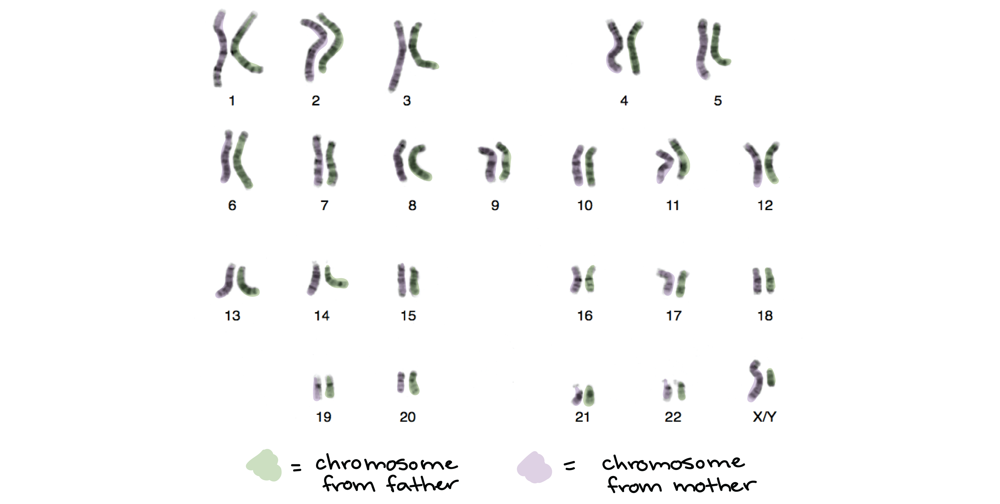

可以看到每個 homologous pair 中的 2 個 chromosomes 都非常相似

* 因為兩者皆攜帶著相同類型的 genetic information
  * 就是 "Same genes in the same location"
  * 但不用是完全一樣的 gene version (從遺傳可以看到)
    * 例如 chromosome 9 定義了 blood type
      * 有可能父母都是 type A
      * 有可能父母分別是 type A 和 type B (讓你成為 type AB)

最後一對 chromosomes 有些不同，是 **sex chromosomes** (X, Y)

* 這對 chromosomes 不是 homologues (是例外)
  * 代表在相同位置不為相同的 genes
  * 只有小部分為了 meiosis 或 sex cell production 才會一樣
  * 另外除了 sex chromosomes 以外的 44 個稱做 **autosomes**

## Chromosomes and cell division

在細胞準備分裂之前，需要先將所有 chromosomes 都複製一遍

* 複製出來的兩個 chromosomes 叫做 **sister chromatids**
  * 兩個是完全一樣的
  * 兩個透過 **cohesins** (protein) 吸附在一起
  * 最緊密的連接處叫做 **centromere** (chromosome X 形狀中間那點)
    * Centromere 對待會的分裂非常重要

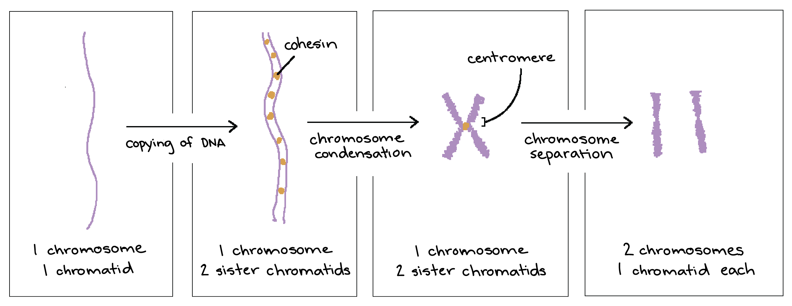

* 連接在一起的 2 個 chromatids 可以視為 1 個 chromosome
  * 分開後就變成 2 個 chromosomes

為什麼簡單的分裂要多了 DNA replication, condensation, separation ?

* 這是為了確保每個新細胞中的 chromosomes 都被正確 copy
  * 更深入的部分要講到 mitosis

# The cell cycle and mitosis

細胞的生命週期 (**cell cycle**) 主要講述該細胞從 birth (divison of mother cell) 到 reproduction (divison to make two daughter cells)

* 在細胞執行分裂之前，需要先複製 genetic material (DNA)
  * 過程是非常有順序的一個 cycle
    * 因為 daughter cells 可以完整重新執行一次，所以是 cycle
  * 在 eukaryotic cells 中會將 cycle 分成兩大階段
    * **Interphase**
      * 細胞成長並複製自己的 DNA
    * **Mitotic (M) phase**
      * 複製好的 DNA 分成兩份，cytoplasm 也分成兩份，形成兩個新細胞

## Interphase

從 mother cell 分裂出來的細胞，接下來要做哪些事才能分裂自己呢 ?

* 在分裂前的階段稱為 Interphase
  * inter- 指的是 between，意思是兩次 mitotic phase 的中間
  * 主要又可分成 3 階段

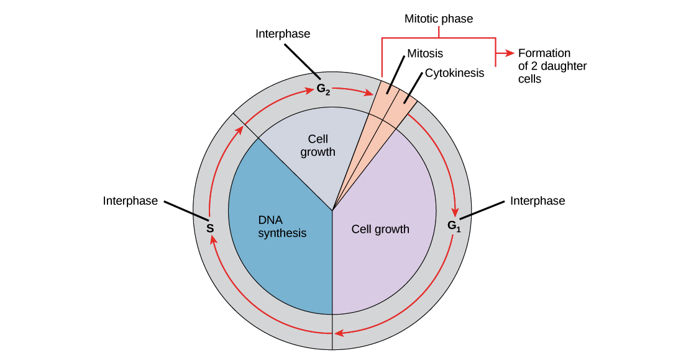

* **G1 phase**
  * 細胞成長變大
  * 複製一些 organelles
  * 建立一些待會會用到的 building blocks 
* **S phase**
  * 在 nucleus 中合成完整的 DNA copy
  * 同時複製一個 **centrosome** (microtubule-organizing structure)
    * Centrosome 未來用於分離 DNA
* **G2 phase**
  * 細胞進一步成長變大
  * 一樣製造一些 proteins, organelles
  * 將內容物重新整理準備進行 mitosis

## Mitotic (M) phase

Mitotic phase 正式要將細胞拆成 2 個新細胞 (各自有新的 DNA 和 cytoplasm)

* Mitotic phase 可以分成兩個工作
  * **Mitosis**
    * Nuclear DNA 會被 condnese 變成看的到的 chromosomes
    * 接著被 mitotic spindle (from centrosome) 扯開變成兩半
    * Mitosis 又可以細分成四大步驟
      1. Prophase (early prophase + prometaphase)
      2. Metaphase
      3. Anaphase
      4. Telophase 
  * **Cytokinesis**
    * 細胞的 cytoplasm 被拆開為二
    * 正式變成兩個獨立的細胞
    * 動物跟植物的 cytokinesis 有些不同
      * 動物由 contractile ring 收縮分裂
      * 植物由 cell plate 來分割

## G0

* 細胞分裂的快慢因細胞而異
  * 像 embryo 或 tumor 中的細胞就分裂複製非常的快速
* 但有的細胞幾乎不會分裂、甚至根本不分裂
  * 他們會由 G1 phase 進入休息狀態 **G0 phase**
  * 只進行他們原本該做的工作
    * 例如 conduct signals, store carbohydrates
  * 等到特定 signal 再重新開始分裂

## Cell cycle time

* Cell cylce 一樣會依細胞而異
  * 一般細胞通常需要 24 hours
  * Intestine 中的細胞可以用 9-10 hours 就完成一次 cycle
* 有的更是會改變 cycle 的過程
  * 例如青蛙的 embryos 細胞
  * 會快速通過 G1 和 G2，只對 zygotes 進行 S 和 M phase
  * 讓一個細胞分裂成多個小細胞

# Phase of mitosis

* Mitosis 在 division 的工作是給予兩個分裂細胞一模一樣的 chromosomes
  * 目標是讓兩個新細胞能有完整、正確的 chromosomes
  * 太少或太多 chromosomes 都可能造成嚴重後果 (not survive, cause cancer)
  * 所以 mitosis 有一系列良好的步驟來複製 chromosomes

* 上面就是完整的 mitosis 進行步驟
  * Prophase 有時會被分為 early phase (prophase) 和 late phase (prometaphase)
  * Cytokinesis 會在 anaphase 的階段就開始同時進行

## Late G2

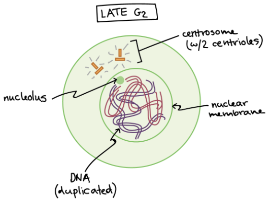

* Interphase 的最後一步 G2 過後
  * 細胞已經複製好 DNA
    * 每個 chromosomes 都有對應的 copy (兩者稱作 sister chromatids)
  * 動物細胞會順便複製 **centrosome**
    * 會在待會的 mitosis 扮演重要角色
    * 植物有另外的 **microtubule organizing center** 取代 centrosomes

## Early prophase

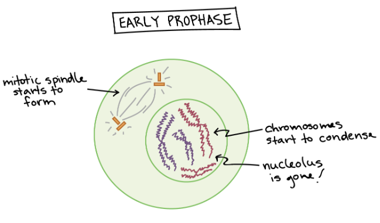

* Chromosomes 開始進行 **condense** (方便待會被拉開)
* **Mitotic spindle** 開始形成
  * 主架構是 strong fibers (細胞的 skeleton) 形成的 microtubules
  * 負責在待會移動 chromosomes
  * spindle 在 2 個 centrosomes 分開的過程中形成
* **Nucleolus** 消失不見
  * 示意 nucleus 準備好被分解

## Late prophase (prometaphase)

在這個階段 mitotic spindle 開始去抓取並移動 chromosomes

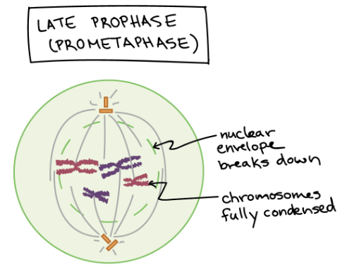

* **Chromosomes** 完成了 condensation 變得非常 compact
* **Nuclear envelope** 也被完全分解，將 chromosomes 釋放出來
* **Mitotic spindle** 長了更多，開始 "capture" 這些 chromosomes

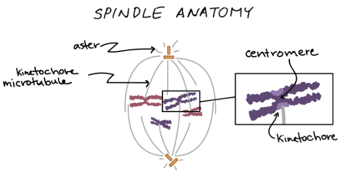

* Microtubules 會與 chromosomes 結合
  * 結合點在 centromere 的 **kinetochore**
* 這些和 kinetochore 結合的叫做 **kinetochore microtubules**
  * 其他的 microtubules 會繼續長在細胞內維持穩定性，形成 **aster** 的架構

## Metaphase

Mitotic spindle 已經抓好所有的 chromosomes 並且將他們置中

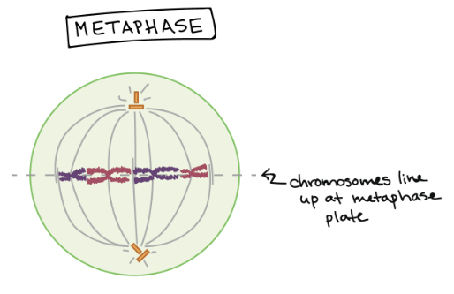

* 所有 chromosomes 排列整齊
  * 形成類似 **metaphase plate** 的樣子
* 每個 chromosome (sister chromatids) 的 2 個 kinetochores
  * 應該都要跟對應的 microtubules 結合
* 確認每個 chromosomes 的 kinetochores 都有良好地附在正確的 microtubules
  * 這個確認叫做 **spindle checkpoint**
  * 若錯誤就暫停分裂，直到問題解決

## Anaphase

Sister chromatids 被拉開到細胞的兩邊了 !

* 幫助黏住 sister chromatids 的 protein 被分解
  * 現在 2 個 chromatids 個別都是獨立的 chromosomes
* Microtubules 開始加長
  * 整個細胞被拉得更長
* 這些工作都是由 **motor proteins** 在驅動
  * Motor proteins 可以走在 microtubules 中運送貨物 (chromosomes, other microtubules)

## Telophase

分裂就快完成了 ! 開始重建一個細胞該有的內容物

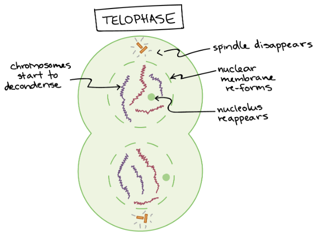

* Mitotic spindle 消失，分解回原來的 building blocks 之中
* 2 個 nuclei 重建，每個有自己的 chromosome set
  * Nuclear membrane 和 nucleolus 也現身
* Chromosomes 開始 decondense 變回 stringy 的形狀

## Cytokinesis

* Cytokinesis 階段會將細胞的 cytoplasm 拆成兩半
  * 可能從 anaphase 開始，可能從 telophase 開始
  * 但會在 telophase 之後結束
* 最終就會產生兩個完全跟 mother cell 一樣的細胞
  * 有著一樣且完整的 chromosome set

# Meiosis

Mitosis 的目的是 development 和 replace 壞掉的細胞，而 meiosis 則是致力於生產 **gametes** (sex cells)

* Meiosis 的目標是製造 4 個 cells
  * 每個都有剛好一半的 chromosome 數量
    * 例如人類 46 個，就要製造出 23 個的細胞
  * 換句話說，Meiosis 要將原本的 diploid cell (兩組 chromosomes 從爸媽而來)
    * 變成 haploid cells (單組 chromosomes)
    * 對人類來說就是 sperm & eggs
    * Sperm 和 eggs 結合會產生完整的 diploid set (而且是新的 genome)

## Phases of meiosis

Meiosis 的過程很多地方都跟 mitosis 策略差不多

* 不同點
  * Mitosis 只有分裂複製好的 **sister chromatids**
  * Meiosis 分裂 **sister chromatids** 和 **homologous chromosomes**
    * Sister chromatids 是把 somatic cell 複製成兩份 chromosome
    * Homologous chromosomes 則是由父母各給一半的 chromosome pairs

所以 meiosis 可以分成兩階段的 division process

* **Meiosis I**
  * 先拆掉 homologue pairs
  * 有 prophase I, metaphase I, anaphase I, telophase I
* **Meiosis II**
  * 再拆掉 sister chromatids
  * 有 prophase II, metaphase II, anaphase II, telophase II

因為有 2 次分裂，共產生 4 個 gametes (eggs or sperm)

## Meiosis I

在進入 meiosis 前，一樣要先完成 interphase (G1, S, G2) 階段，複製好 chromosomes

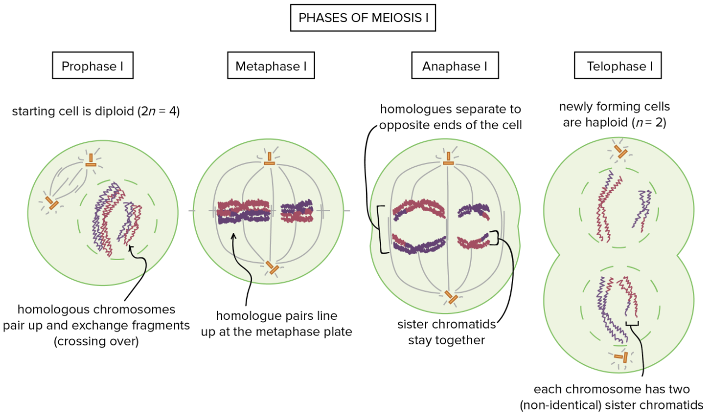

### Prophase I

* Chromosomes 像 mitosis 一樣 condense
  * 但不同的是，他們順便配對在一起
    * 每個 chromosome 都和 homologue partner 排列在一起

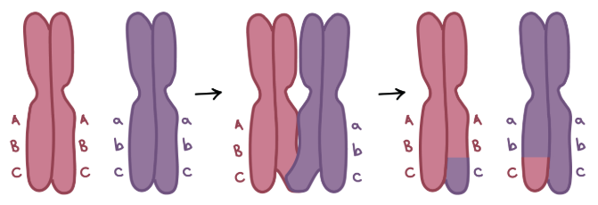

以上圖來說，ABC 和 abc (大小寫) 分別代表父母同段的 genes (**alleles**)

* 這時 B, C 這段會互相和 homologues 交換 DNA
  * 這個交易的行程稱作 **crossing over**
  * 事實上父母的 chromosomes 會由 **synaptonemal complex** 幫忙黏在一起
  * 某一方的 chromosome 會疊在上面 (而不是像上圖一樣在隔壁)

### Metaphase I

* 跟 mitosis 一樣，再來 spindle 會將 chromosomes 移到中央 (metaphase plate)
  * 不一樣的是，每個 homologue pairs 包含複製，會被 microtubules 拉到相同的位置
  * 並且 pairs 會是隨機的方向
    * 為了讓 gametes 有不同的可能性
    * 例如上圖中粉色大和紫色小朝向上方，但也有可能發生粉色大和粉色小同時朝向上方

### Anaphase I

* Homologues pairs 被拉到細胞的兩端
  * 但是 sister chromatids 依然沒有被分離

### Telophase I

* Chromosomes 分別來到兩端
  * Nuclear membrane 重新出現
  * Chromosomes decondense
* 有的生物會將這步跳過，因為細胞馬上就要再進行下一輪分裂 (meiosis II) 了
* Cytokinesis 會在此階段同時開始，試著將細胞分成兩個 haploid cells

## Meiosis II

Meiosis I 產生的兩個細胞沒有繼續複製 DNA 就進入到 meiosis II

* Meiosis II 比 meiosis I 的 process 還要更短更簡單
  * 可以視為 mitosis 的 haploid 版本

從下圖可以看到，一開始每個細胞剩下兩個 chromosomes (每個來自父母其中一邊，但是是 sister chromatids)

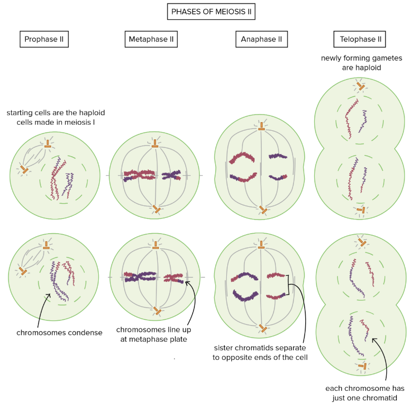

### Prophase II

* Chromosomes 開始 condense
* Nuclear envelope 開始分解消失
* 兩個 Centrosomes 移到兩端，而 spindle 也隨之出現在中間
  * Spindle microtubules 準備來抓取 chromosomes

### Metaphase II

* Microtubules 從兩邊各自把 chromosome 的 sister chromatids 拉到中間
  * Chromosomes 在 metaphase plate 排列整齊

### Anaphase II

* Sister chromatids 被 microtubules 拉開來到兩端

### Telophase II

* Cytokinesis 開始作用，随著 chromosomes 拆成兩個細胞
* Nuclear membranes 開始形成
* Chromosomes 開始 condense

最終產生了 4 個 **haploid cells**

* 每個 cell 的 chromosome 都是 1 個 chromatid
* 對人類來說，每個 cell 稱為 sperm 或 egg cell

## How meiosis "mixes and matches" genes

Meiosis 產生的每個 haploid cell 都不是一樣的 (non-identical)

* 每個 gamete 都有唯一的 genetic material "sample"
  * 研究發現，就算一開始的 somatic cell 只有 4 個 chromosomes
  * 還是能產生非常多的 gamete types
  * 會讓接下來的 meiosis 產生更多隨機性的原因有兩個
    * **Crossing over**
      * Homologues 互相交換 genetic material 的部分有時是隨機的
    * **Random orientation of homologue pairs**
      * Homologue paris 的方向也是隨機的

對人類來說，總共有 8 million 種可能的 gamete types，加上每個人的獨特性，可以繁殖的可能性是無限

# Cell cycle checkpoints

細胞在分裂的每個過程不一定是直接進到下一步，而是會根據各種因素而有 regulation

* **Checkpoint** 是 eukaryotic cell 分析內外環境"決定"是否繼續分裂的階段
  * 最重要的 checkpoints 有三個
    * G1 checkpoint (在 G1/S 中間)
    * G2 checkpoint (在 G2/M 中間)
    * spindle checkpoint (在 metaphase 和 anaphase 中間)

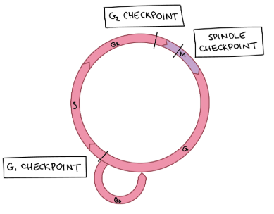

## The G1 checkpoint

G1 checkpoint 是掌握細胞要不要分裂的關鍵

* 如果 G1 checkpoint 通過，進入到 S phase
  * 那就是不可逆轉，要繼續進行下去到分裂完成
    * 除非遇到不可預期的狀況發生 (DNA damage, replication error)

G1 checkpoint 觀察的點為

* **Size**
  * 細胞大小足以分裂嗎
* **Nutrients**
  * 有足夠能量分裂或回復嗎
* **Molecular signals**
  * 有收到任何鄰居的 positive cues 嗎 (e.g., growth factor)
* **DNA integrity**
  * DNA 有損傷嗎

根據不同的細胞其實也會觀察不同事物

* 有的細胞需觀察 mechanical cues
  * 例如有無附在 extracellular matrix 方便分裂

如果細胞沒辦法通過 G1 checkpoint，會進入到 **G0 phase**，等待因素達成 (或永遠待在 G0)

## The G2 checkpoint

在進入 M phase 之前，會在 G2 checkpoint 扎實檢查 DNA 是否完整無誤，所以觀察的點為

* **DNA integrity**
  * DNA 有損傷嗎
* **DNA replication**
  * DNA 在 S phase 有被完整複製嗎

如果有問題，整個 cell cycle 會被停止，直到修復 DNA 或是完成 DNA 複製

* 如果傷害無法補救，細胞會自我毀滅
  * 透過 apoptosis 或是 programmed cell death
  * 避免將受損 DNA 傳給子女，防止 cancer 發生

## The spindle checkpoint

在 M phase (mitosis) 會有一個 spindle checkpoint

* Spindle checkpoint 發生在 metaphase 進入 anaphase 之間
  * 查看 sister chromatids 有沒有正確依附在 spindle microtubules 上 (metaphase plate)
  * 因為 anaphase 將是不可逆的步驟，一定要讓 chromosomes 處於正確位置才行

Spindle checkpoint 不是以 scan metaphase plate 來檢查

* Spindle checkpoint 將尋找有無 chromosomes 迷路 (e.g., 在 cytoplasm)
  * 如果有就會暫停 mitosis
  * 給予時間將 chromosomes 移到正確位置

# Cell cycle regulators

Checkpoint 會決定是否繼續分裂，主要透過改變 cell cycle regulators 的活動

* 這些 cell cycle regulators 用於非常多重要的活動
  * DNA replication
  * chromosome seperation
  * trigger the onset of the next phase (e.g., G1 to S)

這邊來介紹幾個重要的 core cell cycle regulators

* Cyclins (protein)
* Cdks (enzyme)
* APC/C (enzyme complex)

## Cyclins

Cyclins 都是一組一組 proteins，可以分成四種型態

* G1 cyclins
* G1/S cyclins
* S cyclins
* M cyclins

從名字可以看出，每種 cyclins 負責不同 phase 的活動

* 例如 M cyclin 主要負責 M phase 中的活動
  * nuclear envelope breakdown
  * chromosome condensation

* 一般的 Cyclins 會在各種 phase 幫忙簡單 low level 的任務
  * 只有 G1 cyclins 不同，整個 cycle 幾乎都需要他的幫忙

## Cdks (Cyclin-dependent kinases)

Cyclins 為了驅使該 phase 的活動進行，需要 activate/inactivate 一些 target proteins

* Cyclins 會和夥伴 **Cdks (cyclin-dependent kinases)** 一起活動
  * 單獨的 Cdk 是 **inactive** 的
  * 跟 cyclins 結合後才是 **active** 的
* Active 的 Cdks 是 functional enzyme，可以修改 target proteins

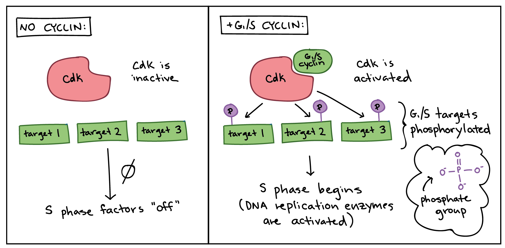

* Cdks 是 **kinases** (**phosphorylate** target proteins 的 enzyme)
  * Phosphate group 就像 switch 一樣
    * 能夠 Activate 或 inactivate 這些 target protein 

當 cyclin 接觸到 Cdk 時，會發生兩件大事

1. Activate Cdk 使他成為 kinase
2. 將 Cdk 引導到由該 cyclin 負責的 phase 時的特定 target proteins
   * 例如 G1/S cyclins 傳送 Cdks 到 S phase targets
     * 幫助 DNA replication
   * 或是 M cyclins 傳送 Cdks 到 M phase targets
     * 幫助 breakdown nuclear membrane

## APC/C (The anaphase-promoting complex/cyclosome)

**Anaphase-promoting complex/cyclosome** 是 protein complex

* APC/C 會在 anaphase 造成 M cyclins 被破壞
  * 促使新的 cell 結束 mitosis 重新進入 G1
* APC/C 也會造成 sister chromatids 中間的 protein 被破壞
  * 讓 sister chromatids 能夠進一步在 anaphase 被推向兩端

APC/C 雖然和 Cdks 一樣為 enzyme 但功能不同

* APC/C 會發送 **ubiquitin (Ub)** 這個標籤給 target proteins
  * 收到的 protein 會被送到細胞中的 **proteasome** (回收筒)
    * 例如 M cyclins 就會收到 Ub 然後送到 proteasome 解決

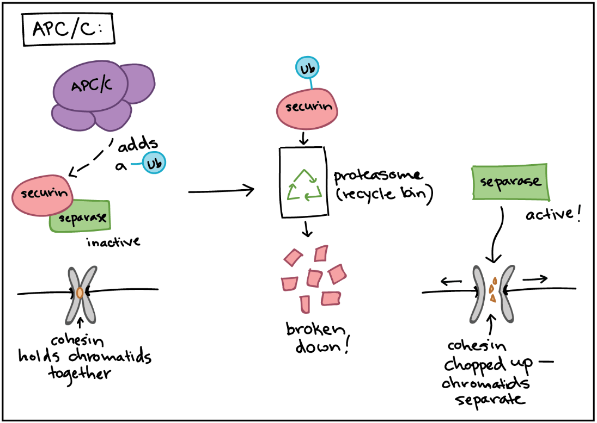

上圖是 APC/C 幫助 sister chromatids 分開的過程

* APC/C 在 metaphase 收到 signals
* 進行一連串活動來破壞 cohesin (glue of sister chromatids)
  * APC/C 將 ubiquitin tag 貼到 **securin** (protein)
    * Securin 通常會和 **separase** (protein) 在一起
  * 沒有了 securin
    * Separase 就會去拆掉 cohesin 順利讓 sister chromatids 分開

## Checkpoints and regulators

* 以上這些 cell cycle regulators 要因為細胞內外的信號才會活動
  * Positive cues
    * growth factors: 增加 Cdks, cyclins 的活動
  * Negative cues
    * DNA damage: 減少或停止整個活動

以下展示一個 DNA damage 造成 cycle 停止於 G1 phase 的例子

* 當人類照射到 UV rays 時 DNA 可能會受到傷害
  * 細胞要修復或避免將損壞的 DNA 複製下去
  * 有一個關鍵的 protein 叫做 **p53** 會幫忙這些事情
  * p53 又稱作 "the guardian of the genome" 是一個 tumor suppressor

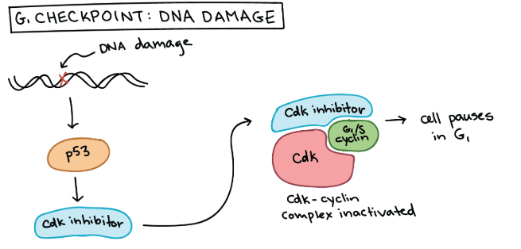

* p53 在細胞分裂中幫助處理 DNA damage 可以分成三大角色
  1. 將 cycle 停止在 G1 checkpoint
     * 利用 **Cdk inhibitor (CKI)** proteins
     * CKI 會結合到 Cdk-cyclin complexes 然後停住他們的活動
  2. Activate DNA repair enzymes
  3. 如果沒救了，就啟動 programmed cell death

## Cell cycle regulators and cancer

不同的基因突變會造成不同的癌症，但 regulators 會造成癌症的突變大致分為兩類

* Positive regulators **overactivate** (become oncogenic)
* Negative regulators **inactivate** (e.g., tumor suppressors)

### Oncogenes

* 促使 regulators overactive 的基因稱為 **oncogenes**
  * 還沒突變的 oncogenes 稱為 **proto-oncogenes**

讓 proto-oncogenes 變成 oncogenes 的方法有很多

* 改變 protein 的 amino acid sequence
  * 讓 protein 形狀改變，變成永遠為 "on" 的狀態
* Amplification
  * 給細胞過多的 gene copies，建造過多的 proteins
* DNA repair 發生錯誤
  * 使 proto-oncogene 和其他不同 gene 結合，產生 "combo" protein (會有不正常的活動)

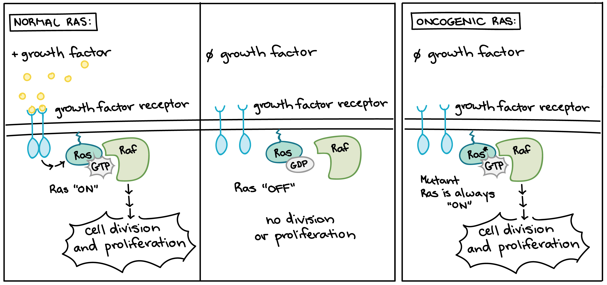

很多 protein 在傳遞的 growth factor signals 都是來自 proto-oncogenes 來 encode

* 當基因變異，一些 proteins 不管有沒有 growth factor 都將 signals 傳出
  * 就會變成上圖的樣子
  * 由 proto-oncogenes 所 encode 的兩個 protein 發生異常
    * Ras protein (growth factor receptor)
    * Raf signaling enzyme

這些 overactive 的 proteins 可以常見於 cancer cells

* Oncogenic Ras mutations 可以在 90% 的 pancreatic cancers 看到
  * Ras 是 G protein，相當於 active/inactive 的開關
  * Cancer-causing mutation 會讓這個開關失效
  * 變得很難或是無法 inactive，卡在 active 的狀態 

### Tumor suppressors

* 幫助從 DNA damage 暫停 cell cycle 運作的是 **tumor suppressors**
  * 其中某個重要的是 **tumor protein p53**
  * 基因突變可能造成 p53 無法進行他的工作
  * 可能由其他的方法來解決，例如增加 p53 的回收

# Apoptosis

細胞死亡可能是不好的事情，但只要是在良好的控制下，對生物是很有幫助的

* Apoptosis 就是良好控制下的"**細胞自殺**"
  * 是 programmed cell death 的一種
  * 他雖然讓細胞死亡，但卻讓整個生物體受益
  * 例如 finger development, eliminate potential cancer cells

其實幫助我們手指生長的細胞，早在很久以前就已經死亡了。

這是為了讓手指能夠順利長成現在的樣子，如果細胞還在，那我們手就會變成像蹼狀一樣的手 !

## Apoptosis vs. necrosis

細胞主要有兩種死法，分別是 apoptosis 和 necrosis

* 被不好的東西搞死的叫做 **necrosis**
  * 例如 toxic chemicals 或 physical injury
  * Messy
  * 會造成 immune response 或 inflammation
* 被觸發的 programmed cell death 有很多種
  * 最常見的就是 **apoptosis**
  * Tidy
  * 將不要的細胞切成一份一份，讓細胞能夠被 recycle

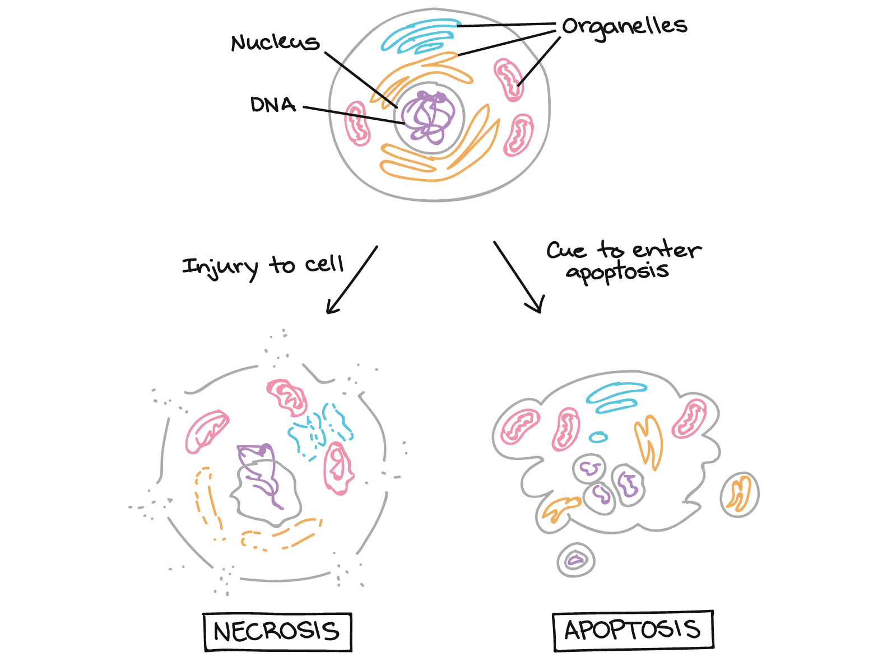

### Necrosis (the messy way)

* 通常發生於細胞受到外部攻擊 (injury, toxicity)
  * 因為 membrane 無法再控制進出，造成膨脹
  * 爆炸，細胞噴發所有內容物
  * 在充斥 dead cell 的 tissue 周圍造成 inflammation

### Apoptosis (the tidy way)

* 細胞有秩序的死亡，縮成像泡泡一樣的 **blebs**
  * DNA 被切成很多碎片
  * 一些 organelles (e.g., endoplasmic reticulum) 也分解成碎片
  * 整個細胞變成一個個由 membrane 完整包裝的 chunks

* 變成 chunks 之後
  * 這些 chunks 會釋放 signals 來吸引 debris-eating (phagocytic) immune cells
    * 例如 macrophages
  * 一些會將 **phosphatidylserine** (lipid molecule) 放到 membrane 表面
    * Phosphatidylserine 通常隱藏在 membrane 裡面
    * 這會吸引 phagocytes 來結合然後被吃掉

## Why apoptosis

Apoptosis 和 DNA 複製或是分解養分一樣，都是細胞天生具有的能力

* Apoptosis 動機是移除不該繼續存在於該 organism 的細胞
  * 刪除一些影響發展的細胞
    * 例如發展手指的時候，避免讓手長成一整塊 tissue
  * 移除異常、可能傷害其他 organism 的細胞
    * 例如 viral infection, DNA damage
  * 保持身體平衡而淘汰細胞
    * 例如為了給新細胞位置，或移除只負責短暫工作的細胞
  * 幫助免疫系統運作
    * 移除為了對付 pathogen 而大量產生的 immune cells
