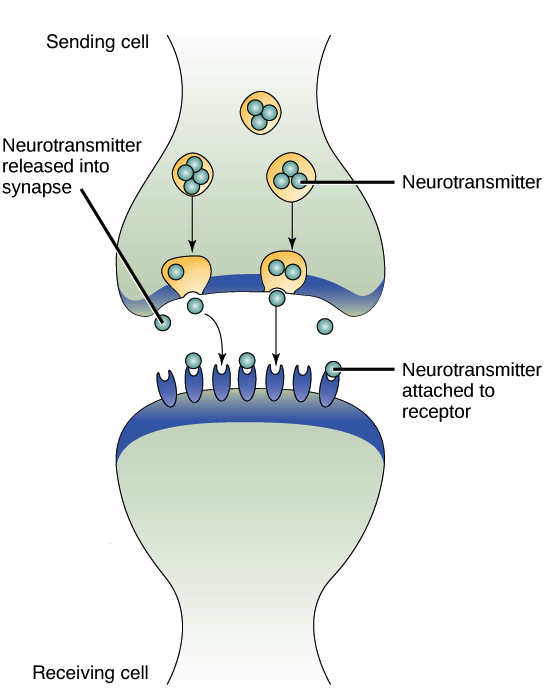

# Intro to cell signaling

細胞能感知周圍變化，根據鄰居的通報來即時應變。
現在，你的細胞正透過 chemical signaling molecules 進行上百萬個訊息傳遞 !

* 細胞之間透過 chemical signals 來交流
  * Signals 通常為 **sending cell** 所產生的 proteins 或其他 molecules
  * 從 cell 中被排出到 extracellular space
  * 像瓶中信一樣漂流在細胞之間

* 擁有對應的 **receptor** 的 **target cell** 才能接收訊息
  * 他們要接收的那些 signals 可以稱做 **ligands**
  * 當 receptor 接收到 ligands
    * 就會改變 receptor 的形狀，試圖改變細胞內部的活動

Ligands 的訊息會在細胞內被"接力"傳遞

* 由一連串的 chemical messengers 來接龍傳達
  * 最終改變細胞活動
    * 例如改變 gene 的活動
    * 例如引導整個 process (e.g., cell division)

* 在細胞間傳遞的 signal 稱為 **intercellular signal**
* 在細胞中傳遞的 signal 稱為 **intracellular signal**

> The signal **transduction** pathway is made up of the following steps:
> 1. A ligand binds to a cell-surface receptor, which initiates a response on the inside of the cell by activating an initial protein.
> 2. The protein goes on to activate other proteins or second messenger molecules such as $$\text{Ca}^{2+}$$ or cAMP.
> 3. The final target is reached, causing the intended response.

## Forms of signaling

細胞之間的距離不一，傳遞方式也不相同，在 multicellular organisms 有四種基本的 chemical signaling

* Paracrine signaling
* Autocrine signaling
* Endocrine signaling
* Direct contact

### Paracrine signaling

* Paracrine signaling 是最近的傳遞方法
  * Chemical messengers (ligands) 很短距離就可到達目標細胞
  * 通常跟鄰居進行 locally coordinate activities
  * 在 development 時特別重要

#### Synaptic signaling

Nerve cells 之間的 paracrine signaling 又稱為 synaptic signaling

* Sending neuron 發射一個 electrical impulse 快速移動在 axon 中 (long, fiber-like)
  * 當 impulse 接觸到 synapse 就會釋放 **neurotransmitters** (ligands) 
  * Neurotransmitters 會快速通過 nerve cells 之間的 gap
  * 來到 receiving cell 和 receptors 結合，改變細胞活動

Neurotransmitters 會被快速收回，讓 synapse 能夠快速準備下一次的 signaling

### Autocrine signaling

* 將 ligands 傳遞到自己身上的 receptors
  * 看起來沒用，但其實扮演很重要的工作 (e.g., development)
  * 幫助細胞在初期加深自己正確的身份
  * 在醫學上，幫助 cancer 執行 metastasis (癌細胞轉移)

多數環境下，signal 可以同時擁有 autocrine 和 paracrine 的效用，幫助 sending cell 和區域的 cells 交流

### Endocrine signaling

* 當細胞需要將訊息傳遞到很遠方時，需要使用 circulatory system (distribution network like)
  * Signals 被特定細胞產生，釋放到 bloodstream 中
  * 透過 bloodstream 運送到身體不同的地方
  * 這些 signals 稱為 **hormones**

人體常見的 endocrine glands 很多，都負責非常重要的工作，釋放一到多種重要的 hormones

* Thyroid (甲狀腺)
* Hypothalamus (下視丘)
* Pituitary (腦垂腺)
* Gonads (生殖腺)
  * Testicle (睪丸) and ovary (卵巢)
* Pancreas (胰臟、胰腺)

例如 Pituitary 釋放 **growth hormone (GH)**，負責生物生長，特別是在 skeleton 和 cartilage 部分

### Signaling through cell-cell contact

* Cell-cell 之間也能透過 gap junctions (animal) 和 plasmodesmata (plants) 來直接傳遞訊息
  * 在這兩種充滿水的 channel 移動的 signaling molecules 稱為 **intracellular mediators**
  * 一些小的例如 calcium ions ($$\text{Ca}^{2+}$$) 可以通過
  * 但大的例如 proteins, DNA 如果沒有特別幫助，就不行直接通過

* 細胞可以透過此類型交流連成一個網路
  * 或許只有其中一個細胞收到指令
  * 但卻可以分享給周邊所有細胞
  * 在植物中 plasmodesmata 就幾乎充斥所有細胞之間，形成巨大網路

另外還有一種 direct signaling 的方式，如下圖

* 兩個細胞有 complementary proteins 在細胞表面的時候
  * 接收到的一方會改變形狀 (有時兩者一起改變)
  * 這類傳遞 signal 方法多發生於 immune system
  * 例如上圖是 immune cell 利用自己的表面 markers 來確認其他細胞是敵是友

# Communication in single-celled organisms

人體間的細胞可以互相溝通，那單細胞生物呢 ?

* 要的，例如 yeast 和 bacteria 都還是要和同族群的生物"對話"
  * 例如 bacteria 透過 chemical signal 確認周遭同一族群的數量
  * Yeast 則是用 chemical signals 來尋找伴侶

## Quorum sensing in bacteria

* 原本大家都認為 bacteria 是單獨行動
  * 但其實 bacteria 是一個 community
  * 彼此之間透過 **quorum sensing** 的 cell-cell signaling 模式來交流
    * Bacteria 透過 quorum sensing 來監測 bacteria population 的密度
    * 當超過一個 threshold level，該區域的 bacteria 就會同時改變行為或是 gene expression

## Signaling in yeasts

* Yeast 是一種 fungus (single-celled eukaryotes)
  * 其中某個重要的 signaling pathway 是 mating factor pathway
  * Budding yeast 也能互相進行像人類一樣的 sexual reproduction
    * 2 個 haploid cells (single set of chromosomes, like sperm and eggs) 
    * 融合成 1 個 diploid cell (two sets of chromosomes, like human body cell)
    * Diploid cell 又可以透過 meiosis 產生多個組合 genetic material 的 haploid cells

為了尋找能夠配對的 haploid yeast cell， budding yeast 就會用到 mating factor 這個 signal
