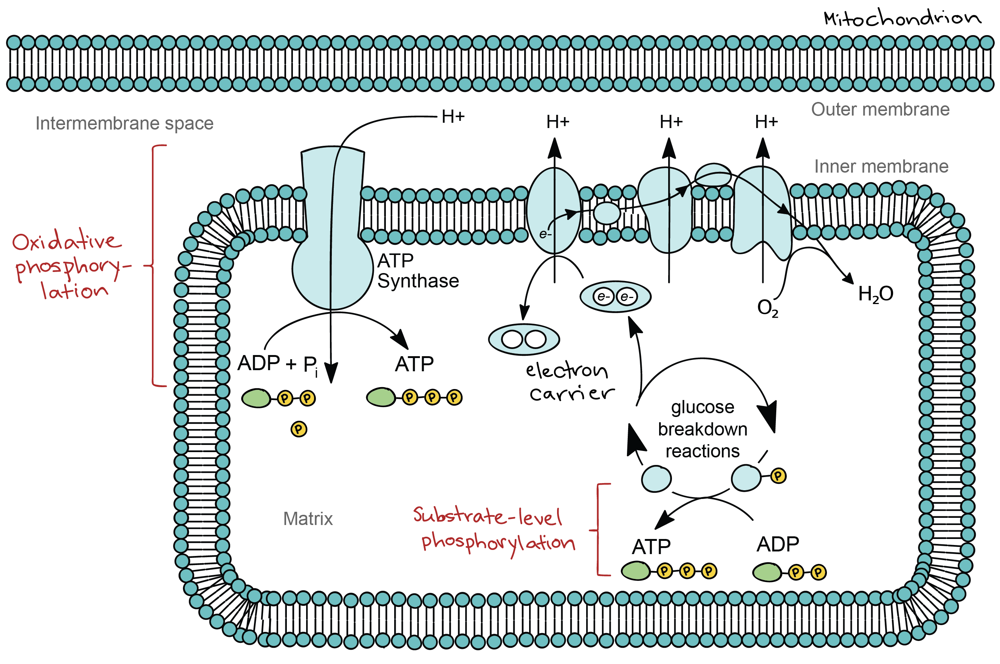
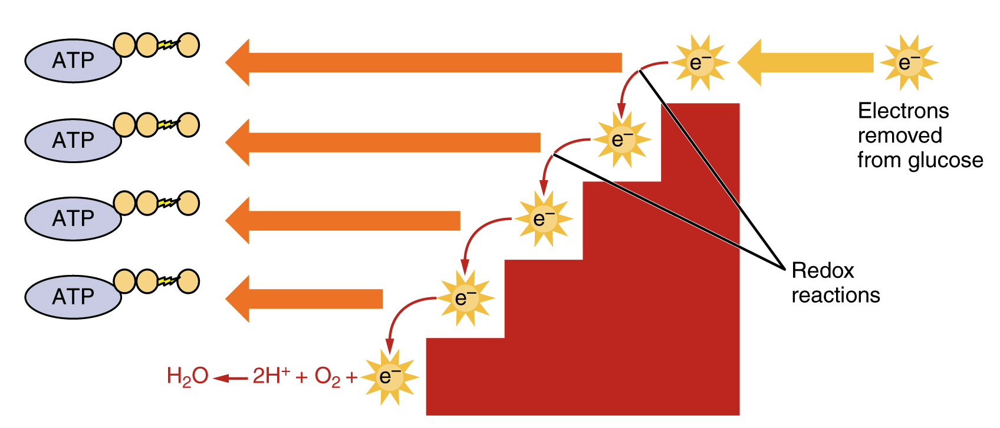
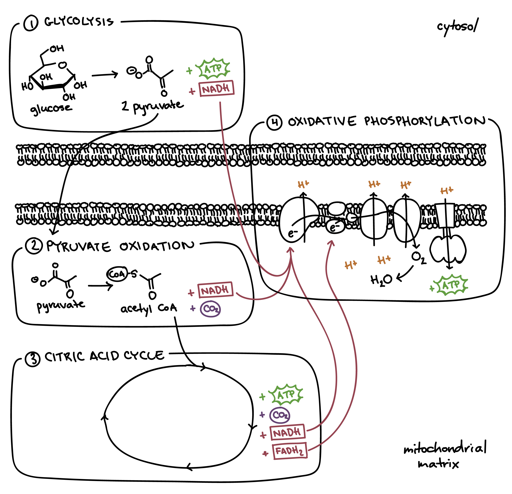
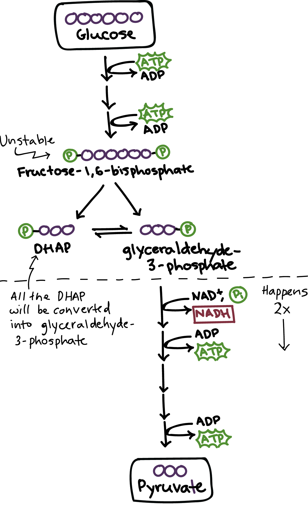
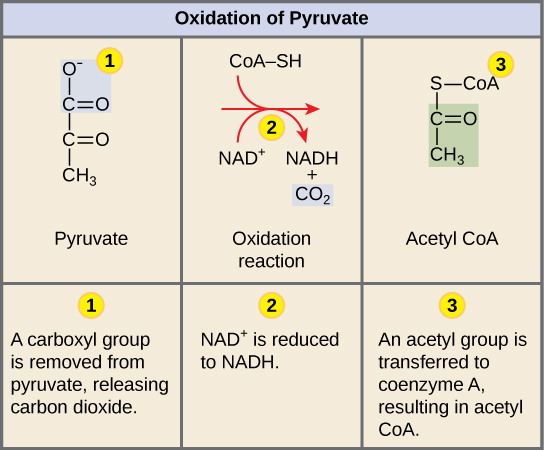
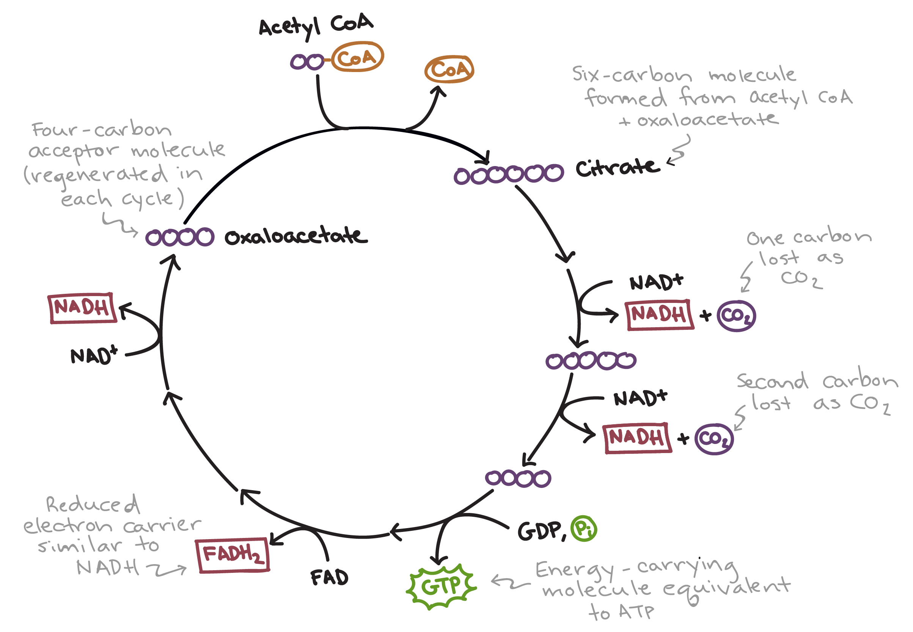
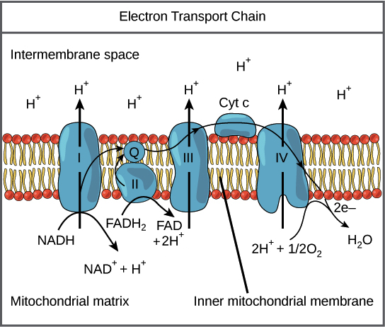
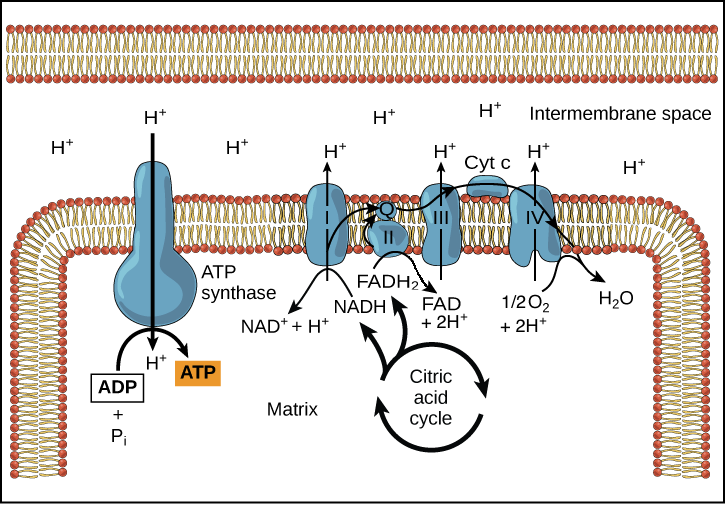
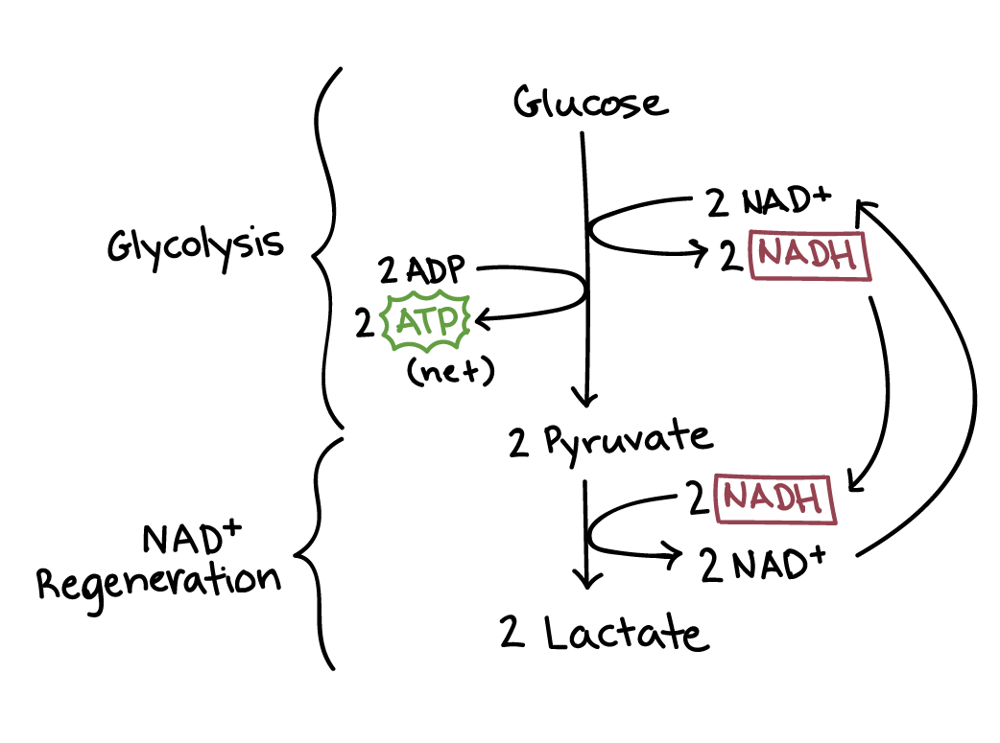
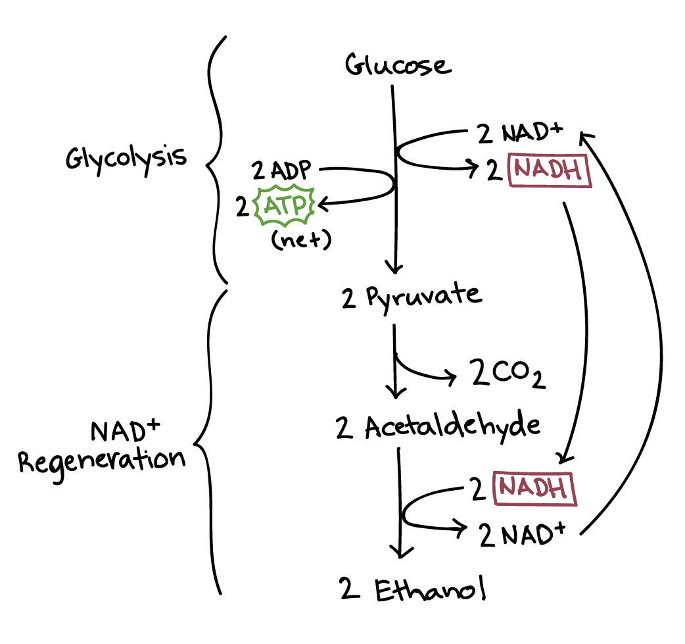

# Introduction to cellular respiration

在 Energy and Enzymes 篇章裡有提到 ATP

* 細胞如何將甜美的 glucose 轉換成方便儲存使用的 ATP
  * 必須要進行 **catabolic reactions**
  * 意思是要將大的分子分解成一小份一小份
  * 例如以下公式代表 glucose 在 oxygen 中被分解成 6 個 carbon dioxide 和 6 個 water molecules

$$
\begin{aligned}
&\text{C}_6\text{H}_{12}6\text{O}_2
\rightarrow
6\text{CO}_2+6\text{H}_2\text{O}
&&
\Delta G = -686\text{ kcal}/\text{mol}
\end{aligned}
$$

* Glucose bond 中的 energy 將透過分解被釋放
  * 有的儲存為 **adenosine triphosphate (ATP)** 格式
  * 有的消散為 heat

* 其中 ATP 可以"直接"透過 **substrate-level phosphorylation** 產生
  * 由 phosphate group 找到 ADP 一起合成出來的

* ATP 也可以"間接"產生
  * 一些 glucose 的 electrons 運送到 **electron carriers** (small molecules)
  * Carriers 帶著 electrons 來到細胞內的 mitochondrion
  * 找到了 **electron transport chain** (protein)
  * Electrons 就在 ETC 上面從 high energy 變成 low energy
    * ultimately passed to oxygen (forming water)

詳細的說，ETC 上的 electrons 釋放的 energy 會用來 pump protons ($$\text{H}^+$$)

* Pump 產生 electrochemical gradient
  * 往 mitochondrion 內流的 H+ 會經過 ATP synthase (enzyme)
    * 幫助合成 ATP
    * 這個作用稱為 **oxidative phosphorylation**
  
下圖展示了 substrate-level 和 oxidative phosphorylation

Glucose 等燃料透過上圖 electron transport chain 分解的過程，稱作 **cellular respiration** !

## Electron carriers

負責載運 electrons 的 electron carriers 有兩種類型

* $$\text{NAD}^+$$
  * nicotinamide adenine dinucleotide
* $$\text{FAD}$$
  * flavin adenine dinucleotide

當他們得到 electrons 時，順便會收下 hydrogen atoms 形成稍微不同的型式

$$
\begin{aligned}
&\text{NAD}^+ + 2\text{e}^- + 2\text{H}^+ \rightarrow \text{NADH} + \text{H}^+ \\
&\text{FAD} + 2\text{e}^- + 2\text{H}^+ \rightarrow \text{FADH}_2
\end{aligned}
$$

丟掉 electrons 就會恢復原狀

$$
\begin{aligned}
&\text{NADH} \rightarrow \text{NAD}^+ + 2\text{e}^- + \text{H}^+ \\
&\text{FADH}_2 \rightarrow \text{FAD} + 2\text{e}^- + 2\text{H}^+
\end{aligned}
$$

這樣 gain/lost electrons 的反應又可以統稱為 **redox reactions**

## Redox reactions

Cellular respiration 有非常多 electrons 互相 pass 的情況

* 所有包括 electron transfers 的統稱為 **oxidation-reduction reactions (redox reactions)**
  * 失去或是無法繼續 hog electrons 的 molecules 就是被 **oxidized**
  * 從被 **oxidized molecules** 獲得或 hog electrons 的 molecules 就是被 **reduced**

為何要區分「失去」跟「Hog」 electrons 呢，我們舉兩個例子 :

### Magnesium chloride

我們用合成 magnesium chloride 來作為失去 electron 的例子

$$
\text{Mg} +\text{Cl}_2 \rightarrow \text{Mg}^{2+} + 2\text{Cl}^-
$$

* 上面的 reaction 告訴我們
  * magnesium atom 完全失去了 2 個 electrons
    * 所以是 oxidized
  * chlorine atoms 則完全接收了這 2 個 electrons
    * 所以是 reduced

### Water

我們另外用合成 water 來作為 hog electron 的例子

$$
2\text{H}_2 + \text{O}_2 \rightarrow 2\text{H}_2\text{O} +\text{heat}
$$

* 在外觀看起來沒有任何電子的轉移
  * H atoms 原本就能很好的共享 electrons
  * O atoms 也能很好的共用彼此 electrons
* 但因為成為 product 後跟原本 reactant 的 electron density 改變了 !
  * 因為 oxygen 有更強的 electronegative
  * 所以變成 $$\text{H}_2\text{O}$$ 之後，變成 oxygen hog 2 個 electrons

所以儘管沒有 electron 的 gain/lost，我們還是能總結在反應過後

* O 有更多的 electron density，所以是 reduced
* H 降低了 electron density，所以是 oxidized

## Biological Redox reactions (trick)

在 biology 中，有一個 trick 用來取代 electrons 來判斷 redox reactions

* 當含有 carbon 的 molecules 在 reaction 期間
  * 獲得 H atoms 或失去 O atoms
  * 那他就是 reduced (gain electrons or electron density)

* 當含有 carbon 的 molecules 在 reaction 期間
  * 失去 H atoms 或獲得 O atoms
  * 那他就是 oxidized (lost electrons or electron density)

用 glucose breakdown 舉例

$$
\text{C}_6\text{H}_{12}\text{O}_6 + 6\text{O}_2
\rightarrow
6\text{CO}_2 + 6\text{H}_2\text{O}
$$

* 在 glucose 時的 carbon 是有跟 H atoms 來往的
  * 但變成 carbon dioxide 之後就沒有跟 H atoms 來往了
  * 所以 glucose 應該是被 **oxidized**
* 在 glucose 時的 oxygen 沒有跟 H atoms 有來往
  * 但變成 water 之後就有跟 H atoms 來往了
  * 所以 oxygen 應該是被 **reduced**

為什麼在 biology 可以這麼草率判斷 oxidation/reduction ?

1. 因為 H 通常會與 organic molecules 結合
  * 例如 C, O, N, P
  * 這些 atom 都比 H 擁有更大的 electronegative
  * 所以當含有這些 atom 的 molecules 與 H 結合，自然多為 **reduced**

2. 因為 O 原本其他主要 biological molecules 的 atoms 還要更加 electronegative
   * 所以跟 O 結合的 molecules 的 electron 通常會被 O 給 hog 走
   * 這些 molecules 就多為 **oxidized**

## Why redox

Redox 的目的就是要從反應中獲得 energy 呀 !

* Electrons 在 less electronegative atoms 的時候會有 **higher energy**
  * 例如在 C 或 H 身邊時
* Electrons 在 more electronegative atoms 的時候會有 **lower energy**
  * 例如在 O 身邊時

所以從 glucose 到 oxygen 的過程，就是從 higher energy 轉換到 lower energy

* Energy 就會在轉換過程中一步一步的釋放出 energy
  * Energy 就會被抓來作功或儲存
* Cellular respiration 的最終目標
  * 就是將每個階段產生的 energy 轉換成 ATP 形式

# Steps of cellular respiration

Cellular respiration 有四大步驟，是地球中一種很美的 metabolic pathway (代謝途徑)

Cellular respiration 主要目標是將養分 (e.g., glucose) 轉化成能量 (e.g., ATP)

* 在 glucose 分解過程，會被拆解成 carbon dioxide, water 然後經過一些方法產出 ATP
  * 有的 ATP 是直接被生產
  * 有的 ATP 需透過 oxidative phosphorylation 來生產
    * electrons 在 electron transport chain 移動產生的能量
      * ETC 是 mitochondrion inner membrane 中一系列的 proteins
    * electrons 來自 glucose，並由 electron carriers (NAD+, FAD) 運送到 ETC
      * 所以會變成 NADH 跟 FADH2

現在來將四個步驟各別進行簡單的解釋

1. Glycolysis
   * 將 glucose (6 carbon sugar) 進行一連串 chemical transformations
   * 轉換成 2 個 molecules 叫做 **pyruvate** (3 carbon orgranic molecule)
   * 並且直接產生出 ATP
   * 而 NAD+ 獲得 electrons 變成 NADH

2. Pyruvate oxidation (Oxygen needed)
   * 2 個 pyruvate 進入 mitochondrial matrix
   * 結合 coenzyme A 形成 **acetyl CoA** (2 carbon molecule)
   * 釋放出 carbon dioxide
   * 而 NAD+ 一樣獲得 electrons 變成 NADH

3. Citric acid cycle (Oxygen needed)
   * Acetyl CoA 結合一個 4 carbon molecule 進行一個 cycle 的 reactions
   * 最終又產出一個 4 carbon molecule
   * 直接產生 ATP
   * 結合 electron 產生出 NADH, FADH2
   * 釋放出 carbon dioxide

4. Oxidative phosphorylation (Oxygen needed, directly used)
   * NADH 和 FADH2 來到 ETC 釋放出 electrons，變回 NAD+ 跟 FAD
   * Electrons 移動釋放能量來 pump protons 形成 gradient
   * 回到 matrix 的 protons 通過 ATP synthase (enzyme) 產生 ATP
   * Oxygen 最終會和 electrons 形成水

因為後三個工程都需要用到 oxygen，所以在第一步 glycolysis 沒有使用 oxygen 的話，會變成 **fermentation** !

接下來我們將詳細認識這四個大工程

# Glycolysis

人類、生物跟某些細菌一樣，在處理 glucose 代謝前的第一步一定是 glycolysis

* Glycolysis 將把 glucose (6 carbon) 拆成 2 個 pyruvate (3 carbon) molecules
  * Glycolysis 在過程中會從 glucose 萃取 energy
  * Glycolysis 不需要 oxygen 的參與就可進行

Glycolysis 總共有 10 個步驟，想要更詳細的知道其中的化學原理，可以參考 [Steps of glycolysis](https://youtu.be/ArmlWtDnuys)，
但這邊我只想要了解簡單版本

* Glycolysis 在 cytosol 中進行，主要有兩階段
  * Energy-requiring phase (下圖虛線上方)
  * Energy-releasing phase (下圖虛線下方)

## Energy-requiring phase

* Glucose 被重新排列，和 2 個 phosphate groups 結合
  * 產生了新的 sugar 叫做 **fructose-1,6-bisphosphate** (unstable)
  * 2 個 P 是從 ATP 變成 ADP 而來，所以 glycolysis 需要 2 個 ATP
* 因為不穩定，所以可以被拆成 2 個擁有 3 個 carbon 的 sugars
  * 一個叫 **glyceraldehyde-3-phosphate** 可以接下去工作
  * 一個叫 **DHAP** 不能工作下去，但他可以輕鬆轉換成 glyceraldehyde-3-phosphate
  * 所以最後會有 2 個 glyceraldehyde-3-phosphate

## Energy-releasing phase

* 在這個階段，每個 glyceraldehyde-3-phosphate 要變成 **pyruvate** 會經過一些反應
  * 反應中將產生 2 個 ATP 和 1 個 NADH
  * 所以共會產生 4 個 ATP 和 2 個 NADH
    * 因為有 2 個 glyceraldehyde-3-phosphate

Glycolysis 的所有反應都有獨自的 enzyme 來幫助催化

* 例如 **phosphofructokinase** 幫助 fructose-1,6-bisphosphate 進行催化
  * 能根據細胞所需能量，調節 glycolysis 的速度

總結一下，在 Glycolysis 將 1 個 glucose:

* 轉成 2 個 pyruvates (3 carbon molecule)
* 花費 2 個 ATP 得到 4 個 ATP (淨生產是 2 個 ATP)
* 得到 2 個 NADH molecules

# Pyruvate oxidation 

Glycolysis 產生的 2 個 pyruvates 還可以透過 oxidation 被萃取出 energy

* Pyruvate oxidation 會在 mitochondria 最內部的 matrix 進行 (eukaryotes)
  * 若是 prokaryotes 會在 cytoplasm 進行
* Oxidation 中，Pyruvate 會變成 Acetyl CoA
  * Pyruvate 去除一個 carbon 並與 Coenzyme A 組合而成
  * 產生 NADH
  * 釋放 carbon dioxide

Acetyl CoA 將成為下一個工程 citric acid cycle 的燃料 !

1. 首先 carboxyl group (藍色) 將會從 pyruvate 提取出來
   * carboxyl 會被作為 carbon dioxide 釋放
   * 留下剩下的 2 個 carbon 部分

2. 剩下的 2 個 carbon 部分會被 oxidized
   * 失去的 electron 會和 NAD+ 形成 NADH

3. Oxidized 後的東西叫做 **acetyl group** (綠色)
   * Acetyl group 和 Coenzyme A (CoA) 組合形成 **acetyl CoA**
   * Acetyl CoA 其實是一個 carrier
     * 運送 acetyl group 去 citric acid cycle

整個過程有一個大的 enzyme complex 叫做 **pyruvate dehydrogenase complex** 幫助

* Pyruvate dehydrogenase complex 由 3 個 enzymes 組成
  * 有 60 個 subunits
  * 調節 acetyl CoA 生成的速度

我們將 glycolysis 生成的 2 個 pyruvates 帶進 oxidation 總結可以得到:

* 2 個 acetyl CoA
* 2 個 NADH
* 2 個 carbon dioxide 釋放
  * Glucose 的 6 個 carbon 有 2 個不見了

# Citric acid cycle (Krebs cycle)

Citric acid cycle 是 cellular respiration 的核心，甚至有三個名字

* Citric acid cycle
  * 第一個參與的東西是 citric acid (檸檬酸)
* Tricarboxylic acid (TCA) cycle
  * 前兩個反應的媒介是 3 個 carboxyl groups
* Krebs cycle
  * 發現者是 Hans Krebs

在 Citric acid cycle 會產生非常多的 NADH 和 FADH2 與幾個 ATP，這些 NADH, FADH2 將會在 ETC 被轉換成非常多的 ATP

Citric acid cycle 一樣在 mitochondria 的 matrix 執行 (Eukaryotes)，或在 cytoplasm (Prokaryotes)

主要會有 8 大步驟形成封閉的迴圈，但這邊一樣簡單理解一下就好

* 首先 acetyl CoA 會和 oxaloacetate (4 carbon acceptor) 組成 citrate 並重新排列
  * Citrate 就是 cycle 命名原因，有 6 個 carbon
* 接著會將 2 個 carbon 以 carbon dioxide 釋放掉
  * 產生 2 次 NADH molecule
* 到這邊有一些 enzymes 非常重要，掌握了整個 cycle 的快慢

到這邊 carbon 從 6 變成 4 個，跟最終要變回的 oxaloacetate 一模一樣

* 接著進行反應產生 1 個 GTP (可以變成 ATP)
* 一次 FAD 變成 FADH2
* 一次 NAD+ 變成 NADH
* 變回 oxaloacetate

最後我們總結一下，一個 Glucose 在 Citric acid cycle 的收穫

* 因為 glucose 產生 2 個 acetyl CoA (from pyruvates) 所以每個都要乘以 2
  * 進入 2 個 carbon 釋放 2 個 carbon dioxide * 2
  * 產生 3 個 NADH * 2
  * 產生 1 個 FADH2 * 2
  * 產生 1 個 GTP (ATP) * 2

所以淨收穫是 6 個 NADH 和 2 個 FADH2 還有 2 個 ATP

想看更完整的化學反應可以參考下圖

# Oxidative phosphorylation

為什麼人沒呼吸、缺氧就會死掉 ? 跟 oxidative phosphorylation 有很大的關係

* Oxidative phosphorylation 需要 oxygen 才能運作
  * 由兩大元件組成
    * Electron transport chain
      * electrons 在 molecules 之間進行 transfers
      * 製造了 electrochemical gradient 的環境
    * Chemiosmosis
      * 利用 gradient 來產出 ATP

Oxygen 出現在 electron transport chain 的最後

* Oxygen 將領取 electrons 和 protons 來形成 water
  * 如果沒有 oxygen (閉氣) 整個流程會停止
  * ATP 就不再會由 chemiosmosis 產生
  * 導致所有細胞都沒有 energy 能夠推動運作

* 主角 **electron transport chain (ETC)** 是位在 mitochondria 的 inner membrane 中的一系列 proteins
  * Electrons 將會在 transport chain 之間位移，進行一連串的 redox reactions
  * 釋放出的 energy 將成為 proton gradient 作為 chemiosmosis 的利用工具
  * **Chemiosmosis** 是產生 ATP 的 process
  * electron transport chain 和 chemiosmosis 就是 **oxidative phosphorylation** 的核心

簡單來說，oxidative phosphorylation 過程可以用以下四點來解釋 :

1. **Delivery of electrons by NADH and FADH2**
   * Respiration 前三步驟產生的 NADH 和 FADH2 終於能卸貨
   * 把身上的 electrons 都放到 transport chain 的起點
   * 然後變回 NAD+ 和 FAD 繼續回到其他地方工作

2. **Electron transfer and proton pumping**
   * Electrons 在 chain 上從 higher energy 移動到 lower energy level
   * 釋放的 energy 被用來 pump H+ ions
   * H+ ions 離開 matrix 來到 intermembrane space
   * 外部的 H+ 濃度大於內部，產生了 electrochemical gradient

3. **Splitting of oxygen to form water**
   * 在 chain 的終點，這些 electrons 會和 molecular oxygen 結合產出水分子

4. **Gradient-driven synthesis of ATP**
   * H+ ions 隨著 gradient 移回 matrix
   * 他們會通過一種 enzyme 叫做 ATP synthase
   * 將 ADP 合成為 ATP

以上只是對過程的簡單解釋，詳細過程只用下面兩張圖帶過

* The electron transport chain

* Chemiosmosis

## ATP yield

* 現在來統整一下 ATP 的總收益
* 根據研究， 4 個 H+ ions 進行 pump 可以產生 1 個 ATP
  * 一個 NADH 所帶的 electrons
    * 約可產生 10 H+ ions 來 pump 產生約 2.5 個 ATP
  * 一個 FADH2 所帶的 electrons
    * 約可產生 6 H+ ions 來 pump 產生約 1.5 個 ATP

| Stage              | Direct products | Ultimate ATP yield (net) |
| ------------------ | --------------- | ------------------------ |
| Glycolysis         | 2 ATP           | 2 ATP                    |
|                    | 2 NADH          | 3-5 ATP                  |
| Pyruvate oxidation | 2 NADH          | 5 ATP                    |
| Citric acid cycle  | 2 ATP/GTP       | 2 ATP                    |
|                    | 6 NADH          | 15 ATP                   |
|                    | 2 FADH2         | 3 ATP                    |
| **Total**          |                 | **30-32 ATP**            |

* 因為 glycolysis 是在 cytosol 發生
  * NADH 無法直接來到 mitochondria 內部，需要額外的 shuttle system
    * 人體細胞有的需要利用 FADH2 來幫助
      * 所以只能產生 3 個 ATP
    * 有的細胞能用 NADH 幫助
      * 所以能產生 5 個 ATP
    * 細菌一律在 cytosol 進行，所以一定產生 5 個 ATP

另外 **30-32** ATP 甚至有點高估，因為 energy 有時會直接供應其他地方使用

# Fermentation and anaerobic respiration

酵母是如何將大麥麥芽發酵成啤酒 ? 肌肉如何處理無氧運動 ? 都跟在 cytoplasm 發生的以下兩件事有關

* 這兩件事皆發生於 aerobic cellular respiration 無法進行時
  * Aerobic = oxygen using
  * 也就是 oxygen 不在 electron transport chain 的最後幫忙
* 這些 **fermentation pathways** 主要組成由
  * Glycolysis 和一些額外的 reactions 接在一起
    * 例如 yeast 的額外 reactions 會產生 alcohol
    * 而 muscle 的額外 reactions 會產生 lactic acid (乳酸)

但並不是所有的 fermentation 都是 **anaerobically** (non-aerobic) 來進行

* 有的 bacteria, archaea 直接利用別的東西來取代在 ETC 尾巴的 oxygen
  * 例如使用 sulfate 作為 acceptor
  * 這種方法稱為 **anaerobic cellular respiration**

## Fermentation

* Fermentation (Anaerobic pathway)
  * Non-oxygen-requiring pathway
  * 唯一有萃取 energy 的工作只有 glycolysis
* 產生的 NADH 無法用正常的 ETC 程序消回原本的 NAD+
  * 所以接續的工作 (extra reactions) 主要目標是將 NADH 變回 NAD+
  * 讓 NADH 的 electrons 丟入一些 organic molecule (e.g., pyruvate)
  * 如此就可以確保足夠的 NAD+ 能繼續進行 glycolysis

### Lactic acid fermentation

* NADH 直接將 electrons 傳給 pyruvate 就是 lactic acid fermentation
  * 會產生 lactate 作為 byproduct
    * Lactate 是 lactic acid 被 deprotonated 後的樣子

* 常見的 lactic acid fermentation
  * Bacteria 產生 yogurt 時
  * Red blood cells (因為沒有 mitochondria)
  * Muscle cells (只在 oxygen 太少的情況)
    * lactic acid 會被 bloodstream 傳送回 liver
    * 變回 pyruvate 然後由 cellular respiration 正常使用

### Alcohol fermentation

* NADH 會將 electrons 傳給 pyruvate 的衍生物，然後產生 ethanol (乙醇)
  * 是一個兩步驟的 process
  * 首先 pyruvate 的 carboxyl group 被提出釋放成 carbon dioxide
    * 產生 2 個 carbon 的 acetaldehyde (乙醛)
  * NADH 再將 electrons 丟給 acetaldehyde
    * 產生出 ethanol
    * NADH 就可以變回 NAD+

* 由 yeast 主導 alcohol fermentation 產出的 ethanol 常見於 beer, wine
  * 但過多的 alcohol 對 yeast, human 都有害
  * 所以 yeast 的 ethanol tolerance 約在 5% 到 21%

## Facultative and obligate anaerobes

很多 Bacteria 和 archaea 可以分成兩大種類 : **facultative anaerobes** 和 **obligate anaerobes**

* Facultative anaerobes (facultative: 兼性)
  * 可以切換 aerobic 和 anaerobic respiration
  * 只要根據 oxygen 的多寡就可以改變
    * Oxygen 足夠時就用 aerobic respiration 產生足夠的 ATP
    * Oxygen 不夠時還能用 anaerobic respiration 維持生命
* Obligate anaerobes (obligate: 專性)
  * 必須只使用 anaerobic respiration 才能生存
  * Oxygen 甚至會殺掉這類型的微生物
    * 例如 clostridium bacteria
    * 還有目前也有許多種 multicellular 的深海生物被發現是 obligate anaerobes

