# Central dogma and the genetic code

## Intro to gene expression

DNA 是生物的 genetic material，但實際上 DNA 到底是怎麼樣來影響特徵的 ?

### Genes specify functional products

* DNA 可以細分成好多個 functional units 叫做 **genes**
  * Genes 提供 instruction 來製作 functional product
    * 通常 functional product 是 protein
    * 例如 flower color gene 幫助 (提供指令) 製作控制花朵顏色的 protein

* 這些 protein 通常都是 **polypeptides**
  * Polypeptide 的意思是 chain of amino acids
  * 有的 protein 只有單個 polypeptide
  * 有的 protein 有多個 polypeptides
  * 幫助製作 polypeptides 的 gene 叫做 **protein-coding genes**

有的 gene 則幫助製作 functional RNA molecules (tRNA, rRNA, ...)

### Gene expression

DNA 將透過 gene 的指令，用兩個步驟來建構 polypeptide:

1. **Transcription**
   * DNA sequence 會被"轉錄"成相似的 RNA sequence
   * 在 eukaryotes 中 RNA 會被處理成 **messenger RNA (mRNA)**
2. **Translation**
   * mRNA 被"翻譯"成對應的 amino acids "語言"
   * 這個 amino acids sequence 就是 polypeptide

整個從 DNA 變成 functional product 的過程叫做 **gene expression**

* 上面看到的 Gene expression 有兩種
  * expression of protein-coding gene
    * DNA → RNA (mRNA) → protein
    * 又稱為 **central dogma**
  * expression of non-protein-coding gene
    * DNA → RNA (functional RNA)

#### Transcription

* 被作為 template 的 strand 叫做 **non-coding strand**
* 沒事的另一個 strand 叫做 **coding strand**

RNA polymerase 將參考 non-coding strand 打造出對應的 **primary transcript**

* Primary transcript 會和 coding strand 擁有一模一樣的資訊 
  * 但 base thymine (T) 會變成 base uracil (U)

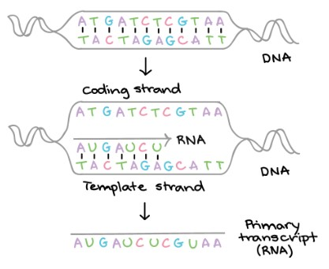

Transcription 在 bacteria 和 eukaryotes 有很多不同處

* 在細菌中的 primary transcript
  * 會直接作為 mRNA (DNA 和 ribosomes 的媒介)
    * p.s. ribosomes 在 cytosol 負責製作 protein
  * Transcription 和 translation 都在 cytosol 中進行

* 在 eukaryotes 的 primary transcript
  * 需要一些步驟才能變成 mRNA
  * 在過程中 RNA 末端會有保護，且會被一點點消去 (**splicing**)
  * Transcription 在 nucleus 進行
  * mRNA 需要輸出到 cytosol 才能找到 ribosome 進行 translation

#### Translation

有了 mRNA 就可以翻譯成 polypeptide 了，這個步驟叫做 translation

* mRNA 中的 nucleotides 會以三個一組 (**codon**) 來讀取
  * 總共有 61 個 codons 來做出 amino acids
  * 其中一個是 start codon
    * 指定從哪裡開始 translation
    * 起點是 amino acid methionine
  * 其中三個是 stop codons
    * 提示 polypeptide 的終點
    * 這三個不算在 61+3 裡面，因為不是用來 coding protein

Codons 和 amino acids 的關係叫做 **genetic code**

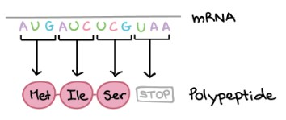

Translation 在 ribosomes 裡面進行，釋出 polypeptides

* Ribosome 會和 mRNA 結合，找出 start codon
  * 然後開始往下讀取 mRNA (一次讀取一個 codon)
  * 產生對應 mRNA codons 的 amino acid sequence

但負責找出 codon 對應的 amino acid 的不是 ribosome 而是 **transfer RNAs (tRNAs)**

* tRNA 的一邊有 3 個 nucleotides
  * 用來找對應的 codon 是否有對應的 base-pair
* tRNA 另一邊則載著 amino acid
  * 這個就是對應 codon 的 amino acid

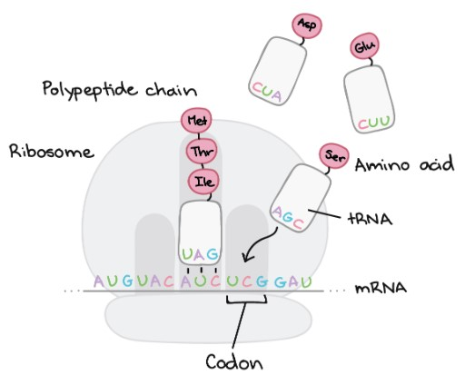

細胞中漂浮著很多 tRNAs，直到找到對應的 codon 並交付 amino acid 給他

* tRNA 在 ribosome 找到對應的 codon
  * amino acid 會被加入到 polypeptide chain 的末端

這些步驟會一直重複，直到 ribosome 讀到 stop codon 然後釋出 polypeptide

## The genetic code

### Codons

Codon 是三個 nucleotides 一組的產物，以下是 codons 的幾個特徵:

* 大部分的 codons 都對應一個 amino acid
* 3 個 "stop" codons 定義 protein 的終點
* 1 個 "start" codon (**AUG**) 定義 protein 的起點
  * 這個 codon 對應的是 **amino acid methionine**

mRNA 分成一個個 codons，由 5' 讀到 3'，產出的 amino acid 則從 N-terminus (methionine) 輸出到 C-terminus

* N-terminus 有 amino group exposed
* C-terminus 有 carboxyl group exposed

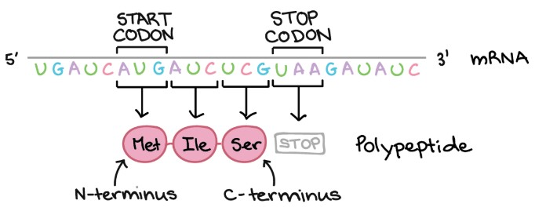

### The genetic code table

Codons 和輸出的 amino acids，兩者之間的關係 (genetic code) 可以用完整的 genetic code table 表示

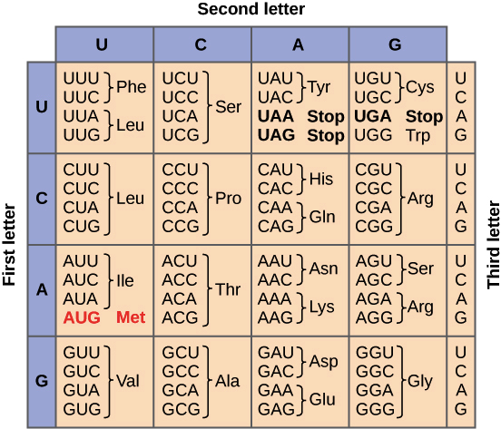

* 左邊是 codon 的第一個 base
* 上方是 codon 的第二個 base
* 右邊是 codon 的第三個 base

有的 amino acids 可以對應多種 codons，例如從表中可看出 leucine 對應了 6 種 codons 組合。

Genetic code table 有個重要的特點，就是幾乎可以對應所有物種合成 protein 的 RNA 組合

### Reading frame

mRNA 到 protein 還有一個重要的概念是 **reading frame**

* 要怎麼在長長一段的 RNA sequence 找出正確的 codon 順序
  * 不同的看法就有不同的 reading frame
  * 例如下圖同個 mRNA 可以被看成三種完全不同的 polypeptide sequence

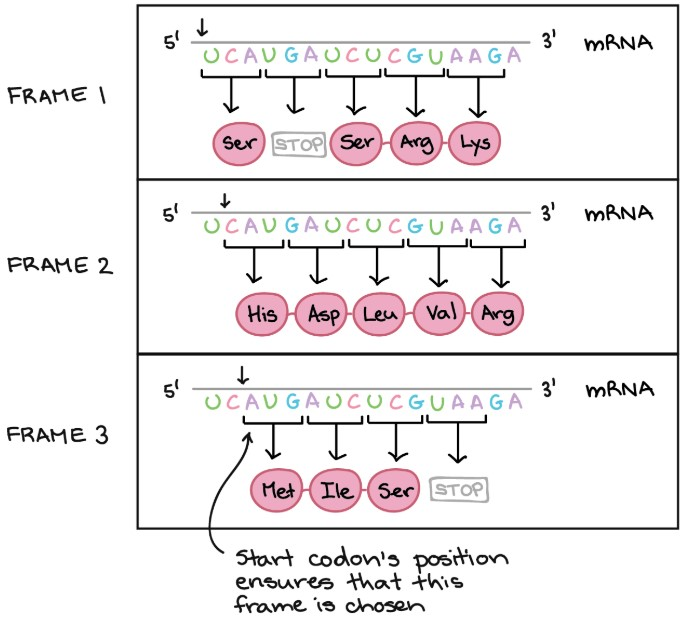

* 哪一個 frame 才是正確的 ?
  * 這要看 start codon 在哪裡
  * 因為 translation 永遠是從 start codon 開始，每三個為一組讀取
  * 所以上圖的 frame 3 才是正確的

另外 mutation 的發生 (insert, delete nucleotides) 會改變 reading frame

* Frameshift mutation
  * 上圖的 UA 就因為 mutation 而被刪除
  * 造成後方的 RNA 也被讀取錯誤
  * 最終產生錯誤的 protein

## One gene, one enzyme

Mendel 雖然找到遺傳現象，但他沒發現他口中的遺傳因子 (gene)，跟其他重要的 functional molecules (e.g., protein) 有所關聯。

* 第一個找出 gene 和 protein 有所關係的是 Archibald Garrod (英國醫學家)
  * Garrod 觀察病人全家都有的 metabolic diseases 叫做 **alkaptonuria**
    * Alkaptonuria 會讓病人的尿變黑
    * 原因是他們無法分解 **alkapton** 這個 molecule

Garrod 認為這和 Mendel 提出的 recessive pattern of inheritance 有關

* Garrod 將這個現象定義成 "inborn error of metabolism"
  * 而且發現其他疾病也有相同現象
  * 因為發現 gene 和控制 metabolic reactions 相關的 enzymes 有關
  * 所以可以說是 "the father of chemical genetics"

### Beadle and Tatum: Connecting genes to enzymes

Garrod 的想法沒得到重視，直到 1940s 兩位科學家 George Beadle 和 Edward Tatum 進行實驗

* Beadle 和 Tatum 使用 bread mold 作為實驗主角
  * bread mold 又稱 **Neurospora crassa**
  * Neurospora 有快速又方便的 life cycle
  * Neurospora 可以生存在 minimal 或 complete medium 當中
    * Minimal medium 只有 sugar, salts, biotin (vitamin)
    * Complete medium 則有豐富的養分讓細胞成長

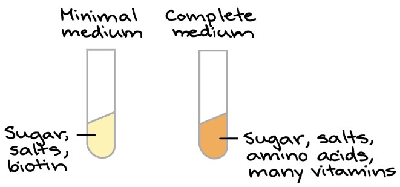

Neurospora 細胞可以在簡單的 minimal medium 存活，是實驗成功的關鍵 !

#### Hypothesis

* 若 gene 真的和 biochemical enzymes 有關
  * 那麼 gene 一定會被外界因素改變 (mutation)
  * 從而將特定的 enzymes "消滅"掉
  * 讓細胞無法在 "minimal" medium 生存

也就是 Neurospora 可以在 complete medium 生存，但無法在 minimal medium 生存

* Beadle 和 Tatum 將 Neurospora spores 暴露在輻射中
  * 再來將它們的子代放到 complete medium 中
  * 當子代繁衍成一群 (colonies) 時，取出一些丟入 minimal medium 中

結果出爐 !

* 有的 colonies 能夠存活在 minimal medium
* 有的 colonies 無法存活在 minimal medium
  * 這些 colonies 就是 **nutritional mutants**
  * Nutritional mutants 的 gene 被破壞，無法產生存活必要的 molecule
    * 而他們可以存活在 complete medium 
    * 因為 complete medium 提供了他們無法製造的養分

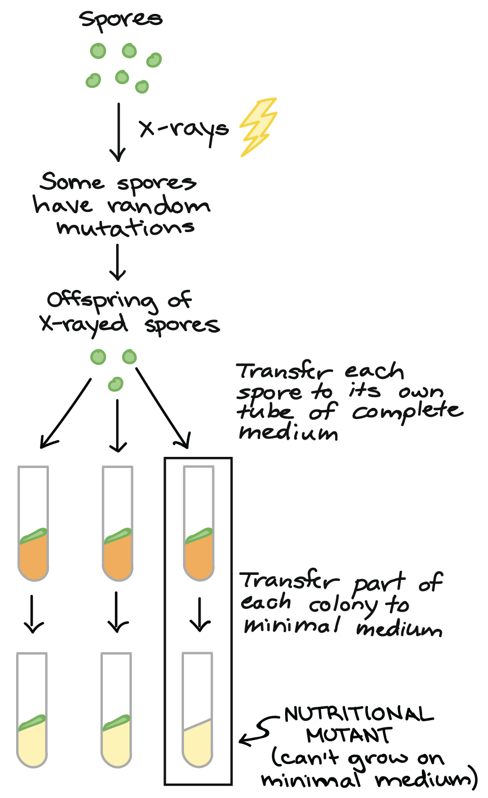

#### Pinpointing the broken pathway

Beadle 和 Tatum 進行了第二階段的實驗，為了是找出真正無法被生產的 protein

* 首先將 mutant 裝入 minimal medium (但還加入特別的東西)
  * 一種加入完整的 **amino acids** (20 種融合)
    * 如果該杯的 mutant 可以存活 (但 vitamin 那杯無法存活)
    * 代表 mutant 一定是無法生成 amino acids
  * 一種加入完整的 **vitamins**
    * 如果該杯的 mutant 可以存活 (但 amino acids 那杯無法存活)
    * 代表 mutant 一定是無法生成 vitamin 

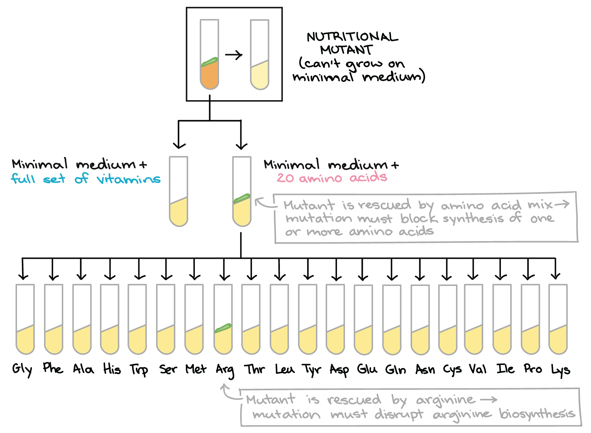

* 當確定是生成 amino acids 的 gene 被破壞後
  * 就可以進入第二輪的測試
    * 將 20 種 amino acids 的 medium 都測試一遍
  * 若 mutant 只存活在某一杯 amino acid medium
    * 就代表該杯就是 mutant 無法生成的 amino acid

這個做法讓 Beadle 和 Tatum 找到了 nutritional mutants 和 amino acid, vitamin 的關係

### "One gene-one enzyme" today

Beadle 和 Tatum 的這個發現稱為 "one gene-one enzyme" 假設，但也在之後被進行了多次的更新

* **Some genes encode proteins that are not enzymes.**
  * Gene 不只用來編碼 enzymes (protein)
  * Gene 也用來編碼了其他 proteins
* **Some genes encode a subunit of a protein, not a whole protein.**
  * Gene 編碼出來的 polypeptide 只是單串 amino acids
  * 有很多 proteins 是由多個 genes 編碼的 polypeptides 組成 
* **Some genes don't encode polypeptides.**
  * Gene 不只編碼 proteins
  * Gene 也編碼 functional RNA molecules

# Transcription

Gene expression 的第一步，將 gene's DNA sequence 複製成 RNA copy (**transcript**)

* Bacteria 可以直接將 transcript 當作 mRNA
* Eukaryotes 則需要對 transcript 動些手腳才能變成 mRNA

負責 transcription 的是 **RNA polymerase** (enzyme)

* 將 double-stranded DNA 打開，並將其中一串 DNA 當作 template 來複製出 RNA
  * 方向是從 5' 到 3'
  * 被打開的 DNA 叫做 **transcription bubble**

人類等 eukaryotes 和細菌的 RNA polymerase 有所不同，和植物又不同

* 人類共有三種 RNA polymerase: I, II, III
  * 每種負責不同種類的 genes
* 植物又比人類多了兩種 RNA polymerase: IV, V

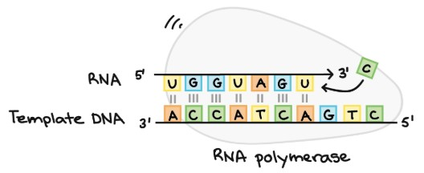

* 第一個被複寫成 RNA 的 DNA 地點稱為 **initiation site**
  * Initiation site 又稱為 +1 site
  * 在 +1 site 之前的都是負數，叫做 **upstream**
  * 在 +1 site 之後的都是正數，叫做 **downstream**

Transcription 有三大步驟: initiation, elongation, termination

## Initiation

* RNA polymerase 到 DNA 上找到 **promoter** (gene 的開始)
  * 每個 gene 都有自己的 promoter
* RNA polymerase 和 promoter 結合後
  * 會將 DNA 打開，把其中一條當作 template 來複寫

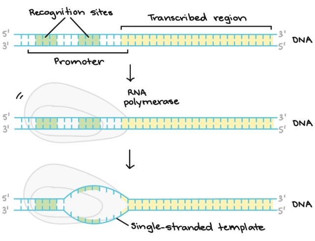

### In bacteria

* 細菌的 promoter 有兩種 DNA sequence
  * **-10 elements**
  * **-35 elements**
  * 取名來自它們在 +1 site 的前面 10 和 35 個 nucleotides 遠
* DNA 會在 -10 的地方被打開
  * 因為充滿 As 和 Ts 所以較容易被打開 (2 hydrogen bonds only)

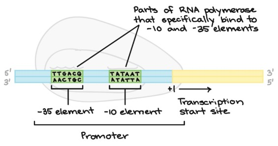

### In human

* 細菌的 RNA polymerase 會直接接觸 promoter
  * 但人類需要透過 **basal transcription factors** 先和 promoter 結合
  * 提供 RNA polymerase 一個立足點

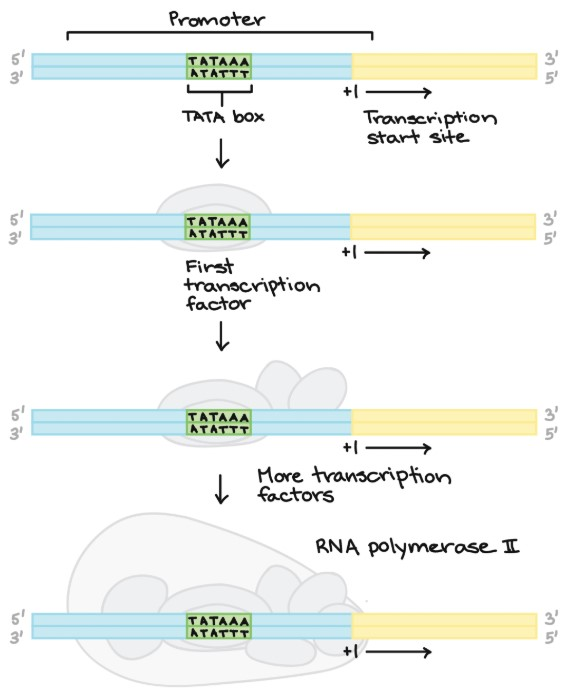

* 大多的 eukaryotic promoters 會有一個序列叫做 **TATA box**
  * TATA box 的角色就像 -10 element 一樣
  * 讓一堆 basal transcription factors 找到他並結合
  * 最後吸引 RNA polymerase 來結合

## Elongation

* RNA polymerase 開始讀取 **template strand** (一次讀取一個 base)
  * 讀取 DNA 的方向是 3' 到 5'
  * 製作出一條對應的 RNA copy chain (由 5' 到 3')
* RNA copy chain (transcript) 會和 **coding strand** 有一模一樣的資訊
  * 只是 uracil (U) 取代 thymine (T)

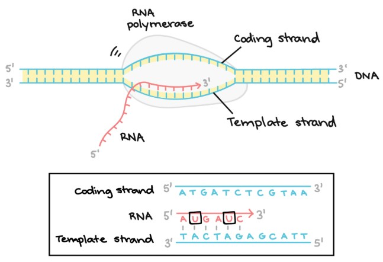

DNA 可以一次被很多 RNA polymerases 複寫

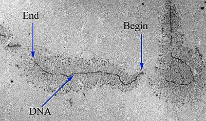

## Termination

* DNA 中有一串序列叫做 terminator 會告訴 RNA 複寫完畢
  * 當 RNA 複寫到 terminators
  * 會讓 transcript 從 RNA polymerase 釋放出來

Termination 有兩大形式: Rho-dependent 和 Rho-independent

### Rho-dependent termination

* 在 RNA 中會有一個 Rho factor (protein)
  * 會往上爬到 RNA polymerase 的地方
    * 將 RNA transcript 從 DNA template strand 拔出來
  * DNA 中會有一個 transcription stop point
    * 停止 RNA polymerase 幫助 Rho factor 趕上

### Rho-independent termination

* DNA template 中有一個區域富含 Cs 和 Gs nucleotides
  * RNA 複寫這段時，會變成摺疊變成髮夾狀
  * RNA 髮夾會接續著 U nucleotides
    * 因為 U 是和 DNA 的 A 吸引 (2 hydrogen bond)
    * 所以容易被其他 enzyme 拉開

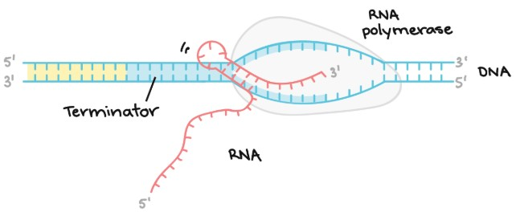

## What happens to the RNA transcript?

* 在細菌中，完成複寫的 transcript 作為 mRNA
  * 會快速和 ribosomes 進行下一個步驟 "translation"
  * mRNA 和 ribosome 形成 **polyribosome**

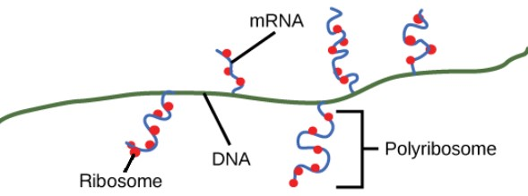

而人類的 transcript 必須進行 RNA modification 變成 mRNA 先

## Eukaryotic RNA modifications

RNA transcripts 在 bacteria 和 eukaryotes 有不同角色

* 在 bacteria 的 transcript 等於 mRNA
  * 可以開始 translation
* 在 eukaryotes 的 transcript 等於 pre-mRNA
  * 還需要程序才能變成 mRNA

### 5' cap and poly-A tail

程序一，在 pre-mRNA 的開頭 (cap) 和結尾 (tail) 加入保護機制，方便 mRNA 離開 nucleus

* **5' cap** 會被加入到第一個 nucleotide
  * Cap 是一個 modified guanine (G) nucleotide
  * 保護 transcript 不被破壞
  * 幫助 ribosome 方便和 mRNA 結合

* **3' end** 是多個 adenine (A) nucleotides 被加入到最後
  * RNA 在 transcription 有一個序列叫做 **polyadenylation signal**
  * Enzyme 會在這個序列將 RNA 切成兩半
  * 其他 enzyme 會再將 100 至 200 個 adenine (A) 加入到切點的後方，形成 **poly-A tail**
  * 讓 transcript 更穩固，幫助他更容易離開 nucleus

### RNA splicing

程序二，**RNA splicing** 移除 pre-mRNA 不必要的地方，合併有用的地方

* 執行的是 **spliceosome** (protein-RNA complex)
  * 發現並移除 **introns** (沒用的 pre-mRNA 部分)
  * 接著發現並合併 **exons** (有用的 pre-mRNA 部分)

只有正確的 exons 組合才能真正合成 protein，多一點或少一點 introns 都會無法運作

#### Alternative splicing

Splicing 看起來很無意義，但他是為要 **alternative splicing** 而存在

* 一個相同的 gene 只要 splicing 切法不同
  * 就可以產生多種 mRNA 的結果
  * 製造出不一樣的 proteins

下圖時是一個 pre-mRNA 在保留各種 exons 時，產生不同的 protein 結果

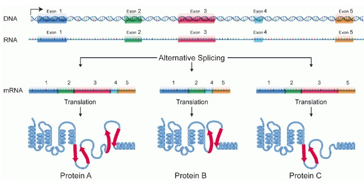

## Transcription happens for individual genes

* 每個細胞會調節每個 gene 被 transcript 的時機
  * 只有需要特定 products 的時候才會執行
  * 例如下圖對 4 種 gene 的要求不同，執行 transcription 的次數也不同

