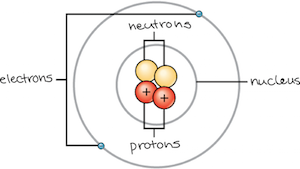
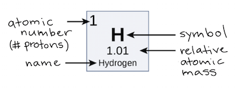
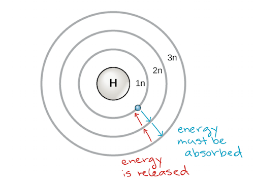
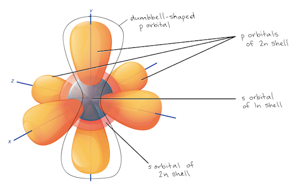
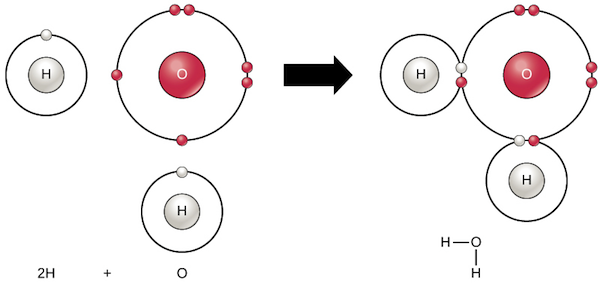
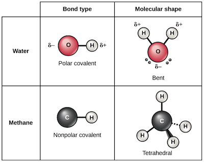

# Elements and Atoms

* Matter
  * 所有能在空間中看的見、擁有量的物質
  * 由更小的 Elements 組合而成
* Element
  * 不能夠再拆解成不同的物質時，就稱作元素
    * e.g., Gold, Carbon
* Atom
  * 將元素拆拆拆，拆成最小單位並且依然保留該元素的 properties 就稱作原子
  * e.g., Gold => Gold atoms

# Atom

* Atom 可以稱成兩個 region，分為 **atomic nucleus** 和 **orbitals ("clouds")**
* Atomic nucleus 包含了 **Proton** 和 **Neutron**
  * Proton (質子) 帶有 positive charge (正極)
  * Neutron (中子) 則是中性
* Orbital 裡有 **Electron**
  * 可以想像 electron 像 orbit 一樣圍繞 nucleus，但其實他是在周圍任何地方機率性的出現，並且跟 proton 吸引
  * Electron (電子) 帶有 negative charge (負極)
* 一般的 atom 都會有這三種 subatomic particles
  * 例如 Helium 有 2 個 Proton, 2 個 neutron 和 2 個 electron
  * 只有 Hydrogen 是例外，他只有一個 Proton + 一個 Electron，而沒有 Neutron

  * Proton 和 Neutron 有差不多的質量，為 $$1.67\times 10^{-24}$$ 克重
    * 會用 **atomic mass unit (amu)** 這個單位來表示，一個 proton 為 1 amu 重
  * Electron 則是只有 1/1800 amu 所以通常在表示 atom 重量時會被省略
* 一個 Neutral atom 表示他的 proton 和 electron 數量相等，正負極互相抵消

## Atomic Number

* 一個 atom 是什麼元素，可以從他的 **proton 數量**來判斷
  * e.g., Carbon atom 有 6 個 proton
  * 我們稱這個數量為 **atomic number**
* 相同元素的 atom 可以有不同的 neutron
  * 同個元素但不同 neutron 我們稱作 **isotopes**
  * e.g., Carbon-12 $$(^{12}C)$$ 和 Carbon-14 $$(^{14}C)$$
* Proton 和 Neutron 相加的質量稱作 **Mass number**
  * Mass number = protons + neutrons
  * e.g., Carbon-12 = 6 protons + 6 neutrons
  * e.g., Carbon-14 = 6 protons + 8 neutrons

## Atomic Mass

* 所以用 amu 來表達 mass number 就是 atomic mass
  * e.g., Carbon-12 = atomic mass of 12 amu.
* 因為一種元素可以有多種 isotopes
  * 但 carbon-12 在地球上出現的數量比 carbon-14 還要多非常多
* 所以科學家用 **relative atomic mass** 來表達一個 atom 在地球上的平均質量

## Electron shells and the Bohr model

* 科學家發現 electron 會根據不同的 energy level 在不同距離環繞 nucleus
* 一般來說可以分成 1n, 2n, 3n 三層
* 越內層的能量越小，越外層能量越大
* 所以下圖顯示當 electron 吸收能量時會跳到外層，而釋放能量時會跳到內層

* Atom 傾向保持在 lowest-energy 的 stable 狀態
* 所以 electrons 會從最內層的 low energy shell 開始填滿
  * 1n 可以保存 2 electrons
  * 2n 可以保存 8 electrons
  * 3n 可以保存 18 electrons
* 而最外層的 shell 決定了每一種 atom 的 reactivity, 或是和其他元素結合的 tendency
* 最外層稱作 **Valence shell**，而在該層的 electron 稱作 **Valence electrons**
* 在 Biology 常見的元素，通常最外層都需要 8 electrons 來維持 stable
  * 這個 Rule 稱為 **Octet rule**

* 上圖可以看到一些常見的 electron configurations
* Helium (He) 有著 full valence shell (2 electrons in 1n)
  * 所以他非常穩定不太和他人往來
* Neon (Ne) 一樣有 complete outer 2n shell 包含 8 electrons
  * 所以可以看到 Group 18 (Noble gases) 都不太和其他元素反應
* Argon (Ar) 雖然在 3n 沒有包含滿滿的 18 electrons
  * 但根據 octet rule 他和 Helium, Neon 一樣 stable
* 另外 Sodium (Na) 在 3n 只有 1 個 electron
  * 所以他非常想要把這個 electron 給別人，讓自己穩定
* 而 Chlorine (Cl) 在 3n 則有 7 個 electrons
  * 所以他和 sodium 非常 reactive，迫不及待從 sodium 手上拿到 electron

# The periodic table

* 元素根據 atomic number (how many protons they have) 排列在週期表上
* 若都假設元素是 neutral atom 那就可以快速得到 electrons 的數目
* 又因為 columns, rows 我們可以從表中得到很多有用資訊
* Rows : Periods
  * H 和 HE 的 electron 都要 fill 1n shell
  * Li fill 2n shell
  * Na fill 3n shell
* Columns : Groups of elements
  * Group 1 只有 1 valence electron
  * Group 18 則有 8 valence electrons 除了 HE
* Group 18 稱作 Noble (inert) gases，作為單個 atom 就已經 highly stable
* Group 1 除了 H 稱作 Alkali metals，只有 1 個 electron 在最外層所以 unstable 
  * 通常會 lose 或 share 他們的 valence electron 來達到 stable
  * e.g., $$\text{Li loses } e \rightarrow \text{Li}^+$$
  * e.g., $$\text{Na loses } e \rightarrow \text{Na}^+$$
* Group 17 稱作 Halogens，有 7 個 valence electrons 缺 1 所以 unstable
  * 通常會從別的 atom 獲得 1 個 electron 來達到 stable
  * e.g., $$\text{Cl gains } e \rightarrow \text{Cl}^-$$
* Carbon 在 Group 14 只有 4 valence electrons
  * 通常 C 會藉由 share electrons 來達到 complete valence shell
  * Forming bonds with multiple other atoms

## Subshells and orbitals

* 為了更精確的表達 electrons 在 nucleus 周圍，也就是 electron orbitals 的分布
* 科學家用數學方法定義了 electrons 90% 所在的地方
* 這些 high-probability region 就是 orbital，每個可以容納 2 個 electrons

* 於是一個 electron shell 被分成多個 subshells，也就是 orbital sets
* Subshell 可以被指定為 s, p, d, f 代表不同形狀
* s 是 1 個 single, spherical orbital
* p 是 3 個 dumbbell-shape orbitals 各別垂直
  * Biology 通常常見的就是 s, p subshells
  * d, f 則是更複雜的形狀

### Electron Shell with subshells

* 1n 通常對應於單個 1s orbital
  * 所以 H 只有一個 electron 在 1s
    * 這可以表達成 **electron configuration** as $$1s^1$$
    * Superscript 表示有幾個 electron
  * Helium 有兩個 electron 填滿 1s
    * 所以可以表達為 $$1s^2$$
* 2n 則對應有單個 2s 和三個 2p，每個包含 2 electrons
  * 所以 electron 會先去 2s 再去 2p
  * 例如 Li 有 3 個 electrons，會先填滿 1s 剩下一個再去 2s
    * $$\text{Li electron configuration: } 1s^22s^1$$
  * 再例如 Ne 是含有 10 electrons 的 Nobal gases
    * $$\text{Ne electron configuration: } 1s^22s^22p^6$$
* 3n 一樣有單個 s orbital 和三個 p orbital (3s + 3*3p)
  * 另外還會有一個 d orbital 但他的 energy 比 3s, 3p 還要多更多
  * 通常要到 4 row 以上的元素才有可能滿足
  * 所以第 3 row 的元素 (如 argon) 在 3s, 3p 都被填滿情況就可以說是 stable

# Chemical bonds

* 為什麼元素會互相有化學鍵反應 ?
  * 因為 atoms 皆想要得到最 stable 的狀態
    * valence shell 被填滿
    * 或是滿足 octet rule (8 valence electrons)

## Ions

* 一些 atom 在 gain/lose electron 後會變成 ions (charged particles)
* Ion 又可分成 **cation** (陽離子) 和 **anion** (負離子)
  * Cation 是 positive ion 透過失去 electron 而來
    * sodium => sodium cation $$(\text{Na}\rightarrow\text{Na}^+)$$
  * Anion 是 negative ion 透過獲得 electron 而來
    * 通常命名結尾 "-ide"
    * chlorine anion is called chloride $$(\text{Cl}^-)$$
* 兩個 atoms 互相 lose/gain 的過程稱作 **electron transfer**
  * Sodium atom + Chlorine atom

* Na 和 Cl 互相作用後，皆成為 ion，且滿足 octet rule 和 complete outermost shell
* 分別帶有 +1 charge $$(\text{Na}^+)$$ 和 -1 charge $$(\text{Cl}^-)$$
* 作用中的 lose/gain 通常會同時發生

## Ionic Bond

* Ionic bond 指的是兩種相反 charge 的結合
  * 例如 positively charged sodium ions + negatively charged chloride ions = sodium chloride (table salt)
* 這類的 ionic compounds 不只是單個和單個 ion 間的結合，而是大量 ions 排列組合而成

## Covalent Bond

* 除了 lose/gain 的模式，atom 之間還可以透過 share electron 方式來達到 stable
  * 這種方式就稱作 **covalent bonds**
  * covalent bonds 在生物的分子間較 ionic bonds 常見
  * 例如他是 carbon-based organic molecules (DNA, proteins) 架構的 key
* 我們拿水分子 water molecule $$(\text{H}_2\text{O})$$ 來舉例
  * 他包含了 2 個 hydrogen atoms 和 1 個 oxygen atom

* Shared electron 將會在 H 和 O 之間游移
  * 幫助 H 和 O 各別達到 complete valence shell (2 and 8 electrons)

### Polar Covalent Bond

* 如果當中某個 shared electron 特別喜歡移動到某個 atom 時候
  * 這個 bond 就是 **polar covalent bond**
* 也因為 electron 特別待在某一邊的關係，atoms 就會分別出現些微的正負電極
  * slightly positive $$(\delta^+)$$ and slightly negative $$(\delta^-)$$ charge
* 在 water molecule 中就有這個現象
  * 因為 oxygen 比 hydrogen 更加有 **electronegative**
    * electronegative 越大代表越會吸引 electron
  * 所以 electron 比較會待在 oxygen 周圍
    * 使得 oxygen 有 slightly negative charge $$\delta^-$$ (high electron density)
    * 而 hydrogens 則是 slightly positive charge $$\delta^+$$ (low electron density)
* 總而言之，當兩個 atom bond 在一起時
  * 較高 electronegative 的 atom 會試圖 "hog" shared electrons
  * 較高者會得到些微的負電極
  * 並且讓 covalent bond 呈現 polar 或 nonpolar 情況

### Nonpolar Covalent Bond

* 當兩個 atom 間的 shared electrons 平均存在周圍是就是 nonpolar covalent bond 啦 !
  * 例如氧分子 molecular oxygen $$(\text{O}_2)$$
    * oxygen atoms 互相分享最外層不足的兩個 electrons
  * 例如甲烷 methane $$(\text{CH}_4)$$
    * carbon atom 將自己的 4 個 electrons 分享給四個 hydrogen atoms
    * 4 hydrogen atoms 也分享自己的 electron 來填滿 carbon atom

## Electronegativity and Bonding

* Covalent & ionic bonds 都是常見非常 strong 的 bonds
* 但生活中 (biology) 還有許多不同的 temporary bonds (weak)
* 沒有這些 bonds 就沒有生命
  * 例如 hydrogen bonds 穩定 proteins 或 DNA 架構，幫助 cell 組成

### Hydrogen bonds

* 在一些包含 hydrogen 的 polar covalent bond 中
* hydrogen 通常會帶有些微正極 $$(\delta^+)$$
  * 因為 electron 會被別的 atom 吸引 (e.g., O-H bonds)
* 帶有些微正極的 hydrogen 就容易被帶有負極的鄰居吸引
  * 這個現象就是 **hydrogen bond**
* 這個現象在 water molecules 中常見
  * 單個 hydrogen bond 可能非常脆弱，但多個結合在一起就能非常堅固

### London dispersion forces

* London dispersion forces 一樣是非常 weak 的 bond
  * 但他不只能作用在 atoms 間，也能作用在 molecules 間
* 因為 electron 是 constant 移動，所以有時會結在一群
  * 造成某一方 atom/molecule 變為 partial negative charge，另一方則相反
  * 此時的些微正負極就讓兩邊吸引在一起

## Bond in cell

* Strong 和 weak bonds 都會是 cell 中非常重要的角色，舉例來說
  * Strong covalent bonds 幫助建立 strand of DNA
  * Weaker hydrogen bonds 幫助建立 two strands of the DNA double helix

# Chemical reactions

* 組成身體的分子 molecules 其實就是各種 atom 透過 chemical bonds 結合而成
* 試著將各種 atoms 用各種不同 chemical bonds 像積木一樣結合
  * 不斷結合分開一個個 chemical bonds 的過程就稱作 **chemical reaction**
* 要參加 chemical reaction 的物質稱作 **reactants**
* 產生的產物就稱作 **products** (compound)
* 通常一般的 chemical reaction 是不容易被逆轉回來的
* 以下舉例一個 **hydrogen peroxide** 被拆成 2 個 **water** molecules 和 1 個 molecular **oxygen** 的 chemical reaction

$$
2\text{H}_2\text{O}_2 \text{ (hydrogen peroxide)} \rightarrow 
2\text{H}_2\text{O} \text{ (water)} +
\text{O}_2 \text{ (oxygen)}
$$

* 注意水和過氧化氫的前面都有一個 2 他們是 **coefficients**
  * 告訴我們有多少 molecules 參與在 reaction 讓整個反應**平衡**
    * **Balance** : 等式兩邊的atoms 數目一樣
  * equation of reation must be balanced 來達到質量守恆定律 (**law of conservation of matter**)
    * 表示 reaction 中沒有任何 atom 消失或增加

* 另外一個有趣例子是水分子的形成
  * 太空梭前方的 tank 就是包含大量 liquid hydrogen & liquid oxygen
  * 作用後產生大量能量，成為後方推進的動力

$$
\text{energy} + 2\text{H}_2 + \text{O}_2 \rightarrow 2\text{H}_2\text{O} + \text{LOTS OF ENERGY!}
$$

## Reversibility and equilibrium

* 有些 reaction 是 **irreversible** 有些則是 **reversible**
  * reactants 轉換成 products 是 forward reaction
  * products 變回 reactants 則是 back reaction
* 在 reversible reaction 中
  * 通常 back and forth reaction 會同時作用
  * products 和 reactants 會試著達到一個最終平衡，稱為 **equilibrium**
  * 在 equilibrium 的狀態時，還是會繼續作用下去，但兩者的平衡點再也不會改變
* 以下是一個 reversible 的在人體血液中的實例
  * excess hydrogen ions $$(\text{H}^+)$$ 會和 bicarbonate ions $$(\text{HCO}_3^-)$$ 反應合成出 carbonic acid $$(\text{H}_2\text{CO}_3)$$
  * 如果有一些 carbonic acid 加入，那就會馬上轉換為 bicarbonate 和 hydrogen ions 來得到 equilibrium
  * 這個反應其實就是我們人體保持 blood pH stable 的關鍵

$$
\text{HCO}_3^- + \text{H}^+ \rightleftharpoons \text{H}_2\text{CO}_3
$$