# Mendelian genetics

## Research on heredity

人類的遺傳特徵 (髮色、身高等) 來自父母親 genes 的影響，而 chromosome 上的任意一段 DNA 就是 genes

* 150 年前還不懂 gene 的概念
  * 是由 **Gregor Mendel** (father of genetic) 進行實驗所發現遺傳
  * Mendel 的發現有兩大定理
    * The law of segregation
    * The law of independent assortment

### 3:1 ratio

* Mendel 使用 pure-breeding 的 pea plants 作為研究對象
  * 研究交配後的顏色、大小、形狀等
  * 最初的世代稱為 P generation (parental)
  * 下一代稱為 F1 generation (first filial)
  * 再下代稱為 F2 generation (second filial)

Mendel 把擁有紫色花朵和白色花朵的 pea 交配，得到 100% 是紫色花朵的後代

* 他稱 F1 generation 中擁有紫色花朵為 **dominant trait** (顯性)
  * 被隱藏的白色花朵特徵稱為 **recessive trait** (隱性)

Mendel 進一步將這些 F1 generation 良好分類，並讓他們 **self-fertilize**

* F2 generation 中共有 705 紫色和 224 白色
  * 大概為 3:1 的比例，而這並非巧合
  * 其他所有的特徵在 F2 也是 3:1 的情況

### Mendel's model of inheritance

Mendel 將 3:1 ratio 和一些成果，統整成 model for the inheritance (單特徵的)

* 在 Mendel's model 中，父母會向孩子傳遞 "heritable factors"
  * 也就是我們現在所說的 genes
  * 每個獨立的個體都會有 2 個 gene 的複製
    * e.g., gene for seed color
  * 兩個 gene 表現在同個地方但不同特徵的地方稱為 allele
    * e.g., allele for green/yellow color
  * 當 allele 同時擁有 dominant 和 recessive 時
    * dominant 會將 recessive trait 完全隱藏起來

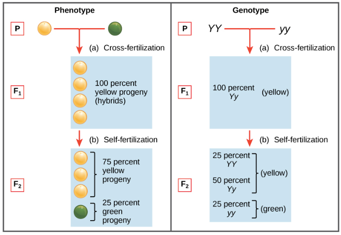

* **Genotype** 指的是生物中的一組組 alleles
  * YY, Yy, yY, yy
* **Phenotype** 指的是 genotype 所顯現的外部特徵
  * 黃色、綠色種子
* **Homozygous** 指的是兩個 gene 的同個 allele 是相同的
  * YY, yy
* **Heterozygous** 指的是兩個 gene 的同個 allele 不同
  * Yy, yY

> 這邊沒講到，但 phenotype 也會受到外部環境影響而改變

## The law of segregation

上面的 model 還不能完整解釋 3:1 ratio 的原因，需要 law of segregation 來講解

* Law of segregation
  * 控制特徵的兩個 genes 只有一個會由 gamete (egg, sperm cell) 方式傳遞給孩子，且 genes 的配置也是隨機的
  * 孩子的 genotype 就會是兩個 gametes 的 alleles 組合，如下圖

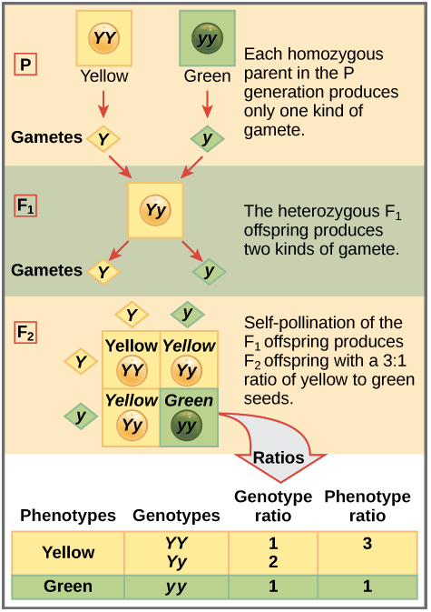

上方在 F2 展示的 four-squared box 稱為 **Punnett square**

* 在 Punnett square
  * 一邊寫著父親的 allele
  * 一邊寫著母親的 allele
  * 可以產生所有可能的 gametes
  * 因為 F2 是 self-fertilize，所以兩邊都是自己

因為 Punnett square 的每個方塊都是 equally likely event，
所以就可以從中得到 genotype 和 phenotype 的結果 (3:1 ratio)

### The test cross

Mendel 也想出辦法來找出特徵為 heterozygote (Yy) 或是 homozygote (YY)

* 因為 Yy 和 YY 都會是 dominant trait
* 所以要使用 **test cross** 找出誰才是真正的 genotype
  * 使用的生物包含 1 個 dominant phenotype (YY 或 Yy)
  * 還有一個 homozygous recessive (一定是 yy)

* 如果 dominant phenotype 是 homozygous (YY)
  * 那麼 F1 一定全部都是 dominant trait
* 如果 dominant phenotype 是 heterozygous (Yy)
  * 那麼 F1 的 phenotype 就會一半是 dominant 一半是 recessive
  * 1:1 ratio

## The law of independent assortment

Mendel 也解決了 genes 互相是否會影響的疑問，就是 law of independent assortment

* Law of segregation 預測了單一特徵的走向
  * 但能否用 2 個完全不同的 genes 來預測 2 個完全不同的特徵呢

首先，這 2 個 genes 是否是 inherited independently ?

* **Law of independent assortment** 說
  * Gamete 從一個 gene 收到的 allele
  * 並不會和從另一個 gene 收到的 allele 有任何關係

### Example: Pea color + pea shape genes

* Yellow, round seeds 為 YYRR
* Green, wrinkled seeds 為 yyrr

因為兩個都是 homozygous，所以根據 law of independent assortment

* Wrinkled, green plant 全都是 ry
* Round, yellow plant 全都是 RY
* 所以 F1 這代全都是 RrYy
  * 全都是 round, yellow plant 的 heterozygotes
  * 稱為 **dihybrids** (di-: two, -hybrid: heterozygous)

Dihybrid 的交配或 self-fertilization 稱為 **dihybrid cross**

* Mendel 在進行 Dihybrid cross 產生了 4 種後代
  * 機率分配是 9:3:3:1
  * 這個 ratio 是 law of independent assortment 的關鍵
  * 因為跟數學 (Punnett square) 算出來的一模一樣

### Independent assortment vs. linkage

我們用另一個角度看為何 law of independent assortment 會成立

* 若 color 和 shape 的 genes 真的會互相影響
  * 例如控制兩者的 genes 在 chromosome 上非常非常接近
  * 那 color 和 shape 的特徵就不可分離了吧

我們將 yellow, round 給成 2 個 YR，而 green, wrinkled 給成 2 個 yr

* F1 當然全都是 YyRr (yellow, round)
* F2 則變成了 3:1 ratio

所以如果兩個特徵真的會同時影響彼此 (**completely linked**)

* **Dihybrid cross** 就只會產生 **2 種**可能性的子代
  * 也就是 3:1 ratio

而 Mendel 的結果顯然不是 3:1 而是 9:3:3:1，這告訴他 genes 是 assorted independently

### The reason for independent assortment

為何會發生 independent assortment 要從 chromosomes 上面的 genes 看起

* 更準確的說，要觀察 **homologous pair** (相同位置的 alleles)
  * 在 meiosis I 的時候，這些 homologous pairs 會隨機排列
  * 然後就可以得到由不同 combo 組成的 gametes

考慮到下圖，兩種不同的 chromosome arrangement

* 一種是 red "mom" chromosomes 合併在一起
  * 一種是 red, blue 互相混合
* 在 meiosis 不斷發生的情況下
  * RY, Ry, rY, ry 就應該是相同的頻率出現

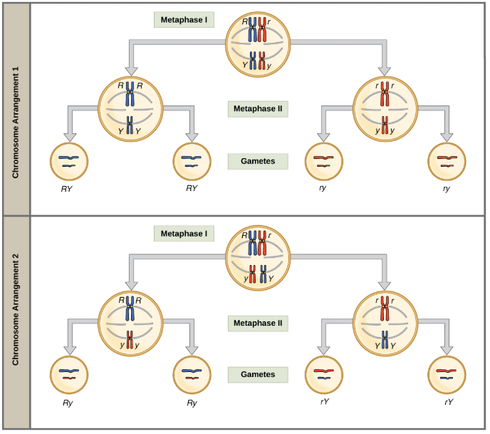

* 所以不同 chromosomes 的 genes 將會 assort independently
  * seed color 和 seed shape 的 genes 分別在 1, 7 chromosomes
* 在相同 chromosome 的 gene 只要離的夠遠也會 assort independently
  * 因為 crossing over 的發生

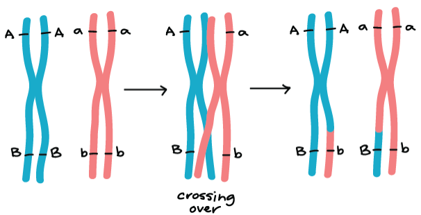

* 但有時候 genes 真的太靠近了，並不會 assort independently
  * 我們稱這些 genes 為 **linked**
  * 只有在非常少數的 crossing over 才會發生 assort independently

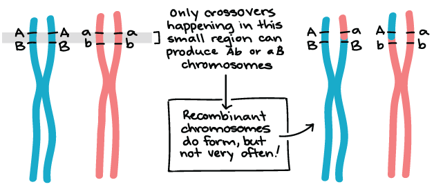

# Variations on Mendelian genetics (overview)

上面學到的 Mendel's law 可以概括整個遺傳的內容，但總會有些例外

## Variations involving single genes

* **Multiple alleles**
  * 一個 gene 可以有超過 Mendel 研究的兩個以上的 alleles
* **Incomplete dominance**
  * 兩個 alleles 不一定會完全 dominate 另一個的 phenotype
  * 可能會出現介於中間的 phenotype
* **Codominance**
  * 兩個 alleles 可能會同時 dominant (特徵一起出現)
* **Pleiotropy**
  * 某些 gene 可以一次影響很多特徵，不只一個
* **Lethal alleles**
  * 有些 genes 在 homozygous 或 heterozygous 時會導致死亡
* **Sex linkage**
  * Sex chromosomes 的 genes (e.g., X chromosome of humans)
  * 會有不同 inheritance patterns

## Variations involving multiple genes

有些變化會發生在 gene pairs 或大量 genes，也就是兩個以上 genes 影響了相同的 process

* **Complementary genes**
  * 兩個不同 genes 的 recessive alleles 反而給出一樣的 phenotype
* **Epistasis**
  * 某個 gene 的 alleles 可能將另個 gene 的 alleles 給隱藏
* **Genetically linked**
  * Gene pairs assort independently

## Polygenic inheritance and environmental effects

很多生物特徵是由多個 factors 所控制，這些 factors 可能包括 genetic, environmental (or both)

* **Polygenic inheritance**
  * Polygenic 代表該特徵是由多個不同的 genes 所控制
  * 這類特徵可能很模糊，而非一個簡單明確的特徵
* **Environmental effects**
  * Phenotype 不見得完全由 genotype 所控制
  * 有的 phenotype 還會受到環境的影響

因為 genetic 跟 environment 造成了兩個事件

* **Incomplete penetrance**
  * 不是每個 genotype 都能完整顯現出對應的 phenotype
* **Variable expressivity**
  * 一個 genotype 可能有較強或較弱的 phenotype

# Variations on Mendelian genetics

## Incomplete dominance

* 一個 heterozygous organism 的 phenotype
  * 可能是父母的混合體
  * 以下以 snapdragon 為例

* Homozygous 的白色花朵為 $$C^WC^W$$
* Homozygous 的紅色花朵為 $$C^RC^R$$
* 但下一代卻產出粉紅色的花朵 $$C^RC^W$$

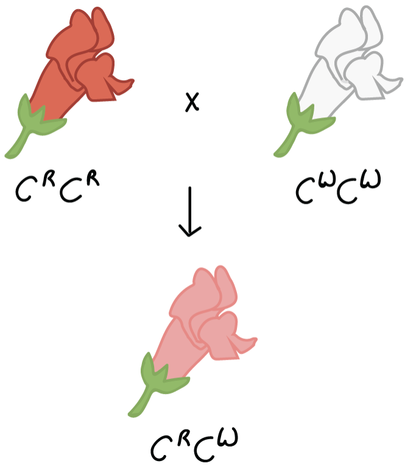

儘管如此，還是能用 Mendel's model 來預測，
粉紅色花朵的 snapdragon 進行 self-fertilization 後，
會變成 red:pink:white = 1:2:1

## Codominance

Codominance 和 incomplete dominance 有些類似，是把父母的兩種特徵一起呈現出來

* 以人類的 MN blood groups (類似於 ABO blood groups) 舉例
  * 在 red blood cells 上產生 M markers 的 allele 擁有 $$L^M$$
    * 所以是 $$L^ML^M$$ 的 homozygotes
  * 在 red blood cells 上產生 N markers 的 allele 擁有 $$L^N$$
    * 所以是 $$L^NL^N$$ 的 homozygotes
  * 而 heterozygotes ($$L^ML^N$$) 則會出現 M, N 各半的 markers

Codominance 一樣可以用 Mendel's model 來預測，
若父母生的夠多，最終 M, MN, N 的 blood types 會是 1:2:1 的比例 !

## Multiple alleles

Mendel 原本認為每個 gene 只有 2 個 alleles 來影響特徵，的確對人類 (all diploid organisms) 是如此

* 但一些生物層級可能出現多個 alleles 來影響特徵
  * 而這些生物就會有更多的 alleles 組合
  * 例如影響兔子顏色的 **C gene** 有四個常見 alleles
    * $$C, c^{ch}, c^h, c$$

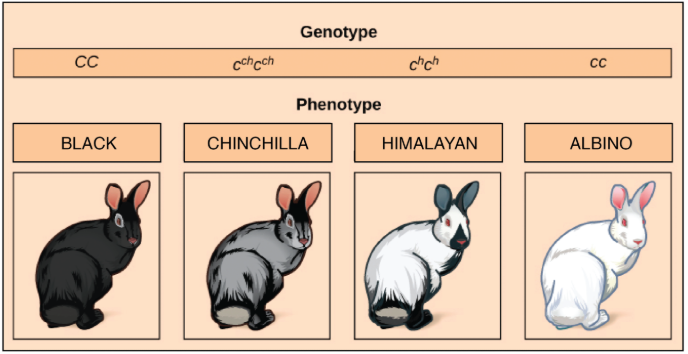

* Multiple alleles 造成多樣的 dominance 關係
  * 例如 black ($$C$$) 會完全 dominate 所有其他特徵
  * Chinchilla ($$c^{ch}$$) 有時會 dominate Himalayan ($$c^h$$) 和 albino ($$c$$)
  * Himalayan ($$c^h$$) 會完全 dominate albino ($$c$$)

## Pleiotropy

Mendel 在研究花的顏色時，也發現了一些事情，就是 seed 的顏色和 axil 的顏色也會跟花顏色有正相關

* Gene 可以控制多個看似互不相關的特徵，稱為 **pleiotropic**
  * Pleio- = many
  * -tropic = effects

* 製造花朵顏色的 protein 同時也製造了其他地方的顏色
  * 這讓我們能夠從毫不相關的特徵來推回某個 gene 的缺陷

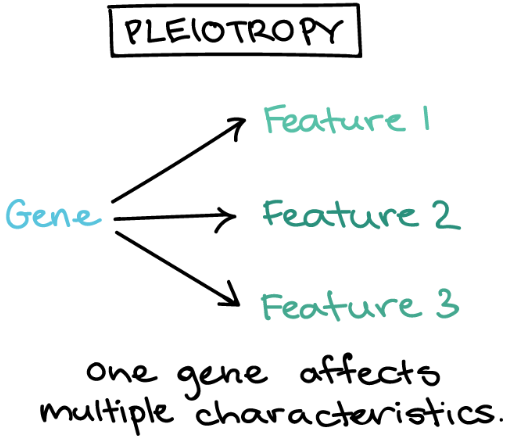

儘管一個 gene 決定了多個特徵，但他的 model 依然和原本一樣

* 可以將所有特徵看成一個大特徵
  * 所以 dominant, recessive 的關係一樣存在
  * 子代的 heterozygotes 也一樣是 3:1

Marfan syndrome 這個基因缺陷，是一個 pleiotropy 的例子

* Marfan syndrome 會出現以下症狀
  * 身高過高
  * 手、腳指頭過細
  * 水晶體位移
  * 心臟問題

科學家發現，其實就是某段 gene 產生的 protein 發生問題，造成 fibrils 變異，才會出現這麼多不相關的問題

## Lethality

Mendel 所看到的 homozygous dominant, recessive 和 heterozygous 都是相同

* 但事實上有的 gene 會導致生物無法生存
  * 例如 allele 讓 gene 失去功用，或造成一些異常的活動
  * 有可能會讓觀測者永遠觀測不到他的 genotype

### The yellow mice

20 世紀法國科學家 Lucien Cuenót 在 yellow mice 身上發生不對勁的遺傳

* Yellow mice 和 brown mice 交配
  * 產生了一半 yellow 一半 brown 的後代
  * 代表這些 yellow mice 應該是 heterozygous
  * 而 yellow 的 allele ($$A^Y$$) 會隱藏 brown 的特徵

但奇怪的是，他又把這群 hererozygous 的 yellow mice 互相交配

* 原本應該要產生 yellow:brown = 3:1 的情況
  * 但卻只有 2:1
  * 而且當中完全沒有 homozygous 的 yellow mice 存在 ($$A^YA^Y$$)

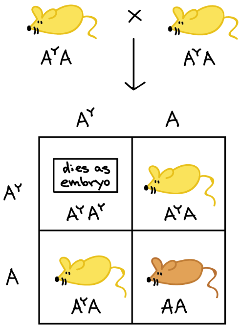

結果是，這些 homozygous genotype ($$A^YA^Y$$) 在 development 階段就先死掉了

* 遠在出生之前，也就是在 egg, sperm, fertilization 的階段就死亡
  * 讓原本能夠 YY:Yy:yy = 1:2:1 的情況
  * 變成 YY:Yy:yy = 0:2:1

這種在 homozygous 無法存活但 heterozygous 可以的 alleles 稱為 **recessive lethal alleles**

### Lethal alleles and human genetic disorders

人類也有 allele 是 recessive lethal 而造成相關的疾病，例如 **achondroplasia** (軟骨發育不全症)

* 當 allele 是 heterozygous 的時候會出現四肢短小、身材矮小
  * 但當 allele 是 homozygous 的時候會造成死亡 (成為胚胎後的一個月內)

另外也有 **dominant lethal alleles**，因為單一一邊 allele 就造成死亡

* 這種情況在 heterozygotes 還沒出生就死亡
  * 所以不容易判斷 (可能被判斷成手術失敗之類)
* 但若 dominant lethal alleles 有辦法存活
  * 那就會是一個可以被看見的 genetic disorder

事實上，當擁有 dominant lethal alleles 的人可以存活至能夠生育的階段

* 那他就有機會把這個症狀也傳給小孩
  * 例如 Huntington's disease (將造成神經系統嚴重缺陷)
  * 他們到 40 歲前都不會發作，所以非常有機會傳給小孩

## Polygenic inheritance

一些特徵不只由單個 gene 來影響，這類特徵稱為 **polygenic inheritance** (poly- = many)，例如人類身高由 400 多個 genes 控制

* 我們可以用 wheat kernels 作為例子
  * 有三個 gene (A, B, C) 會影響 wheat kernel 紅色系的顏色
  * 大寫會影響顏色，而小寫不影響
  * aa = no pigment
  * Aa = some amount of pigment
  * AA = more pigment

現在將三個 gene 都是 heterozygous (AaBbCc) 的兩個 wheat 交配

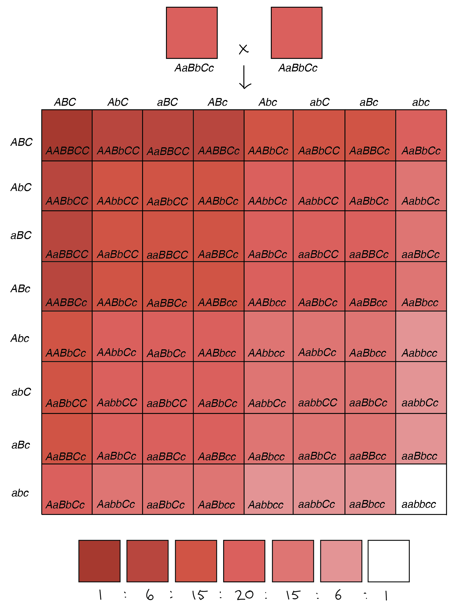

* 子代將會產生 7 種顏色的 spectrum
  * 而這還只是 3 種 gene 控制的情況
  * 可以想像 400 個 genes 能出現多少種身高的情況

## Environmental effects

一些特徵不只由 gene 影響，也受外部環境影響 (environmental effects)，例如 overall health 或 nutrition

* Phenylketonuria (PKU) 是一種遺傳缺陷
  * PKU 病患的 PKU gene 是有缺陷的 homozygous alleles
  * 會缺乏 enzyme 來幫助分解 phenylalanine (amino acid)
  * 從而快速增加體內的 phenylalanine，升高體內的毒素等級

但 PKU 患者可以透過減少攝取 phenylalanine 來解決，甚至可以沒有任何症狀

## Variable expressivity, incomplete penetrance

* **Variable expressivity**
  * Genotype 所造成的 phenotype 可能有強有弱
    * 例如有的 genotype 造成疾病
    * 有的人可能很嚴重，有的人可能較輕微

* **Incomplete penetrance**
  * 有的 genotype 可能完全沒把 phenotype 顯現出來
    * 例如有的 genotype 造成疾病
    * 有的人可能很嚴重，有的人可能完全沒症狀

# The chromosomal basis of inheritance

Mendel 在研究遺傳時還沒有發現 chromosome，直到半世紀後才有人將兩者結合

* Walter Sutton 和 Theodor Boveri
  * 分別在 1902 和 1903 提出了相關的想法
  * **chromosome theory of inheritance**
    * Genes 可以在 chromosomes 的特定位置找到
    * Chromosomes 在 meiosis 的行為跟 Mendel's law 非常相似

以下幾點是 chromosome theory of inheritance 的結論

* Chromosomes 和 Mendel 所說的遺傳因子一樣，都是 homologous pairs (分別來自父母)
* Homologous pair 會在 meiosis 時分離成 sperm, egg (對應 law of segregation)
* 不同 pairs 分離出不同的 gametes 彼此之間是獨立的 (對應 law of independent assortment)

但沒有完全證明，直到 Thomas Hunt Morgan 和他的學生對果蠅進行實驗

## T. H. Morgan: Fun with fruit flies

Morgan 的重要理論，是從發現果蠅的眼睛顏色開始，到確定控制顏色的 gene 在 X chromosome

* 首先 Morgan 發現了雄性的眼睛有白色突變 (一般是紅色)
  * 他將 white-eyed male 和 red-eyed female (wild type) 交配 (P generation)
    * 結果產出了一堆 red-eyed males and females (F1 generation)
  * 接著將這群 F1 互相交配
    * 結果產出了 red-eyed 跟 white-eyed 為 3:1 的現象
    * 但若將雄性和雌性分別開來，會得到 red(female):red(male):white(male) = 2:1:1

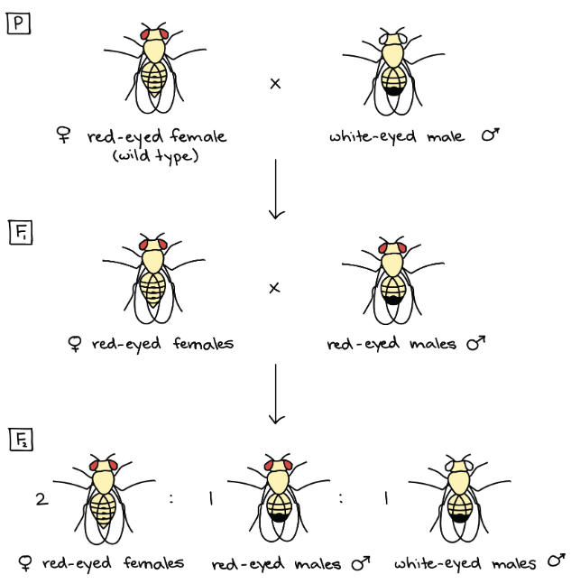

在 F2 只有雄性擁有白色眼睛的現象，可以說明為何控制眼睛顏色的 gene 是在 X chromosome 上面

* 果蠅和人類一樣，雄性擁有 XY sex chromosome 而雌性擁有 XX chromosome
  * 將 w 視為 gene 擁有白色 recessive allele
  * 而 w+ 視為 gene 擁有紅色 dominant allele
  * 於是可以將 F1 製成下方的 Punnett square
    * 結果和 Morgan 實驗結果一模一樣，不管雌雄都是紅色眼睛

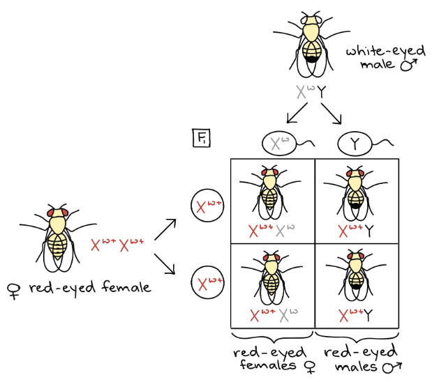

* F1 的雄雌互相交配之後
  * 可以發現真的有 1/4 會出現擁有白色眼睛的雄性果蠅
  * 也就是雄性有一半是紅色，一半是白色的眼睛
  * 準確的和 Morgan 實驗結果對應

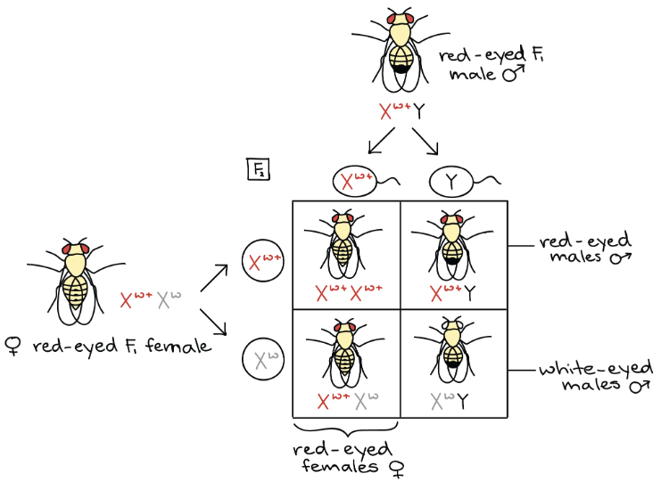

Morgan 還進行了其他實驗來更加確認這個模型的真實性，也發現了 gene 的突變在 non-sex chromosomes 一樣會出現在特定位置

# Genetic linkage & mapping

## What is genetic linkage

當 gene 分隔很遠或在不同 chromosome 時 (assort independently)，一個 heterozygous 細胞 meiosis 所得到的 4 種 gametes 會各為 25%

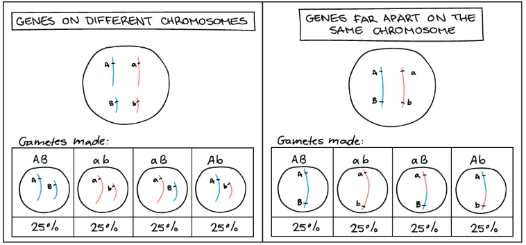

* 因為 gene 在不同 chromosome 或在同個 chromosome 但距離很遠時
  * 以下兩種狀況都會讓 gene 在 meiosis 得到不同組合 
    * Crossing over (**homologous recombination**)
    * Random orientation
  * 以下是一個正常的 meiosis 狀況

然而當 gene 在相同 chromosome 又非常接近的時候，我們會稱 genes 為 **linked** 的關係

* 這種 genes 黏在一起的結果
  * 會讓 meiosis 的結果變得非常不均勻
* 因為 crossing over 不會很常出現在緊密的 genes
    * **Parental** 指的是一般情況，genes 非常靠近
    * **Recombinant** 則是例外，代表 crossing over 有出現

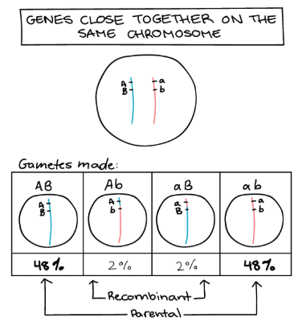

因為 recombination events 發生機率較低，代表 genes 越接近

* 我們可以利用這個關係，判斷 genes 的遠近
  * 透過計算 **recombination frequency**
    * RF 越小，代表 genes 越接近
    * RF 越大，代表 genes 離得越遠

## Finding recombination frequency

要計算 recombination frequency，首先要先準備兩隻果蠅

* purple gene
  * pr+ 代表正常的紫色
  * pr 代表隱性的紅色
* vestigial gene
  * vg+ 代表正常的長翅膀
  * vg 代表隱性的短翅膀

為了計算，我們要先得到一隻擁有兩個 gene 都是 heterozygous 的果蠅

* 不只兩個 gene 都要 heterozygous
* 也要知道 alleles 在同個 chromosome 上

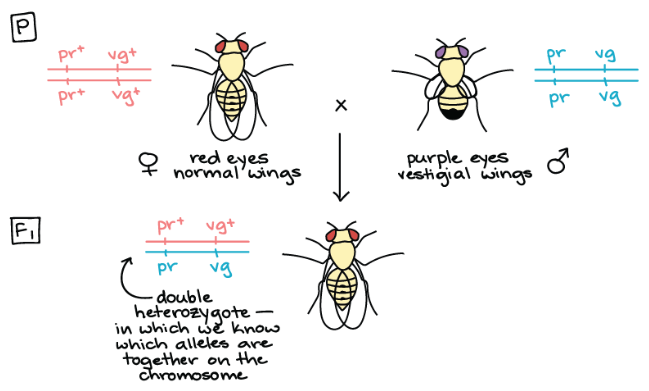

接著需要一個果蠅作為 tester 

* tester 必須要是 double homozygous recessive
  * 意義是能夠完整看到 non-tester 給子代的所有 phenotype

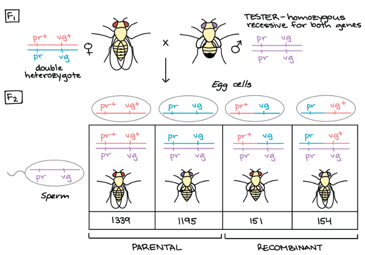

上圖可以看到四種子代皆來自"母親"不同的四種 gametes

* 因為非常不平均，可以確認 pr 和 vg 一定是 **linked**
  * Parental chromosome configuration 會大幅提高
  * Recombinant chromosome configuration 會大幅降低
* 於是我們可以進一步來計算 pr 和 vg 的 **recombination frequency (RF)**
  * 公式為 $$\frac{\text{Recombinants}}{\text{Total offspring}} \times 100\%$$

所以可以得到 pr 和 vg 的 RF:

$$
\text{RF} = \frac{151+154}{1339+1195+151+154}\times 100\% = 10.7\%
$$

## Recombination frequency and linkage maps

計算 Recombination frequency 可以用來建立 **linkage maps**

* Genes 之間有較大的 RF 代表距離較遠
* Genes 之間有較小的 RF 代表距離較近
* 以此可以計算出實際距離的近似值

RF 的比較也可以用來排序在 chromosome 上的 genes 順序

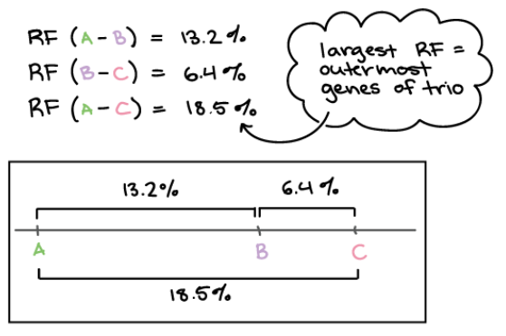

* 例如一開始有 A, B, C 三個 genes
  * 再慢慢加進 D, E, F 並比較
  * 就可以達到整個 chromosome 上的 linkage map

在 linkage map 上的距離是 centimorgans (map unit)

* 1% RF 等於 1 centimorgan (map unit)
  * 但因為 double crossover 的關係
    * 有時 RF 不能完全換算成 centimorgan
  * 因為 double crossover 在只看兩個 gene 的情況下
    * 中間被轉換的地方會被無視

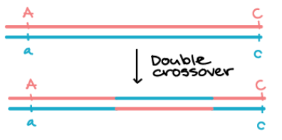

下圖就是 crossover 讓 RF 測量不準確的例子

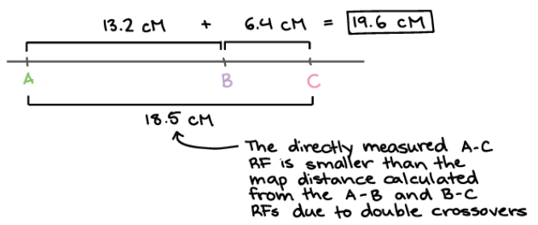

# X-linked inheritance

人類的 23 對 chromosomes 裡有 1 對可能不是 **homologous pair**

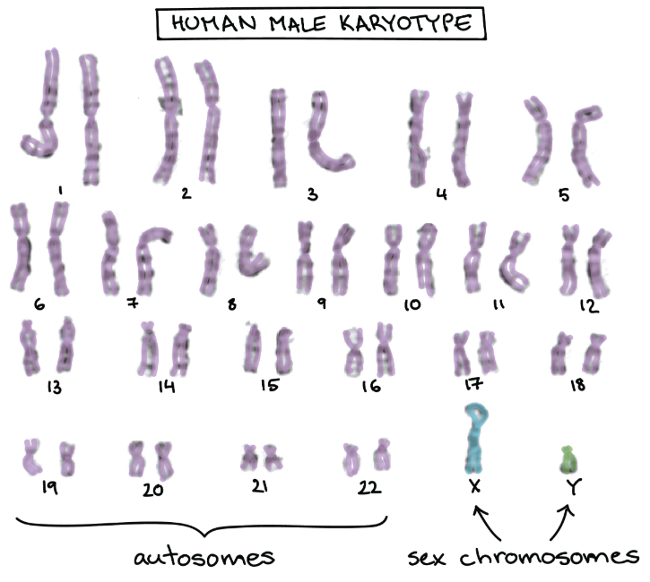

* 這會因你的性別而不同，不同發生在最後一對 chromosomes
  * 這對 chromosomes 叫做 **sex chromosomes**
  * 男生會是一個 X 一個 Y
    * 並非 homologous pair
  * 女生會是兩個 X
    * 是一對 homologous pair

X 和 Y 會有一小部分的地方相似 (為了 meiosis 組合)，但大致上都不同

* X chromosome 有 800-900 個 genes
* Y chromosome 只有 60-70 個 genes
  * 有一半的部分都是用來 code for **testes** (sperm-producing organs)
  * 最重要的地方稱作 SPY (sex-determining region of Y)
    * 因為 XX 沒有 SRY 所以會變成女生
    * 因為 XY 有 SRY 所有會變成男生

在極少數情況下，含有 SRY 的 X 變成 XX，那還是會變成男生，而不含 SRY 的 XY 會變成女生

## X-linked genes

* 只有在 X chromosome 才出現的 gene 稱為 **X-linked**
  * X-linked 有著獨特的 inheritance patterns
  * 這是因為男女的 X-linked 一定不同

所以女生通常會有 2 個 X-linked

* 例如果蠅有一個 gene 控制眼睛顏色就在 X chromosome 上
  * 其中 $$X^W$$ 為 dominant (normal red eyes)
  * 而 $$X^w$$ 為 recessive (white eyes)
    * 雌性的蠅就有 $$X^WX^W$$ (red), $$X^WX^w$$ (red), $$X^wX^w$$ (white)
  * 雄性的蠅則只有 $$X^WY$$ (red) 和 $$X^wY$$ (white)
    * 也就是說雄性的 X-linked gene 會直接決定 phenotype
    * 我們不稱 homozygous 或 heterozygous 而是稱 **hemizygous**

所以當一個擁有 recessive X-linked gene 的雌蠅和 dominant X-linked gene 的雄蠅交配

* 若是 autosome (non-sex) 的 homozygous dominant 和 recessive 交配
  * 那全部都會是 heterozygous 的 dominant phenotype
* 但 X-linked gene 讓所有的後代雄蠅都擁有 hemizygous recessive phenotype !

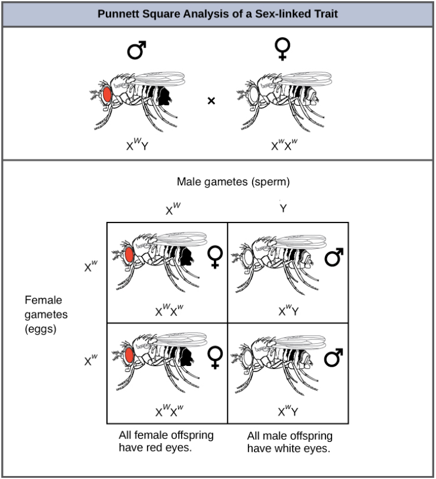

### X-linked genetic disorders

以上在果蠅的特徵，可以全部套用於人類身上

* 若母親是帶有 heterozygous (disease-causing allele)
  * 那會稱她為 **carrier**
  * Carrier 不會出現任何症狀，但有 50% 機率將疾病帶給"兒子"
  * 而女兒最多變成 carrier 而已

常見 X-linked gene 突變所造成的有 color blindness, hemophilia, muscular dystrophy

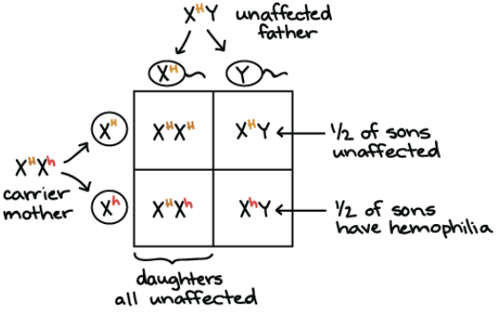

所以女兒要得到症狀，必須至少要母親為 carrier，而父親是已經帶有疾病的個體

# X-inactivation

只要多一個或少一個 chromosome 對人類都是致命的，但為什麼女生可以多男生一個 X chromosome ?

* 這是因為 X chromosome 只要一個就夠了 !
  * 女生的其中一個 X chromosome 會被 shutdown (稱為 **X-inactivation**)
    * X chromosome 會被壓縮成一個小球 (**Barr body**)
    * Gene 變成 Barr body 是無用的 (not transcribed)
  * 這個發現是由英國的遺傳學家 Mary F.Lyon 所發現
    * 所以 X-inactivation 有時稱為 **lyonization**

那女生的兩個 X chromosomes 是哪一個被 shutdown 呢 ? 從父親來的還是從母親來的 ?

* X-inactivation 在每一個細胞都是隨機的
  * 每個細胞可能將 paternal X 壓縮成 Barr body
  * 也可能將 maternal X 壓縮成 Barr body
  * 每個細胞都會自己處理 X-inactivation

值得一提的是，袋鼠永遠都是將父親的 paternal X 給關掉 !

## Calico cat

最經典的 X-inactivation 可以在母貓身上看到

* 若母貓擁有 black 和 tan 這兩種決定顏色的 heterozygous alelles 在父母的 X chromosomes
  * 那他就會隨機 inactivate 這兩種 Xs
  * 於是他就會變成 tortoiseshell coat pattern
    * 其中黑色的是 black allele 的 X 被 activated
    * 棕色的部份是 tan allel 的 X 被 activated

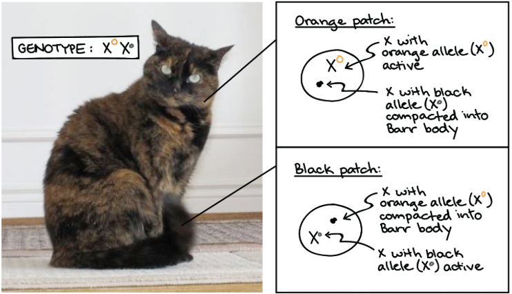

> 看到這裡，既然女生的一個 X 會被 inactivate，那為何 carriers 不會得到疾病 ?
> 
> A: 這是因為有一半的 normal gene 就足以維持正常生活

## Sex chromosome aneuploidies

* 若生物擁有多的或少一個 chromosome 稱為 **aneuploid**
  * 通常生物的 autosomes (non-sex) 特別是較大的，如果有 aneuploid 會無法出生
  * 而 X chromosomes 發生就還好，因為有 X-inactivation 幫助

常見的 X chromosome aneuploidies 有

* **Triple X syndrome**
  * 女性
  * 1/1000 的機率
  * 出現 XXX genotype
  * 學習障礙、兒時肢體障礙、肌肉問題

* **Klinefelter syndrome**
  * 男性
  * 1/500 到 1/1000
  * 出現 XXY 甚至是 XXXY 或 XXXXY genotype
  * 無法生育、毛髮較少

* **Turner syndrome**
  * 女性
  * 1/2500
  * 只剩一個 X 有功用
  * 不孕、學習障礙、矮小
  * 症狀較輕微，因為本來就只會用到一個 X

男生若有 XXY 會和女生一樣將一個 X inactivate，女生若有 XXX 就會將兩個 X inactivate

# Aneuploidy

細胞的 DNA 被改變是一種 mutation，而 chromosome 增加或減少也是一種 mutation

* 當 chromosome number 是正常的 2n 時稱為 **euploid**
  * eu- = good
* 當 chromosome 缺少或多餘時，稱為 **aneuploid**
  * an- = not (not good)
  * 例如人類 somatic cells 的 chromosome number 為 (2n-1) = 45 或 (2n+1) = 47 都是 aneuploid
  * 而 sex cells 的 chromosome number 為 (n-1) 或 (n+1) 也都是 aneuploid

其中又有兩種常見的 aneuploidy:

* **Monosomy** 代表 chromsome 少一 (2n-1)
* **Trisomy** 代表 chromosome 多一 (2n+1)

Aneuploidy 可以持續到 (2n-2), (2n+3), ... 但太超過時 (e.g., 3n) 稱為 **polyploid**

## Nondisjunction of chromosomes

這些 chromosome number 的異常，發生於 miosis I, II 或 mitosis 分裂時

* Meiosis I
  * Homologous chromosomes 沒有很好的分開
  * 所有 gametes 都變成 aneuploid

* Meiosis II
  * Sister chromatids 沒有很好的分開
  * 只有兩個 gametes 變成 aneuploid

* Mitosis
  * 分裂時 homologous chromosomes 沒有很好的分開
  * 不會 pass 給小孩
  * 但可能變成癌症

## Genetic disorders caused by aneuploidy

* Autosomal Monosomy 對人類來說就是死刑
  * 少掉的 chromosomes 指令產生過少的 proteins 和其他的 gene products
* Autosomal trisomy 一樣無法讓 embryo 發展到出生
  * 少數幾個 chromosomes (13, 15, 18, 21, 22) 發生 trisomy 可能能多活一些時間
  * Trisomy 21 (**Down syndrome**) 發生在第 21 對 chromosome 多 1 個時
    * 短小身高跟指頭、骨骼過寬、舌頭過大、發展遲緩

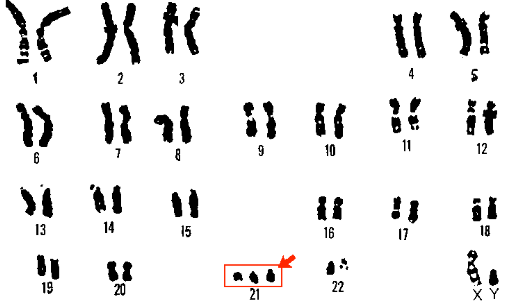

* Down syndrome 發生機率為 1/800
  * 母親通常大於 40 歲
  * 可能原因是年紀較大的女性，較常在 meiosis 發生 nondisjunction

Aneuploidies 發生在 sex chromosomes 上病狀會來得較輕微，因為 X-inactivation

# Chromosomal rearrangements

另外一種 mutation 為 **chromosomal rearrangement**，發生在 chromosome 的一大塊出現以下問題

* **Deletion**
  * Chromosome 的一部分被刪除
* **Duplication**
  * Chromosome 的一部分被多複製
* **Inversion**
  * Chromosome 的一部分被顛倒過來

* **translocation**
  * Chromosome 一部分和另一個 chromosome 互相影響到 
  * **Reciprocal translocation**
    * 兩個 chromosomes 互相交換了一部分
  * **Non-reciprocal translocation**
    * 一個 chromosome 把一部分都丟到另個 chromosome

Chromosomal rearrangements 一樣會產生疾病，
例如 down syndrome 一樣發生於某對 chromosome 21 的其中一個 chromosome 將大部分 translocation 到另一個身上
