# Structure of DNA

關於基本的 DNA 介紹可以到 [Macromolecules](macromolecules.md) 章節觀看。

# Discovery of DNA

DNA 在現今已經得到大眾的認知，但就在一世紀前左右，一些最頂尖的科學家並不知道 DNA 是 hereditary material

## Protein vs. DNA

Mendel 找到遺傳現象，而 Boveri, Sutton, Morgan 發現遺傳因子出現在 chromosomes

* 但 chromosome 上有大量 protein 和 DNA
  * 到底是誰決定了遺傳因素
  * 這時候各大科學家都覺得是 protein
    * 因為 protein 有多樣的 amino acid sequences
    * 而 DNA 只是無趣且不斷重複的 polymer
      * 當然還沒發現 DNA 架構

於是就開始有一連串的研究，最終發現 DNA 才是真正的遺傳因子

* Frederick Griffith
* Avery, McCarty, and MacLeod
* Hershey and Chase

### Frederick Griffith: Bacterial transformation

* 1928 年，英國的細菌學家 Frederick Griffith 進行了一個實驗
  * 想要找出能夠對抗肺炎的疫苗
  * 他將兩種 Streptococcus pneumoniae bacteria 注射到老鼠身體中
    * **R strain**
      * 是 nonvirulent 的 (老鼠注射後不會死亡)
    * **S strain**
      * 是 virulent 的 (老鼠注射後會死亡)

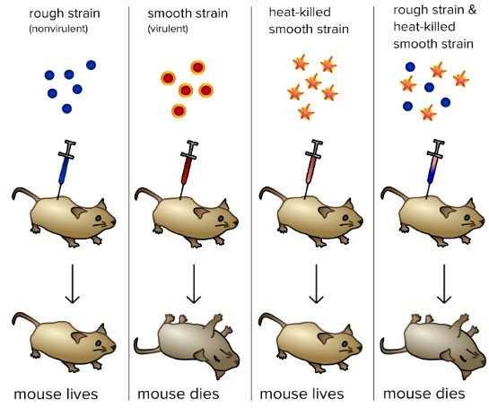

* 他將 S strain 的細菌利用高溫殺死，變成 heat-killed S strain
  * Heat-killed S strain 沒有將老鼠致死
  * **但 heat-killed S strain 和 R strain 加在一起卻將老鼠致死 !!**

R strain 可能是從 heat-killed S strain 獲得了什麼

* Griffith 認為 R 從 heat-killed S 取得 **transforming principle**
  * 讓 R 變成能夠致死的 bacteria

> * 事實上，這是因為 S strain 雖然死亡，但裡面的 DNA 沒有死亡
> * DNA 混入 R strain 讓他變得能夠致命

### Avery, McCarty, and MacLeod: Identifying the transforming principle

* 1944 年，加拿大和美國的三個科學家 Avery, McCarty, MacLeod
  * 想要找出 Griffith 實驗中的 transforming principle
  * 他們培養了大量 heat-killed S cells 然後進行實驗
  * 將 transforming principle 盡可能的淨化，然後進行分析

有幾個證據都指出 transforming principle 就是 DNA

* 在 detect protein 的測試中是 negative，但在 DNA 測試中是 positive
* 淨化的物質成分和 DNA 的 nitrogen 與 phosphorous 的比例很接近
* Protein 和 DNA degrading enzymes 都對 transforming principle 有些微效果
  * 但可以完全消除 transforming activity 中的 DNA

這時候的三人，都還不敢完全確定 transforming principle = DNA，直到 1952 年 ...

### The Hershey-Chase experiments

* 1952 年，美國科學家 Hershey 和 Chase
  * 研究 **bacteriophage** (病毒如何攻擊細菌)
  * Phages 是由 protein 外層包覆 DNA 內層的病毒
    * Phages 會依附細菌細胞的外部，然後注入一些物質到細菌的細胞中
    * 該"物質"會給細菌細胞一連串的指令，生產更多的 phages
    * 這個"物質"就是 phage 的 genetic material

在實驗開始前，兩人本來是想要證明這個 genetic material 就是 protein

* 實驗中，他們準備了兩群 phages，讓 phages 出生在特定的輻射環境
  * 一群生產於 $$^{35}S$$ (radioactive isotope of sulfur)
    * 該 sulfur 只會出現在 protein 中
    * 所以輻射會標註 phage proteins 的部分
  * 一群生產於 $$^{32}P$$ (radioactive isotope of phosphorous)
    * 該 phosphorous 只會出現在 DNA 中
    * 所以輻射會標註於 phage DNA 的部分

細菌感染後，會被 blender 旋轉，將 phage 和細菌細胞分離

* 較重的物質會出現在試管的底部
  * 例如細菌等物質
  * 這些物質稱為 **pellet**
* 較輕的物質會浮在試管的上方
  * 例如繁殖所需使用的液體，以及 phage 跟 phage 碎片
  * 這些液體層稱為 **supernatant**

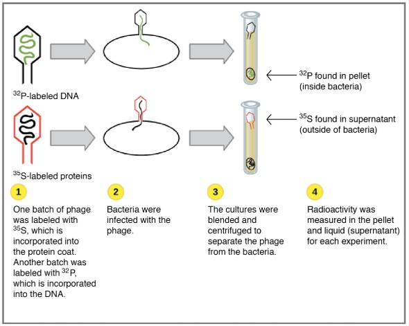

* Hershey 和 Chase 接著檢驗試管中 $$^{32}P$$ 和 $$^{35}S$$ 的濃度
  * 發現 $$^{32}P$$ 都出現在 pellet
  * 而 $$^{35}S$$ 都出現在 supernatant
  * **這代表是 DNA 而非 protein 注入到細菌細胞當中 !!**

至此，人類都肯定 genetic material 就是 DNA ! 但怎麼會是 DNA ?

## Discovery of the structure of DNA

過了幾年後，DNA 的全貌才被幾名科學家披露 (James Watson, Francis Crick, Rosalind Franklin, and other researchers)

### Chargaff's rules

澳洲的生物學家 Erwin Chargaff 分析各種生物的 DNA 找到一些重要發現

* A, T, C, G 並不是等量
* 這些 bases 在不同生物出現的數量不同 (但在相同生物大致相同)
* A 的數量永遠等於 T，而 C 的數量永遠等於 G

這些發現稱為 **Chargaff's rules**，對 Waston 和 Crick 在日後定義 DNA 模型非常重要

### Watson, Crick, and Rosalind Franklin

在 1950 年代早期，美國生物學家 James Waston 和英國物理學家 Francis Crick 一起提出 DNA 雙螺旋的 model

* 他們研究中借鑑了 Rosalind Franklin 的發現
  * Franklin 使用 **X-ray crystallography** 照出了一些 DNA 架構的跡象
  * DNA 在 X-rays 照射下，一些 rays 被 crystral 中的 atoms 反射，因而出現 **diffraction pattern**

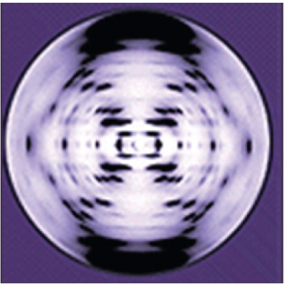

* Waston 和 Crick 一看到圖片，就聯想出 DNA 是雙螺旋架構
  * 於是結合了 Franklin, Wilkins, Chargaff 等人的研究結果
  * 發表了 DNA 的 3D 架構
  * 在 1962 年，Watson, Crick 和 Wilkins 獲得了諾貝爾獎 (Franklin 過世無法得獎)

### Watson and Crick's model of DNA

* Waston 和 Crick 的 3D model 呈現出 DNA 的樣貌
  * double-stranded helix
    * 由 sugar-phosphate backbones 所組成
    * 下圖紅色和橘色部分
  * nitrogenous bases
    * 由 hydrogen bond 所組成的 pairs
    * 下圖藍色部分

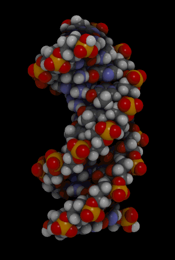

  * antiparallel
    * Two-strand 是往相反方向而平行
  * right-handed
    * 兩條 DNA 互相纏繞彼此，並且多以右迴旋纏繞

Base pairs 之間會有 gap，稱為 groove

* 若 gap 較大，稱為 **major groove**
* 若 gap 較小，稱為 **minor groove**
* 這些 groove 對 protein 維護 DNA 和 gene activity 非常重要

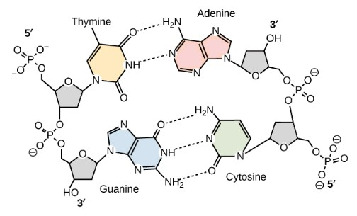

另外這些 base pairs 都是 **complementary base pairs** (以 A-T 和 C-G 配對)

* 這是因為 purine (A, G) 的 hydrogen bond 地點
* 永遠都會剛好和 pyrimidine (T, C) 的 hydrogen bond 地點對應
* 這也解釋了 Chargaff's rule 中，為何 A 和 T 且 G 和 C 的數量永遠一致

# DNA replication

## Molecular mechanism of DNA replication

DNA 複製必須精準無誤，而生物之間的複製方法大致都一樣 (由 proteins 和 enzymes 主導)，以下將用大腸桿菌舉例

* DNA replication 是 **semiconservative**
  * 每條 DNA 都將是新的 DNA 的樣本 (template)
  * 新的 DNA 會透過樣本，產出對應的 complementary strand
    * 也就是一個 DNA molecule 會變成 2 個 DNA molecules
    * 一個是舊的一個是新的

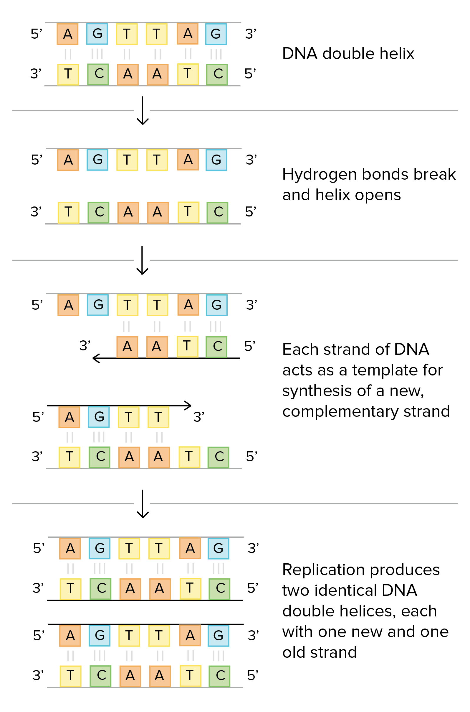

* 上圖就是整個 DNA replication 的重點
  * 但有趣的是 DNA replication 是怎麼在細胞中進行的
  * DNA replication 必須又快又無錯誤 (錯誤會產生癌症)
  * 所以 DNA replication 通常會有多種 enzymes 和 proteins 來幫忙

### DNA polymerase

* **DNA polymerase** 是幫助 DNA replication 一個很重要的 enzyme
  * 加入新的 nucleotides 到新的 DNA chain 中，幫助合成新的 DNA
  * 必須要與 template 互補

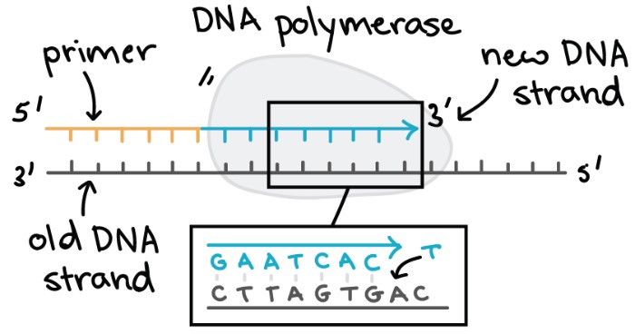

DNA polymerases 有幾個重要特性 :

1. 永遠需要一個 template
2. 只能將 nucleotides 加入到 DNA strand 的 3' end
3. 不能從 DNA chain 開始做起
  * 必須要有已經存在的 DNA chain
  * 或是有 **primer** 存在 (一小節的 nucleotides)
4. 會 **proofread** (check their work)
  * 移除掉錯誤的 nucleotides

另外，要加入 nucleotides 需要 energy

* Energy 從 nucleotides 身上而來
  * 因為 nucleotide 含有 3 個 phosphates
    * 跟 ATP 很像吧
  * 當 phosphate 的 bond 分解，就會釋放 energy

在大腸桿菌上，有 2 個主要的 DNA polymerases

* DNA pol III (major DNA maker)
* DNA pol I (support)

### Starting DNA replication

DNA polymerases 和其他 replication factors 是怎麼知道從哪裡開始複製的 ?

* Replication 會在 DNA 特定的位置開始進行
  * 這個位置叫做 **origins of replication**
  * 例如大腸桿菌的 chromosome 會有一個 origin of replication
    * Origin 有 245 個 base pairs，多數是 A/T base pairs 
      * 因為 hydrogen bond 比 G/C 少一個，更好讓 DNA strands 分開
  
特殊的 proteins 會找到 origin 並與之結合，打開 DNA

* 隨著 DNA 被打開
  * 2 個 **replication forks** (Y-shaped) 會出現
  * 這 2 個 forks 會往反方向移動，形成 **replication bubble**

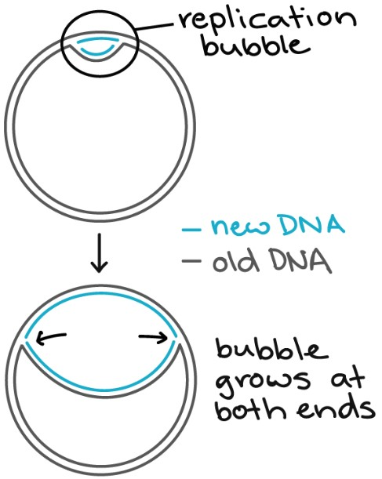

* **Helicase** 是第一個出現在 origin 的 replication enzyme
  * 他會透過將 DNA 拆開，幫助 forks 移動
    * 分解 nitrogenous base pairs 的 hydrogen bonds
* **Single-strand binding proteins** 則是 replication protein
  * 覆蓋在 fork 周圍的舊 DNA 兩個分開的 strands 上
  * 防止 strands 回復成雙螺旋的樣子

### Primers and primase

DNA polymerases 只能將 nucleotides 加到 DNA strand 的 3' end

因為 3' 才有 -OH group 作為 hook 讓 nucleotide 可以與之發生 polymerization reaction

* 但 DNA polymerase 並不可以將 nucleotide 加到全新的 fork
  * 需要 **primase** (enzyme) 來幫助
  * Primase 會製作 **RNA primer** (primes DNA synthesis 得名)

* Primers 會製作一小節的 nucleotides 來和 template 互補
  * 長度約為 10 個 nucleotides 長
  * 讓 DNA polymerase 可以從 primers 的尾端 3' 開始工作

也就是 RNA primer 起手，而 DNA polymerase 擴展

### Leading and lagging strands

大腸桿菌的 DNA polymerase III 會有兩個 molecules 跑到 fork 上，幫助 DNA strands 複製

* DNA polymerases 只能在 5' 到 3' 方向上製造 DNA
  * 所以隨著 template 3' 到 5' 的 fork 會變為 5' 到 3' 方向進行
    * 該 DNA strand 稱為 **leading strand**
    * 能夠輕鬆、連續生產 DNA 形成 strand
  * 而反向隨著 template 5' 到 3' 的 fork 會變成 3' 到 5' 進行
    * 該 DNA strand 稱為 **lagging strand**
    * 隨著 fork 前進，DNA polymerase 必須要脫落並重新接上 DNA 繼續製作
    * 所以 Strands 必須要分成一個個 **Okazaki fragments** (日本學者發現而得名) 來製作
    * 每個 fragments 都需要一個新的 primer 來幫忙開始

### The maintenance and cleanup crew

除了最重要的 polymerase 和 primase 及 helicase，還有非常多 enzyme 和 proteins 幫助 DNA replication

* **Sliding clamp** (protein)
  * 幫助 polymerase III 在 lagging strand 運作時，不被破壞
  * 能夠很好的到下一個 Okazaki fragment 繼續工作
* **Topoisomerase** (enzyme)
  * 避免 fork 前面的 DNA 雙螺旋過度結合在一起
  * 會在 helix 弄出一個暫時的小缺口來釋放壓力
  * 之後再將缺口回復，來避免永久傷害
* **DNA polymerase I**
  * 為了讓 DNA 複製的完美乾淨
  * 所以會將 RNA primers 用複製的 DNA 再一次取代掉
* **DNA ligase** (enzyme)
  * Primers 留下的一些缺口會由 ligase 來幫忙補上

### Summary of DNA replication in E. coli

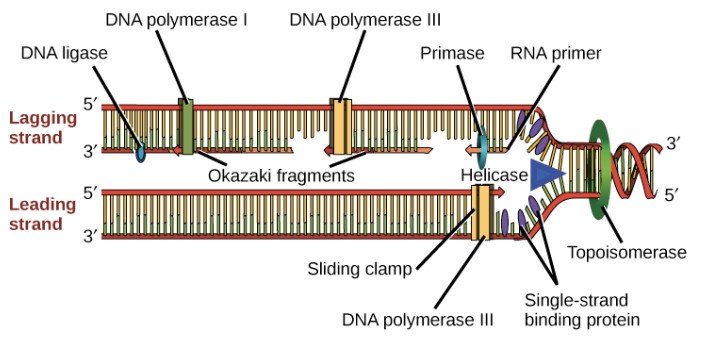

* **Helicase** 在 replication fork 處打開 DNA 
* **Single-strand binding proteins** 避免 fork 周圍的 DNA strands 重新結合
* **Topoisomerase** 避免 fork 前方的 DNA 過度結合
* **Primase** 製造對應 template 的 RNA primers
* **DNA polymerase III** 擴充 primers，在 3' 後面加入新的 DNA
* **DNA polymerase I** 用 DNA 將 RNA primers 取代掉
* **DNA ligase** 修復 DNA fragments 的缺口

雖然大腸桿菌的 DNA replication 和其他生物、細菌都差不多，但還是有些微差異:

* 人類有 100000 個 origins of replication
* 人類有 5 個 DNA polymerase 來製造 DNA

## DNA proofreading and repair

* Cells have a variety of mechanisms to prevent mutations
* During DNA synthesis, most DNA polymerases "check their work,
  * fixing the majority of mispaired bases in a process called **proofreading**.
* after DNA synthesis
  * remaining mispaired bases can be detected and replaced 
  * **mismatch repair.**
* DNA gets damaged can be repaired by various mechanisms,
  * chemical reversal, excision repair, and double-stranded break repair.

我們都知道 gene mutation 讓細胞無限分裂複製就會造成 cancer。

其實 DNA 複製錯誤或受到傷害在身體是不斷在發生的，但身體中有一些修復機制可以預防

* **Proofreading** 修正 DNA replication 的錯誤
* **Mismatch repair** 修正 DNA replication 錯誤的配對
* **DNA damage repair pathways** 偵測 cell cycle 任何傷害

### Proofreading

DNA polymerases 不只能製造 DNA，還能檢查工作有沒有失誤

* 檢查的過程叫做 **proofreading**
  * 在加入 nucleotide 時，會順便檢查是否 pair 正確
  * 若檢測到錯誤，會馬上移除並替換掉該 nucleotide
  * 結束後才繼續進行 DNA 合成

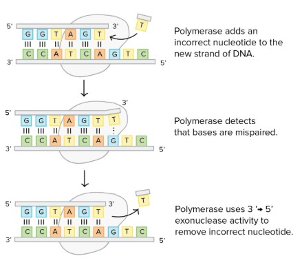

### Mismatch repair

Proofreading 有時可能會有漏網之魚，所以在 DNA 複製完會進行一個 mismatch repair

* Mismatch repair 的工作就是移除那些 mis-paired bases
  * 首先 protein complex 找出 mispaired base
  * 找到後會切掉該 base pair 包含周邊的 DNA
  * 接著 DNA polymerase 將正確的 nucleotides 補貼回去
  * 最後 DNA ligase 將切口封好

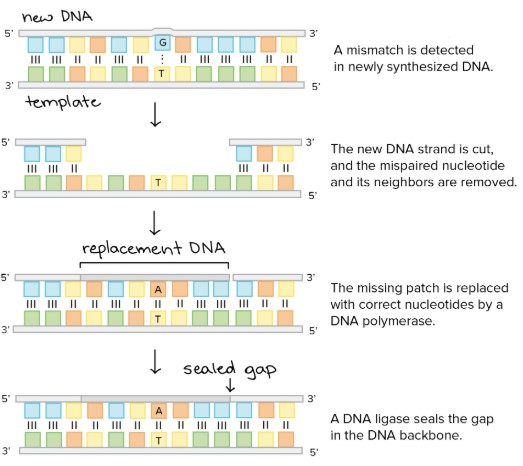

令人好奇的是 protein 如何認出 mismatch pair 中，哪一方才是新加上去錯誤的 base

* 在細菌中，新生的 DNA 會有一個特徵稱為 **methylation state**
  * 舊的 DNA strand 會有 methyl ($$-\text{CH}_3$$) groups 依附在 base 上
  * 新的 DNA strand 則不會有任何 methyl group
* 在 eukaryotes 中
  * 只有新的 DNA strand 會有 recognition of nicks (breaks)

### DNA damage repair mechanisms

DNA 不只在 replication 會出現問題，整個 cell cycle 都有可能發生錯誤

* 幸好細胞有許多機制可以偵測和修復 DNA damage
  * **Direct reversal**
    * 細胞的 enzyme 能夠將讓 DNA 受到傷害的 chemical reactions "**undone**"
  * **Excision repair**
    * 跟 mismatch repair 很像，修剪掉錯誤的 DNA 然後補回正確的，又分成兩種
    * **Base excision repair**
      * 只修復單個 nucleotide (damaged base)
    * **Nucleotide excision repair**
      * 修復錯誤周邊整塊 nucleotides
  * **Double-stranded break repair**
    * 修復 DNA 的 double-stranded 分成兩半，有兩個主要修法
      * non-homologous end joining
      * homologous recombination

#### Reversal of damage

* 有很多 DNA damage 只是一些額外 atoms 透過 chemical reaction 附在 DNA 上
  * 例如 guanine (G) 可能和 methyl group 在 oxygen 部分結合
  * Methyl-bearing guanine 比起跟 cytosine (C) 配對，更想跟 thymine (T) 配對
  * 要解決問題，一些 enzyme 只要移除掉 methyl group (reverse reaction) 就行

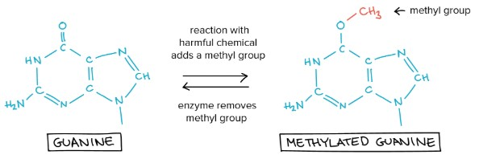

#### Base excision repair

* Glycosylases (group of enzymes) 在 base excision repair 扮演重要角色
  * 每個 glycosylase 會偵測並移除特定的 damaged base
  * 例如 deamination 是一種將 cytosine (C) 變成 uracil (U) 的 reaction
    * 變成 uracil 的 cytosine 比起跟 guanine (G) 配對，更想跟 adenine (A) 配對
  * 為避免這種突變，Glycosylase 會把 deaminated cytosines 移除
    * DNA backbone 也會一起被移除
    * 最後由 DNA polymerase 和 ligase 把缺口補回

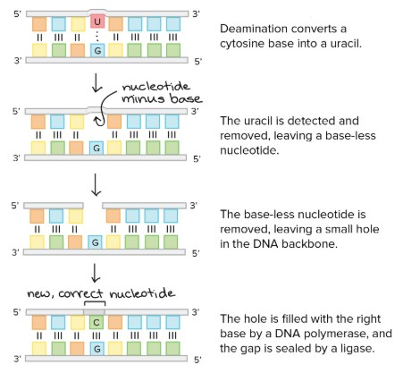

#### Nucleotide excision repair

* Nucleotide excision repair 主要修復造成 DNA double helix 扭曲的傷害
  * 例如一些 bases 被大量 chemical 影響 (e.g., 菸中的致癌物)
  * 或是 UV radiation 造成 cytosine 或 thymine 會影響周圍的 Cs 或 Ts
    * 扭曲雙螺旋架構，造成複製發生錯誤
    * 最常見的是 **thymine dimer** (兩個 T 互相影響彼此)

1. Helicase 將 DNA 打開成泡泡狀
2. DNA cutting enzymes 將該泡泡切除
3. DNA polymerase 製作新的 DNA 取代
4. DNA ligase 將 backbone 缺口補平

#### Double-stranded break repair

外部環境可能會造成 DNA 損傷 (e.g., high-energy radiation)

* 這種損傷通常為 double-stranded 被拆成兩半 (chromosome 裂成兩半)
  * 這種斷裂非常危險，可能造成 chromosomes, genes 永久遺失
  * 修復方法有兩種
    * non-homologous end joining
    * homologous recombination

##### non-homologous end joining

* Chromosome 的斷裂兩端直接黏合
  * 可能造成黏接點突變

##### homologous recombination

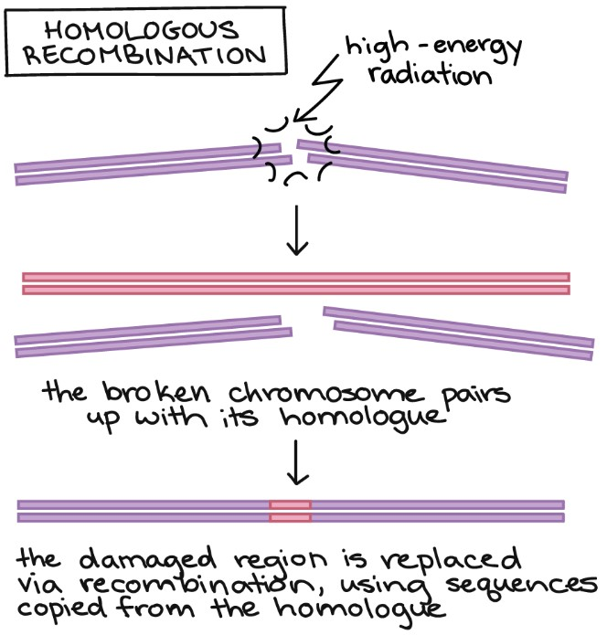

* Chromosome 的另外一半 (homologue, chromatid) 將會來支援
  * 另一半作為 template 來取代 chromosome 受損的區域
  * 修復的比 non-homologous end joining 還要完整
  * 較不會造成黏接點突變

### DNA proofreading and repair in human disease

以上介紹的修復機制突變，和 heredity cancers 常有重大關聯

* **Hereditary nonpolyposis colorectal cancer** (**Lynch syndrome**)
  * 發生於製造 mismatch repair proteins 的 genes 突變
  * Mismatched bases 無法修復，讓突變累積起來，發展成 tumors

* **Xeroderma pigmentosum**
  * 發生於 nucleotide excision repair 相關 genes 突變
  * Thymine dimers 和其他 UV damage 無法修復
  * 病人變得極度容易受到 UV light 影響
  * 暴露在太陽下幾分鐘就可以造成曬傷，半小時就有機會得到 skin cancer

## Telomeres and telomerase

Chromosomes 的最末端會發現 TTAGGG 反覆出現幾百幾千次，這些是 **telomeres**

* Telomeres 會保護 chromosome 的內部 gene
* 並且在每次 DNA replication 後都會磨損一些
* 磨損的 telomeres 會由 enzyme **telomerase** 來補充延長

### The end-replication problem

這個問題通常發生在 eukaryotes 的 chromosome 上 (因為是 linear, rod-shaped)

* Chromosome 的末端在 DNA replication 時會出現問題
  * 每一輪的 replication 當中，末端的 DNA 都無法完整的複製
  * 造成 chromosome 越來越短

這種情況分別發生在 leading strand 和 lagging strand

* 在 lagging strand 的末端沒有辦法存在 Okazaki fragment
  * 因為 primer 會掉出 chromosome 末端之外
  * 就算有 primer，也無法繼續進行 DNA 的複製
    * 這是因為製作 DNA 需要 energy
    * Energy 來自 Okazaki fragment 的 hydroxyl group
    * 但末端沒有辦法向鄰居的 Okazaki fragment 取得 energy

在 leading strand 看起來很完整，但事實上也會被 enzymes 吃掉一些部分

* 因為這些緣故，一些 eukaryotes 的 DNA 末端保留無複製進入下一輪 replication
  * 產生 single-stranded overhang (下圖) 
  * 接著的 cell division 就會讓 chromosome 不斷變小

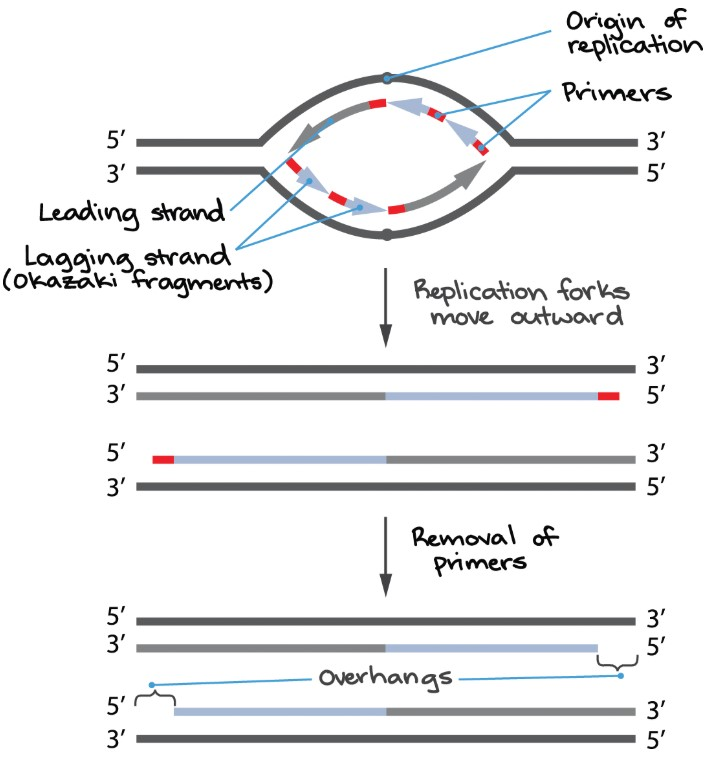

* 在人類細胞中，最後一個 RNA primer
  * 在 lagging strand 會距離末端 70 到 100 個 nucleotides
  * 在 leading stran 會距離末端 30 個 nucleotides
  * 所以每一輪產生的 overhang 很長

### Telomeres

為了避免 chromosome 越來越短，我們 eukaryotes 的 chromosome 末端有一個保護套叫做 **telomeres**

* Telomeres 由上百上千個重複的 DNA sequence 組成
  * 在人類中是 5'-TTAGGG-3'
  * telomeres 需要避免被細胞的 DNA repair system 攻擊
    * 因為他看起來像一個 damaged DNA (single-stranded overhang)

Telomeres 會接續在未完成的 single-stranded overhang 上

* telomere 會自己形成 protective loops
  * 跟 telomere 相關的 protein 也會起到保護作用，避免觸發 DNA repair
  * 於是不斷復生的 telomere loops 就可以代替在每個 replication 變短
    * 保護 chromosome 內部真正有用的 genes

Telomeres 也不是無限的，這也是為什麼細胞只能分裂有限次數，且跟細胞的衰老有關

### Telomerase

一些細胞能夠利用 telomerase (enzyme) 來延長 telomeres

* Telomerase 是一個 RNA-dependent 的 DNA polymerase
  * 意思是利用 RNA 作為 template 來製造 DNA
* Telomerase 會結合包含 telomere 對應 sequence 的 RNA
  * 加入 nucleotides 到 telomere 的 overhanging strand
    * 可以想像是利用 RNA 作為 template 來補足 telomere DNA 
  * 當 overhang 夠長，對應的 strand 就可以透過 DNA replication 產生

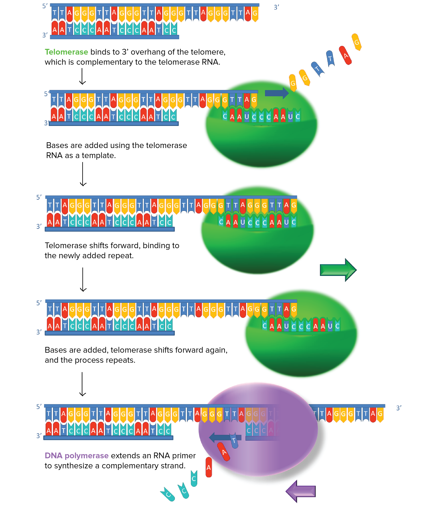

Telomerase 通常只出現在需要大量分裂的細胞中 (e.g., germ cells, adult stem cells)

有時也會出現在 cancer cells 中，
所以有些藥物可以抑制 cancer cells 中的 telomerase，
避免讓 telomere 不斷生長。
