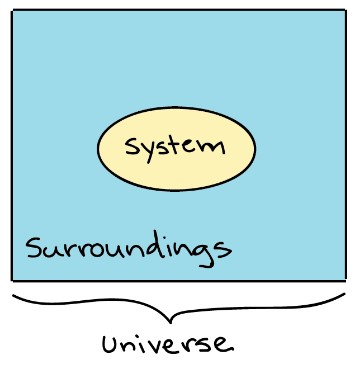
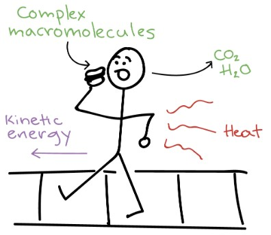
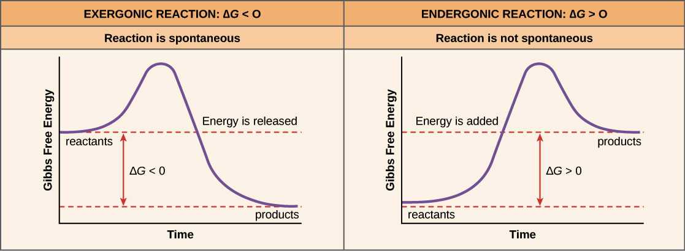
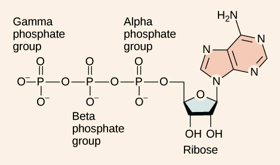
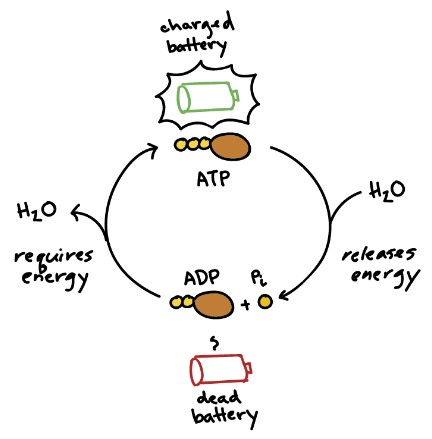
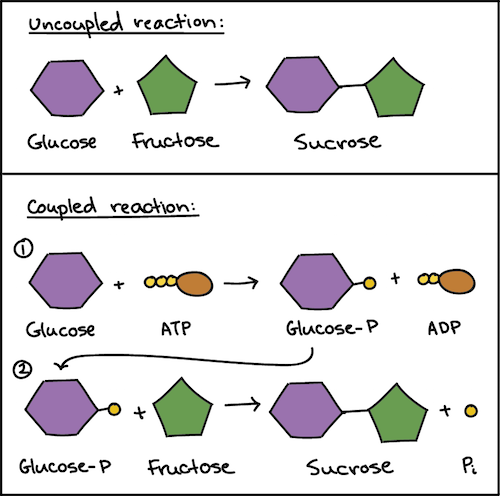
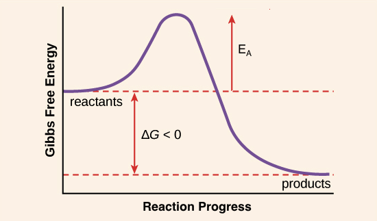
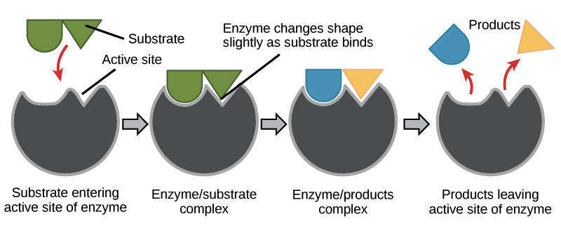
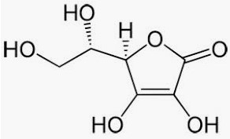

# Overview of metabolism

* 細胞正無時無刻的運作上千種 chemical reaction 來讓身體保持正常
* 這些一連串的 chemical reaction 又稱為 cell's **metabolism**
* 例如下圖是一個 eukaryotic cell 的 metabolic pathways
  * 每條線是一個 reaction
  * 每個點是 reactant 或 product

* 在 cell 中的 metabolic web 的 chemical reaction 會釋放能量而且可能會自發性的發生
* 但有的需要外部的 energy 來讓 reaction 發生
  * 事實上，我們吃的食物就是用來產生 reaction 的 energy
* 在來要介紹兩個非常重要的 metabolic processes
  * build & break down sugars

## Breaking down glucose: Cellular respiration

* 這是一個 energy-releasing pathway 的範例
  * 將吃的點心中的 sugar molecules 分解來使用
* 我們身體大多數的 cell 都是用 glucose $$(\text{C}_6\text{H}_{12}\text{O}_6)$$ 來獲得能量
  * 這個過程稱為 **cellular respiration**
  * 這個過程細分成非常多小步驟，但可以用底下的化學式統整
    $$
    \text{C}_6\text{H}_{12}\text{O}_6 + 6\text{O}_2 
    \rightarrow 
    6\text{CO}_2 + 6\text{H}_2\text{O} + \text{ energy}
    $$
* 分解 glucose 產生的 energy，會被細胞以 ATP 的形式捕捉起來
  * **ATP** 分子的全名為 **adenosine triphosphate**
  * ATP 是一個小分子用來讓 cell 可以更方便儲存能量
  * 可以將 ATP 想像成 cell 的 energy 貨幣 (energy currency of the cell)
* 有了 ATP，其他需要 energy 的 reaction 就可以使用他

## Building up glucose: Photosynthesis

* 我們已經知道 sugar 可以分解成 ATP，那 sugar 是如何組成的呢
  * sugar (e.g., glucose) 主要由植物執行 **photosynthesis** 來生成
  * 植物使用太陽的能量，一樣一步步的將 carbon dioxide gas 轉換成 sugar molecules
  * 一樣非常多步驟，但可以用一個化學式統整 (其實就是 cellular respiration 的相反)
    $$
    6\text{CO}_2 + 6\text{H}_2\text{O} + \text{ energy}
    \rightarrow
    \text{C}_6\text{H}_{12}\text{O}_6 + 6\text{O}_2 
    $$
* 植物除了本身需要 energy (sugar) 來執行自己的 cellular processes
  * 但植物也提供了 food source 給動物們
  * 這些食物就會透過 cellular respiration 從 glucose 分解成 ATP 供細胞運作  

## Anabolic and catabolic pathways

* 不管是組合或拆解 glucose 都是 metabolic pathway 的一種
  * **metabolic pathway** 就是一連串的 chemical reaction 互相照顧彼此
* Metabolic pathways 又可以依照 effects 被分為兩大類
  * **Anabolic (anabolism)** 指的是 building up
  * **Catabolic (catabolism)** 指的是 breaking down

* Metabolic pathways 中的 chemical reactions 不是自動自發、毫無頭緒的在運作
  * 通常由一種 protein 稱作 **enzyme** 來 facilitate, catalyze 這些 reaction

### Anabolic pathways

* 將簡單的 molecules 組裝成複雜的 molecules，通常需要 energy inputs
  * Carbon dioxide 組裝成 glucose
  * Amino acids 組裝成 proteins
  * nucleotides 組裝成 DNA strands
* 這些 "biosynthetic process" 所用的 energy 通常為 ATP 或其他 short-term energy storage molecules

### Catabolic pathways

* 將複雜的 molecules 分解成簡單的 molecules，通常也會釋放 energy
  * 例如釋放儲存在 glucose, fats 的 energy
* 得到這些 energy 就可以轉換成適合使用的格式，例如 ATP

# Types of Energy

* 這邊指的 energy 不是起床很有精神那種 energy
* 這邊指的 energy 是定義為 ability to do work
  * 例如 light, heat, electrical energy
* 我們來詳細了解一下 biological system 中幾個重要的 energy
  * kinetic energy (motion)
  * potential energy (position, structure)
  * chmical energy (chemical bonds 的 potential energy)
* 要注意的是 energy 永遠不會消失，只會從一種型態轉換成另一種

## Kinetic energy

* 物體移動產生的能量就稱為 **kinetic energy** (動能)
  * speeding bullet, walking person, electromagnetic radiation (light) 都有
* **Thermal energy** 也是一種 kinetic energy
  * 來自 atoms 或 molecules 隨機跳動時產生
  * 一群 molecules 的 **average thermal energy** 就是 temperature
  * 而當 thermal energy 在兩個物體轉移時，就是 heat

## Potential energy

* 跟物體本身的架構或位置有關的則稱為 **potential energy** (位能、勢能)
  * 水庫的水、跳傘的人、拆房子的鐵球
* **Chemical energy** 也是一種 potential energy
  * 指的是存在 chemical bonds 的 energy
* 位能表示了物體在特定位置上所儲存的能量，在適當情況下，位能可以轉換為動能

## Energy conversions

* 當鐵球被起重機拉到高空停止時
  * 這時鐵球的 kinetic energy 不存在
  * 但鐵球的 potential energy 非常大
* 這時鐵球被釋放，因為重力的關係高速的向下掉
  * 下降時 kinetic energy 越來越來越大
  * 但 potential energy 則是減少到幾乎不存在

### Energy in car

* Chemical energy (potential) 的 conversions 在日常中也可以看到
  * 例如 gasoline 中的 octane (hydrocarbon) 含有 chemical energy
  * 汽車引擎中的 gasoline combust 將會釋放這些 energy
  * 產生的 high-temperature gases 將會推動 pistons 然後讓車前進 (kinetic energy)
  * 所以一些 chemical energy 轉換成 kinetic energy
  * 而一些 chemical energy 則會轉換成 thermal energy (heat emitted from engine)

### Energy in life

* Energy 會儲存在 ATP 的 bonds 當中 (potential energy)
* 這些 energy 可以轉換成 kinetic energy
  * 例如移動 motor protein
  * 收縮 muscle cells 來移動四肢

# The Laws of Thermodynamics

* 人是一個 open system (幾乎所有生物都不是 closed system)
  * 意思是我們總會和周遭環境交換 matter, energy
    * 例如從食物獲得 chemical energy
    * 然後透過 moving, talking, walking, breathing 對周遭 do work (做功)
* 所有 energy 的交換 (體內外) 都可以被定義為 laws of physics
  * 例如在 hot, cold, gas molecules 等情況下的 energy 交換
* 所以接下來先來看兩個 laws - first and second laws of thermodynamics

## Systems and surroundings

* Biology 的 thermodynamics 指的是一個或一群 molecules 的 energy transfer
  * 這時我們關心的那群東西 (小到 molecules 大到 ecosystem) 都稱為 **system**
  * 其他不在 system 的東西就稱為 **surroundings**
  * 兩者相加就是 **universe**

* Thermodynamics 有三種 system
  * **Open system**
    * 可以和 surroundings 交換 energy 和 matter
  * **Closed system**
    * 只能和 surroundings 交換 energy，不能交換 matter
  * **Isolated system**
    * 什麼都不能和 surroundings 交換
    * 只有和內部的 items 交換

* 所以人是 open system，吃和做任何事都是在跟 surroundings 交換 energy, matter
  * 這些交換都是要遵守 laws of physics 的
  * 可以說人和周遭進行的 energy 交換，就跟 circuit 中電流交換一模一樣
  * Laws of thermodynamics 就是 energy transfer 的 physical rules

## The First Law of Thermodynamics

第一個法則的範圍超級大，探討的是整個宇宙的 energy

* 整個宇宙的 energy total amount 是不變的
* 所以 energy 不能被 created 或 destroyed
* energy 只能轉換其形式，或是只能從一個 object 傳遞到另一個

舉幾個日常生活中的例子 :

* 燈泡將 electrical energy 轉換成 light energy (radient energy)
* 撞球撞到下一顆球，傳遞 kinetic energy
* 植物將陽光 (radiant energy) 轉換成 chemical energy 並儲存起來
* 你將吃的東西 (chemical energy) 轉換成你的任何動作、呼吸 (kinetic energy)

這些 energy 的轉換並不是非常的有效率

* 一開始的 energy 可能在途中被釋放出一些 thermal energy，也就是 **HEAT**
  * 在燈泡上顯而易見，因為除了產生光以外燈泡也會產生熱
  * 撞球摩擦撞球桌 (friction)，也會產生熱
* 這些 heat generation 也非常重要，跟第二個法則有關

## The Second Law of Thermodynamics

所以根據第一個法則，能量可以無限循環利用對嗎 ? (嗯... 對但不對)

* Energy 雖然不能被 created 或 destoryed
* 但 energy 可以從 **more-useful form** 轉換成 **less-useful form**
  * 事實上，目前知道的所有 energy transfer 都是這種模式
  * 轉換成的 less-useful 根本是 **unusable** energy
  * 而這些 unusable energy 通常就是以 heat 形式出現

Heat 在正確的環境下使用不是可以做功嗎 ?

* 是的，但 heat 永遠無法 100% 轉換成其他 useful energy
  * 所以每當 energy transfer 發生
  * 一些 useful energy 就會被永遠轉換成 useless energy

### Heat and Universe

這些沒用的 heat 最終會增加宇宙的 **randomness (disorder)** !
  
* 舉例來說，你有兩個不同溫度的 metal 放在一起
  * 在冷金屬的 molecules 會移動較慢，另一邊熱金屬的移動較快 (ordered)
  * 當 heat 自動要從熱傳遞到冷的一方時
  * 熱金屬的 molecules 移動變慢，相反的冷金屬的 molecules 則移動變快
  * 這個情況會持續到兩邊的 molecules 移動的平均速度都差不多 (disordered)
* 所有的 system 都會趨向從 ordered 狀態一路變成 disordered
  * 因為 disordered 提供較多的新狀態可以選擇

### Entropy

System 的 degree of randomness (或 disodered) 會以 **entropy** 來表示 !

#### Second Law of Thermodynamics

現在我們已經知道 energy 一定會從 useful 轉換到 unusable form (e.g., heat)，
我們可以定義 **biology-relevant** 的 second law of thermodynamics

* 每個 energy transfer 會增加宇宙的 entropy (減少可以做功的 energy)
* 更精確地講，任何 chemical reaction 或一組 connected reactions 都會增加宇宙整體的 entropy

總結一下 :

* First Law 告訴我們 processes 中 energy 的 **conservation**
* Second Law 告訴我們 processes 的 **directionality**
  * from lower to higher entropy (in overall universe)

#### Biological System

Second law of thermodynamics 告訴我們任何的 process 都會增加宇宙的 entropy，所以我們來實際看看一個人的活動影響了那些事

* 走路時肌肉收縮，讓腳可以移動身體前進
  * 這是用了大量 molecules 中的 chmical energy (e.g., glucose) 來產生 kinetic energy
  * 這個行為其實非常 low efficiency，也就是會產生非常多的 unusable energy (heat)
    * 一些 heat 會讓身體暖起來，但很多 heat 會消散在周圍環境
    * Heat 消散在周圍環境，代表讓周圍的 entropy 增加
* 呼吸時將很多簡單的 molecules (e.g., carbon dioxide, water) 透過 metabolize 吸收成走路的燃料
  * 這些分解 molecules 的動作一樣釋放了 heat，一樣增加了 surroundings 的 entropy
* 雖然有一些 processes 能 locally decrease entropy 
  * 例如 build, maintain 較高等級的身體元件
  * 但它們需要花費更多的 energy，這些 energy 也會消散成 unusable form
* 總體而言，local decrease entropy process 和 energy transfer 兩者 Overall 是增加了宇宙的 entropy

# Free Energy

* 這邊的 free energy 指的不是免費的能源
* free energy 是用來測量 chemical reaction 造成多少 usable energy 的釋放 (消耗)
* 一個 process 若要自發性的發生
  * 那一定是沒有 input 任何 energy
  * 就讓 universe 的 entropy 增加

**Gibbs free energy (G)** 可以測量 process 是否自發性發生 :

$$
\Delta G = \Delta H - (T\times\Delta S)
$$

* 測量時必須在一定的 temperature, pressure，而生物的系統正好符合
* **ΔG** 是 gibbs free energy 的變化
  * 若是大於 0，代表 process 非自發性發生
  * 若是小於 0，代表 process 是自發性發生
* **ΔH** 是 enthalpy 的變化
  * 在 biology 中 **enthalpy** 代表儲存在 bonds 的 energy
  * 所以 change of enthalpy 代表最終 products 和最初 reactants 的 bond energy 差異
    * 若是大於 0，代表 reactants 到 products 的途中沒有 heat 被釋放 (因為能量變多)
    * 若是小於 0，代表 reactants 到 products 的途中有 heat 被釋放 (因為能量變少)
* **ΔS** 是 entropy 的變化
  * 若是大於 0，代表 system 在 reaction 後變得更加 disordered
    * 例如 large molecules 被拆成更多 small molecules
  * 若是小於 0，代表 system 在reaction 後變得更加 ordered
  * ΔS 必須再和溫度 (**T**) 相乘，得到實際 ∆S 的影響

* ΔG 是負的，代表不需要 input energy 就可以進行
  * **Spontaneous**
* 相反的話，就需要 input energy 才能進行
  * **Non-spontaneous**
* 以下整理了 ΔS 和 ΔH 的所有可能性

* 總結，若 reaction 釋放 heat (ΔH < 0) 且增加 entropy (ΔS > 0)
  * 那 reaction 不管什麼溫度，都會是 spontaneous
* 若 reaction 沒有釋放 heat，又沒有增加 entropy
  * 那 reaction 不管什麼溫度，都會是 non-spontaneous
* 其他的 reaction 則要依照溫度來判斷

## Endergonic and exergonic reactions

* **exergonic reactions** (spontaneous)
  * 指的是 ΔG 為負的，釋放 free energy 的 reactions
  * Reactants (initial state) 比 products (final) 還要更多 free energy

* **endergonic reactions** (non-spontaneous)
  * 指的是 ΔG 為正的，需要 input energy 的 reactions
  * Proudct 反而比 reactants 的 free energy 還要多
  * 所以一定需要外部提供 energy 才能進行反應

# ATP and reaction coupling

* 細胞中那些 endergonic reactions 需要 input energy
  * 這些 energetically unfavorable reactions 跟 energetically favorable reactions "購買"其所釋放的 energy
  * 購買的 energy 會是一種小分子，稱作 adenosine triphosphate, ATP

## ATP structure and hydrolysis

* **Adenosine triphosphate, ATP** 可以視為 cells 的 **energy currency**
  * energy 將會儲存在 ATP 中
  * 需要使用時，透過 hydrolysis 將 ATP 分解成需要的 energy
  * 下圖是一個 ATP 的完整架構

* ATP 就是 RNA 中 adenine based 的 nucleotide
  * 而從 ribose 近到遠的三個 phosphate group 分別為 alpha, beta, gamma
  * ATP 就是因為這三個 group 中含有負電的 phosphate tail 所以 unstable
    * 意思是這三個 phosphate 都彼此想要和對方分開
    * 這三個 phosphate 的 bonds 又稱作 **phosphoanhydride bonds**

### Hydrolysis

* 因為 phosphoanhydride bonds 透過 **hydrolysis** 斷開時會釋放大量的 energy
  * 所以又稱作 high-energy bonds
* 以下是 ATP 透過 hydrolyze 變成 ADP 的模樣

$$
\text{ATP} + \text{H}_2\text{O} \leftrightharpoons
\text{ADP} + \text{P}_i + \text{energy}
$$

> 其中的 P 指的是被分開的那個 inorganic phosphate group $$(\text{PO}_4^{3-})$$

* ATP 到 ADP 的反應是可逆的，需要加入新的 energy 才可以進行逆反應
  * 重新生成 ATP 對細胞來說是相當重要的
  * 因為細胞會很快的分解完所有 ATP 拿到 energy，所以要馬上再組合回 ATP

* 你可以想像拿著 ATP 的細胞就是充飽電的情況
  * 當電池沒電，就要分解成 ADP 充電

* ATP 透過 hydrolysis 分解後到底能拿到多少 energy 呢
  * 在一般情況下 ATP to ADP 產生的 ∆G 為 $$-30.5 \text{ kJ/mol}$$
  * 而在細胞中可以達到兩倍 : $$-57 \text{ kJ/mol}$$

## Reaction coupling

* ATP 轉 ADP 被釋放的能量細胞將透過 **reaction coupling** 來使用
  * ATP hydrolysis 這個 exergonic reaction 將會連結到 endergonic reaction
  * 兩個 reaction 的 link 稱作 **shared intermediate**
    * 第一個 reaction 的 product 會作為第二個 reaction 的 reactant

這樣把兩個 reaction 合起來有什麼好處嗎 ?

* 若 exergonic 的 ΔG 比 endergonic 的 ΔG 還要負更多的話
  * 這兩個反應合起來就會是一個 ΔG 為負的 exergonic reaction
  * 也就是讓 endergonic 也變得能夠自發性發生了 !
* 實際上 shared intermediate 可以看成以下的簡單加法

$$
\begin{aligned}
 & A\leftrightharpoons B & \Delta G = X \\
+& B\leftrightharpoons C+D & \Delta G = Y \\
\hline
& A\leftrightharpoons C+D & \Delta G = X+Y
\end{aligned}
$$

* B 看起來消失了，但這其實表示著他成為兩個式子的 product 和 reactant
  * 所以兩個 B 彼此被 cancel out

## ATP in reaction coupling

若 reaction coupling 包含 ATP 的時候，
shared intermediate 通常會是 **phosphorylated molecule**，
以下用合成 sucrose 作為範例 :

* 要合成 sucrose 需要 energy，所以是 endergonic reaction (不是自發性的)
  * ΔG 是 +27 kJ/mol
* 我們可以將 ATP hydrolysis 這個 exergonic 加入進來幫忙"支付" energy
  * ΔG 是 -30 kJ/mol

$$
\begin{aligned}
\text{glucose} + \text{fructose} 
\leftrightharpoons \text{sucrose} && \Delta G = +27 k \\

\text{ATP} + \text{H}_2\text{O}  
\leftrightharpoons \text{ADP} + \text{P}_i && \Delta G = -30k \\

\hline
\text{glucose} + \text{fructose} +\text{ATP} 
\leftrightharpoons \text{sucrose} +\text{ADP}+\text{P}_i && \Delta G = -3k
\end{aligned}
$$

* ATP hydrolysis 所產生的 energy 是怎麼幫助 sucrose 合成的，其實不只一個 reaction 就解決
  * 第一個 reaction 中，ATP 的 phosphate group 跑到 glucose
    * phosphate 跟 glucose 在一起變成 phosphorylated glucose (**glucose-P**)
    * 這個 reaction 就是一個 energetically favorable 的 reaction
    * 因為 ATP 是 unstable 的，非常想要把他的 phosphate group 給別人
  * 第二個 reaction 中，glucose-P 就會跟 fructose 一起合成 sucrose
    * 因為 glucose 現在有 phosphate，所以他也變成 unstable
    * 所以這個 reaction 一樣會釋放 energy，然後也是 spontaneous

以上這個方法，大量使用在細胞中的 metabolic pathways，
利用 ATP to ADP 產生的 energy 來推動各種 reactions

# Activation energy

你今天有非常多的事情要做，你感到很有幹勁，但你必須要先起床，而起床又是一個難關 (hump)

* Reaction 在進行前也需要先經過一道 energy hump
  * 這個 hump 稱作 **activation energy**
  * 連 exergonic reaction 一樣需要先突破 activation energy 才能開始
  * activation energy 的簡寫是 $$E_A$$

為什麼連 exergonic (energy-releasing) reaction 這種負 ∆G 的反應都需要先有 energy 才能執行呢 ?

* Reactants 要變成 products 之前，需要先把 bonds 都先打掉重用
* 為了把 bond 都打掉，molecules 必須先變成 unstable state
  * 也就是 molecules 必須把自己 contort (deform, bent) 起來
  * 這個 state 稱為 **transition state**
* 因為 transition state 是一個非常高 energy 的 state
  * 所以必須有 activation energy 的加入才能達到

* Activation energy 的來源通常是 heat
  * 這些 heat 由 reactant molecules 從周遭吸收而來

## Reaction Rate

* Activation energy 的量會和 reaction 的速率呈現對比
  * energy 的需求越高，那麼 reaction 就會越慢
  * 在有些情況下是好事 (e.g., propane)，但有些情況需要加速，該怎麼加速
* 幫助減少 activation energy 加速 reaction 的動作稱為 **catalysis**
  * 實際影響這件事的 factor 稱為 **catalyst**
  * 而在生物界的 catalyst 就是 **enzymes**

# Enzymes

* Enzymes 通常為 proteins，有一些 RNA molecules 也會進行 enzyme 的行為
  * 跟前一章節講得一樣，enzymes 會幫助降低 activation energy
  * 加速 chemical bond-breaking & bond-forming processes

例如下圖紫線是 enzymes 尚未幫忙的狀況，綠線就是 enzymes 加入後的狀況

* 注意的是，enzymes 只會幫助降低 transition state 的 energy
  * Enzymes 並不會改變 ∆G，也就是不會改變 reaction 的本質 (exergonic or endergonic)

## Active sites and substrate specificity

* 在 catalyze 時，Enzyme 會抓取需要被幫助的 reactant molecules (1 or more)
  * 這些被幫忙的 molecules 稱為 **substrates**
    * 有的單個 substrate 可以被拆分成多個 products
    * 有的兩個 substrates 合併成一大個 prodcuts 或是被互換一些東西
    * 幾乎所有的 biological reaction 都有 enzymes 在加速

* Enzyme 和這些 substrates 互相 bind 在一起的地方稱為 **active site**
  * 還記得 protein 是由 amino acids 組合而成的
  * 所以 active site 擁有各種 amino acids 獨一無二的 properties
  * 這讓不同 enzyme 的 active site 能夠獨特的和一些 substrate 一起運作

* 另外，除了 amino acids 的特徵會改變 active site 以外，環境也是很重要的因素
  * **Temperature**
    * 不管升高 temperature 或降低 temperature 都可能造成 enzyme 暫停或中止
  * **pH**
    * 過高或過低的 pH 跟溫度一樣，最極端會造成 enzyme 被 denature

## Induced fit

* Enzyme's active site 和 substrate **並非**像拼圖一樣 (lock-and-key model)
* Enzyme 會在 bind substrate 的時候些微的改變自己形狀
  * 這個行為稱為 **induced fit**

對了，enzymes 到底怎麼樣讓 activation energy 降低的 ?

* 這其實是根據 enzyme 不同有不同的做法
  * 有的將 substrates 以正確的 orientation 合併
  * 有的將 active site 布置成適合 reaction 的環境 (acidic, nonpolar)
  * 有的將 substrate 的架構弄得更容易分解，更容易達到 transition state

有一點重要的事是 enzyme 不會受到 reaction 影響

* Enzyme 最終會回歸原本的狀態
* Enzyme 釋放 prodcut 後可以馬上進行下一個 catalysis

# Enzyme regulation

Enzymes 為了協助細胞的 metabolism，必須要被更小心的控制，以下是幾個常見會影響 enzyme activity 的因子

* **Regulatory molecules**
  * bind 在 enzyme 上的 activator, inhibitor molecules 有時會控制 enzyme activity 
* **Cofactors**
  * 有時 enzyme 還需要額外的 non-protein helper molecules 來幫忙運作
* **Compartmentalization**
  * 儲存時正確的分隔 enzymes 能有效避免造成傷害或提供正確環境來運作
* **Feedback inhibition**
  * 關鍵的 metabolic enzymes 往往會被最終 product 限制住

## Regulatory molecules

* Enzymes 會受到其他 molecules 影響，增加或減少 activity
  * 讓 activity 增加的 molecules 稱為 **activators**
  * 讓 activity 減少的 molecules 稱為 **inhibitors**

多數的 activator, inhibitor 都是 reversible 的，
不會永遠和 enzyme 互動

* 例如一些重要的藥就是 reversible inhibitors
  * tipranivir (treat HIV)
  * 防止 viral enzyme 幫助 virus 複製

Reversible inhibitors 可以有非常多種類，下面講兩個重要的 group

* competitive inhibitors
* noncompetitive inhibitors

## Competitive vs. noncompetitive

* **Competitive inhibition**
  * inhibitor 會跟 substrate 搶奪 enzyme 的 **active site**
  * 先到先贏，後到就不能和 active site 綁定起來 
* **Noncompetitive inhibition**
  * inhibitor 會到別的地方 (another site) 和 enzyme 綁定
  * substrate 也可到 active site 綁定
  * 但 inhibitor 的綁定會讓整個 enzyme 無法正常運作

* 當 inhibitor 是 **competitive** 的時候
  * 若 substrate 數量很少
    * Reaction rate 會降低
  * 若 substrate 數量很多
    * 幾乎所有的 enzymes 的 reaction rate 一樣可以達到 maximum
    * 因為 inhibitor 搶不贏阿
* 當 inhibitor 是 **noncompetitive** 的時候
  * 不管 substrate 的數量多寡
    * 所有的 reaction rate 都會降低
    * 因為 inhibitor 就像"毒"一樣防止 enzyme 運作

## Allosteric regulation

* 上面說的 noncompetitive inhibitor 會到不是 active site 的別的地方跟 enzyme 綁定
  * 這些 activator, inhibitor 綁定的"別的地方"稱為 **allosteric site**

有些特別能夠接受 allosterically regulated 的 enzymes 會有特別的 properties

* 能夠 allosterically regulated 的稱為 **allosteric enzymes**
  * 他們會有多個 active sites 分布在不同的 protein subunits 上
  * 當 **allosteric inhibitor** 綁定在該 enzyme 時
    * 所有的 active sites 都會變化，使得工作無法順利進行
  * 當 **allosteric activator** 綁定在該 enzyme 時
    * 所有的 active sites 的效能都可以變好

另外再 allosteric enzymes 上還會有 **cooperativity** 的行為出現

* 某些 substrate 可以作為 allosteric activator 的角色
  * 當該 substrate 綁定到某個 active site 時
  * 其他的 active sites 的效能也都會變好

## Cofactors and coenzymes

有些 enzyme 無法自己就做到最好，需要其他 non-protein molecules 的幫忙

* 這些 non-protein molecules 稱做 **cofactors**
  * 可能透過 ionic, hydrogen bonds 暫時綁定在 enzyme 上
  * 可能透過強力的 covalent bonds 永遠綁定在 enzyme 上
* 舉幾個常見的 inorganic ions 的 cofactors
  * iron $$(\text{Fe}^{2+})$$
  * magnesium $$(\text{Mg}^{2+})$$
    * 一些幫助建立 DNA 的 enzyme 就需要 magnesium ions 的幫助

Cofactor 還有一些子集合是 organic molecules (**carbon-based**)

* 這些 organic molecules 稱做 **coenzymes**
  * 最常見的 coenzymes 是 dietary vitamins
    * 有的 vitamins 是 coenzymes 的 precursor
    * 有的 vitamins 本身就是 coenzymes

例如 vitamin C 是非常多 enzymes 的 coenzyme

* 幫助建立 protein collagen
* Connective tissue 的重要元件

## Enzyme compartmentalization

Enzymes 會被 compartmentalize，也就是儲存在 cell 的不同 part，執行各自的工作

* 例如在 organelle (細胞器官) 中
  * enzymes 根據特定工作被分配在不同的位置
  * 如此一下 enzymes 可以更快找到跟他相應的 substrates
  * 也可以防止 enzyme 傷害到 cell

* 例如 lysosome 中的 digestive enzymes (lysosomal enzymes)
  * 需要在 pH 為 5.0 的環境下才能工作
  * 所以通常只能在 lysosome 的 acidic interior 才能找到他們
  * 而不會在一般的 cytosol (pH 7.2) 看到他們
  * 他們就像 cell 的 "insurance" 一樣
  * 就算 lysosome 爆裂，這些 enzymes 也不會去傷害 cell (因為不能在 7.2 環境下運作)

## Feedback inhibition of metabolic pathways

生成的 product 防止更多 product 被產出的 regulation 稱為 **feedback inhibition**

* 這是一個很好的方法讓 cell 產出剛好數量的 product

