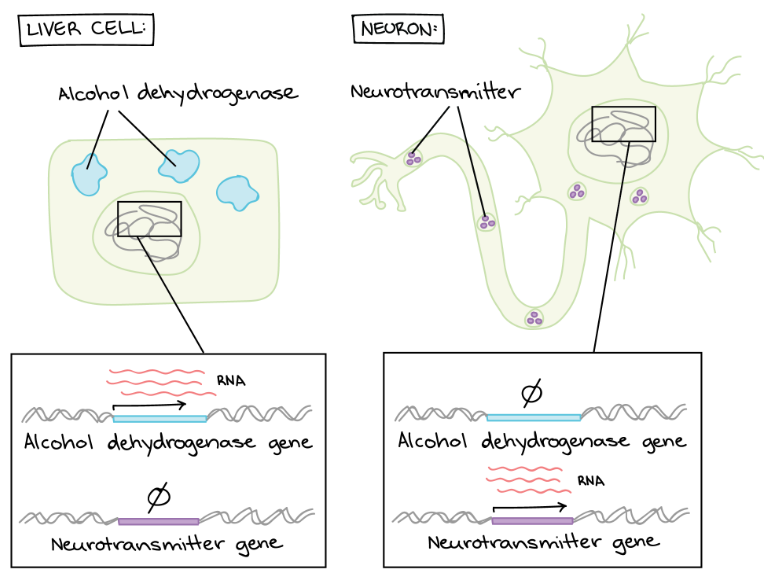
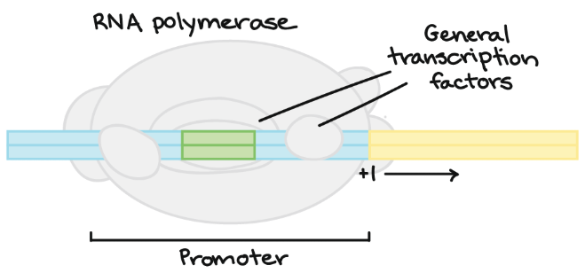
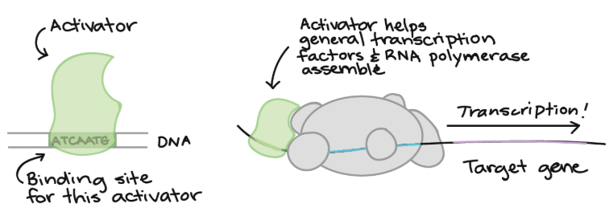
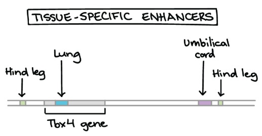
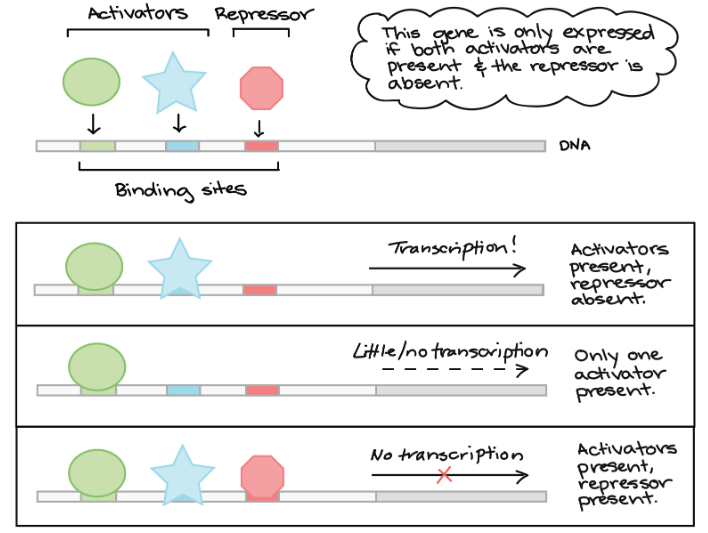
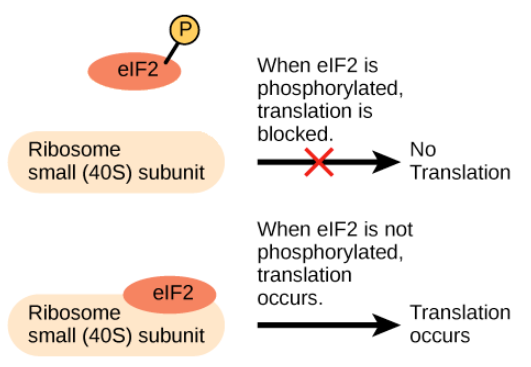
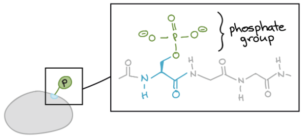
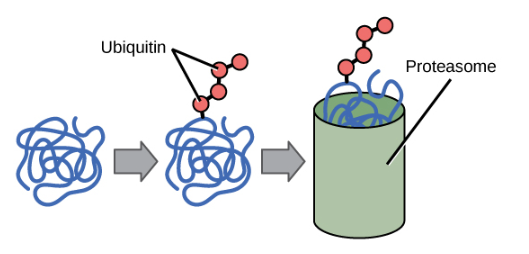

# Eukaryotic gene regulation

人體中的細胞其實都擁有一樣的 DNA instructions，但為什麼可以出現幾百多種類型 ? 答案是 gene regulation

* **Gene regulation** 會將特定 genes 啟動
  * 所以就算細胞都擁有一模一樣的 DNA
  * 也會有獨一無二的 active genes 做不同的事情

* 例如肝細胞為了要移除有毒物質
  * 會啟動產生 alcohol dehydrogenase 的 genes
  * 而神經細胞就不會啟動這個 gene
* 相反的神經細胞要傳遞訊息
  * 會啟動 neurotransmitter 相關的 genes
  * 而肝細胞就會關閉這個 gene

## How do cells "decide" which genes to turn on?

簡單來說，細胞將靠著內部和外部環境，來決定自己的 gene expression pattern

* Examples from inside the cell
  * 從 mother cell 繼承的 proteins
  * DNA 是否受損
  * ATP 是否足夠
* Examples from outside the cell
  * 其他 cells 給的訊號
  * Extracellular matrix 的訊號
  * Nutrient level

這些因素又是怎麼觸發 gene expression 執行 ? 答案是透過一個 molecular pathway

以上是細胞根據鄰居細胞給的 growth factors 來執行 gene expression

* 細胞透過表面的 receptor protein 偵測到 (結合) growth factor
* Receptor 改變形狀引起一連串的活動，啟動了 **transcription factors** (protein)
* Transcription factors 和 DNA 結合，讓 nucleus 開始執行分裂相關的 gene transcription
* 最終的產物就是幫助細胞分裂的 proteins

## Regulation stages

**Gene regulation** 幾乎出現在 gene expression 的每個階段

* **Chromatin accessibility**
  * Chromatin 的架構可被調節
  * 越 open (relax) 的 chromatin 越適合 transcription
* **Transcription**
  * Transcription factors 會和特定 DNA sequences 結合
  * 促進或壓抑 RNA transcription 的執行
* **RNA processing**
  * Splicing, capping, adding poly-A tail 可被調節
  * 是否要讓 RNA 離開 nucleus
  * Alternative splicing 也可以製造出不同的 mRNAs

* **RNA stability**
  * mRNA 在 cytosol 的壽命會影響到 proteins 製造的多寡
  * miRNAs 會結合並除掉 (chop up) 特定的 mRNAs 
* **Translation**
  * Translation 的執行次數可以被 regulators 影響而增加或減少
  * miRNAs 有時會檔住 translation
* **Protein activity**
  * 被製作出來的 proteins 可以被修改
  * 修改就會影響 protein 的行為和活動

其中最重要的是 transcription，後面幾個 regulation 幾乎都是在 transcription 時制定的 !

## Transcription factors

人類在 transcription 需要 **basal (general) transcription factors** 的幫助，才能將 RNA polymerase 放到 DNA promoter 的位置上

* Transcription factors 不只 general 一種
  * 有非常多種類的 transcription factors
  * 每種可能對應於特定的 genes

但這些 transcription factors 都會到目標的 DNA 上與之結合，促進或抑制 RNA polymerase 結合 promoter

### Activators

* 一些 transcription factors 是 **activator**
  * 幫助 general transcription factors 和 RNA polymerase 更容易結合到 promoter 上面

### Repressors

* 一些 transcription factors 是 **repressor**
  * 讓 general transcription factors 和 RNA polymerase 很難和 promoter 結合
  * 有很多種方法阻止結合，以下是其中一種

### Binding sites

* Transcription factors 通常非常靠近 gene's promoter
  * 但也可以在 DNA 的其他地方，離 promoter 很遠

* 因為 DNA 非常有彈性
  * 讓遠處的 transcription factors 可以透過 DNA 的變形接近 promoter

### Turning genes on in specific body parts

有的 gene 會控制身體很多個地方的細胞，那 transcription factors 要如何和這種 gene 互動 ?

* 這種 gene 可以會有多個 **enhancers** 或 **silencers**
  * Enhancers 代表有多個給 activators 結合的 binding sites
  * Silencers 代表有多個給 repressors 結合的 binding sites

以老鼠為例，有一個 gene 控制非常多身體的成長，叫做 Tbx4

* 所以 Tbx4 上就有多個 enhancers
  * 每個 enhancers 對應不同的生長部位

* 這種 enhancers 又叫做 **tissue-specific enhancers**
  * 控制身體特定部位的 gene expression
  * Tissue-specific enhancers 或 silencers 突變，是進化的關鍵

### Transcription factors and cellular "logic"

很多 genes 會被多個 transcription factors 所控制，所以 factors 的組合會決定 gene 的啟動與否

* 透過 transcription factors 組合來控制 gene 又叫做 **combinatorial regulation**
  * 例如下圖的 gene 只在 A, B 出現，而 C 不在時才會啟動

* 若 Activator A 只出現在 skin cells
* Activator B 在收到 growth factors 時出現，代表要 divide cell
* Repressor C 會在 DNA 損傷時出現

那這個 gene 就是在 "健康的" skin cells 中取得 growth factors 後控制細胞分裂的角色

## Regulation after transcription

mRNA 在 transcription 後離開 nucleus 一樣能夠被調節，調節重點有兩個:

* Lifespan of mRNA in cytosol
* How readily the translation

### microRNAs

有一個 regulators 叫做 small regulatory RNAs 被發現能調節上述兩個因子

* **microRNAs (miRNAs)** 是第一個被發現的 small regulatory RNAs
  * miRNA 一樣被 transcribe 成 RNA molecules
  * 釋出 22 nucleotides 的 small double-stranded fragment
  * 其中一串就是 mature miRNA
  * 將會跟特定 protein 結合成 **microRNA-protein complex**

miRNA 將會指引整個 protein complex 去和 mRNA 配對

* 若完全配對
  * RNA-protein complex 中的 enzyme 就會把 mRNA 整個切掉
* 若配對有少部分錯誤
  * 會代替 ribosome 和 mRNA 結合，停止 translation

### Regulation of translation

Translation 的調節發生在 initiation

* Ribosome 為了正確與 mRNA 結合，需要很多 "helper" proteins
  * 改變這些 helpers 的活動就是調節目標

* 例如其中一個 protein 叫做 eukaryotic initiation factor-2 (eIF-2)
* eIF-2 必須要結合到 ribosome 的一個部位
  * 當 eIF-2 被加上一個 phosphate group (been phosphorylation)
    * 就無法幫助 ribosome 進行 translation
  * 當 eIF-2 沒有被 phosphorylation
    * 就可以進行 translation

### Proteins can be regulated after translation

產生的 protein 依然可以被調節，一些對 protein 的 edit 可以改變其行為及活動

* 有的 protein 可能需要被切開才能啟動
  * e.g., insulin
* 有的 protein 則需要其他 chemical groups 加到身上
  * e.g., methyl, phosphate, acetyl, ubiquitin

#### Phosphorylation

一個最常見的 post-translational modifications 就是 **phosphorylation**

* Phosphate group 依附到 protein 上
  * 可能造成 protein 被 activated 或 deactivated 甚至改變行為
  * 前面說到的 eIF-2 就是一個例子

#### Ubiquitination

Ubiquitination 則是 protein 和 chemical marker **ubiquitin** 結合的現象

* Ubiquitin-tagged proteins 會被帶到 proteasome
  * 拆解成 components 回收利用
  * Ubiquitination 控制了細胞中 protein 的 persistence
