# Introduction

* 人類是由一堆 large biological molecules 組合而成
* 更可以將人類看成由 4 major types of large biological molecules 組成
  * carbohydrates (such as sugars)
  * lipids (such as fats)
  * proteins
  * nucleic acids (such as DNA and RNA)

- 這些 large biological molecules 在生物中處理非常多的工作
  - **carbohydrates** : store fuel, energy
  - **lipids** : key structure components of cell membranes
  - **nucleic acids** : store, transfer hereditary information (instruction for making proteins)
  - proteins : 最多功能性
    - structural support
    - carry out specific jobs in a cell, such as **catalyzing** metabolic reactions, **receive** or **transfer** signals

## Monomers and polymers

* 這些大多數的 large biological molecules 都是 **polymers** (視為 necklaces, series of beads)
* Polymers 又是由很多小單位重複的組成，這些小單位叫作 **monomers** (視為 beads)
* Carbohydrates, nucleic acids, proteins 這三類通常在自然中為 long polymers
  * 這三種又會被稱作 **macromolecules** (marco- : big, large, huge)
* Lipids 則是四個裡面最小的，甚至不會是一個 polymer
  * 有的時候 lipids 不會被考慮在 macromolecules 中
  * 但很多時候還是會稱這四個 large biological molecules 為 "**macromolecule**" (more loosely)

> 只要記得 lipids 也是 large biological molecules 的一員，但只是他不常形成 polymers

## Dehydration synthesis

- 這些 large biological molecules 通常透過 dehydration synthesis reaction 聚集起來
  - 也就是 monomers 之間會透過 covalent bond 起來，且過程中會釋放水分子
  - 這也是為什麼叫作 dehydration

- 例如上圖的 dehydration synthesis reaction 
  - 可以看到 2 個 sugar glucose 組合成 1 個 sugar maltose + 水分子
  - 其中一個 glucose 損失一個 H，另一個損失一個 OH group
  - 失去的兩個東西 (H 和 OH) 用 covalent bond 的形式組合成水分子
- 其他的 monomers 也用這個方式合成，最後就形成越來越長的 polymer

* polymers 雖然單純重複 monomer 組成，但可以有非常多的 shape, composition
  * composition, sequence 的不同會影響 function
  * carbohydrates, nucleic acids, proteins 都能有非常多不同類型的 monomers
    * 例如 DNA 有 4 種 nucleotide monomers
    * proteins 有 20 種 amino acid monomers

- 單一種類的 monomer 也可以組成不同的 polymers (當然就擁有不同 properties)
  - 例如 starch, glycogen, cellulose 都是由 glucose monomers 組成的 carbohydrates
  - 但都有不同的 bonding 和 branching patterns

## Hydrolysis

* polymers 有時需要**被轉換回** monomers
  * 例如身體會回收 molecule 來重新 build 其他的 molecule
* polymers 會透過 **hydrolysis reaction** 來**分解**成 monomers 
  * 也就是原本組合 monomers 的 bond 會被水分子**斷開**

- 在 hydrolysis reaction 當中，原本的組成分子會被一分為二
  - 其中一個 molecule 得到 hydrogen atom $$(\text{H})$$
  - 另一個 molecule 則得到 hydroxyl $$(\text{-OH})$$ group
  - H 和 -OH 兩者都是從 dehydration synthesis 產生的水分子而來
  - 所以 hydrolysis 其實就是 dehydration synthesis 的逆反應

* 這些被轉換回的 monomer 可以重組成新的 polymer
  * 例如下圖中水分子把 maltose 拆成 2 個 glucose monomers
  * 這是原先上圖那個 dehydration synthesis 的 reverse

* Dehydration synthesis reactions 需要能量來組合 molecules
* Hydrolysis reactions 則是把 molecules 拆解並釋放能量
* Carbohydrates, proteins, nucleic acids 就是透過這些 reactions 不斷建立又拆解，儘管他們的 monomers 都是不同的

> * 在 cell 中的 nucleic acids 實際是不會用 dehydration synthesis 來合成
> * 有些種類的 lipids 也會使用 dehydration synthesis 來合成，儘管 lipids 不是 polymers

## Enzymes

* 身體中的 enzymes 通常會加速 (catalyze) dehydration synthesis 和 hydrolysis 兩種反應
* 而破壞 bond 的 enzymes 通常命名的結尾會有 **-ase**
  * 例如 maltase enzyme 用來分解 maltose
  * lipases 用來分解 lipids
  * peptidases 用來分解 proteins
* enzymes 可以分解任何 large biological molecules
  * 將物質釋放成 small building blocks 供身體吸收及使用

# Carbohydrates

* 一些 carbohydrates 以 sugar 型態現身，提供吃的人 fuel source
* 一些 carbohydrates 則是 fiber 型態，例如 cellulose polymers 提供細胞壁結構
* 大多 carbohydrates 是 starch 型態，是一連串連結的 glucose molecules (儲存能量)
  * 當吃下薯條時，我們消化道的 enzymes 就是在這串 glucose 上將他們切斷成一個一個的 sugar，讓 cell 可以使用

## Monosaccharides

* **monosaccharide** (mono- = one, sacchar- = sugar) 是單醣
  * 最常見的是 glucose
  * fomula 是 $$(\text{CH}_2\text{O})_n$$，通常有 3 到 7 個 carbon atoms
  * monosaccharide 中的 oxygen atom 會出現在兩個地方
    * hydroxyl $$(\text{OH})$$ group
    * carbonyl $$(\text{C}=\text{O})$$ group，這個 group 的位置會改變糖的種類
      * 若 carbonyl 包在 **aldehyde group** (在最後 chain)，那這個糖就是 **aldose** (醛糖)
      * 若 carbonyl 被包在兩個 C 中間 (不在最後 chain)，就會形成 **ketone group**，而成為 **ketose** (酮糖)
    * 另外糖的名字還可以依照 carbon 數量命名，例如 trioses (3 carbons)、pentoses (5 carbons)、hexoses (6 carbons)

### Glucose

* glucose 是 monosaccharide 重要的一員，有 6 個 carbon 寫作 $$\text{C}_6\text{H}_12\text{O}_6$$
  * 另外常見的 monosaccharides 還有 galactose (半乳糖), fructose (果糖)
  * 但它們三個的 formula 都一模一樣 ($$\text{C}_6\text{H}_12\text{O}_6$$)
  * 所以他們是 **isomers**

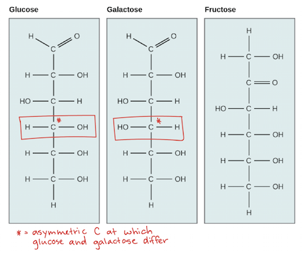

* Fructose 和 glucose 是 **structural isomer**
* Galactose 和 glucose 則是 **stereoisomers**
* 這些小細節都足夠告訴 enyzes 來取得正確要使用的糖來進行 chemical reactions

### Ring forms of sugars

* 除了上面三種 linear chain 的糖，其他還有很多 ring-shaped 的糖
  * 有些 5, 6 carbons 的糖可以存在 linear 以及 ring-shaped
* 這些型態都能達到 equilibrium，但 ring 才是最好達到的型態 (特別是在水中)
  * glucose 有 99% 都是以 6 carbon ring form 存在 solution 中
* Glucose 在 6 個 carbon ring 還會有兩種型態
  * alpha form
    * 當 carbonyl 轉成 hydroxyl group 在 ring 之上時 (跟 $$\text{CH}_2\text{OH}$$ 同邊)
  * beta form
    * 同樣當 carbonyl 轉成 hydroxyl 並在 ring 之下時

## Disaccharides

* **disaccharide** (di- = two) 是雙醣
  * 是兩個 monosaccharides 透過 dehydration synthesis (condensation reaction) 結合在一起的
  * 其中一邊的 hydroxyl group 和另一邊的 hydrogen 結合
  * 釋放出水分子後形成了 glycosidic linkage (covalent bond)
* 例如下方是一個 glucose 和 fructose 兩個 monomers 組合的情況
  * 透過 dehydration 形成 **sucrose** (table sugar，蔗糖)

* 結合時 monosaccharide 中 carbon 的位置非常重要
  * 我們從離 carbonyl group 最近的 carbon 開始從 1 標號碼
  * 可以看到 glucose 的 1 carbon 和 fructose 的 2 carbon 連結在一起
  * 這個 bond 就是一個 **1-2 glycosidic linkage**

- 常見的 disaccharide 有 lactose (乳糖), maltose (麥芽糖), sucrose (蔗糖)
  - lactose = glucose + galactose
  - maltose = 2 * glucose
  - sucrose = glucose + fructose

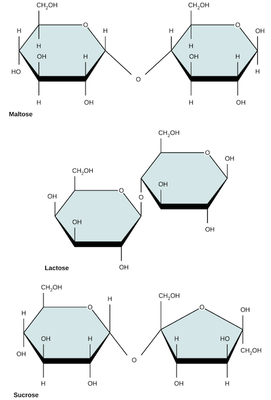

## Polysaccharides

* 大量的 monosaccharides 透過 glycosidic bond 連結起來就是 polysaccharides (多醣)
  * chain 可以是 branched 或是 unbranched
  * 可以包含各種類型的 monosaccharides
  * 常見的 polysaccharides 有
    * Starch (澱粉), glycogen (肝糖), cellulose (纖維素), chitin (甲殼素)
    * 都是對生物非常重要的多醣

### Storage polysaccharides

#### Plants

* **Starch** 是植物中糖的 stored form
  * 由 2 個 polysaccharides (amylose + amylopectin) 組成
    * 2 個都是由 glucose 組成的 polymers
  * 植物透過光合作用產生大量的 glucose 來維生
    * 還沒使用到的 glucose 就會轉成 starch 形式儲存在 roots 或 seeds
      * 在 seed 中的 starch 提供胚胎養分，或是成為動物的食物
      * 動物再透過 digestive enzymes 來分解 starch 成為 glucose monomers 吸收

- 在 starch 中，glocose monomers 都是 alpha form
  - hydroxyl group of carbon 1 sticking down below the ring
- 而且 connect 的方式多為 1-4 glycosidic linkage
  - 舉例來說
    - Amylose 由 linear chain 的 glucose 組成，連接方式是 1-4 glycosidic linkage
    - Amylopectin 是 branched polysaccharide，連接方式大部分是 1-4 glycosidic linkage，有一些是 1-6 linkage 在 branch 處

#### Humans

* **Glycogen** 是人類中糖的 stored form
  * 跟植物一樣，也是由 glucose monomers 組成的 polymer
  * 甚至比 amylopectin 還要多 branches
* 通常 glycogen 儲存於 liver, muscle cells
  * 當血液中的 glucose level 下降
    * glycogen 就會透過 hydrolysis 分解，然後釋放 glucose 到血液中

### Structural polysaccharides

* polysaccharides 除了當作能量來源，另一個重要用途就是作為 structure
  * 例如 **Cellulose** 用於植物的 cell walls，負責包圍細胞
    * 樹和紙都是由 cellulose 組成
    * cellulose 由大量的 glucose monomers 透過 unbranched chains 由 1-4 glycosidic bonds 組成

* cellulose 中的 glucose 則是 beta form
  * 可以看到上圖每一個 glucose 都和鄰居成上下顛倒的情況
  * 這讓 cellulose 的形狀是 long, straight, non-helical chains
* 這些 chain clusters 中每個的 hydroxyl group 再透過 hydrogen bonds 連結
  * 所有的特性讓 cellulose 非常 rigid，且有高度 tensile，適合作為細胞壁

- cellulose 中的 beta glycosidic linkages 是人類的 digestive enzymes 所無法分解的東西 (所以人類無法消化 cellulose)
  - 但是有一些草食動物，例如 cow, koala, buffalo, horse
  - 體內有一些特別的 microbes 幫助他們處理 cellulose
  - 這些 microbes 生存在動物的消化道，把 cellulose 分解成 glucose monomers 供動物使用

#### Chitin

* 某些昆蟲有 hard external skeleton 稱作 exoskeleton (外骨骼)
  * 是為了保護他們較脆弱的內部身體而存在
  * 這些 exoskeleton 由 macromolecule **chitin** 組成
  * 結構跟 cellulose 很像，但是 glucose 和 nitrogen-contained 的 functional group 組合在一起

# Lipids

* 我們都以為 fat 是對身體很不好的東西，但實際上是生物中非常重要的角色
  * 近年的研究甚至發現 sugar 可能比 fat 帶來更多的健康問題
* Fat 由 1 個衣架形狀的 molecule 稱作 **glycerol** (丙三醇又稱甘油)
  * 和 3 個 long hydrocarbon tails (**fatty acids，脂肪酸**) 組合在一起

- Fats 只是 **Lipid** 的一種
  - 因為 lipids 多由 hydrocarbon chains 所組成，所以是特別不會溶於水的 molecules (**hydrophobic, nonpolar**)
  - Lipids 可以有多種功用，例如 :
    - **store energy** (long-term)
    - **insulation** (cell membranes)
    - **water-repellent** (on leaves)
    - **building blocks for hormones** (testosterone)
  - 甚至有很多維他命是 fat-soluble，表示他們只能跟 fat molecules 作用，才被人體吸收
  - 以下我們先針對幾種常見的 lipids 來介紹
    - fats, oils, waxes, phospholipids (磷脂), steroids (類固醇)

## Fats and Oils

* Fat molecule 包含兩大部分
  * **glycerol backbone**
    * 包含 3 個 hydroxyl (OH) groups
  * **three fatty acid tails**
    * 每個由 12 至 18 個 carbon 組成 hydrocarbon 分別連結至 hydroxyl group
    * 還是有少如 4 個 carbon 或多如 36 個 carbon

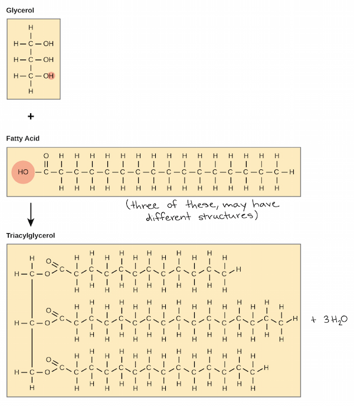

- glycerol 的 **hydroxyl** 將會與 fatty acids 的 **carboxyl** 進行 dehydration synthesis 合成
- 所以 glycerol backbone 會以 **ester linkage** 和 3 個 fatty acid tails 連結起來
  - ester linkage : oxygen atom next to a carbonyl $$(\text{C}=\text{O})$$ group
- 所形成的 fat molecules 可以稱作 **triglycerides** (三酸甘油酯)
  - triglycerides 可能會有 3 個完全相同的 fatty acid tails
  - 也可能會有 3 個完全不同的 fatty acid tails (diff length, diff patterns of double bonds)

* Triglycerides 又可以稱作 **triacylglycerols**
* Triglycerides 主要儲存於一些特別的 fat cells，稱作 **adipocytes** (脂肪細胞)
  * adipocytes 會組成常見的 adipose tissue
* 有些不存在 fat 的 fatty acids 自己在人體中游移，這些也可當作 lipids

### Saturated and unsaturated fatty acids

* 3 個 fatty acid chains 可以有不同的長度，而裡面的架構又會改變 **degree of unsaturation**
  * 當 carbon 之間都是 single bond 的時候，這個 fatty acid 是 **saturated** 的
    * 指的是跟 hydrogen 互相飽和 (saturated)
    * 所有 hydrogen 都盡可能 attach 到 carbon skeleton
  * 當 carbon 之間有出現 double bond 的時候，這個 fatty acid 就是 **unsaturated** 的
    * 如果又只有一個 double bond，那就是 **monounsaturated**
    * 如果有多個 double bond，那就是 **polyunsaturated**
    * 這些 double bond 又可以有 **cis** 或 **trans** configuration
      * Cis configuration
        * Bond 兩邊的 hydrogens 在同一側
        * 使得 fatty acid 產生 **kink, bend**
      * Trans configuration
        * Bond 兩邊的 hydrogens 在不同側
        * 使得 fatty acid 是 **linear**

* Saturated fatty acid tails 是直的，所以該 fat molecules 能夠非常緊密的包在一起
  * Pack tightly against one another
  * 所以在室溫時會是固體 (high melting point)
  * 例如一些 butter 就是 saturated fats
* Cis-unsaturated fatty acid tails 則是彎的，這讓 fat molecules 無法緊密包在一起
  * 所以在室溫時會是液體 (low melting point)
  * 例如一些常見的 oils 就是 cis-unsaturated fats

### Trans fats

* 上面我們少講了 trans-unsaturated fatty acid tails (或稱 **trans fat, 反式脂肪**)
  * Trans fats 在自然界非常稀有，但卻被工業中使用 partial hydrogenation 方式大量生產
    * hydrogenation 意思是氫化，也就是灌入 hydrogen gas
    * 通常會灌入 cis-unsaturated fats
    * 試著讓那些 double bond 變回 single bond，也就是嘗試得到 saturated 的特性 (室溫固態)
    * 但是卻出現一些副作用，例如 cis double bonds 變成 **trans double bonds**
    * 常見的 trans fats 在室溫中是固體，例如大部分的 shortening, creamer
* 看起來 partial hydrogenation 和 trans fat 表面上帶來的好處有
  * 用 oil-like prices 就得到 butter-like substance
* 但實際上 trans fats 對人體有非常不好的影響
  * 與 coronary heart disease 有非常大的正關聯性

### Omega fatty acids

* omega-3, omega-6 fatty acids 也是值得一提的 fatty acids
* 這兩種 fatty acids 又有非常多種形態
  * 但 omega-3 主要架構是 alpha-linolenic acid (ALA)
  * 而 omega-6 主要架構是 linoleic acid (LA)
* 人體非常需要這兩種 fatty acids 但卻無法生成 ALA, LA 這兩種 **essential fatty acids**
  * 只好從飲食取得，例如 fish (salmon), seeds (chia, flax)

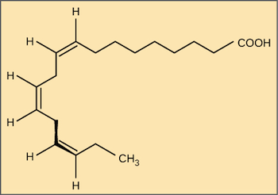

* omega fatty acids 都含有至少 2 個以上的 cis-unsaturated bonds
  * 所以都是 curved 形狀，例如上圖的 ALA
* 這些 omega fatty acids 都扮演非常重要的角色
  * 例如作為合成重要 signaling molecules 的 precursors 
    * 幫助調節 inflammation, mood
  * Omega-3 fatty acids 減少 heart attack 這種瞬間死亡疾病的機率
  * 或是減少血液中的 triglycerides、降低血壓、減少血栓形成

## Waxes

* Waxes 是另一種重要的 lipids
* 常見在一些水棲鳥類的羽翼上、或是一些植物的葉面上
  * Waxes 用了 lipid 中 hydrophobic (water-repelling) 的特性來防水
* Waxes 通常由 long fatty acid chains 和 alcohols 透過 ester linkages 組成
  * ester linkage : oxygen atom next to a carbonyl $$(\text{C}=\text{O})$$ group

## Phospholipids

* 細胞中有 plasma membrane 來防止 cytosol (細胞液) 溢出
  * 這些 plasma membrane 的主要成分就是 **phospholipids** (磷脂)
* phospholipids 組成方法跟 fat 非常像，只是他只有 2 個 fatty acid tails
* 而 glycerol backbone 的第三個 carbon 則跟 **phosphate group** 組成
  * 這個 phosphate group 又可以有不同的 modifiers 得到不同的屬性
    * 例如 choline (nitrogen-containing compound)
    * 例如 serine (an amino acid)

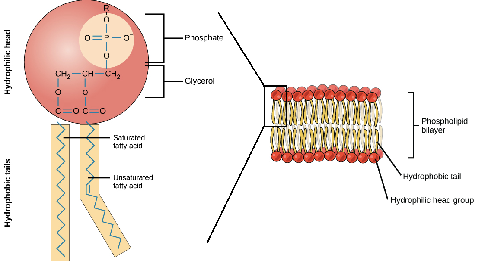

- phospholipids 是一種 **amphipathic** 的 molecule
  - amphipathic 代表一半 hydrophobic 一半 hydrophilic
  - phosphate 部分是 hydrophilic
  - fatty acids 部分是 hydrophobic
- Membrane 的架構就是由 phospholipids 組成的 bilayer
  - 其中 phosphate 面向水的一方，而 tails 則面向內部
  - 這個架構讓 tails 不會碰到水，得到 low-energy, stable arrangement

> * 如果將 phospholipids 放到水中，會形成一個 sphere-shaped 的架構稱作 **micelle**
> 

## Steroids

* **steroids** 是另一個重要的 lipids，它的特徵就是 4 個 **fused rings**
  * 雖然和其他 lipids 的架構幾乎不同，但他依然是 hydrophobic 以及 insoluble in water
* 有些 steroids (例如 **cholesterol, 膽固醇**) 會有一些 short tail
* 很多 steroids 會有 -OH functional group 出現在特定的地方
  * 這類有 -OH 的 steroids 也會被認定為 alcohols，稱作 **sterols**

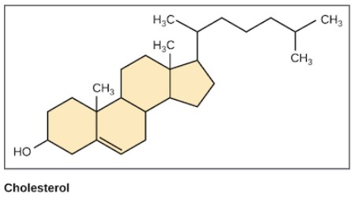

- Cholesterol 是最常見的 steroid，主要在肝產生
  - 是很多 steroid hormones 的 precursor
    - 例如 testosterone (睪酮), estradiol (雌二醇)
  - 也是其他重要 molecules 的 precursor
    - 例如 vitamin D, bile acids (膽汁酸)
    - 用於從飲食中消化脂肪利用
  - 或是重要的 membranes component
- 血液中也會出現 cholesterol
  - 可以有正面影響
    - 例如在其 HDL form 可以保護人體
  - 也可以有反面影響
    - 在其 LDL form 可以傷害心血管健康

# Nucleic acids

* DNA 持有從雙親繼承下來的遺傳資訊，提供一些關鍵的 instructions
  * 例如要在何時、如何產生 proteins 來幫助建立 functioning cells, tissues, organisms
  * DNA 是如何將這些資訊帶入 cells, organisms 的 ?
    * 其實非常複雜、甚至 mind-blowing
    * 會在之後的 **molecular biology** 章節講到
  * 這邊先從 macromolecule 的角度簡單介紹 nucleic acids

## Roles of DNA and RNA in cells

* **Nucleic acids** 主要是由多個 **nucleotides** 所組成的，主要有兩種類型
  * **deoxyribonucleic acid (DNA)**
    * DNA 是所有 living organism (單細胞細菌到多細胞生物) 的遺傳物質
  * **ribonucleic acid (RNA)**
    * RNA 則是某些病毒 (but technically not alive) 的遺傳物質

## DNA in cells

* 為什麼 DNA 的名字中有 nucleic ?
  * 因為 DNA 會在細胞核中被發現
    * 例如 eukaryotes (真核生物，動物或植物) 的 DNA 可以在 **nucleus** 找到
      * nucleus 通常在 membrane-bound cell 之中
      * 或是在一些 organelles 中 (mitochondria, chloroplasts of plants)
    * 或是 prokaryotes (原核生物，細菌) 的 DNA 可以在 **nucleoid** 找到
      * nucleoid 則是沒有任何 membrane 保護

- eukaryotes 的 DNA 通常拆分成又長又直的單位，稱作 **chromosomes** (染色體)
- prokaryotes 的 DNA 通常就拆成比較小，而且又是 ring-shaped 的 chromosomes
- chromosome 當中包含了成千上萬的 **genes**
  - 每個 genes 都提供了如何生產 cell 必要產物的 instruction

## From DNA to RNA to proteins

* Genes 要怎麼用來生成 protein products ? 
* 也就是如何指定特定的 amino acids 序列來組合特定的 protein ?
  * 首先要先產生 RNA copy (transcript)
    * 又稱作 **messenger RNA (mRNA)**
    * 因為該 mRNA 會是 DNA 到 ribosomes 中間的 messenger
  * 接著 molecular machines 就會讀取 mRNA 的序列來建立 proteins
  * 這個 DNA 到 RNA 到 protein 的過程可以稱為 **"central dogma"**

- 值得一提的是，不是所有 genes 都是用來 encode proteins
- 例如 **ribosomal RNAs (rRNAs)** 用來作為 ribosomes 架構的元件
- 或是 **transfer RNAs (tRNAs)** 負責運送 amino acids 到 ribosome 來執行 protein 合成
- 還有 **microRNAs (miRNAs)** 作為 genes 的 regulators
- 另外還是有非常多 non-protein-coding 的 RNA

## Nucleotides

* DNA 和 RNA 都是非常長的 polymers
  * 由非常多的 monomers (**nucleotides**) 組成，所以又稱 **polynucleotide**
* 其中的 nucleotide 由三個部分組成
  * **nitrogenous base** 
    * nitrogen-containing ring structure
  * **five-carbon sugar**
    * 這個 sugar 會在 nucleotide 的中央
    * 一個 carbon 會和 phosphate group 連結
    * 一個 carbon 會和 nitrogenous base 連結
  * **phosphate group**

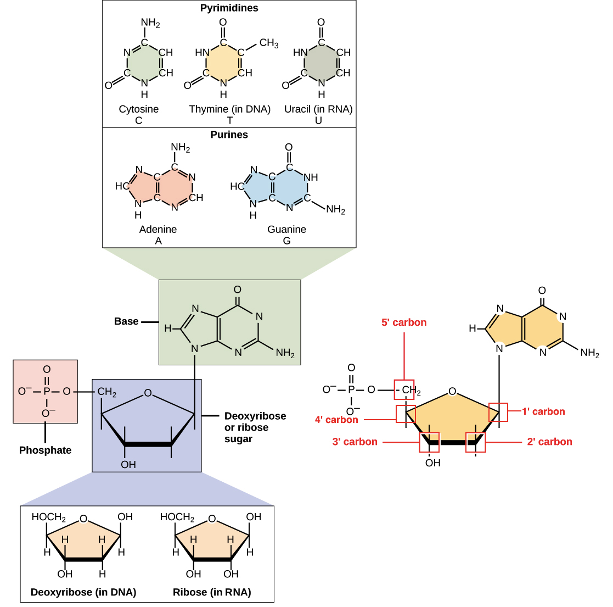

### Nitrogenous bases

* nitrogenous bases 由 carbon-based 組成的 molecules
  * 其中包含 nitrogen，且為 ring structures
* DNA 中的每個 nucleotide 都可能出現 4 種不同的 nitrogenous bases
* 這 4 種又可以分為 2 類
  * **Purine** : 有 2 個 fused carbon-nitrogen rings
    * Adenine (A)
    * Guanine (G)
  * **Pyrimidine** : 只有 1 個 carbon-nitrogen ring
    * Thymine (T)
    * Cytosine (C)

- 在 RNA 中，thymine 則會被另一種 pyrimidine base : **uracil (U)** 取代
  - 所以 DNA 有 A, T, G, C
  - 而在 RNA 有 A, U, G, C
- 為什麼會有 uracil (U)，又或者為什麼要有 thymine ? 原因"可能"是
  - 因為 uracil 比較會發生 error (比較可能跟別人 bond)
  - 所以 uracil 跟 thymine 比起來 **less stable**
  - 所以用 RNA 在進行初期的動作，可能比較適合非常多的變化
  - 而在穩定後，需要較少的 error，所以就用 thymine 來取代

### Sugars

* DNA 和 RNA 的 five-carbon sugar 只有一個地方有些微的不同
  * 在 DNA 的 five-carbon sugar 稱為 **deoxyribose**
  * 在 RNA 的 five-carbon sugar 稱為 **ribose**
* 不同的地方在五個 carbon 中的第二個 carbon
  * RNA 的 2' carbon 連結著一個 hydroxyl (OH) group
  * DNA 的 2' carbon 則只跟一個 hydrogen (H) 連結，所以少了氧 (deoxy)
* 不管是 DNA 還是 RNA 的 sugar 都會用 1', 2', 3', 4', 5' 來標註 carbon
  * 可以看到上面的圖片
  * 1' carbon 連接到 nitrogenous base
  * 5' carbon 連接到 phosphate group

### Phosphate

* 一個 nucleotide 可以有 1 至 3 個 phosphate groups 連結到 sugar 的 5' carbon
* 在 cell 中，一個 nucleotide 被加入到 polynucleotide chain 時本來會持有 3 個 phosphate groups
* 但在連接到 DNA 或 RNA chain 時，會損失 2 個 phosphate groups
* 所以在 DNA 或 RNA 中，每個 nucleotide 只會有 1 個 phosphate group

## Polynucleotide chains

* Polynucleotide chain (DNA, RNA) 有一個重要特性就是 **directionality** (方向性)
  * 雖然 DNA 的兩端 backbone 看起來是平行的，但其實跟馬路一樣是雙向的 (antiparallel)
* 例如左邊的 backbone 由上而下是由以下架構所連成
  * "... - phosphate - sugar 5' carbon - sugar 3' carbon - phosphate - ..."
* 右邊的 backbone 就會是相反架構
  * "... - phosphate - sugar 3' carbon - sugar 5' carbon - phosphate - ..."
* 而 sugar 和 phosphate 鄰居相連的線就是 **phosphodiester linkage**
  * sugar 的 3' carbon 的 hydroxyl group 會和 phosphate 的 hydroxyl group 相連
  * 這也是 dehydration synthesis 所以會釋放出水分子

## Properties of DNA

* DNA 通常是以 **double helix** 的樣貌出現
  * 也就是 2 個 complementary chains (backbone) 互相 stuck 在一起
* 這兩條 backbone 主要由 sugars 和 phosphates 組成
  * 所以又可以稱為 **sugar-phosphate backbone**
* 中間的每一個像階梯的就是一個個的 **nitrogenous base pairs**
  * 每個 base pair 中的兩個 bases 則是用 **hydrogen bond** 相連

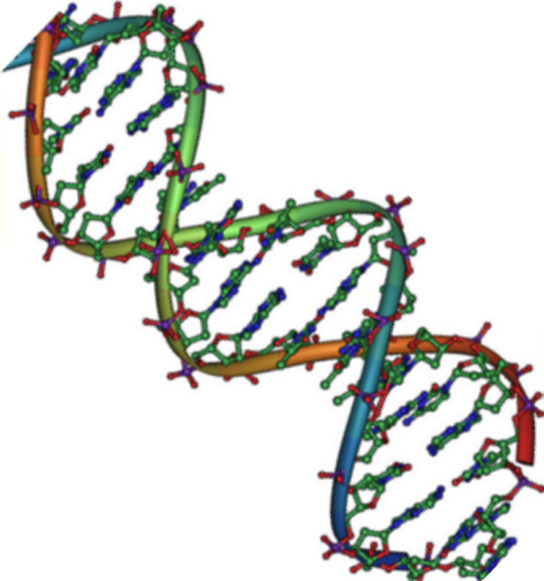

* 兩個 stands 又是以相反方向互相對應，這個現象稱為 **antiparallel**
  * 對 DNA 的複製非常重要
* base pair 中也不是隨便 2 個 bases 就可以組合，需考慮到 size, funtional groups
  * Adenine 會對應 Thymine
  * Guanine 會對應 Cytosine
* 所以只要知道 DNA 的一邊，就可以簡單的猜出另外一邊
  * 例如當 DNA 的一邊是 `5'-AATTGGCC-3'`
  * 那麼另外一邊一定是 `3'-TTAACCGG-5'` 
* DNA 的 antiparallel 方式的 match 現象，稱為 **complementary**

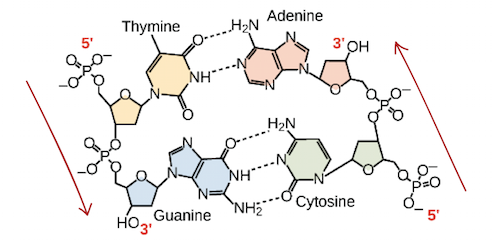

## Properties of RNA

* RNA 和 DNA 的結構不同，是只有一條的
* 裡面的每個 nucleotide 包含
  * five-carbon **ribose**
  * 4 nitrogenous bases (A, U, G, C)
  * phosphate group
* 主要的 RNA 類別有
  * messenger RNA (mRNA)
  * ribosomal RNA (rRNA)
  * transfer RNA (tRNA)
  * regulatory RNAs

### Messenger RNA (mRNA)

* mRNA 是 protein-coding gene 和 protein 產物的中間人
* 當需要製作 protein 時，RNA-polymerizing enzyme 就會來製作 RNA copy (transcript)
  * 這個 RNA copy 是從 gene's DNA sequence 複製而來
  * 並且 RNA 會將 DNA 資訊的 Thymine 用 Uracil 取代
    * 例如 DNA sequence `5'-AATTGCGC-3'` 會變成 RNA sequence `5'-AAUUGCGC-3'`

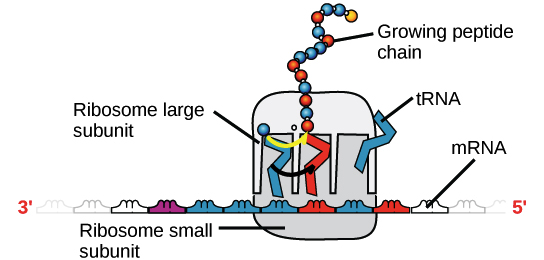

* 所以 mRNA 產生後，就會去找 ribosome (負責將一堆 amino acids 組合成 proteins)
* ribosome 讀取 mRNA 從 DNA 複製的遺傳資訊，然後就可以開始製作 proteins
  * mRNA 的 nucleotides 會被三個一組的閱讀，每一組稱為一個 **codon**
  * 每一個 codon 產出特定的 amino acid

### Ribosomal RNA (rRNA)

* rRNA 是 ribosome 的主要元件
  * 幫助 mRNA 找到正確的位置，讓資訊能夠正確被讀取
* 有些 rRNA 的作用也像 enzymes，幫助催化 chemical reactions
  * 在這個例子中就是加速 amino acids 組成 proteins 的過程
  * 幫助催化的 rRNA 可以稱作 **ribozymes**

### Transfer RNA (tRNA)

* tRNA 也在 protein synthesis 裡面作為 carriers 的角色
* tRNA 將 amino acids 帶到 ribosome
  * 確保要加入到 protein chain 的 amino acid 是符合 mRNA 的要求
* tRNA 是一個單串 RNA，但當中有許多互補的區段，這些區段互相鏈結產生雙螺旋的區間

### Regulatory RNA (miRNAs, siRNAs)

* 其他沒有幫助製造 proteins 的 RNA 則來幫助調節 genes 的 expression
  * 所以稱作 regulatory RNAs
* 例如有的 regulatory RNAs 會和 mRNA 結合
  * 降低 mRNA 的 stability 或干擾 translation
  * 幫助 cell 來降低或者是 fine-tune 這些 mRNA 的 level
* 目前還有很多 noncoding RNA 在探索中

## Summary of DNA and RNA

|           | DNA                      | RNA                           |
| --------- | ------------------------ | ----------------------------- |
| Function  | 存放 genetic information | 幫助合成 proteins 和調節 gene |
| Sugar     | Deoxyribose              | Ribose                        |
| Structure | Double helix             | Usually single-stranded       |
| Bases     | A, T, C, G               | A, U, C, G                    |

# Proteins

* Proteins 不是單純的一種物質，而是非常多樣的存在生物體或細胞中
  * 他們有不同的 size, shape, function, jobs
  * 例如 structural parts, signal, messengers, metabolic enzymes, ...
* Proteins 比其他的 macromolecules 還要有更多的架構、功用
  * 一個簡單的細胞可以有上千個 proteins，每個有不同的 function
  * 但他們還是來自一連串的 amino acids 來組成

## Types and functions of proteins

| Role              | Examples               | Functions                           |
| ----------------- | ---------------------- | ----------------------------------- |
| digestive enzyme  | amylase, lipase        | 分解食物養分，讓人體快速吸收        |
| transport         | hemoglobin             | 在血液或淋巴中運送物質              |
| structure         | actin, tubulin         | 幫助組織各種架構，例如 cytoskeleton |
| hormone signaling | insulin, glucagon      | 調和身體系統運作                    |
| defense           | antibodies             | 保護身體不受外界病原體攻擊          |
| contraction       | myosin                 | 負責肌肉收縮功能                    |
| storage           | legume storage protein | 供給養分給成長中的胚胎              |

## Amino acids

* amino acids 是產生 protein 的 **monomers**
* 由一個或多個 chains of amino acids 所組成的 protein 又可稱作 **polypeptide**
* 人體有 **20 種**常見的 amino acids 可以在 protein 中找到

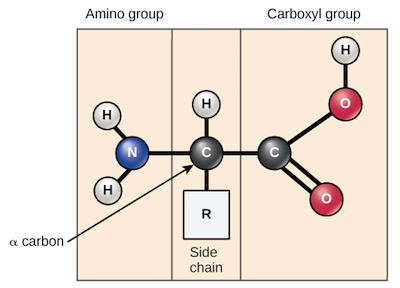

* 所有的 amino acids 都有一些共通的架構
  * 左邊是 amino 的 amino group $$(\text{NH}_2)$$
  * 右邊是 acid 的部分，是個 carboxyl group $$(\text{COOH})$$
  * 中間一定會有一個 carbon 叫做 **alpha carbon**
    * alpha carbon 會連接一個 hydrogen atom 還有 side chain
    * side chain 的不同造就出不同作用的 amino acids
    * 例如 R 的部分只是一個 hydrogen atom，那麼就會是 glycine
    * R 的部分是 methyl group $$(\text{CH}_3)$$，那麼就會是 alanine

- 上面的 amino group 和 carboxyl group 看起來呈中性，但實際中的 amino acid 不會是這種狀態
- 在 pH 7.2 - 7.4 的情況下 :
  - amino group 會是 protonated (帶些微正電)
  - carboxyl group 則會 deprotonated (帶些微負電)

## Peptide bonds

* Protein 是一或多個 polypeptide chains 所組成
* polypeptide chain 又是由 amino acids 相連而成
* amino acids 之間是用一種 covalent bond 稱作 **peptide bond** 所連結在一起
  * 每個 bond 是經由 dehydration synthesis 才產生的，如下圖所示
  * 最尾端的 amino acid 的 carboxyl group 的 OH
  * 和新來的 amino acid 的 amino group 的 H
  * 兩者進行 dehydration (condensation) 合成，釋放出水分子並連結起來

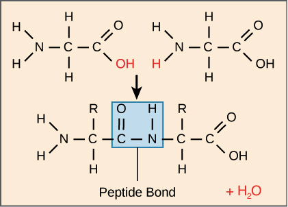

* 另外 polypeptide chain 是有 **directionality** 的
  * 也就是 chain 有完全不同的兩端
  * 有一端稱作 **amino terminus (N-terminus)** 有一個多的 amino group
  * 另一端稱作 **carboxyl terminus (C-terminus)** 有一個多的 carboxyl group
  * 其中 N 端在左邊，而 C 端在右邊。上圖就是一個非常短的 polypeptide 例子

## Orders of Protein Structure

* Protein 中的 polypeptide, amino acids 的架構只要改變，就會連帶改變非常多功能或特性
  * 這邊以煎蛋的蛋白為何會從透明變成白色不透明來舉例
* 蛋白中包含大量的 proteins (**albumins**)
  * 這些 albumins 因為 amino acids 的架構形成 3D 的形狀
* 加熱使得 amino acid 之間的 bonds 被切開
  * 一些 hydrophobic 的 amino acids 就被暴露出來
* 這些 amino acids 為了避免碰到水，所以又互相連結了起來
  * 形成了 protein network 使得蛋白從透明變白

所以 protein 的形狀及架構非常重要，會關係到他的 function，

而要了解 protein 的架構，需要從 primary, secondary, tertiary, quaternary 這四個架構來了解

### Primary Structure

* 這是最簡單的一層，就是以 amino acids 的排列來決定架構
  * 例如以下是一個 hormone insulin，他有兩個不同的 polypeptide chain

* protein 的 sequence 是 gene's DNA sequence 所提供的
  * 只要 gene's DNA sequence 稍微改變，protein 中的 amino acid 就會跟著改變
  * 而只要有任一個 amino acid 被改變，那整個 protein 的架構跟功能就會完全不同

- 例如 sickle cell anemia 症狀
  - 在血液中運送氧氣的 hemoglobin 某個 amino acid 遭到改變
    - 在 beta chain 上的第 6 個 glutamic acid 被 valine 取代掉

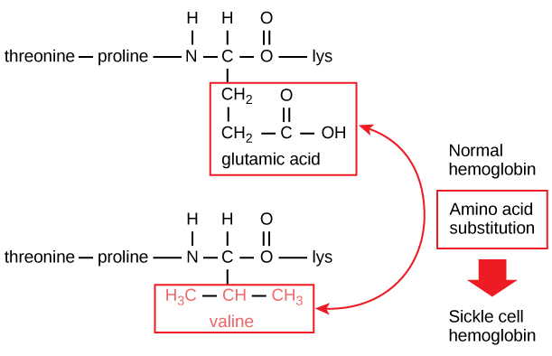

- 這還只是 hemoglobin 中 600 個 amino acids 的其中 2 個被改變而已
  - 但這個改變使得 hemoglobin 的形狀完全改變 (disc to cresent)
  - 讓 hemoglobin 非常困難於經過血管，造成嚴重的健康問題

### Secondary Structure

* 第二層則是以 protein 的 backbone 上的 atoms 互動來決定架構
  * 在這一層還不包含 amino acid 中的 R groups
* 最常見的 secondary structure 為下面兩者
* 兩者都是由一邊的 **carbonyl O** 和一邊的 **amino H** 以 hydrogen bond 連結而產生
  * α helix
    * 例如 amino acid 1 的 carbonyl 和 amino acid 5 的 N-H 以 hydrogen bond 連結
    * 這讓 polypeptide chain 產生 helical structure (curled ribbon)
    * 每一圈大約有 3.6 個 amino acids
  * β pleated sheet
    * polypeptide chain 上的 2 個或多個 segments 透過 hydrogen bond 連結
    * 形成類似 sheet 的架構，這個 sheet 可以是 **parallel** 也可以是 **antiparallel**

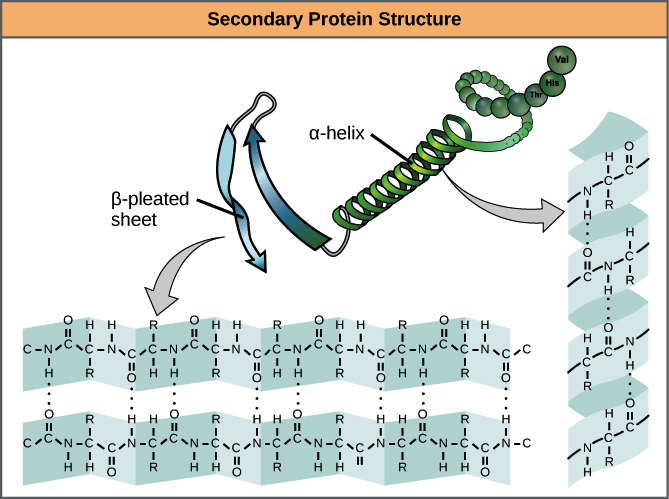

- 大部分的 amino acids 都會以上面兩種型態出現
- 但有的 amino acids 也可一次出現兩種型態，或是根本不是上面兩種型態
  - 例如 amino acid **proline** 因為 R group 會和 amino group 連結形成 ring
    - 所以他會破壞 helix 的形狀，變得 bend, unstructured
  - 其他 amino acids 如 tryptophan, tyrosine, phenylalanine 有較大的 ring structure R group
    - 他們常被發現於 β pleated sheet，可能因為空間較大放得下他們的 side chains

### Tertiary Structure

* 第三層是由 R groups 之間的反應來決定架構
  * 通常是由 R group 中間 non-covalent bonds 來造成第三層改變
    * hydrogen bond, ionic bond, dipole-dipole, london dispersion forces
    * 例如兩邊 R group 的電極非常不同，容易形成 ionic bond
    * 例如 polar R groups 容易產生 hydrogen bonds, dipole-dipole 反應
  * 另一個改變第三層的重要原因是 **hydrophobic interactions**
    * Nonpolar, hydrophobic 的 R groups 群聚起來躲在 protein 內部避免碰到水
    * 讓 hydrophilic amino acids 在外部與水分子作用
  * 最後一個改變第三層的是一個 covalent bond 叫做 **disulfide bond**
    * 包含 sulfur 的 amino acid cysteines 互相透過 covalent bond 連結
    * 非常堅固，可以視為 molecular "safety pins"

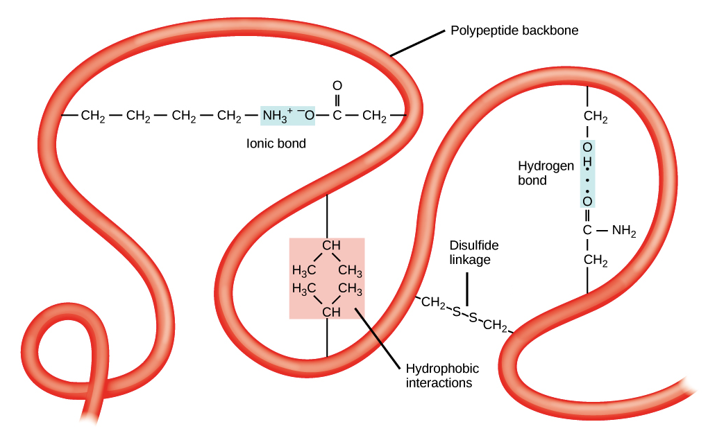

### Quaternary Structure

* 前三層都跟 amino acids 有關，第四層則是與 polypeptides 的排列有關
  * 當 protein 只有單個 polypeptide chain 時只會有前三層架構
  * 當 protein 有多個 polypeptide chains 就會出現第四層架構 

- 有第四層架構的例子有 
  - hemoglobin (2 alpha + 2 beta)
    - 運送血液中氧氣
  - 還有 DNA polymerase (10 subunits)
    - 一種產生新 DNA 的 enzyme

以下圖片總結了這四層改變 protein 架構的方法

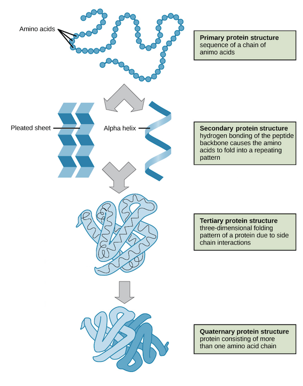

## Denaturation and protein folding

* Protein 組起來的 3D 架構會因為**溫度**或是 **pH** 而改變
  * Protein 會因此被分解，變回簡單的 amino acid string
  * Protein 失去架構的這個過程稱為 **denaturation**
  * Denatured proteins 是毫無功用的 (non-functional)

- 有些 denaturation 是 reversible，有的是 permanent
  - 因為 primary structure 未受到改變，回到原本的環境或許能讓 protein 恢復形狀
  - 但有的 denaturation 是永遠的，例如蛋白煮熟就回不去了