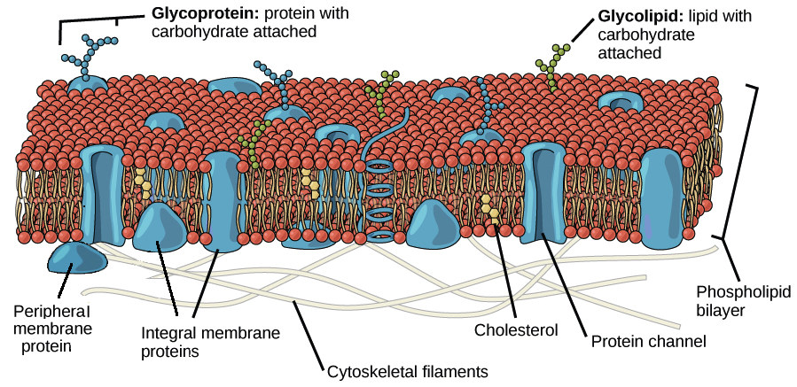
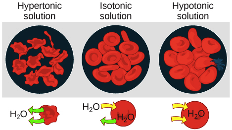
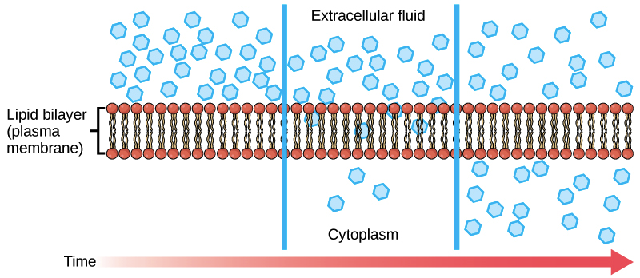
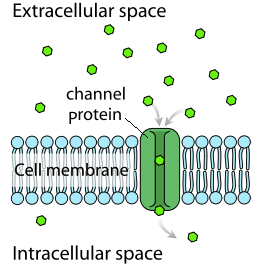
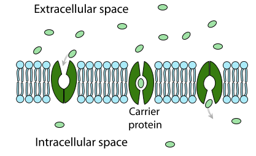
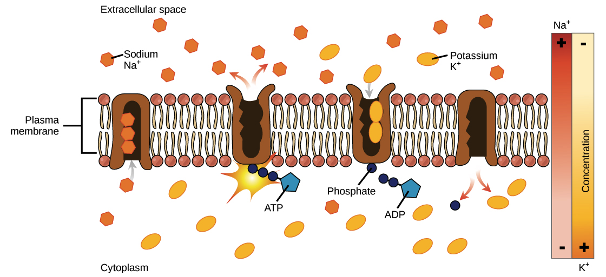
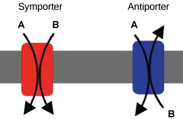
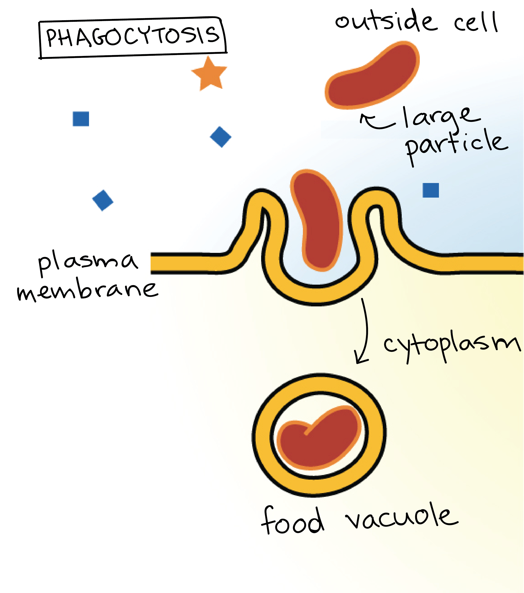
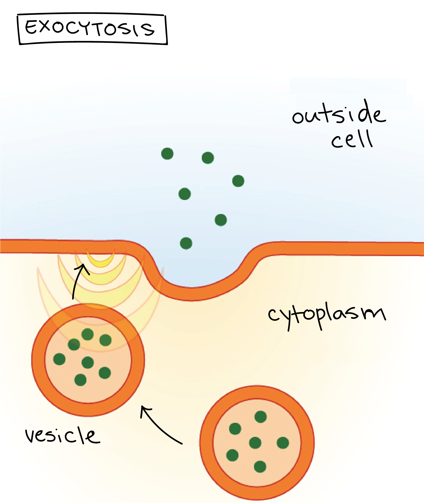

# The plasma membrane

每個 cell 都是被包覆在 membrane 泡沫當中

* membrane 的質地其實就像沙拉油一樣
  * 看起來隨便就可以破掉，但其實非常適合作為 cell 的包裝
* Membrane 的工作有很多
  * 包覆 cell
  * 與外部環境互動
  * 輸入輸出一些物質
  * 認知其他 cells，並跟其溝通

為了能處理這些工作，membrane 必須包含 lipids (semi-permeable barrier), proteins (transport, communication), carbohydrates (decorate lipids and proteins, recognition)

## Fluid mosaic model

現今最正確稱呼 membrane 架構的說法為 **fluid mosaic model**

* fluid mosaic model (1972) 用來定義各種 cells 的 membrane 架構
  * 元件 (phospholipids, cholesterol, proteins 等) 自由浮動在 membrane 的平面上
  * 像 mosaic 一樣的鑲嵌畫板
  * 例如下圖只是 membrane 在 dynamic process 中的任一 snapshot 而已

Membrane 主要元素有 lipids (phospholipids, cholesterol), protein, carbohydrate groups 附在一些 lipids 和 proteins 上面

* **Phospholipid** 由 1 個 glycerol 和 2 個 fatty acid tails 還有 1 個 phosphate group 的頭組成
  * 生物細胞的 membranes 主要會有兩層 phospholipids 形成 phospholipid bilayer
* **Cholesterol** 主要由 4 個 fused carbon rings 組成
  * 主要影響 fluidity
* **Proteins** 有的作為橫跨整個 membrane 作為通道，有的只出現在內外表面
  * 又可以分成 **integral membrane protein** 和 **peripheral membrane protein**
  * Integral membrane protein 能夠穿過整個 membrane 的又叫 **transmembrane proteins**
* **Carbohydrate groups** 只出現在外部，作為 ID markers 讓 cell 互相辨識
  * 和 proteins 形成 **glycoproteins**
  * 和 lipids 形成 **glycolipids**

在人類細胞的 membranes 中，proteins 佔了約 50%，lipids 40%，carbohydrates 10%

# Diffusion and osmosis

植物沒有澆水就會萎縮，這是因為水分子都從細胞跑出來了，但為什麼 ?

* 這是因為 osmosis 作用發生
  * 隨著外部 solute concentration 的增加
  * 它們能夠將水分子從 cell 中拉出來

正式來說，**osmosis** 指的是水從 **lower solute concentration** 區域通過 semipermeable membrane 到 **higher solute concentration** 區域所產生的 net movement

* semipermeable 代表只有水分子可以穿過但一些 molecule 無法穿過的意思
* osmosis 對於生物的一些作用十分重要，特別是跟 solute diffusion, transportion 有關的

## Diffusion

要了解 osmosis 之前，先來了解基本的 diffusion 作用

* 通常 higher concentration 的 molecules 最終會和 lower concentration 形成平衡
  * 也就是高濃度區域的 molecules 會移動到低濃度的區域
  * 這不是什麼定理，只是單純的機率問題
  * 因為 molecules 只是隨機跳動，高濃度的區域一定更高機率移動到低濃度區域

## Osmosis

基於一般 diffusion 的現象，我們在 higher 和 lower concetration 中間加入一個 **semipermeable membrane**，並且加入一個 **solute** 到其中一邊，他將影響整個機率問題 !

* 有很多的理論提出不同的原因
  * 主要就是新加入的 solute molecules 也在跳動，但無法通過 membrane
  * 不斷反彈，影響水分子移動到對面
* 不管理論如何，我們知道某一邊 solute 加入越多，該邊的水就越難流到對面
  * 造成低濃度 solute 的水流到高濃度 solute 的區域

## Tonicity

細胞外部 solution 讓細胞水分因為 osmosis 作用移動的現象稱為 **tonicity**

* 一個 solution 的 tonicity 跟他的 **osmolarity** 有關
  * Osmolarity 代表該 solution 中的 solutes 濃度
    * 所以當一邊為 low osmolarity 一邊為 high osmolarity
    * 水分子就會從 low 移動到 high

有三個詞彙可以用來比較細胞內部和外部的 osmolarity，並且通常代表 solute 是無法通過 membrane 的 !

* **Hypotonic** 代表 osmolarity A < B
  * hypo-: less than
  * 所以水會往 B 流
* **Isotonic** 代表 osmolarity A = B
  * iso-: the same
  * 水很平衡
* **Hypertonic** 代表 osmolarity A > B
  * hyper-: greater than
  * 所以水會往 A 流

舉個例子，細胞內部是跟外部的 solute 濃度比起來是 hypertonic，代表外部的濃度跟內部比起來是 hypotonic !

## Tonicity in living systems

現在從動物細胞角度來看 tonicity，也就是當細胞置入三種不同的 solution 時

* Place in **hypertonic** solution
  * 水會離開細胞，細胞萎縮
  * 紅血球可能會死亡
* Place in **isotonic** solution
  * 不會有水移動
  * 紅血球最適合的環境
* Place in **hypotonic** solution
  * 水會進入細胞，細胞膨脹
  * 紅血球可能會爆炸

紅血球在 isotonic 環境是最好，但植物則需要 hypotonic 環境才是最好 !

* 因為植物細胞絕對不會被撐破 (cell wall)
* 所以通常植物細胞的 cytoplasm 會比外界還要 hypertonic (讓水流進來)
  * 直到達到內部壓力 (**turgor pressure**) 防止過多水進入

維持 tonicity 關係到植物的死活

* 如果沒澆水，外部可能會變成 isotonic 或是 hypertonic
  * 造成水流失，降低 turgor pressure，最終枯萎
  * 最終達到 **plasmolysis** 的狀況 (下圖最左)
  * Plasmolysis: membrane detach from wall and constrict the cytoplasm

# Passive Transport

Plasma membrane 就像機場安檢一樣，控制不同身份的 molecules 通過

* **Selectively permeable** 管理物質能否進出 cells，以及需要多久時間進出
  * 是 cell 保持 homeostasis 的能力
  * 幫助 cell 獲得養分、淘汰廢物

Passive transport 是細胞讓物質被動的進出 membrane 方式

* **Passive transport** 讓 cell 不需花費任何 energy 就能讓物質進出 membrane
  * 物質會靠著 **concentration gradient** 的特性移動
    * 就是從**高濃度**地區移動到**低濃度**地區

另外，有的物質能直接從 membrane lipids 穿過，有的則需要從 membrane proteins 穿過 (facilitated diffusion)

## Selective permeability

還記得 membrane 上的 phospholipids 是 **amphipathic** 的嗎 (hydrophilic head + hydrophobic tails)

* 因為 hydrophilic head 上面的 phosphate group 帶有負電
  * Polar 或 charged molecules 會較難或無法通過
    * 例如水分子在通過 membrane lipids 時，相較於 oxygen 就會來的慢很多
    * sodium, potassium, calcium, chloride 則是無法通過 membrane lipids
      * 需要透過一些特別的 protein 通道
    * sugar, amono acids 也是無法直接通過，需要 protein 幫助

## Passive transport

我們已經知道 diffusion 的原理，而 molecules 為了在內外取得平衡，所以就會透過 diffusion 來移動

* 下圖是隨著時間的增加， diffusion 造成的結果
  * 高濃度的地區 molecules 移動到低濃度的地區
  * 其實這個 concentration gradient 就是一種 stored (potential) energy

* 每個物質都有自己的 concentration gradient
  * 例如外部的 oxygen 濃度較低，而 carbon dioxide 濃度較高
  * Oxygen 就會往外移動，而 carbon dioxide 會往內移動 (passively)

## Facilitated diffusion

除了一些如 oxygen, carbon dioxide 可以直接通過 membrane lipids 外，其他 molecules 必須要有別人幫助

* **Facilitated diffusion** 指的就是透過 proteins 幫助通過 membrane
  * 因為 molecules 帶有電或 polar，所以會被吸引
  * Facilitated transport proteins 提供 shield 讓 molecules 可以順利通過
    * 主要的 facilitated transport proteins 有兩種
      * **channels 和 carrier proteins**

### Channels

* Channel protein 在 membrane 開出一條 hydrophilic tunnel
  * 讓帶有 polar, charged 的 molecules 能透過 diffusion 通過
  * 免於接觸 membrane 的 hydrophobic core
* 通常 channel 只給一種類型的 molecules 通過 (或只給一些具有相同特質的)

* **Aquaporins** 是一個很重要的 channel protein
  * 控制水分子快速進出 membrane
  * 在 plant cells, red blood cells, kidney (部分細胞控制水量流失) 皆扮演重要角色

Channel protein 還有分永遠開啟和可以開關的類別

* 有的 channel 永遠開啟，有的則是有 **gated** 的架構
  * 透過特定 signal 控制開關
* 例如 nerve, muscle cells 都有 ion channels (給 sodium, potassium, calcium ions 通過)
  * 幫助 nerve cells 進行 electrical transmission
  * 幫助 muscle cells 進行 muscle contraction

### Carrier proteins

* Carrier protein 改變形狀讓 molecules 從一邊轉移到另一邊
  * 一個 carrier proteins 一樣只給特定類型的 molecules 通過

* Channel 比 carrier 運送的速率還要快很多
  * 因為 channel 不需像 carrier 改變形狀，進行 "reset"
  * 通常 channel 每秒可運送千萬個 molecules
  * 而 carrier 每秒只能運送千個 molecules

# Active Transport

假設細胞外的 sugar 比內部多，但又需要更多的 sugar 來進行 metabolic process

* 無法利用 passive transport 來傳送，這時就要利用 **active transport**
  * Active transport 需要細胞消耗 energy (e.g., form of ATP)
  * 來對抗 concentration gradient 甚至是 electrochemical gradients

## Electrochemical gradients

Concentration gradient 指的是粒子經由濃度的梯度進行移動，Electrochemical gradients 則是粒子另一種移動模式

* 粒子除了濃度外，還能經由"帶電梯度"來移動
  * 因為 atom, molecules 都能有 ions 帶正或負電
  * 因此在 membrane 的內外形成 electrical gradient (difference in charge)
  * 這個梯度一樣形成一股能量 (**membrane potential**)

* 通常內部帶有負電，外部帶有正電
  * 且內部的負電比外部的正電還要更多
  * 一般細胞的 membrane potential 約為 -40 至 -80 millivolts
  * 細胞會透過 **sodium-potassium pump** 來維持 membrane potential

通常來說細胞內跟外界比起來，會有較高濃度的 potassium $$(\text{K}^+)$$，和較低濃度的 sodium $$(\text{Na}^+)$$

* 根據 concentration gradient
  * Sodium 應該會透過 passive transport 由外往內移動
  * Potassium 則不會透過 passive transport 由外往內移動
    * 相反的， potassium 還會從內往外移動
* 根據 membrane potential
  * Sodium 依然由外往內移動
  * Potassium 則變為想要由外 (正電) 往內 (負電) 來移動
* 將兩種梯度考慮，造成 ion 移動的影響稱為 **electrochemical gradient** !
  * electro = membrane potential
  * chemical = concentration gradient

兩種梯度相撞的 electrochemical gradient，使得 potassium 維持在一個平衡的狀況 !

## Moving against a gradient

為了對抗 electrochemical gradient，細胞必須使用 energy

* Active transport 使用 ATP 得到 energy 產生推進的力量
  * 事實上細胞會保留 metabolism 產生的 energy 作為 active transport 的燃料
  * 例如 red blood cell 會保留 energy 用來維持內外 sodium, potassium level

事實上 active transport 的形式分為兩大類

1. **Primary active transport**
   * 直接使用 chemical energy (e.g., ATP) 對抗 gradient 移動粒子
2. **Secondary active transport**
   * 利用 active transport 產生的 electrochemical gradient 來移動粒子
   * 不會直接使用 ATP 這類 chemical energy

### Primary active transport

Primary active transport 最著名的例子就是 **sodium-potassium pump**

* Sodium-potassium pump 需要使用到 ATP 作為能量來源
  * sodium ($$\text{Na}^+$$) 被排出細胞
  * potassium ($$\text{K}^+$$) 被吸入細胞

Pump 不只維護 sodium 和 potassium 的 concentration 平衡，更扮演控制細胞 **voltage** 的角色

* 這類能建立又能維護 membrane voltages 的 pump 稱為 **electrogenic pumps**
  * 例如植物中也有 electrogenic pump
    * 他使用 hydorgen ions ($$\text{H}^+$$) 來取代 sodium 和 potassium

* Sodium-potassium pump 會持續改變形狀來 transport sodium 和 potassium
  * 每個 cycle 會吐出 3 個 sodium 和得到 2 個 potassium
  * 主要可以分為 6 個步驟

1. pump 一開始向細胞內部打開，吸引 sodium ions 來結合 (3 個)
2. 結合完畢， pump 會 hydrolyze (break down) ATP
   * ATP 的 phosphate group 會和 pump 結合 (pump 被 phosphorylated)
   * ADP 會被釋放掉
3. Phosphorylation 讓 pump 改變形狀，變成開口朝外
   * Pump 不再喜歡 sodium ions，所以將他們都釋放出去
4. Pump 變成喜歡和 potassium ions 結合 (2 個)
   * 結合後，將 phosphate group 移除掉
5. 失去 phosphate 的 pump 又變回原本的形狀，開口朝內
6. Pump 不再喜歡 potassium，將 2 個 potassium 釋放到細胞中
   * 變回步驟一的模樣，完成一個 cycle

看起來複雜，其實只是 protein 靠著 ATP 的 phosphate group 變換兩種形狀而已

* 朝內的形狀對 sodium 有 high affinity
* 朝外的形狀對 potassium 有 high affinity

Sodium-potassium pump 如何產生 membrane potential，以下是根據 stoichiometry 的簡單計算

* 3 個 sodium ions 離開，和 2 個 potassium ions 進入的確產生些微的負電
  * 但只是產生 membrane potential 的非常小的原因
* 主要原因是**內部**大量濃度的 potassium ions
  * 這讓 potassium 的 concentration gradient 非常陡峭
  * 陡峭到能夠對抗 voltage (內部負電) 往外流出
    * 這個流出現象會持續到 electrochemical gradient 重新平衡為止

至此，只要 potassium 持續在細胞內部佔高濃度，細胞內比外面 charge 就會更加 negative

### Secondary active transport

運用上面所講的 electrochemical gradient 所儲存的 energy，來運送物質的就是 secondary active transport

* 例如 sodium-potassium pump 在運送 sodium ions 的時候
  * Sodium ions 經由 concentration gradient 移入細胞
  * 這時候 glucose 可以和 sodium ions 透過 shared carrier protein (**cotransporter**) 結合
  * Cotransporter 運用 sodium 的 gradient 一起將兩者送入細胞當中

可以從下圖看到，glucose 是逆著自己的 concentration 從外到內移動的 !

另外 cotransporter 又可以分成兩種，像上圖 sodium ions 和 glucose 是朝同方向移動的

* 兩種粒子往同樣方向的稱為 **symporter**
* 兩種粒子往相反方向的稱為 **antiporter**

# Bulk transport

上面講完 ions, molecules, sugar 等小型物體穿過 membrane 的方法 (channel, transporters)，那更大的物體呢 ?

* 細胞需要 **bulk transport mechanisms** 來讓大型粒子穿過 membrane
  * 例如**Macrophages** 將 membrane 延伸成像"手臂"一樣
  * 然後將整個 pathogen 包裝在一個球形 membrane (**food vacuole**) 吃進細胞當中

Macrophages 是 bulk transport 很好的例子，不過通常細胞不會直接把整個微生物吃掉

* 有的細胞會透過 bulk transport 來獲取養分
  * 從外部水分中"抓取"需要的粒子
* 有的細胞釋放 signaling molecules
  * 用於和周圍細胞交流

Bulk transport 一樣需要使用到能量 (like active transport)，甚至要更多能量 (energy-intensive)

* 以下來了解幾種重要的 bulk transport
  * phagocytosis
  * pinocytosis
  * receptor-mediated endocytosis
  * exocytosis

## Endocytosis

Endocytosis 泛指用 membrane 將粒子包覆成 vesicle 吸入的 active transport

* Endocytosis
  * endo = internal
  * cytosis = transport mechanism
* 所有類型的 endocytosis 都擁有相同特性
  * membrane 會 invaginates (往內陷) 形成 pocket 圍饒著目標粒子
  * 特殊的 proteins 會幫助把粒子包覆成 vesicle (vacuole) 送入細胞

### Phagocytosis

Phagocytosis (literally: cell eating) 把粒子直接吃進細胞 (Macrophages 那個例子)

* 當細胞成功吞噬粒子後
  * 形成一個 membrane-bound compartment 稱為 **food vacuole**
  * Food vacuole 隨著路線來到了 lysosome (recycling center)
  * Lysosome 有 enzymes 能將 vacuole 分解成 basic components (e.g., amino acids, sugars)
  * 然後粒子就可以被細胞使用

一些 Single-celled eukaryotes (e.g., amoebas) 也是用 phagocytosis 來捕捉獵物

### Pinocytosis

Pinocytosis (literally: cell drinking) 則是將水和一些小粒子一起喝進細胞

* Pinocytosis 通常會不斷進行
  * 跟著 cell-sampling, re-sampling 從水中獲得養分
  * vesicle 會比 phagocytosis 的 food vacuole 還要小很多

圖左是 pinocytosis，圖右是接下來要講的 receptor-mediated endocytosis

### Receptor-mediated endocytosis

Receptor-mediated endocytosis 利用 membrane 表面上的 receptor proteins 作為中介來捕捉粒子

* Receptors (transmembrane proteins)
  * 群聚在 membrane 作為 **coated pits**
  * 名字由來為細胞內部的 **coat proteins** (上圖的 Clathrin) 

當 receptors 和目標粒子結合後一樣包覆成 vesicle

* Coat proteins 幫助結合並運送進來
  * Receptor-mediated endocytosis 可以運送**大量**較珍貴的粒子 (low concentration in fluid)
  * 但有些不友善粒子也可能隨著 receptor-mediated 的通路進入細胞
    * 例如 flu viruses, diphtheria, cholera toxin, ...

## Exocytosis

細胞除了要吸收養分，也要排除廢物，傳遞出訊號

* Exocytosis
  * exo = external
  * cytosis = transport mechanism
* 就是由內到外的 bulk transport
  * 常用於釋放 signaling proteins, waste products 到外部

* 要釋放的物質通常以 vesicle 形式從 Golgi apparatus 而來
* 這些 vesicles 會以兩種方法來釋放物質
  * 一種是 vesicle 完全跟 membrane 融合在一起，成為 membrane 新的一部分
  * 一種採取 "kiss-and-run" model
    * 只融合一部分 (kissing the membrane)，足夠排出物質就回到細胞內
