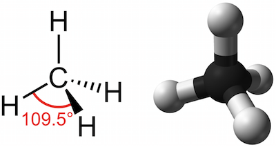
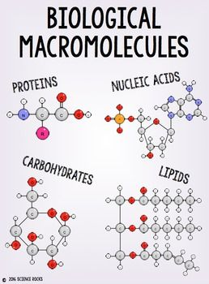
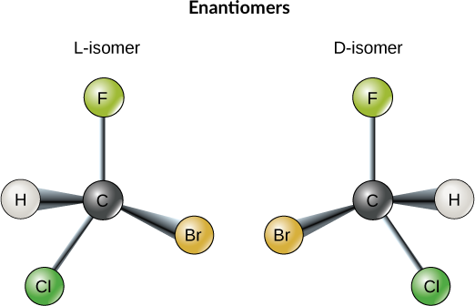
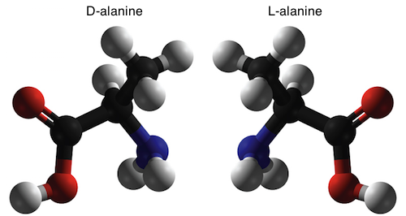
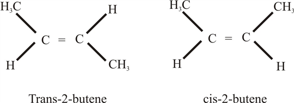
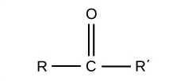
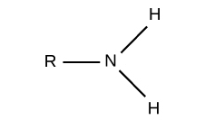
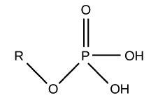

# Carbon

* Carbon 不只常出現在生活中 (pencil, briquettes, diamonds)
* Carbon 更在身體裡佔了 18% 的重量
  * backbone of many important molecules (DNA, RNA, sugars, fats)
  * 這些複雜的 biological molecules 又稱作 **marcomolecules (organic molecules)**
    * 因為他們都包含 carbon atoms

## The bonding properties of carbon

* 因為 carbon-carbon bonds 非常的堅固，所以適合當作 molecular backbones
* 另外 carbon 也有很大的 covalent bonding **capacity**
  * Carbon atom 的原子序為 6 (代表在 neutral 時有 6 protons 和 6 electrons)
  * 6 electrons 分別有 2 個在 inner shell，而 4 個在 valence (outermost) shell
  * 所以 carbon atom 只有 4 個 valence electron ，還有 4 個空間可以和其他 atom 作用
* 舉個例子，在 methane $$(\text{CH}_4)$$ 中，carbon 和 4 個 hydrogen 產生 covalent bonds

## Hydrocarbons

* 只要是全由 carbon 和 hydrogen 組成的 **organic molecules** 都會稱作 **hydrocarbon**
  * 上面例子所舉的 **methane** $$(\text{CH}_4)$$ 就是一種 hydrocarbon
* 在生活中有許多 hydrocarbon 的例子
  * **propane** $$(\text{C}_3\text{H}_8)$$ 應用於燒烤
  * **butane** $$(\text{C}_4\text{H}_{10})$$ 應用於打火機
* 看起來都是非常好的燃料來源
  * 原因是 hydrocarbon 的 covalent bonds 可以儲存大量 energy
  * 透過燃燒來釋放能量 (react with oxygen to form $$\text{CO}_2$$ and water)

* 通常由一個 carbon atom 和四個其他 atoms 所組成的 molecules 都會形成 tetrahedral 的形狀
  * 由 carbon 在正中央，而四個 atoms 向四個完全不同方向散射出去
  * tetrahedral shape = 4 triangular faces
  * 例如 methane $$(\text{CH}_4)$$
* 這是因為生成 bonds 的 electron pairs 互相排斥彼此
  * 所以 pairs 間的 distance 都拉到最遠的距離，形成這樣四面體的形狀

* 大多數的 marcomolecules 不是 hydrocarbons
  * 因為他們雖然有包含 carbon, hydrogen
  * 但還和很多不同的 atoms 組合在一起 (e.g., nitrogen, oxygen, phosphorus)
* 但注意 carbon chain with attached hydrogens 是大多數 marcomolecules 的 **key component** 
  * 所以了解 hydrocarbons 的 properties 能更了解 macromolecules 的 behaviors

## Representing structures of organic molecules

* 以下是幾種方式來表達 organic molecules 的架構
  * 通常會用直線而不用兩點來表達 covalent bonds
  * 也可以簡寫成單字 subscript 數量
  * 甚至使用直線直接表達 carbon chain

# Hydrocarbon structures and functional groups

* gasoline 當中的 hydrocarbons 可以有 4 至 12 的 carbon atoms
  * 這些的 hydrocarbons 有的是 straight line，有的是 branched structure
  * 有的 carbon-carbon bonds 是 single bonds 有的是 double, triple bonds
  * 還有 ring 狀的架構
  * 在 gasoline 的這些不同 hydrocarbons 都會有不一樣的 properties (melting, boiling points)

## Hydrocarbons are diverse

* 單看 gasoline 的例子就可以知道 hydrocarbons 的多樣性
  * differ in length, branched or unbranched, linear or ring shape
  * single, double, triple carbon-carbon bonds
  * 會有相同的 molecular formula 但是完全不同的架構，稱作 **isomer**
* 這些不同的改變使得 hydrocarbons 的 3D shape (**molecular geometry**) 有所不同
  * 在人體中也影響了 DNA, proteins 等 biological molecules 的運作

## Branching, multiple bonds, and rings in hydrocarbons

* Hydrocarbon 的主要部分為 carbon atoms 所組成的 carbon chain
  * Chains 可長可短
  * e.g., ethane 包含 2 個 carbons，而 decane 包含 10 個 carbons
* 這些 chain 不一定是一條線，有可能是任何形狀
  * e.g., decane $$(\text{C}_{10} \text{H}_{22})$$ 的 10 carbons 連成一條線
  * 但有其他相同 molecular formula $$(\text{C}_{10} \text{H}_{22})$$ 的 hydrocarbons 是含有 branches 的
  * 實際上，$$\text{C}_{10} \text{H}_{22}$$ 共有 75 種可能的架構

* Hydrocarbons 還有各種不同的 carbon-carbon bonds (single, double, triple)
  * 分別為 ethane, ethene, ethyne

* Ethane $$(\text{C}_2\text{H}_6)$$
  * C 和 C 是 single bond
  * 有著 2 個 tetrahedron shape (1 個 carbon 為 1 個核心)
  * 重點是可以兩個 tetrahedron **可以旋轉**
* Ethene $$(\text{C}_2\text{H}_4)$$
  * C 和 C 是 double bond (所有的 atoms 都在同個平面)
  * 跟 single bond 不同，double bond 的 molecules 是**無法旋轉**的 !
* Ethyne $$(\text{C}_2\text{H}_2)$$
  * C 和 C 是 triple bond
  * 和 ethene 一樣**無法旋轉**

* Hydrocarbon 也包含多種 ring structure
  * 也就是 carbon 之間形成一個 cycle
  * carbon 間允許有 branches 和 double bonds
* 有些 rings with conjugated atoms 非常 stable
  * 這些 ring 又稱作 **aromatic rings**
  * 常在 amino acids (e.g., hormones, testosterone, estrogens) 看見

## Isomers

* Hydrocarbon 的架構 (molecular geometries) 會直接影響 physical, chemical properties
* 有相同的 molecular formula 但又不同架構的 molecules 稱作 **isomers**
  * isomer 又可以分成 **structural isomers** 還有 **stereoisomers**

### Structural isomers

* Atoms 的連結方式完全不同
  * 例如上圖的 butane 和 isobutane 都是 4 carbons + 10 hydrogens $$(\text{C}_4\text{H}_{10})$$
  * 但有 butane 是 linear
  * 而 isobutane 是 branched
  * 所以他們兩個的 melting, boiling points 是完全不同的
  * butane 適合用作 ligter, torch 的燃料
  * isobutane 用作 refrigerant, spray cans 的 propellant

### Stereoisomers

* Atoms 的連結方式一模一樣，但是方向完全相反
  * Stereoisomers 可以分成兩種 : **enantiomers** 和 **diastereomers**
* Enantiomers 就像 mirror image，enantiomers 間是不可以疊加在一起的

* 上圖是一組 enantiomer pair
  * 兩者都有相同的 molecular formula 且都是由 fluorine, bromine, hydrogen 和 carbon bond 在一起所組成
  * 但兩者是鏡像成對，就像左右手一樣是不能完美疊在一起的

* 大多數的 amino acids (用於組成 proteins)
  * 都包含了 asynmmetric carbon
  * 上圖就是一個包含 2 個 enantiomers 的 amino acid alanine
    * 在 biology 中，通常會用 L/D prefix 來命名兩者
    * 但更精確應該用 R/S 來命名

* 雖然 enantiomers 間看起來非常像，但一對 enantiomers 對生物的影響非常非常不同
  * 例如 D form of ethambutol 可以製成藥片治療 tuberculosis (肺結核)
  * 但是 L form 卻可以致盲
* 又或者某些 enantiomers 只有其中一邊出現在身體中
  * L form of amino acids 用於生產 proteins (但 D form 不常見)
  * D form of sugar glucose 是 photosynthesis 的主要產物 (但 L 幾乎不會出現在自然界)

* 其他不是 enantiomers 的 stereoisomers 就是 **diastereomers**
  * cis-trans isomer 是一個經典的 diastereomer
  * 發生於 atom 或 functional group 錯位在 carbon-carbon double bond 的兩邊
  * 因為 double bond 無法旋轉的關係，導致他們的架構不同

* 例如 2-butene $$(\text{C}_4\text{H}_8)$$ 中的 2 個 methyl groups $$(\text{CH}_3)$$
  * 若都在同一邊，稱作 cis configuration of 2-butene
  * 若在相反邊，稱作 trans configuration

* 在 trans configuration 中 carbon backbone 大多是 linear 的
* 而 cis configuration 中 backbone 多為 bend, kick 的

* fatty acids (脂肪酸) 通常包含 double bonds
  * 也就會有 cis / trans configuration
* Cis fatty acids 在室溫下通常為正常的 oils
  * 因為 backbone 是 bend 的關係，讓 molecules 不會被 pack tightly together
* Trans fatty acids (trans fatty, 反式脂肪) 在室溫下則為固態的脂肪
  * 因為 backbone 相對 linear 關係，molecules pack tightly together

# Functional Group

* Hydrocarbons 很適合作為 combustion fuels 使用
  * 但要組成 living organism 似乎還不夠
* 大部份的 biological molecules 包含非常多 carbon, hydrogen 以外的 atoms
  * 這些 atoms 能夠給予更多樣性的 functionality

* 大多的 biological molecules 由 carbon skeleton 和其他 atoms (oxygen, nitrogen, sulfur, etc) 組成
  * 這些"其他 atoms" 通常會以 **functional groups** 角色出現
  * functional groups 是一些 atoms 組成的 pattern, motif
  * functional groups 會表示出一致的 function (properties, reactivity)
  * 所以 biological molecules = carbon skeleton + many different functional groups
* 最常見的 functional groups 在下表列出
  * 其中 methyl $$(\text{CH}_3)$$ group 是 hydrophobic (nonpolar)
  * 而其他六種 functional groups 皆為 hydrophilic (polar)
  
| Functional Group | Structure                                        | Properties    |
| ---------------- | ------------------------------------------------ | ------------- |
| Hydroxyl         |    | Polar         |
| Methyl           |      | Nonpolar      |
| Carbonyl         |    | Polar         |
| Carboxyl         |    | Polar, Acidic |
| Amino            |       | Polar, Basic  |
| Phosphate        |   | Polar, Acidic |
| Sulfhydryl       |  | Polar         |

* Carboxyl group $$(\text{COOH})$$ 是一個非常 hydrophilic 的 funtional group
  * 可以失去一個 proton 來形成負電的 carboxylate ion $$(\text{COO}^-)$$
  * 所以他除了 polar 還是酸性
  * 通常可以在 amino acids, fatty acids 等 biomolecules 看到他
* Carbonyl group $$(\text{C=O})$$ 則是 less hydrophilic 的 functional group
  * 他是 uncharged 但有 partial positive/negative charges 所以 polar
  * 通常可以在 proteins, peptides, carbohydrates 等地方看到他

* 在表中可以看到 letter R 用來表達一大串的 molecules
  * R 可能是 ethyl $$(\text{CH}_2\text{CH}_3)$$ group
    * 可以跟第一個 entry 形成 ethanol
  * R 也可能拿來表達非常大的 molecule (e.g., protein)
  * R 的用法會在 biology, chemistry 常見到
    * 用來簡化 chemical structures 並只強調重要的部分 (通常為 functional groups !)

