# Intro to cells

牆是"磚"砌成的，人是"細胞"組成的 (standard building block)

* 但細胞不像磚塊無趣，細胞的可能性非常多
  * 有各種形狀、各種功能
  * 還能到處移動
* 各種細胞會扮演各種不同角色，幫助我們成長、生存
  * epithelial cell 負責保護身體的表面，例如皮膚或器官
  * bone cell 負責建構骨骼支撐身體
  * cells of immune system 對抗細菌
  * blood cells 在身體裡四處運送養分及氧氣，並移除 carbon dioxide
* Cell 不只人類擁有，其他動物、植物、甚至細菌都有
  * 雖然會有很大不同，但都會有一些相同的地方

## Scale of cells

雖然我們知道 atom, protein, virus, cell, ... 都是小到肉眼看不到的東西，但他們還是有大小之分 !

* Water molecules : ~0.275 nm (約 10 億分之 1 公尺)
* Hemoglobin (protein) : 5 nm (約 10 億分之 5 公尺) 
* HIV (virus) : 120 nm
* Red blood cell : 6 to 8 μm (micrometer, 約 100 萬分之 7 公尺)
  * 含有 280 million 個 hemoglobin !

## Cell theory

其實到 1600s 根本沒有人知道 cell 的存在

* 因為細胞實在太小了，沒有很強力的 **microscopes** 能夠看到細胞

> * 附帶一提，最適合觀測細胞的是 **light microscope**
> * 而最適合觀測到細胞內部架構的是 **transmission electron microscope**

直到第一個人看到，並且在他的書中命名為 cell

* **Robert Hooke** 這位英國科學家是第一個用他的 microscope 看到細胞這個 microscopic structures
  * 他將看到的一切和命名都寫在他的 *Micrographia* 書中
  * 他看到的細胞是 dead cork tissue
  * 因為外型非常像寺院中僧侣所居住的小房間 (cells of a monastery)
  * 所以就取名為 cell

但 Hooke 所看到的只是一個死掉的細胞

* 第一個看到活著的細胞的是一個荷蘭貿易家 Anton van Leeuwenhoek
  * 他在 1670s 改善了 Hooke 的 microscopes
  * 建立出更強大的 microscopes
  * 這些加強的 microscopes 可以看到一些 single-celled organisms
    * 例如 bacteria, sperm cells
    * 他將這些 cell 稱作 animalcules

儘管如此，還是沒有人相信 cell 是組成動物、植物、細菌最基礎的 building block，直到 160 年後 ...

* 植物學家 Matthias Schleiden 和動物學家 Theodor Schwann
  * 兩人在 1830s 提出了跨世紀的突破理論
* 也就是所有植物和動物的所有部位，都是由 cell 組合而成
* 以及 cells 是可以被其他 cells 所生產出來的

接著德國科學家 Rudolf Virchow 盜用了別人的點子，也就是

* 波蘭科學家 Robert Remak 基於上面兩位所提出的第三個理論
  * 所有的 cells 都是從其他 cells 而來 !!!
  * 這在今日聽起來也是非常匪夷所思的理論

這三點總結起來就是 modern **cell theory**

1. All living things are composed of one or more cells.
2. The cell is the basic unit of life.
3. New cells arise from pre-existing cells.

# Prokaryotic and eukaryotic cells

人體是一個細胞的家，總共有 100 trillion 的細胞在人體中

* 人體其實就是一個 ecosystem
  * 包含了 prokaryotic, eukaryotic cells
* 所有的細胞就是分成了這兩類
  * Prokaryotic (**pro-** : before, **kary-** : nucleus)
    * 目前只有 single-celled organisms (Bacteria, Archaea) 被分類在此
  * Eukaryotic (**eu-** : true)
    * Animals, plants, fungi, protists 是該分類
    * 而他們又是由很多的 eukaryotic cells 組成

Cell 的大小範圍在 0.1 到 100 μm

* 其中 prokaryotic cells 在 0.1 到 5 micrometers (μm)
* 而 eukaryotic cells 在 10 到 100 micrometers (μm)
* 為什麼不能更小 ?
  * 因為細胞必須要放得下需要的元件
* 為什麼不能更大 ?
  * 因為細胞越大越難和外界交換足夠的養分來供給
  * 可以從 **surface-area-to-volume ratio** 看得出來

## Prokaryotic cells

不同的細胞主要還是有四種重要的元件

* **plasma membrane**
  * 幫助細胞分開內部和外部環境的接觸
* **cytoplasm** (細胞質)
  * 包含像果凍的 cytosol，還有一些 cellular structures
  * 通常在 nucleus 和 membrane 之間
* **DNA**
  * 是該細胞的 genetic material
* **Ribosomes**
  * 是一個 molecular machines 用於合成 proteins

上面講的是和 eukaryotes 共同的地方，再來講點相異的地方

* Prokaryote 指的是簡單的 single-celled 生物
  * 沒有 nucleus 和 membrane-bound 的 organelles
  * 內部沒有被切成多個功能的部分，是一個開放空間
* prokaryotic DNA 會在開放空間的最中間 (**nucleoid**)
  * 通常包含了 circular chromosome (single large loop)
  * 下圖是一個 rod-shaped bacterium 剖面

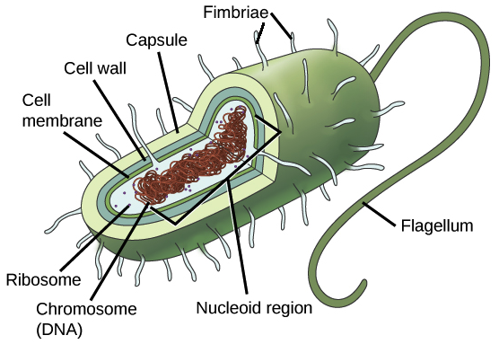

* 一般的 bacteria 含有這些構造 :
  * 用 **peptidoglycan** (肽聚醣) 組成的 rigid cell wall
    * **Cell wall** 保護細胞、維持形狀、避免 dehydration
  * 有的還有用 **carbohydrates** 組成最外層的 capsule
    * **Capsule** 幫助細胞跟當下環境表面接觸
  * 一些外部構造幫助移動細胞，甚至交換 genetic material
    * **Flagella** 像 rotary motors 依樣幫助 bacteria 移動
  * 另外還有跟頭髮很像的 **fimbriae** 用來跟 host cell 或其他表面接觸
  * 有的 bacteria 還有各種不同的桿狀架構 **pili**
    * 有些幫助 bacteria 之間傳遞 DNA molecules
    * 有些也幫助 bacteria 移動

## Eukaryotic cells

如果把 prokaryotic cells 譬喻為比較窄的單人房，那麼 eukaryotic cells 就是合租公寓了吧

* 就像大房子一樣，有浴室、廚房、臥室、客廳一樣
  * Eukaryotic cells 會含有各種不同功能的 **compartments**
  * Compartments 被層層的 membrane 分隔開來
  * 所以每個 compartment 都有獨自的 conditions 進行自己的工作

以下舉幾個常見的 compartments

* **Lysosomes (溶酶體)** 是細胞的回收中心
  * 必須要保持正常的 acidic pH 才能 dispose 細胞垃圾
* **Peroxisomes (過氧化體)** 負責處理一些 chemical reaction
  * 例如 oxidation reactions 和生產 hydrogen peroxide
  * 這兩件是都有可能傷及細胞，所以 comparment 起到很好的保護

就是因為 eukaryotic cell 可以維持多種環境在一個細胞的能力，而 prokaryotes 不行

* 所以 eukaryotic cells 可以比 prokaryotic cells 還能成長好幾倍

Eukaryotic cells 還比 prokaryotic cells 多了幾種重要特徵

* Membrane-bound **nucleus**
  * 在細胞中央被 membrane 包住的洞，是 genetic material 的家
* Number of membrane-bound **organelles**，各種浮在 cytosol 上的 **compartments**
* Multiple **linear chromosomes**
  * 對應到 prokaryote 中的 single circular chromosome

## Plasma membrane and cytoplasm

* Cell 非常簡單來說就是 bag of goo
  * Plasma membrane 就是 bag
  * Cytoplasm 就是 goo
* 但 cell 其實非常精緻，所以 bag 和 goo 也非常複雜
  * Membrane 是包含 lipids 和 proteins 的雙層架構，負責任何東西進出 cell
  * Cytoplasm 不只包含 cytosol，更包含 organelles, structural proteins (skeleton of the cell)

### Plasma membrane

* Membrane 所含的 lipids 是 **phospholipids**
  * phospholipid 由 hydrophilic 的 phosphate head 和兩個 hydrophobic 的 fatty acid tails 組成
  * hydrophilic head 朝外，hydrophobic tails 朝內，自然形成雙層架構
  * 這個 energetically faborable 的雙層架構又稱為 **phospholipid bilayer**

* Protein 會傳過整個 membrane，作為 channels 或 signal receptors 的角色
* 有的 lipids 如 cholesterol 則是控制了 membrane 的 fluidity

Plasma membrane 是 cell 內部和外部的邊界，控制一些 molecules 的通過

* 所以 sugars, water, ions, amino acids 都需要通過 plasma membrane 才能到達 cell 內部
  * 簡單的 nonpolar molecules (e.g., oxygen) 可以直接從 phospholipid 部分通過
  * 較大的 polar, hydrophilic molecules (e.g., amino acids) 必須從 protein channel 通過

Plasma membrane 的 **surface area** 會限制 cell 和周遭環境物質交換的上限

* 某些特別需要物質交換的 cell 的 membrane surface area 就會較大
  * 例如為了吸收養分的 cells 會折成 fingerlike projection 形狀
  * 這些稱為 **microvilli (singular: microvillus)**
  * Microvilli 分布在小腸表面，從食物中吸收養分
  * 因為增加表面積的關係，讓 microvilli 幫助小腸最大化的得到養分

### Cytoplasm

Cytoplasm 在 eukaryotes 和 prokaryotes 中有些微的不同

* 在 eukaryotes 指的是 nucleus 和 membrane 間的所有東西
* 在 prokaryotes 因為沒有 nucleus，所以指的是在 membrane 裡所有的東西

兩者共同有的是 cytosol

* Gel-like 的 **cytosol** 是 cytoplasm 主要物件
  * 組成物是 water-based solution (含有 ions, small molecules, macromolecules)
* 為什麼 cytosol 主要是水組成，但為何會是 Jello-like 的呢
  * cytosol 包含大量的 macromolecules (e.g., proteins) 還有 small organic molecules 懸浮其中
  * 有 glucose, sugars, polysaccharides, amino acids, nucleic acids, fatty acids, ...
  * Ions of sodium, potassium, calcium, ...
  * 很多的 metabolic reaction (e.g., protein synthesis) 也都是在 cytosol 進行

在 eukaryotes 有特別的一些東西在 cytosol 當中

* Membrane-bound organelles
* cytoskeleton (network of fibers)
  * give the cell shape
  * organize cellular components

## Nucleus and ribosomes

汽車、房子、模型，都需要藍圖，人體也有藍圖，不只給了建造的重點，更給了所有建造的步驟

* 這麼重要的資訊一定存在很保密的地方
  * 這正是 eukaryotic cells 所做的事
    * 將 genetic material 存放在 membrane-enclosed 的 nucleus 當中

Eukaryotes 甚至不會讓重要資訊離開 nucleus 中

* Eukaryotic DNA 透過 transcribe (copy) 至 RNA molecules 再離開 nucleus
  * RNA 接著再 cytosol 與 ribosomes 相遇，創造出 proteins

### Nucleus

* **Nucleus** (plural: **nuclei**) 就是 genetic materia (DNA) 的家
  * 可以生成 ribosomes
  * 收集 proteins
  * **chromatin** (纏繞 protein 的 DNA) 儲存在 **nucleoplasm** (gel-like)

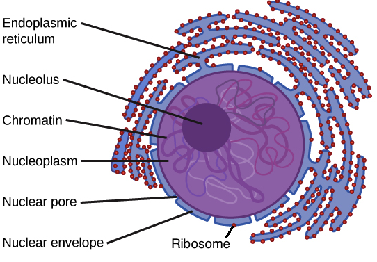

* 包住 nucleoplasm 的是 **nuclear envelope**
  * Envelope 包含 2 層的 membrane (outer & inner)
    * Membrane 又再包含 2 層的 phospholipids bilayer (tails inward)
  * Envelope 的 2 層 membrane 的中間有一個小空間
    * 小空間將會連接到 **endoplasmic reticulum** (membranous organelle)

再來是控制物質進去的部分

* **Nuclear pores** 將 envelope 些微張開，控制物質進出 nucleus
  * 控制進出的開關稱為 **nuclear pore complex**

若用顯微鏡可以看到一點黑點在中心

* **Nucleolus** 產生新的 ribosomes
  * 一些 chromosomes 含有 DNA 片段能夠 encode ribosomal RNA
  * 這類 RNA 和 protein 結合成為 ribosom
  * 在 nucleolus 中，新的 ribosomal RNA 和 proteins 合成出 ribosome 的 subunits
  * 這些 subunits 就會穿過 nuclear pores 移動到 cytoplasm 開始他們的工作

有些 cell 可以多達 6 個 nucleoli (e.g., mouse cell)，而 prokaryotes 沒有半個 nucleus，需要在 cytosol 中製造 ribosomes

### Chromosomes and DNA

了解 nucleus 後來深入了解內部的 DNA

* DNA 主要由 1 至多個 **chromosomes** 組成
  * 一個 chromosome 是非常長的 string 或 DNA loop
  * 一個 chromosome 可以承載非常多 genes
* 在 prokaryotes 中 DNA 通常是單個 circular chromosome (a loop)
* 在 eukaryotes 中則是 linear structures (strings)
  * 每個 eukaryotes 都有特定數量的 chromosomes 在 cells 的 nucleus 當中
    * 例如人類細胞有 46 個 chromosomes
    * 果蠅的細胞只有 8 個 chromosomes

Chromosomes 只有在細胞進行 division 時才可以很好的觀測到

* 所以細胞在生長和維護的階段時
  * Chromosomes 會變成 unwound, jumbled bunch threads
  * 此時 enzyme 就可以介入將 DNA 編譯成 RNA 來利用

不論是 loose 還是 compact 的 chromosomes 都會和 structural proteins 結合在一起

* 例如下圖的 DNA 和 histone 這種 protein 結合在一起
  * 這些跟 DNA 相關的 proteins 幫助 DNA 進入 nucleus
  * 他們也扮演讓 genes 啟動或不啟動的角色
  * 這種 DNA 和 proteins 組合的複雜結構叫作 **chromatin**

* 一個人類細胞的 DNA 通常有 2 m
 * 一個 nucleus 的半徑大約只有 0.006 mm

所以要把整個 DNA 塞進 nucleus 相當於將 40 km 的直線塞到一顆網球裡 !!

### Ribosomes

接下來是用來產生 protein 的重要角色 **ribosomes**

* Ribosome 由 RNA 和 proteins 組成
  * 含有兩個分開的 RNA-protein complexes (small, large subunits)
  * 大的在小的上面，中間夾著 RNA template (mRNA)

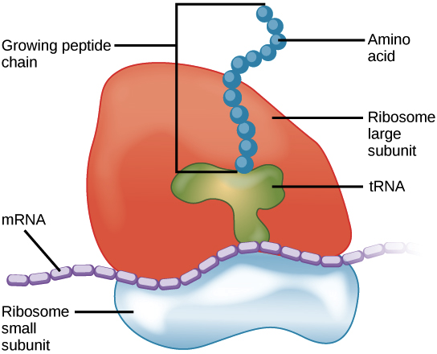

在 eukaryotes 中， ribosomes 是怎麼樣從 nucleus 獲得製造 protein 的指令呢 ?

* Nucleus 中一部分的 DNA (genes) 被轉錄 (transcribed) 成 messenger RNAs (mRNAs)
* mRNAs 從 nucleus 來到 ribosome 並告訴他基因給予製造 protein 的訊息 
  * 例如用什麼特別的 amino acids 序列
* 這一連串的動作叫作 **translation**
* 另外在 prokaryotes 因為沒有 nucleus，所以直接在 cytoplasm 轉錄成 mRNAs 然後直接給 ribosomes

在 eukaryotes 的 ribosomes 可以出現在各種地方

* 例如漂浮在 cytoplasm
* 或是 bound (attach) 在 endoplasmic reticulum 和 nuclear envelope 的外部
  * Nucleus 那張圖的**紅點**就是 bound ribosomes
  * ribosomes 和 endoplasmic reticulum 結合在一起會成為 **rough endoplasmic reticulum**

因為 protein synthesis 是細胞中非常基本且重要的功能，幾乎所有 cell 都有 ribosomes (甚至 bacteria)

* 而某些特別需要產生 proteins 的細胞會有非常大量的 ribosomes
  * 例如 pancreas (胰臟) 為了產生大量 digestive enzymes
  * 所以 pancreatic cells 擁有異常多數量的 ribosomes

# Tour of eukaryotic cell

## The endomembrane system

想像你是 pancreatic cell 要讓自己的 digestive enzymes 離開自己到小腸幫助消化。這件事需要整個 endomembrane system 的幫忙！

* **Endomembrane system** (endo-: "within")
  * 指的是 eukaryotic cell 中一群 membranes 和 organelles
  * 這些東西幫忙修正、打包、運輸 lipids 和 proteins
  * 例如 **nuclear envelope**, **lysosomes** 還有 **endoplasmic reticulum**, **Golgi apparatus**
  * **Plasma membrane** 雖說不算在 cell 內，但也是 system 的一員
    * 幫助前面所說的 pancreatic enzymes 等 secreted proteins 排出細胞
  * 另外 **mitochondria** (粒線體), **chloroplasts** (葉綠體), **peroxisomes** (過氧化體) 不屬於 system

### The endoplasmic reticulum

* **ER** 扮演非常重要的角色，修改 proteins 和合成 lipids
  * ER 包含由 membranous tubules 和 flattened sacs 組成的網路
  * 這些 disc 和 tubule 都是中空的，然後裡面的空間稱為 **lumen**

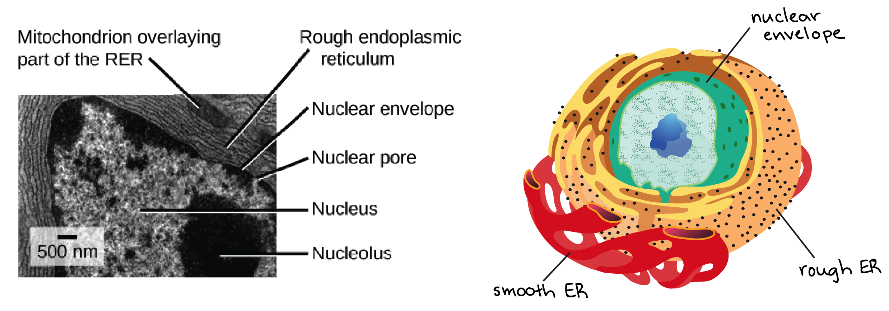

#### Rough ER

前段的 ER 因為一堆 ribosomes 附在上面，所以稱為 **rough endoplasmic reticulum**

* Ribosomes 生產的 protein chains 會被送進 lumen
  * 一些完全送進去並漂浮在 ER
  * 一些固定在 ER 的 membrane 上
* 在 ER 中，proteins 會被 fold 或被修改 (e.g., addition of carbohydrate side chains)
  * 被改變的 proteins 就會到其他 membranes 報到 
    * e.g., membrane of ER, other organelles, secreted from the cell
  * 沒有待在 ER 的 proteins 將會被打包成 **vesicles** 送至 Golgi apparatus 
* Rough ER 還可以製造 phospholipids 供其他 membranes 使用
  * 一樣是使用 vesicle form 傳送

一些 cell 的工作主要為 secrete protein 就會有大量的 rough ER (e.g., liver cell)

#### Smooth ER

接續 rough ER 的就是 **smooth endoplasmic reticulum**

* smooth ER 上幾乎沒有 ribosomes，而主要的功能為
  * 合成 carbohydrates, lipids, steroid hormones
  * 對藥物或毒物進行解毒
  * 儲存 calcium ions (sarcoplasmic reticulum in muscle cell)

rough ER 中也有一些 "smooth" patches 用來作為 vesicles 的出口，這些稱為 **transitional ER**

### The Golgi apparatus

從 ER 出來的 vesicles 在抵達終點之前還要再通過 **Golgi apparatus**

* Vesicle 中的 lipids, proteins 需要被 sorted, packaged, tagged 到正確的格式，這些動作就是在 golgi apparatus 中進行

* Golgi apparatus 有兩面，負責接收 vesicle 的為 **cis face**
  * vesicle 和 cis face 結合，將內容物都丟進 Golgi apparatus 的 lumen 當中
* 另一面則為 **trans face**
  * proteins, lipids 在 Golgi apparatus 中被改造完成
    * 加入或移除 sugar 或加入 phosphate groups 當作 tags
  * 改造過的 proteins 將進行排序然後再次打包成 vesicle 從 trans face 送出

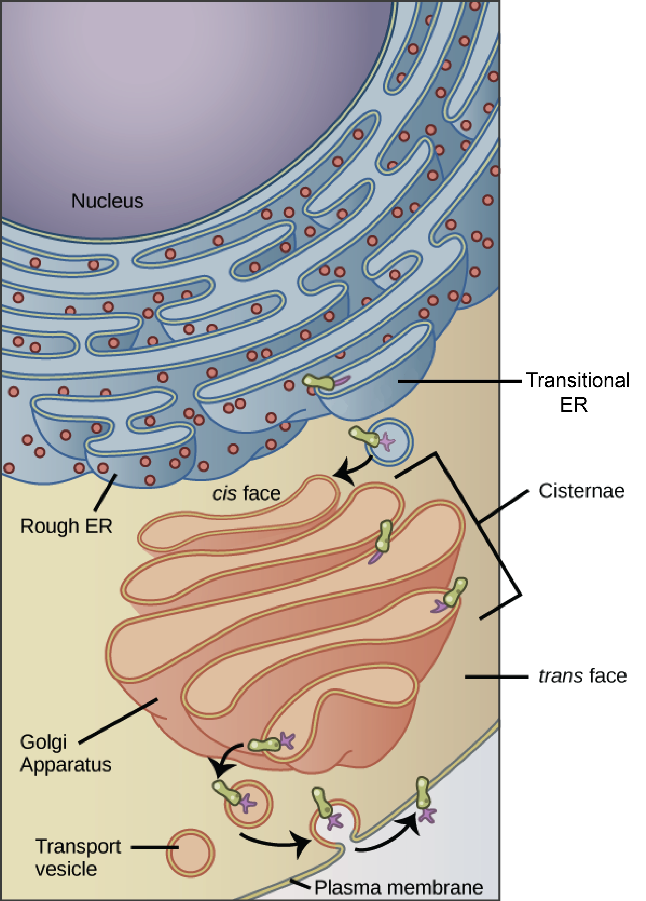

從 Golgi 出來的 vesicles 終於可以用了

* 有的送至 cell 內部的地方使用
  * 例如 lysosome, vacuole
* 有的則到外圍和 plasma membrane 結合
  * 將一些 secreted proteins 釋放到 cell 外作用

一些需要 secrete 大量 proteins 的 cell 會有很多 Golgi stacks

* 分泌 digestive enzymes 的 salivary gland cells
* 分泌 antibodies 的 immune system

植物的 Golgi apparatus 也會製造 polysaccharides 用於 cell wall

### Lysosomes

Lysosome 包含 digestive enzymes 作為 animal cell 的回收場

* Lysosome 將不要的分子架構拆解重新使用
* 上面說的，一些離開 Golgi 的 vesicles 會來到 lysosome

Lysosome 還能夠分解外部進入 cell 的垃圾

* 例如人類免疫系統的 macrophages (某種 white blood cell)
  * 會進行 **phagocytosis** (吞噬作用)
  * 一段在 macrophages 的 membrane 會內陷 (invaginates)
  * 接著如下圖一樣吞噬 pathogen

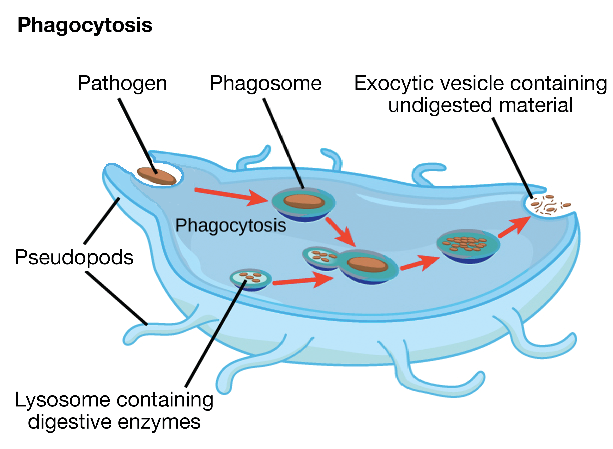

#### Peroxisome

這邊額外討論一下非 endomembrane system 的 peroxisome

* Peroxisomes 和 lysosomes 
  * 一樣負責分解並中和細胞中的 molecules
  * 並且兩者的形狀都很像

但 peroxisome 有獨特的一些特性

* Peroxisome 的 enzymes 通常會涉及 oxidation reactions
  * 也就是產出 hydrogen peroxide $$(\text{H}_2\text{O}_2)$$ by-product
* 這些 enzymes 負責分解的是 fatty acids 和 amino acids
  * 另外也會解毒進到身體中的毒素
  * 例如 liver cell 的 peroxisomes 能夠解毒 alcohol

### Vacuoles

植物多了一個跟 lysosome 很像的 organelle 稱為 **vacuoles**

* Vacuole 儲存水和廢物，隔離危險的物質
  * 其中的 enzymes 一樣能分解廢物 (macromolecules, cellular components)
  * 能進行 water balance
  * 儲存一些 toxins, pigments 等 compound

## Mitochondria and chloroplasts

假設你吃了花椰菜，你要怎麼從他得到能量來運動，花椰菜又為什麼會有能量 ?

這必須要牽扯到兩個重要的 organelles : mitochondria 和 chloroplasts

* **Chloroplasts** 只存在於植物細胞中，將得到的陽光能量轉化成 sugars (透過 photosynthesis)
  * 這些 sugars (fuel molecules) 存在 plant's tissues
* **Mitochondria** 是細胞中的"發電所"，將 fuel molecules 分解，然後幫助人類吸收養分 (透過 cellular respiration)

> **Endosymbiotic theory (共生體學說)**
> * 這兩個 organelles 的起源被認為是在古代和一些細菌共生而成
> 
> 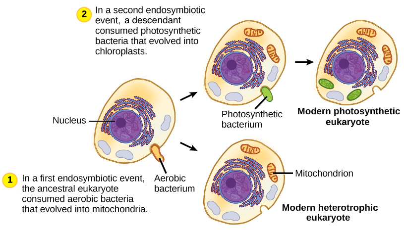

### Chloroplasts

* Chloroplasts (葉綠體) 可以在 cytosol 中被找到
  * 是 disc-shaped 的 organelles
  * membrane 包含 **outer** 和 **inner**，中間夾著 **intermembrane space**
  * 裡面包含了 **thylakoids** (類囊體，含有 membrane 的膠囊)
    * thylakoid 的 membrane 包含可以捕獲光的複合物
      * 這些複合物包含了 **chlorophyll** (葉綠素，讓植物變綠色的顏料)
    * thylakoid 是中空的，裡面的空間稱為 **thylakoid space (lumen)**
  * 這些 thylakoids 疊成了 **grana** (singular: **granum**)
  * 漂浮在周圍的液體為 **stroma**

### Mitochondria

* **Mitochondria** (singular: **mitochondrion**) 的工作是穩定輸出 ATP
  * 利用 fuel (e.g., sugar) 產生 ATP 的行為稱為 **cellular respiration**
  * 而這些過程發生在 mitochondria 當中

Mitochondria 一樣漂浮在 cytosol 中

* Mitochondria 是 oval-shaped 的 organelles
  * 有兩個 membranes
    * 一個是把整個 mitochondrion 包覆住的 membrane (**outer**)
    * 一個是在內層把 cristae 包覆住的 membrane (**inner**)
  * **Cristae** 指的是為了增加表面面積的突起物
    * Cristae 原本被想像為 broad, wavy folds
    * 但現在被認為應該是 long carven 的形狀

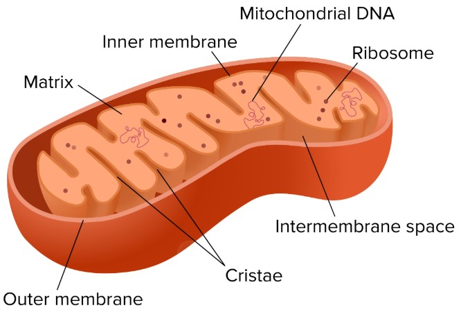

 * 兩個 membranes 之間是 **intermembrane space**
 * Inner membrane 中被分隔的 compartment 稱為 **mitochondrial matrix**
  * Matrix 中包含 DNA 和 ribosomes
  * multi-compartment 架構方便進行 cellular respiration
    * 讓不同的 "room" 能夠有不同的 concentration of molecules

雖然 mitochondria 都可以在動物和植物多數的細胞被找到，但還是會依照能量需求有所不同

* Muscle cells 需要非常多的能量，所以 cell 中的 mitochondria 非常多
* Red blood cells 只專注於運送氧氣，所以 cell 中**沒有任何**的 mitochondria

## Cytoskeleton

細胞就像人體的器官一樣，需要各種 skeleton 支撐

* 支撐細胞的 skeleton 稱為 **cytoskeleton**
  * 不只支撐 plasma membrane 賦予整個細胞形狀
  * 更負責正確的布置各種 organelles 的位置
  * 提供 vesicles 移動路徑
  * 多數的 cytoskeleton 也幫助細胞移動

在 eukaryotes 中有三種 protein fibers 存在於 cytoskeleton:

1. microfilaments
2. intermediate filaments
3. microtubules

### Microfilaments

* Microfilaments 是三種 fiber 最窄的一個
  * 他的半徑只有 7 nm
  * 他是由很多 protein 的 monomer (**actin**) 所組成的 double helix
    * 所以又稱為 **actin filaments**
  * 他有 directionality 也就是兩邊的 end 不同

Microfilament 在細胞裡有幾個重要工作

* 幫助 myosin 這類 motor protein 移動的路徑
* 幫助 cell division
* 幫助 muscles contraction
* 能快速集中，幫助細胞移動 (例如免疫系統的白血球移動)
* 在 cytoplasm 周圍與 plasma membrane 連接，穩定細胞架構跟形狀

### Intermediate filaments

* Intermediate filament 的半徑約為 8 到 10 nm
  * 由多個 fibrous proteins 組成的 strands 組合而成

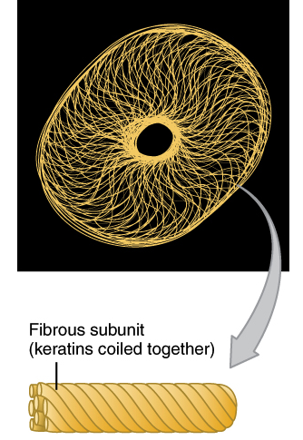

* Intermediate filaments 的種類非常多 (不同 protein 組成)
  * 例如由 keratin 所組成的 intermediate filaments
  * 常見在 hair, nails, skin

Intermediate filaments 不像 microfilaments 可以快速集中又散開

* Intermediate filament 通常是不變的
  * 所以主要工作是維持細胞的張力
  * 保持細胞的形狀和 nucleus 等 organelles 的位置

### Microtubules

* Microtubules 是三類 fiber 中最大的一種
  * 他的半徑能到 25 nm
  * 主要由 tubulin proteins 組成一個空心吸管狀的管子
  * 每個 tubulin proteins 又包含兩種 (alpha, beta- tubulin)

Microtubules 的特性和 microfilaments 大同小異

* 能夠快速集中的 dynamic structure (靠著 add, remove tubulin)
* 擁有 directionality
* microtubules 主要幫助細胞承受 compression force

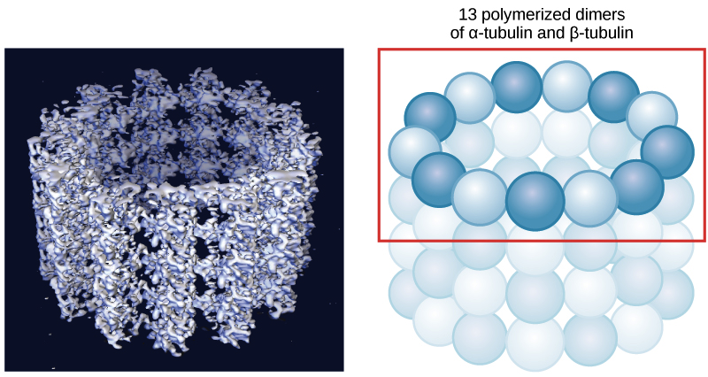

Microtubules 也扮演了非常多的角色

* 提供 kinesins, dyneins (motor proteins) 移動管道
  * 移動細胞內的 visicles
* 在 cell division 期間組合成 **spindle**
  * 負責將 chromosomes 分離

#### Flagella, cilia

Microtubules 還是組成 flagella 和 cilia 的重要元件

* **Flagella** 是很長的 hair-like structure
  * 接在細胞後端，幫助整個細胞移動 (e.g., sperm)
* **Cilia** (singular: cilium) 也是幫助移動，但通常遍布細胞表面
  * 例如上呼吸系統的細胞，他們的 cilia 幫助移動 dust, particles 到鼻孔

Flagella 和 cilia 的共同點有以下幾點

* 9 對 microtubules 排列成圓形
  * 2 個 microtubules 則在中間
  * 形成 9+2 的環
* 有 dyneins 這個 motor proteins 在 microtubules 移動
  * 使得 flagella 和 cilia 跳動 (beating)
* 在兩者的底部有 **basal body** 存在
  * basal body 一樣由 microtubules 組成，負責集合 cilium 或 flagellum

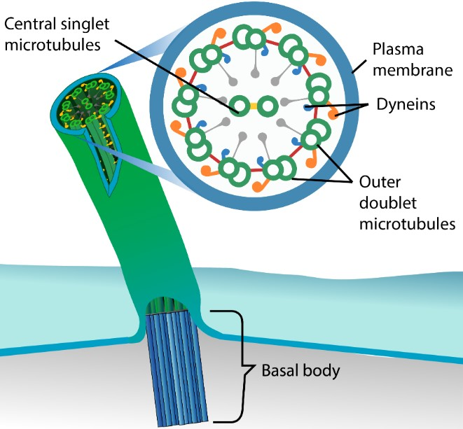

# Extracellular structures and cell-cell junctions

我們花了很多時間在觀察 cell 的內部，但外部呢 ?

## The extracellular matrix and cell wall

植物細胞有堅固的 cell wall 而動物細胞則和周圍的細胞互相形成 meshwork (extracellular matrix)

### Extracellular matrix of animal cells

* 有的 animal cell 釋放一些物質 (protein **collagen**，膠原蛋白) 到細胞外部的空間
  * 釋放的 collagen 會和 carbohydrates 組合形成複雜的 meshwork
  * 這些外部的 long fibers 又叫做 collagen fibrils

這些 collagen proteins 非常重要，讓 tissues 的架構能夠穩固

* 在 extracellular matrix 中
  * Collagen fibers 會和 **proteoglycans** (carbohydrate-bearing) 交織在一起
  * extracellular matrix 會直接透過 **integrins** connector 和最近的 cell 連接
    * integrins 被嵌在 plasma membrane 上面
    * integrins 上有 **fibronectin** 作為外部 protein 和 integrins 的橋樑
    * integrins 在內部會和 cytoskeleton 連接起來

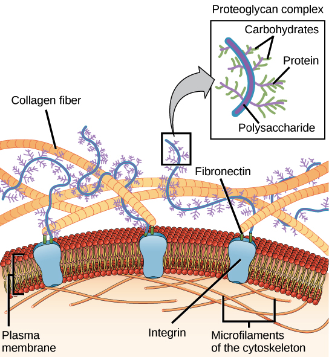

Integrins 幫助細胞架在 extracellular matrix 上面，進一步的說，integrins 幫助細胞感知外部環境，並做出適當的訊號跟反應

### The cell wall

植物沒有 collagen 可以維持細胞間的組織，但有 cell walls 維持細胞的架構和形狀

* Fungi, protists, most prokaryotes 幾乎都有 cell walls
* Cell wall 是由 cell 所排出的 molecules (**cellulose**，纖維素) 所組成
  * Cellulose 是 glucose units 所組成的 polysaccharide
  * cellulose 集合再形成 microfibrils 的 fibers

* 除了 cellulose 外，還有許多 polysaccharides 常見於 cell wall
  * 例如 **hemicellulose**, **pectin**
* 最上層的 **middle lamella** 則負責 cell walls 之間的穩定

## Cell-cell junctions

在蓋房子時，房間之間到底要怎麼處理呢 ? 細胞之間也有這個問題 !

* 要直接開一個通道直接連接鄰居嗎
* 要加強細胞之間的關係，強化整個 layer 嗎
* 還是建立 tight seal 避免水通過整個 tissue

Junctions 就是為了解決這些事情的專家，而且有很多種 junctions

### Plasmodesmata

植物的 cell walls 之間會有特殊的 junctions 叫做 **plasmodesmata** (singular: **plasmodesma**)

* Cytoplasm 的物質可以透過這個洞互相交換
* 一些較小的 molecules 可以順利的透過 passive diffusion 通過這個管道
* 一些較大的 (e.g., proteins)，plasmodesmata 可能會選擇性的撐大管道來讓他們通過

### Gap junctions

**Gap junctions** 是動物版的 plasmodesmata，讓細胞可以交換 water, ions, 還有一些物質。但其實和 plasmodesmata 有些差異

* 在脊椎動物中，六個 membrane proteins (**connexins**) 組合成一個 **connexon**
  * connexons 為甜甜圈形狀的架構
  * connexons 會連接兩個相鄰的 animal cells
* 在無脊椎動物中，也會有類似的 gap junctions，但用的 proteins 叫做 **innexins**

Gap junctions 主要應用在 cardiac muscle

* Heart muscle cells 之間應用 gap junctions 來傳遞 ions，起到讓 cell 之間同時收縮的效果

### Tight junctions

**Tight junctions** 不提供 cytoplasmic connections，而是提供 watertight seal

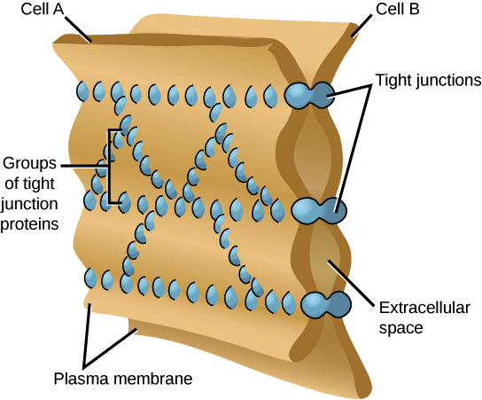

* Cells 之間透過 tight junction proteins group (claudins) 緊密湊在一起
  * Groups 之間排成 strands 形成 branching network
* Tight junctions 目的是防止水分從 cells 間流失
  * 讓 cells 整層形成無法穿透的屏障 (e.g., cells those lining an organ)
  * 例如膀胱的 epithelial cells 透過 tight junctions 防止尿液洩漏

### Desmosomes

一些動物細胞間還會有 **desmosomes** 幫助連接 epithelial cells 不被扯斷

* Desmosomes 通常由複雜的 proteins 組成 (e.g., **Cadherins**)
  * Cadherins 出現在 membrane 中，將兩個 cells 的 membranes 連結起來
  * Cadherins 透過 cytoplasmic plaque (下圖紅色部分) 一路連接到內部的 intermediate filaments

Desmosomes 讓器官、組織等 (cardiac muscle, skin)，能夠拉伸並且保持 unbroken 的樣子
