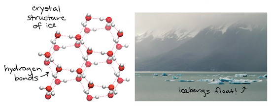
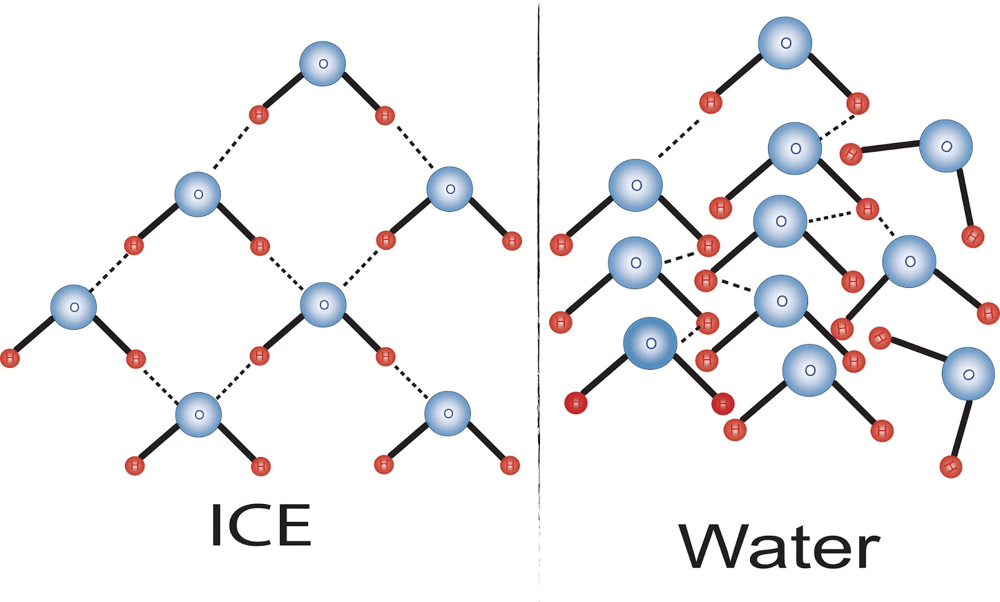

# Water

* 大多動物甚至細菌都是由水組成
* 水能夠溶解非常多的 polar 和 charged molecules
* 水有 cohesion (和自己結合) 還有 adhesion (和其他分子結合) 的特性
* 水有 high heat capacity, heat of vaporization, ice (less dense than liquid) 等特性
* 水能有這麼多特性都跟他 polarity 和 hydrogen bonds 有關

## Polarity of water molecules

* Water molecule 有兩個 hydrogen atom 和一個 oxygen atom
* 因為 oxygen 有較高 electronegativity, 讓他偏向 hog 兩個 electrons
  * 所以 oxygen end 有 partial negative charge $$(\delta^-)$$
  * 而兩個 hydrogen end 有 partial positive charge $$(\delta^+)$$
* Water molecule 形狀呈下圖樣式，像一個 tetrahedron

## Hydrogen bonding of water molecules

* 多虧 polarity，水分子之間非常喜歡互相吸引
  * 微負極的 hydrogen 去和隔壁老王微正極 oxygen 相互吸引
* 這些吸引關係就是較弱 (weak) 的 **hydrogen bonds**
* 水分子還會和其他 polar molecules 相互吸引並變成 ion
  * 有些 polar 物質容易和水作用並溶解於水的稱他們 **hydrophilic**
    * 例如食鹽 (NaCl)
  * 而 nonpolar 物質不會和水作用且不易溶解的稱他們 **hydrophobic**
    * 例如己烷 (hexane)

## Solvent properties of water

* **Solvent** 指的是某些物質 (e.g., 水) 能將其他物質溶解
  * 而能被溶解的物質就稱 **solute**
  * 能夠良好將 solvent, solute 一起混合的現象稱 **solution**
    * 大部分的 life chemistry 皆為 **aqueous solutions**
* 水因為 polarity, hydrogen bonds 的關係，是非常好的 solvent
  * 有時又被稱為 "universal solvent"
  * 這樣講有點不對，因為水比較偏向溶解 ions, polar molecules
  * 不易溶解 nonpolar molecules

> * 複習 : Polar 指的是 neutral, uncharged
>   * 但 asynmmetric internal distribution of charge
>   * 有 partially positive, negative regions

* 從上圖看到，水的 O 帶負電 H 帶正電的 polarity
  * 讓水有辦法和 polar molecules, ions (NaCl) 進行 electrostatic interactions
  * 可以看到正電 Na 被負電 O 圍繞，負電 Cl 則被正電 H 圍繞
* 當非常多的水分子和 solute 作用於 aqueous solution 時
  * 水和物質間的圍繞，會產生一種叫 **hydration shell** 的 3D sphere
  * 該 shell 會讓 particles 均勻的分解到水中
* 所以一些 nonpolar (e.g., oil) 就不會和水產生 hydration shell
  * 也就不會溶解於水中

## Cohesion and adhesion

* Cohesive, Adhesive forces 對於非常多 water-based process 的 biology 十分重要
  * 例如水往樹上跑 (capillary action)
  * 昆蟲在水面行走 (surface tension)

### Cohesion of water

* 水分子之間會互相吸引，稱為 **cohesion**
  * 這是因為水分子間的 hydrogen bonds
  * 常見例子是水向下滴時的水滴狀
* 另一個例子是 **surface tension**
  * 想像容器的最上方的水，因為上方就是空氣 $$(\text{N}_2)$$
  * 空氣沒辦法和水吸引，所以最上方的水分子只能互相吸引
  * 所以他們的 hydrogen bond 比下方的水還要強

### Adhesion of water

* Water 雖有強大的 cohesion 特性，但在特定情況也會去貼近其他 molecules
  * 這種去和其他 molecules 互相吸引的特性稱為 **adhesion**
  * 例如玻璃杯中上緣的水，會呈現 concave meniscus 的特性
  * 因為水分子被兩側玻璃中的分子吸引 (polar of glass is greater than water)
* 另一個例子是 **capillary action**
  * 水分子被玻璃管吸引，並且往上爬

## Temperature and state changes in water

* 水分子中的 Hydrogen bonds 造成了許多的現象
  * effectiveness of evaporative cooling
  * low density of ice
  * temperature changes, freezing, vaporization

### Solid, liquid, and gas

* 水在三種狀態下都有獨特的 chemical characteristics
  * 這和 hydrogen bond 有非常大的關係
  * 水的三種形態的特徵跟生物學息息相關
* 當水在液態時
  * Hydrogen bonds 被重複組成又分開
  * 原因是來自 heat 造成的 energy of motion (kinetic energy)
* 當溫度變高 (boiled)
  * kinetic energy 將 hydrogen bonds 完全破壞
  * 使 water molecules 逃到空氣中
  * 這就是我們看到的 water vapor, steam
* 當溫度變低 (freeze)
  * water molecules 透過 hydrogen bonding 成結晶的形狀
  * 也是因為幾乎沒有 heat energy 能破壞 hydrogen bonds 了
  * 這些因素讓 ice 跟 liquid water 比起來較不密集 (less dense)

### Density of ice and water

* 水在固態時，分子間的距離會被推的更遠
  * 也就是當水結冰時 water 會 expand 
* 水以外的 liquid 因為溫度下降，所以 molecules 就不會被 knetic energy 破壞
  * 這時候固化 (solid)，變得比 liquid 更加 pack tightly, greater density
* 水是例外，在固化時，將有 lower density
  * 因為 ice less dense 的特性，所以讓他能夠浮在 liquid water 上

* 因為 freeze 會讓體積變大，所以物質的內容物將會衝破表層
  * e.g., soda bottle cracking in the freezer

### Heat capacity of water

* 要讓水的溫度上升需要大量的 heat
  * 要用來破壞 hydrogen bonds
* 我們稱水有非常高的 **specific heat capacity**
  * 這個 capacity 就是計算物質 1 克需要多少 heat 來升上 1 度
  * 而要把 1g 水升 1 度所需的 heat 又稱作 **calorie**
* 因為水有 high specific heat capacity
  * 水能讓溫度的變化最小化
  * water's capacity is five times greater than sand
  * land cools faster than sea after sunset
  * warm-boolded animals distribute heat through their bodies

### Heat of vaporization of water

* 水同樣需要大量 heat 讓水蒸發
  * 我們稱水同樣有非常高的 **heat of vaporization**
  * 1g 的水變成氣體所需的 heat
  * 通常 water's heat of vaporization 在 540 cal/g at 100 °C
* 水分子離開的表面會變得 cooler
  * 這個現象稱作 **evaporative cooling**
  * 因為最高的 kinetic energy 消失在蒸發中，原本的水分子能量變少溫度變低
* 所以人類的汗有 99% 的水，在蒸發時會降溫身體，保持溫度平衡

# Acids, bases, and pH

* 我們都知道酸和鹼，但到底要怎麼真正定義他們倆，以下是簡短答案
  * 酸 : 高濃度的 hydrogen ions $$(\text{H}^+)$$，高於純水
  * 鹼 : 低濃度的 hydrogen ions $$(\text{H}^+)$$，低於純水

## Autoionization of water

* Hydrogen ions $$(\text{H}^+)$$ 會自動在純水中小機率的生成出來
  * 透過 dissociation (ionization) 生成，又稱作 **autoionization** of water
    * l = liquid
    * aq = aqueous solution (water-based)

$$
\text{H}_2\text{O} (\text{l}) \rightleftharpoons \text{H}^+ (\text{aq}) + \text{OH}^- (\text{aq})
$$

* 式子中，水有小機率分解產生相同份量的 hydrogen ions $$(\text{H})^+$$ 和 hydroxide ions $$(\text{OH}^-)$$
  * 因為 H 的 electron 被 O 吃掉，H 剩一個 proton 變成正電，成為 hydrogen ions
  * hydroxide ions 會保持不變飄在水中
  * 但 hydrogen ions 會去跟其他水分子結合，得到 hydronium ions $$(\text{H}_3\text{O}^+)$$

* 所以這個小機率分解的機率到底有多小
  * 在純水時，分解機率為 $$1\times 10^{-7} \text{ Molar}$$ (moles per liter)
  * 而一公升純水中的水分子約有 $$3,460,000,000,000,000,000,000,000^{2,3}$$
  * 所以 autoionized water molecules 要在純水中出現的機率非常的低

## Acids and bases

* 我們可藉由和純水相比的 hydrogen ion 濃度來決定溶液是酸還是鹼
  * 當 $$\text{H}^+$$ 濃度高於純水時是 acidic solution
    * greater than $$1\times 10^{-7} \text{ M}$$
  * 當 $$\text{H}^+$$ 濃度低於純水時是 basic (alkaline) solution
    * less than $$1\times 10^{-7} \text{ M}$$

* 因為這個表達法太難記了，所以科學家想出 pH 來表達 hydrogen ion 的濃度
  * pH 取濃度的 negative log
  * $$\text{pH} = -\log_{10}(\text{concentration of H}^+)$$

* 所以你用純水的濃度算可以得到 pH = 7
  * $$-\log_{10}(10^{-7}) = -(-7) = 7$$
  * known as **neutral pH**
  * 身體裡大多的血、組織液都是 neutral pH

* acid 會增加 hydrogen ions $$(\text{H}^+)$$ 濃度，pH 值降低
  * 因為會多分解出 hydrogen atoms 並 donate 自己給其它水分子
* base 則會減少 hydrogen ions $$(\text{H}^+)$$ 濃度，pH 值增加
  * 因為會多分解出 hydroxide $$\text{OH}^-$$，迅速的移除掉 hydrogen ions

* 酸性越強，便越快分解產生 $$\text{H}^+$$
  * e.g., hydrochloric acid $$\text{HCI}$$ 在水中能完美分解成 hydrogen 和 chloride ions，所以讓他成為強酸
  * tomato juice, vinegar 則沒辦法像鹽酸一樣很好的分解，所以是弱酸
* 鹼性越強，則是越快分解產生 $$\text{OH}^-$$ 可以吸收 $$\text{H}^+$$
  * e.g., sodium hydroxide $$(\text{NaOH})$$ 是在水中能完美分解的強鹼

## The pH scale

* 用來排名 solution 的 **acidity** or **basicity** (**alkalinity**)
* 因為是使用 logarithmic，所以 1 pH 的改變是 10 倍的 $$\text{H}^+$$ 濃度改變
* 大於 7 的視為 acidic，小於 7 的視為 basic (alkaline)
* 有可能出現超出 0-14 範圍的液體

* 人類的 cell (6.8) 和 blood (7.4) 都接近中性
* 雖然極端的 pH 通常對人體有害，但 stomach acid 是非常酸性的 (1 to 2)
  * 胃是怎麼解決這個問題 ?
  * 答案 : Disposable cells
  * 胃中直接接觸胃酸和食物的細胞，通常會在 7 至 10 天就會被新的取代掉

## Buffers

* Buffers 會幫人類保持血液或體液的 pH 值範圍，避免瞬間改變
  * 當有太多 $$\text{H}^+$$ ions 時，buffer 會吸收他們，讓 pH 值上升
  * 當 $$\text{H}^+$$ ions 太少時，buffer 會將自己的 $$\text{H}^+$$ 捐出來，pH 下降
* Buffers 通常是一個 **conjugate acid-base pair**
  * 例如人體有一個維持血液 pH 的 buffer 他包含 carbonic acid $$(\text{H}_2\text{CO}_3)$$ 還有他的 conjugate base 即 bicarbonate ion $$(\text{HCO}_3^-)$$
  * 當 carbon dioxide 進入血液和水組合時會形成 carbonic acid
    * 通常是 carbon dioxide 經過 muscles, lungs 在血液的形態
    * 在 muscles 生成，在 lungs 又轉回水和 $$\text{CO}_2$$ 當成廢物排掉

* 如果有太多的 $$\text{H}^+$$，式子就會被推向**右邊**
  * 透過 bicarbonate ions 吸收 $$\text{H}^+$$ 來形成 carbonic acid
* 同樣的，$$\text{H}^+$$ 若太少，式子就會被拉回**左邊**
  * carbonic acid 分解成 bicarbonate ions，然後 donate $$\text{H}^+$$ 給身體
* 如果沒有這些 buffer system，那麼人體的 pH 將會亂七八糟，無法存活