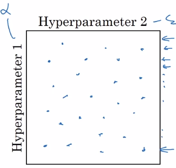
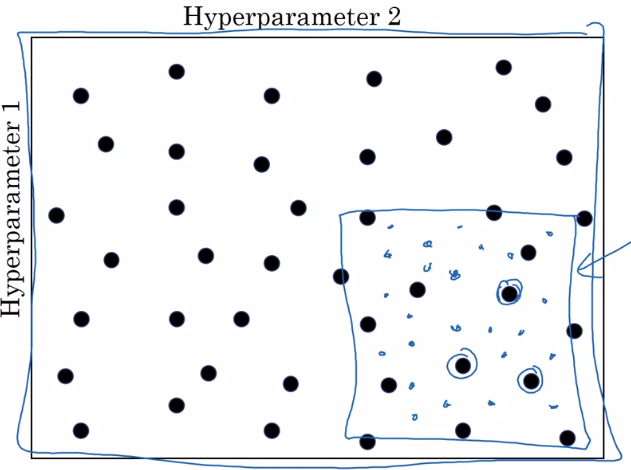

# Hyperparameter Tuning

* 下面來 ranking 一下目前所出現過的 hyperparameters 重要度
* 最重要
  * Learning rate $$\alpha$$
* 第二重要
  * Momentum parameter $$\beta \approx 0.9$$
  * Number of hidden units $$n^{l}$$
  * Mini-Batch size
* 第三重要
  * Number of layers $$L$$
  * Learning rate decay $$\text{Decay-rate}$$
* 不怎麼需要調整
  * Adam parameters $$\beta_1, \beta_2, \epsilon$$

## Tunning Process

* 我們可以一次測試多種 hyperparameters 的組合
* 但不要使用 grid 當作測試方法
  * 假設你的 (x, y) 選用最重要跟最不重要的 $$(\alpha, \epsilon)$$
  * 那麼你用 grid 方式等於只是在測試五種 $$\alpha$$ 而已

* **隨機選擇**測試組合
  * 這是相對不錯的測試方法

* **Coarse to fine**
  * 基於隨機選擇，在測試時順便聚焦到測試結果不錯的區域，繼續測試該區域

## Appropriate Scale for Picking Hyperparameters

* 在隨機選取 hyperparameters 時要注意數值的區間 scale
* 例如隨機選取 layers 或 units，線性區間是非常合理的事
  * n = [50, 100], L = [2, 4]
* 但在選取 $$\alpha, \beta$$ 時，不同區間代表的意義不同
  * 例如 $$\beta$$ 從 0.9 增加至 0.9005 幾乎沒影響
    * 依然是在取大約前 10 個值的平均
  * 但是 $$\beta$$ 從 0.999 增加至 0.9995
    * 代表原本取前 1000 個值的平均
    * 變成取前 2000 個值的平均
* 所以對這些 hyperparameters 必須先依區間拆分，然後再從每個區間隨機取值
* $$\alpha$$ 拆成 0.0001, 0.001, 0.01, 0.1
* $$\beta$$ 取 $$1-\beta$$ 然後像 $$\alpha$$ 一樣拆成 0.1, 0.01, 0.001 

## Practices

* 考慮數據、伺服器等環境變化，最好每隔幾個月就要更新你的 hyperparameters，來獲得當前最好的模型
* Deep learning 中，hyperparameters 可能可以跨領域設定，所以時常關注不同領域的應用可以獲得靈感
* 在訓練模型時，有兩種方法
  * Panda (babysitting one model)
    * 硬體有限、模型困難，所以無法一次測試大量模型時採用
    * 快速建置、開始測試、不斷調整參數
    * 就像熊貓一樣專心的照顧自己小孩
  * Caviar (training many model parallelly)
    * 有足夠硬體、自己足以應付多個模型
    * 一次平行測試多種 hyperparameters 的結果，並挑選最好的
    * 就像魚一次產下上億個魚卵，看看能不能有很棒的小孩出現

# Batch Normalization (BN)

* Batch Normalization (BN) 有許多好處
  * 訓練速度提升
  * 快速尋找 hyperparameters，所以尋找範圍更加旁大
  * 能夠使 NN 不會受 hyperparameters 影響，更加穩定
* 在先前我們學過 [Normalize input](optimization.md)
* 那我們能不能把這個方法，也運用在每個 hidden layers 的 activation units ($$A^{[l]}$$) 呢 ?
  * 答案是可以的，而且能夠加速 $$W^{[l+1]}, b^{[l+1]}$$ 的訓練
  * 實作時通常會 normalize $$Z^{[l]}$$，實作如下
    $$
    \begin{aligned}
    \mu &= \frac{1}{m}\sum_i z^{(i)}\\
    \sigma^2 &= \frac{1}{m}\sum_i (z_i - \mu)^2\\
    z_\text{norm}^{(i)} &= \frac{z^{(i)}-\mu}{\sqrt{\sigma^2+\epsilon}}
    \end{aligned}
    $$
  * 此時所有新的 $$z^{(i)}$$ 的 mean = 0, variance = 1
  * 但我們不想讓每個 $$z^{(i)}$$ 都一樣是 mean = 0, variance = 1
    * 以 sigmoid 為假設，這樣 normalize 後，每一個 $$z^{(i)}$$ 都會在 sigmoid 的 linear 區間
    * 將會不利於訓練 non-linear neural network，進而得到不好的模型
  * 所以我們再次計算
    $$
    \tilde{z}^{(i)} = \gamma \times z_\text{norm}^{(i)} + \beta
    $$
    * 這個 $$\gamma, \beta$$ 跟 $$w, b$$ 一樣都是 parameters，可以隨著 gradient descent 更新
    * 最終這個 $$\tilde{z}^{(i)}$$ 就可以取代 $$z^{(i)}$$

## Adding BN to a NN

* 所以現在利用 $$w, b$$ 計算完 $$z$$ 之後
* 再用 $$\gamma, \beta$$ 計算 $$\tilde{z}$$，以此類推下去
* Backpropogation 一樣就會計算出 $$d\gamma, d\beta$$ 來更新 $$\gamma, \beta$$
* 另外由於 BN 包含減去 mean $$\mu$$ 的動作，使得 $$b$$ 參數變得沒有作用
  * 會變成由 $$\beta$$ 來取代 $$b$$ 的工作
  * 所以在 BN 中，可以把 $$b$$ 省略或設為 0

## Why BN works ?

1. 因為對每個 neuron 的 input 都做了 normalization，所以提高整體訓練速度
2. 因為 normalization 的關係，所有前面層的 weights 對後面層影響減少，更加精確
   * 每一層之間的 weights 耦合度減少，所以更加獨立，並提升自我學習的強度
   * 減緩了 "Covariate Shift" 的影響
3. BN 也起到了些微的 regularization 效果
   * 因為是在每個 mini-batch 重新計算 mean, variance
   * 這樣計算的結果會產生一些 noise，這些 noise 產生了類似 dropout 的效果
     * 若 mini-batch size 越大，這個效果會越小
   * 不要把 regularization 當作使用 BN 的主要原因

## BN at test time

* BN 能在 mini-batch 時運作良好
* 但在運行 test set 時，資料是一筆一筆出現，無法得到 $$\mu, \sigma^2$$
* 解決方法 : 當訓練每一個 mini-batch 時，會得到每一個 $$\mu^{\{i\}[l]}, \sigma^{2\{i\}[l]}$$
  * 將這些參數當成 $$\theta_i$$ 進行 exponentailly weighted averages
  * 預測出最終給 test 時使用的 $$\mu, \sigma^2$$ 即可

# Softmax Regression

* 要得到多個種類的 classification，我們可以使用 Softmax 作為最後一層的 activation function
* 我們使用 $$C$$ 作為 classification 的種類數目
* 最後一層計算出 Z : $$Z^{[L]} = W^{[L]}a^{[L-1]} + b^{[L]}$$
* 對 $$Z$$ 向量的每一個 $$z_i$$ 使用 softmax activation function
  $$
  a_i^{[L]} = \frac{e^{Z_i^{[L]}}}{\sum_{i=1}^C e^{Z_i^{[L]}}}
  $$
  * 所有的 $$a_i^{[L]}$$ 加起來要等於 1
    $$\sum_{i=1}^C a_i^{[L]} = 1$$
* 用實際例子舉例
  

## Softmax Cost Function

* Loss function : $$\mathcal{L}(\hat{y}, y) = -\sum_{j=1}^C y_j\log \hat{y_j} $$
* 在 $$y$$ vector 中因為只有第 i 個 entry 為 1
  * 所以其他都等於 0 $$y_j = 0 \text{ if } j \neq i$$
* 所以 Loss function 可以簡化成 $$\mathcal{L}(\hat{y}, y) = -\log\hat{y_j}$$
  * 也就是要讓 $$\hat{y_j}$$ 越大，cost 才會越接近 0
* 於是 Cost Function 等於
  $$
  J = \frac{1}{m}\sum_{i=1}^m \mathcal{L}(\hat{y}, y)
  $$

## Softmax Gradient Descent

* Softmax regression 在回推 backpropogation 時的算法跟 logistic 時一模一樣
* 只是以向量模式取代實數
* $$dZ^{[L]} = \hat{y} - y \in \mathbb{R}^{(C, 1)}$$

# Deep Learning Frameworks

* 現在有非常多種框架能夠簡單應用 deep learning
  * Caffe / Caffe 2
  * CNTK
  * DL4J
  * Keras
  * Lasagne
  * mxnet
  * PaddlePaddle
  * TensorFlow
  * Theano
  * Torch
* 但選擇時最好基於以下幾個重點
  1. 方便編寫程式
  2. 運行速度要快 (特別是大型數據)
  3. 是否真正開放 (不但是開源、而且需要良好管理、能夠持續更新)

