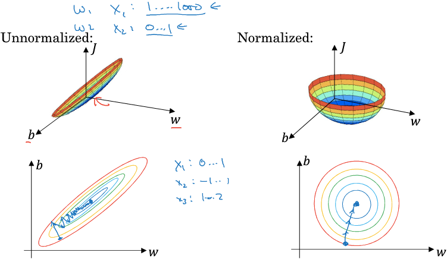

* 在這個篇章裡會講到一些關於優化 cost function 也就是 gradient descent 的方法

# Normalize Inputs



* 若某個 feature $$x$$ 的 input range 非常大 (size=1 ... 1000000)
* 那他的 cost function 會像橢圓一樣的形狀
  * 在 gradient descent 時非常緩慢曲折
* 所以我們可以 normalize feature $$x$$
* 使得 cost function 變成像正常的碗狀一樣
  * 適合 implement gradient descent
* Normalize 方法如下
* $$x = \frac{x-\mu}{\sigma}$$
  * 其中的 $$\mu$$ 是平均數 (mean)
    * $$\mu = \frac{1}{m}\sum_{i=1}^{m}x^{(i)}$$
  * 另一個 $$\sigma$$ 是變異數 (variance)
    * $$\sigma = \sqrt{\frac{1}{m}\sum_{i=1}^{m}x^{(i)^2}}$$


# Vanishing / Exploding Gradient

* 在 gradient 有可能出現 **vanishing** gradient 或是 **exploding** gradient 的問題
  * 梯度消失、梯度爆炸
* 通常發生在 nn 有非常多 layers 時
* 可被視為阻檔 deep learning 發展的一個原因
* 也就是 weights 將 decrease / increase exponentially
* 假設 activation function 是一個 linear function $$g(z) = z$$
* 假設所有的 $$b^{[l]} = 0$$
* 如此一來，$$\hat{y}$$ 可以很容易的算出

$$
\hat{y} = W^{[L]}W^{[L-1]}\cdots W^{[2]}W^{[1]}X
$$

* 若所有 $$W^{[l]}$$ 的值**大於** 1 時，weights 將會 **increase exponentially**
* 若所有 $$W^{[l]}$$ 的值**小於** 1 時，weights 將會 **decrease exponentially**
* 對於 backpropogation 的導數一模一樣
* 這會讓訓練難度變得非常高

# Weight Initialization

* Weight initialization 雖然沒辦法完全解決 vanishing / exploding gradient
  * 但可以減緩兩者的發生
* 從 single neuron 看起，若一個 neuron 得到很多個 input，那麼計算 z 等於

$$
z = w_1x_1 + w_2x_2 +\cdots w_nx_n + b
$$

* 因為 n 很大，所以我們勢必要讓每個 $$w_i$$ 都越小越好
* 為此，我們套用一招 **Xavier initialization** $$\text{Var}(w_i) = 1/n$$
  * 用 python 寫成
  ``` python 
  WL = np.random.randn(WL.shape[0], WL.shape[1]) * np.sqrt(1/n)
  ```
  * 其中 n 是输入的神经元个数，即 `WL.shape[1]`
* 若是 activation function 使用 ReLU 時
  * 可以套用另一招 **He initialization** $$\text{Var}(w_i) = 2/n$$

# Gradient Checking

* Gradient Checking 可以用來檢查 backpropogation 的導數是否正確
* 先利用雙邊誤差方式計算出近似於 slope 的值


$$
J'(\theta) = \frac{J(\theta+\epsilon) - J(\theta-\epsilon)}{2\epsilon}
$$

* 當有多個 parameters 時，我們會針對每一個 parameter 都做一次雙邊誤差計算

$$
\begin{aligned}
\text{For each i} &: \\
&d\theta_\text{approx}[i] = \frac{J(\theta_1,\theta_2,\cdots,\theta_i+\epsilon, \cdots) - J(\theta_1,\theta_2,\cdots,\theta_i-\epsilon, \cdots)}{2\epsilon}
\end{aligned}
$$

* 我們希望每一個算出來的值，都可以跟自己計算的一樣
* $$d\theta_\text{approx}[i] \approx d\theta[i] = \frac{\partial J}{\partial \theta_i}$$
* 我們用以下方式來 check，可以固定比例，不怕數值過小

$$
\frac{\lVert d\theta_\text{approx} - d\theta \rVert_2}{\lVert d\theta_\text{approx}\rVert_2 + \lVert d\theta \rVert_2}
$$

* 若結果和 $$\epsilon$$ 近似，表示 backpropogation 做得不錯
* 另外上面計算時用到的為 **Euclidean norm**
  * $$\lVert x\rVert_2 = \sum_{i=1}^N\lvert x_i\rvert^2$$

## Implementation Notes

* Gradient checking 只適用於 debug，training 時應該關掉
* Fail 時，可以去觀察每一個 $$\theta$$ 來找出 bug
* 記得要包含 regularization
* Gradient checking 不適合跟 dropout regularization 一起使用