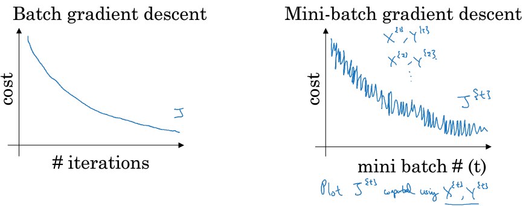
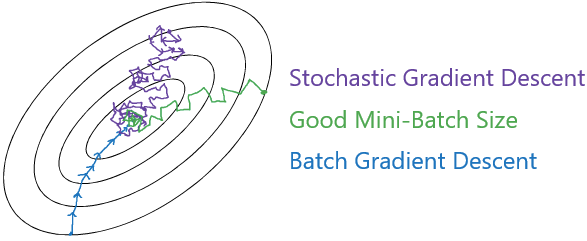
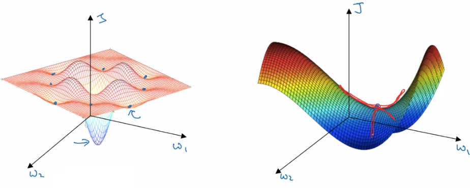

# Mini-Batch Gradient Descent

* 當 training set 非常大，例如有 m = 5000000 筆時
  * Batch gradient descent 需要跑完所有 m 才能進行一次下降
* Mini-batch gradient descent 從 m 中取出一批一批 training set
  * 假設每 1000 筆一批
  * 那就可以執行 5000 次下降
    * 全部 5000 筆執行完一次，稱為 1 epoch
  * 前 1000 筆用 $$(X^{\{1\}}, Y^{\{1\}})$$ 表示，
  * 最後 1000 筆就是 $$(X^{\{5000\}}, Y^{\{5000\}})$$
  * 每次執行的 gradient descent 和 batch 時一模一樣
  * 執行 5000 次完還可以重複進行，直到 converge
    * 執行多次 epoch
* Batch 和 Mini-Batch 的 cost per iteration 如下

## Mini-Batch Size

* Mini-batch size 也是一個需要經驗的 hyperparameter
* 當 size = m 時
  * 就是原本的 Batch gradient descent
* 當 size = 1 時
  * 稱為 **Stochastic gradient descent**
  * 每讀一筆 training set 就做一次 gradient descent

* Batch Gradient Descent
  * 對整個 m 進行一次 gradient descent
  * 下降幅度較大，很穩定往最小值移動
  * 每個 iteration **時間很長，訓練過程很慢**
* Stochastic Gradient Descent
  * 速度很快
  * 但完全沒享受到 vectorization 的加速優勢
  * 永遠不會 converge，會在最小值周圍移動
    * 可以用 learning rate decay 解決
* Mini-Batch
  * 將兩者優點合併，但需要找出適合的 batch size
  * 若 m 較小，如 $$m \le 2000$$ 可以考慮直接使用 batch gradient descent
  * 若 m 較大，通常使用 $$2^6, 2^7, 2^8, 2^9$$ 作為 batch size 較好
    * 符合電腦 memory 儲存方式
    * 另外，size 一定要定義為 CPU/GPU 裝的下的大小

# Exponentially Weighted Averages

* 在實作一些比 gradient descent 還要棒的 optimization algorithm 前
* 需要先學會使用 **Exponentially Weighted Averages**
* 這是一種用於分析**移動平均**的算法、像天氣、股票等一連串資訊
  * 要試著減緩短期波動、反映長期趨勢

* 例如上圖是倫敦一整年的溫度變化圖
* 我們想算出他的移動平均 (紅線)
* 我們定義 $$v_i$$ 為前一天算完的平均 ($$v_0 = 0$$)
* 定義 $$\theta_i$$ 為每一天的溫度
* 我們可以用以下算法算出紅線

$$
\begin{aligned}
v_0 &= 0 \\
v_1 &= 0.9 v_0 + 0.1\theta_1 \\
v_2 &= 0.9 v_1 + 0.1\theta_2 \\
\vdots \\
v_{365} &= 0.9 v_{364} + 0.1\theta_{365}
\end{aligned}
$$

* 可以將以上循環定義為一個簡單公式
  * 把 $$v_t$$ 想成是 $$\approx \frac{1}{1-\beta}$$ 天的溫度
$$
v_t = \beta v_{t-1} + (1-\beta) \theta_t
$$

* 所以 $$\beta$$ 是一個 weight，在上面例子是 0.9
  * 代表每次得到的 $$v$$ 是平均前 10 天的溫度
* 若設定 $$\beta = 0.98$$
  * 每次得到的 $$v$$ 就是平均前 50 天的溫度
* 設定 $$\beta = 0.5$$
  * 得到 $$v$$ 為平均前 2 天的溫度
* 所以 $$\beta$$ 越小，代表平均越少前面天數，就會改變的越激烈
  * 所以綠線就是平均前 50 天所產生的線 ($$\beta = 0.98$$)
  * 黃線則是平均前 2 天 ($$\beta = 0.5$$)
* 我們這目標是在不同分析中找到類似紅色的線

## Understanding Exponentially Weighted Averages

* 我們設定 $$\beta = 0.9$$，可以計算出

$$
\begin{aligned}
\vdots& \\
v_{98} &= 0.9v_{97} + 0.1\theta_{98} \\
v_{99} &= 0.9v_{98} + 0.1\theta_{99} \\
v_{100} &= 0.9v_{99} + 0.1\theta_{100}
\end{aligned}
$$

* 然後把計算到 $$v_{100}$$ 的值攤開

$$
\begin{aligned}
v_{100} &= 0.1\theta_{100} + 0.1 \times 0.9\theta_{99} + 0.9v_{98} \\
&= 0.1\theta_{100} + 0.1 \times 0.9\theta_{99} + 0.1 \times 0.9^2\theta_{98} + 0.9v_{97} \\ &= \cdots
\end{aligned}
$$

* 因為每個 $$\theta_i$$ 代表第 i 天的真實溫度
* 每個 $$\theta_i$$ 前方的 $$0.1 \times 0.9^{(n-i)}$$ 稱為 Bias correction
  * 所有的 Bias correction 加總會接近或等於 1
* 而真實溫度會隨著 Bias correction 不斷被降低 (被無視)

$$
\lim_{\beta\rightarrow 0}(1-\beta)^{\frac{1}{\beta}} = \frac{1}{e} \approx 0.368
$$

* 上面這個公式代表當 $$\beta = 0.9$$ 時
  * 10 天後的溫度在乘上 bias correction 後，已經下降到原本的 1/3 左右
  * 所以越往後的溫度根本等於沒有用一樣

* 最後，在計算 exponentially weighted averages 只需要一行程式碼
  * 並且只需要一個儲存 v 的 memory 位置
  * 因為不需定義所有的 v，只需對同一個 v 進行運算更新即可

$$
\begin{aligned}
\text{Repeat : }&\\
&v := \beta v + (1-\beta) \theta_t
\end{aligned}
$$

* 雖然**不會**比你直接計算前 10 天、50 天的平均還要**精準**
* 但他只需要一行代碼、而且佔用非常少 memory、效率極高

## Bias Correction Adjustment

* 實際上會因為 $$v_t$$ 從 0 開始
* 所以 $$v_1 = \beta v_0 + (1-\beta)\theta_1$$
* 前項完全被消掉，因此第一個 v 僅為當天溫度的 ($$1-\beta$$) 倍
* 會產生紫色線一樣慢熱的狀況
* 我們可以修改 $$v_t$$ 為以下公式

$$
v_t = \frac{\beta v_{t-1} + (1-\beta)\theta_t}{1-\beta^t}
$$

* 這個修正讓 $$v$$ 在一開始可以正常一點
* 而隨著 $$t$$ 越大，$$\beta^t$$ 將趨近於 0，代表整個修正不再影響結果

# Gradient Descent with Momentum

* Momentum 事實上就是對 gradient 進行 Exponentially weighted averages 的計算
  * 並用新產生的 gradient 來更新下降

* 上面用一個 intuition 解釋
* 藍線為一般的 gradient descent
  * 有一些不往最小值移動的 oscillation
* 紫線為 learning rate $$\alpha$$ 特別大的 gradient descent
  * oscillation 更大，甚至會 overshoot
* 我們的目的就是要減少上下擺動的幅度
  * 並且維持甚至增加往最小值移動的幅度
  * 紅線的部分
* 所以 gradient descent with momentum 的實作如下

$$
\begin{aligned}
\text{On iteration t :}&\\
&\text{Compute } dw, db \text{ on current mini-batch} \\
& v_{dW} = \beta (v_{dW}) + (1-\beta) dW \\
& v_{db} = \beta (v_{db}) + (1-\beta) db \\
&W = W - \alpha (v_{dW}) \\
&b = b - \alpha (v_{db})
\end{aligned}
$$

* 其中 $$v_{dW}, v_{db}$$ 就是計算 exponentially weighted averages 的方法
* 而 $$\beta$$ 跟 $$\alpha$$ 一樣，是一個 hyperparameter
  * 當 $$\beta = 0$$，就等於一般的 gradient descent
  * 通常會設置 $$\beta = 0.9$$，會很好的得到紅線的效果
* momentum 不需要修正 bias correction
  * 因為通常移動十次左右，就已經是不錯的移動平均

# RMSprop

* RMSprop 全名為 Root-Mean-Square Propagation
* 我們假設 $$w$$ 和 $$b$$ 是主要影響 oscillation 的 parameters
  * 而 $$b$$ 是影響上下擺動較嚴重的 parameter

* 我們先來計算 RMSprop
* 為了跟 momentum 區分，RMSprop 中的 $$\beta$$ 改為 $$\beta_2$$

$$
\begin{aligned}
\text{On iteration t :}&\\
&\text{Compute } dw, db \text{ on current mini-batch} \\
& s_{dW} = \beta_2 (s_{dW}) + (1-\beta_2) (dW)^2 \\
& s_{db} = \beta_2 (s_{db}) + (1-\beta_2) (db)^2 \\
&W = W - \alpha \frac{dw}{\sqrt{s_{dW} + \epsilon}} \\
&b = b - \alpha \frac{db}{\sqrt{s_{db} + \epsilon}}
\end{aligned}
$$

* 因為 $$W$$ 較小，所以用 $$(dW)^2$$ 計算的 $$s_{dW}$$ 也會較小
  * 那麼更新 $$W$$ 時，$$s_{dW}$$ 在分母，算出來的 $$dw$$ 就適中
* 而 $$b$$ 較大，所以用 $$(db)^2$$ 計算的 $$s_{db}$$ 就會較大
  * 那麼更新 $$b$$ 時，$$s_{db}$$ 在分母較大，算出來的 $$db$$ 就會變小
  * 就可以抑制上下的 osciilation
* 另外在分母加上 $$\epsilon$$，是為了防止分母太小，導致數值不穩定
  * $$\epsilon$$ 通常為 10e-8
* 這裡只是舉 $$b$$ 為影響上下擺動嚴重的 parameter
  * 實際例子可能為 $$w_1, w_2, w_3, \cdots$$ 是影響上下擺動的原因
  * 而 $$w_4, w_5, \cdots$$ 是不影響的
* $$\beta_2$$ 也是一個 hyperparameter

# Adam

* Adam 的全名為 Adaptive Moment Estimation
* Adam 將 momentum 和 RMSprop 融合在一起，得到更好效果
* 以下是 Adam 算法

1. 初始化以下參數
   $$v_{dW} = 0, v_{db} = 0, s_{dW} = 0, s_{db} = 0$$
2. 在每個 itetation t 進行計算
   * 在 momentum 部分的 $$\beta$$ 用 $$\beta_1$$ 表示
   * 在 RMSprop 部分的 $$\beta$$ 用 $$\beta_2$$ 表示
   $$\begin{aligned}
   &\text{Compute } dw, db \text{ on current mini-batch} \\
   & v_{dW} = \beta_1 (v_{dW}) + (1-\beta_1) dW \\
   & v_{db} = \beta_1 (v_{db}) + (1-\beta_1) db \\
   & s_{dW} = \beta_2 (s_{dW}) + (1-\beta_2) (dW)^2 \\
   & s_{db} = \beta_2 (s_{db}) + (1-\beta_2) (db)^2 \\
   \end{aligned}$$
3. 接著在 Adam，要對這四個參數進行 bias correction adjustment
   $$
   \begin{aligned}
   v_{dW}^{\text{corrected}} &= \frac{v_{dW}}{1-\beta_1^t} \\
   v_{db}^{\text{corrected}} &= \frac{v_{db}}{1-\beta_1^t} \\
   s_{dW}^{\text{corrected}} &= \frac{s_{dW}}{1-\beta_2^t} \\
   s_{db}^{\text{corrected}} &= \frac{s_{db}}{1-\beta_2^t} \\
   \end{aligned}
   $$
4. 最終更新參數 $$w, b$$
   $$
   \begin{aligned}
   W &= W - \alpha \frac{v_{dW}^{\text{corrected}}}{\sqrt{s_{dW}^{\text{corrected}} + \epsilon}} \\
   b &= b - \alpha \frac{v_{db}^{\text{corrected}}}{\sqrt{s_{db}^{\text{corrected}} + \epsilon}}
   \end{aligned}
   $$

### Hyperparameter choices

* 以上就是整個 Adam 算法
* 在這個算法中出現非常多 hyperparameters
  * 要怎麼設置以下一一介紹
* $$\alpha$$ : learning rate，需要自己慢慢找到一個合適的
* $$\beta_1$$ : momentum 使用到的像 exponentially weighted averages 的 weight
  * 常用的設定為 0.9
* $$\beta_2$$ : RMSprop 所使用到的 $$\beta$$，一樣是由 exponentially weighted averages 而來
  * Adam 作者建議設定為 0.999
* $$\epsilon$$ : 不重要，用預設的 10e-8 即可
* $$\beta_1, \beta_2, \epsilon$$ 通常不太需要去修改調整

# Learning Rate Decay

* 若使用固定 $$\alpha$$ 的 mini-batch，那麼 gradient descent 幾乎不會準確 converge
  * gradient descent 將會在最小值周圍擺動
* 為此我們可以讓 $$\alpha$$ 隨著時間慢慢減少
  * 一開始 $$\alpha$$ 較大，幫助我們跨大步伐
  * 最終 $$\alpha$$ 變小，幫助我們在最小值收斂
* 最常用的 learning rate decay 公式如下
  $$
  \alpha = \frac{1}{1 + \text{decay-rate} \times \text{epoch-num}} \times \alpha_0
  $$
  * $$\alpha_0$$ 是初始的 learning rate
  * `k epoch` 代表所有 mini-batch 全跑過 k 遍
  * `decay-rate` 是一個 hyperparameter
* 假設我們設計 $$\alpha_0 = 0.2, \text{decay-rate = 1}$$
  * 那 $$\alpha$$ 將會隨著跑過所有 mini-batch 的次數而下降

| Epoch | $$\alpha$$ |
| ----- | ---------- |
| 1     | 0.1        |
| 2     | 0.067      |
| 3     | 0.05       |
| 4     | 0.04       |
| ...   | ...        |

## Other Learning Rate Decay Formula

* Exponentially Decay
  $$
  \alpha = 0.95^{\text{epoch-num}}\times\alpha_0
  $$
* $$
  \alpha = \frac{\text{constant}}{\sqrt{\text{epoch-num}}}\times\alpha_0
  $$
* $$
  \alpha = \frac{\text{constant}}{\sqrt{\text{mini-batch-num t}}}\times\alpha_0
  $$
* Discrete staircase
* Manual decay : Only small num training set

# Problem of Local Optima

* 在 machine learning 時，我們對梯度接近 0 的想像都是 local optima
  * 圖面上很多凹點，然後你隨便掉進一個凹點就出不來
* 但在 deep learning 中，你的維度變的非常大
  * 通常會遇到梯度接近 0 的地方是 **saddle point**
  * 所以在大型的 nn、有著大量參數、較高維度時
    * 困在 local optima 的情況是不太可能的
* 所以 deep learning optimization 的問題不是 local optima 而是 **plateaus**
  * 這個 saddle point 或者 plateaus 會使得 learning 速度變慢
  * 所以才會不斷的推出新的 optimization algorithm
    * Momentum, RMSprop, Adam, ...
    * 這些算法能夠加速離開這些梯度接近 0 的點
    * 甚至找出更棒的 optimization algorithm 是 deep learning 的挑戰之一

