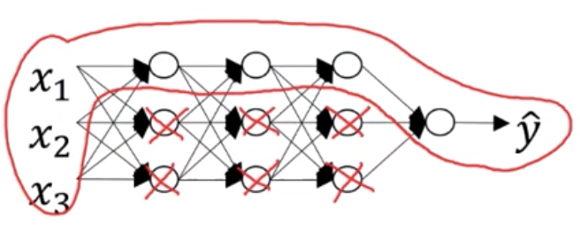
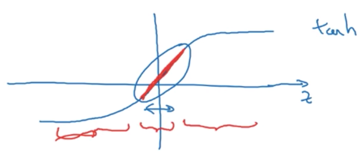

# Regularization

* 我們在 machine learning 中也有提到的 regularization
* 我們重新提出，並且將他應用到 neural network 中
* 這是 logistic regression $$J(\theta)$$ 使用 regularization
  * $$J(w, b) = \frac{1}{m}\sum_{i=1}^m\mathcal{L}(\hat{y}^{(i)}, y^{(i)}) + \frac{\lambda}{2m}\lVert w\rVert^2_2$$
* 後面加的這一項 regularization 可以細分為 L2 和 L1 regularization
  * L2 就是上面寫的
    * $$\frac{\lambda}{2m}\lVert w\rVert^2_2 = \frac{\lambda}{2m}\sum_{j=1}^{n_x}w_j^2 = \frac{\lambda}{2m} w^Tw$$
  * L1 就是沒有平方的版本
    * $$\frac{\lambda}{2m}\lVert w\rVert_1 = \frac{\lambda}{2m}\sum_{j=1}^{n_x}\lvert w_j\rvert$$
  * 因為 L1 會產生 sparse matrix (很多 entries 為 0)
  * 所以通常大家都使用 L2

## Regularization in Neural Network

* 在 nn 中所用到的 L2 regularization 稱為 **Frobenius Norm** (F底標記)
  * 也就是整個 $$w (n^{[l-1]}, n^{[l]})$$ 每個 entries 的平方和
  * $$\lVert w^{[l]}\rVert_F^2 = \sum_{i=1}^{n^{[l-1]}}\sum_{j=1}^{n^{[l]}}(w^{[l]}_{ij})^2$$
* 所以整個包含 regularization 的 neural network cost 為
  * $$J(w^{[1]},b^{[1],\cdots,w^{[L]},b^{[L]}}) = \frac{1}{m}\mathcal{L}(\hat{y}^{(i)},y^{(i)}) + \frac{\lambda}{2m}\sum_{l=1}^L \lVert w^{[l]}\rVert_F^2$$

### Weight decay

* 另外，當 L2 套用之後，會讓 gradient descent 在每次更新時， $$W$$ 都會乘以一個小於 1 的數
* 所以 L2 又稱為 weight decay

$$
\begin{aligned}
dW^{[l]} &= \frac{\partial \mathcal{L}}{\partial w^{[l]}} + \frac{\lambda}{m}W^{[l]} \\
&\text{insert into gradient descent} \\
W^{[l]} &:= W^{[l]} - \alpha dW^{[l]}\\
&:= W^{[l]} - \alpha\begin{bmatrix}\frac{\partial \mathcal{L}}{\partial w^{[l]}} + \frac{\lambda}{m}W^{[l]}\end{bmatrix}\\
&:= W^{[l]} - \alpha\frac{\lambda}{m}W^{[l]} - \alpha\frac{\partial \mathcal{L}}{\partial w^{[l]}} \\
&:= (1-\frac{\partial\lambda}{m})W^{[l]} -  \alpha\frac{\partial \mathcal{L}}{\partial w^{[l]}}
\end{aligned}
$$

## Regularization Intution

* 這裡講解的 regularization 原因和 machine learning 裡類似
* 但是是以 nn 為基底來解釋

### Intuition 1



* 在 regularization 中 $$\lambda$$ 增加
* parameters $$W$$ 中一些不重要的 unit 就會被降低 $$\approx 0$$
* 這就像把一些 neuron 從 nn 中去除掉，變成一個較小的 nn
* 進而避免 overfitting

### Intuition 2



* 假設 activation function 為 tanh
* Regularization 將 $$\lambda$$ 上升
* 所以 $$W^{[l]}$$ 就會下降
* 進而影響 $$z^{[l]} = w^{[l]}a^{[l-1]}+b^{[l]}$$ 變小
* 降低 $$z^{[l]}$$ 我們就會得到 unit 的值介於上圖中間紅色 linear 區域
* 此時 tanh(z) 會接近 linaer function
* 整個網路就會近似 linear nn 一樣，不會 overfitting

# Dropout Regularization

* Dropout 對每一個 hidden layer 設定一個隨機消除 neuron 的機率
* 會讓每次訓練的 nn 變成一個較小的 nn
* Dropout 通常使用於 Computer vision


* 通常會使用 **Inverted dropout** 來 implement dropout
* 以下是對第 l 層進行 dropout 的過程

``` python
keep_prob = 0.8  # hold neuron probability
dl = np.random.rand(al.shape[0], al.shape[1]) < keep_prob
al = np.multiply(al, dl)
al /= keep_prob
```

* 有點類似遮罩的感覺，將 `al` 乘以 0/1 遮罩 `dl`
* 最後 `al /= keep_prob` 就是 inverted dropout 的精神
  * 是為了避免下一層計算發生錯誤
  * 因為 al 有些 neuron 被歸零
  * 所以我們在沒被歸零的 neuron 上補回 20% 期望值
* 另外，別在 test 時使用 dropout，會讓預測結果隨機化

## Dropout Intuition

* 因為一個 neuron 會接收多個 features 並分配 weights 給他們，然後計算後輸出
* 但現在任何一個 features 都有可能消失
* 所以這個 neuron 在 weights 上會更平均的分配
* 這就類似 L2 在 shrink weights 的做法


* 對於不同的 layer 設定的 `keep_prob` 也不同
* 通常較少 hidden units 的 layer 的 `keep_prob = 1`
  * Input layer 通常也為 1
* 越多 features (weights 越大) 的 layer 的 `keep_prob` 越小越好
* Dropout 有一個大缺點
  * 就是無法正確定義出 $$J(\theta)$$
  * 所以無法邊訓練邊看 cost function 是否正確遞減
  * 通常需要將 `keep_prob` 先全部設定回 1 再觀察

# Other regularization methods

## Data Augmentation

* Overfitting 往往可以依靠增加 data 數量來緩解
* 利用修改圖片 (flip, stretch, crop, ...)，來產生更多新的 data

## Early Stopping


* 我們將 train error 和 dev error 同時 plot 在一起
* 當 train error 持續下降而 dev error 卻上升時
  * 就是 overfitting 的開始
* 所以我們在此時停止 iteration，並返回 dev error 在最小時的參數
* 好處是不需要嘗試大量 L2 regularization
* 但 early stopping 有一大缺點
  * 他違反了 orthogonalization

### Orthogonalization

* 在處理一個 nn 時，我們偏向專注於一次一件事情上
* 第一件事是 **optimize cost function**
  * 會用 gradient descent 等方式處理
* 第二件事是 **not overfitting**
  * 會用 regularization 等方式處理
* 但 early stopping 既不跑完 optimization 還要時刻注意 overfitting 問題