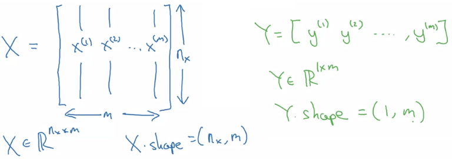
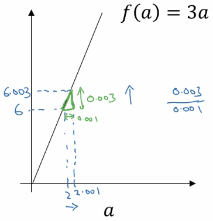
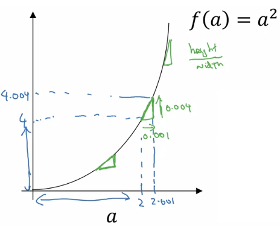

# Binary Classification

一開始，我們想將一張 64x64 的圖片餵進 nn 中，來辨識是否是貓

1 代表是，0 代表不是

怎麼餵呢，我們將圖片中 RGB 三種 channel 的各 64x64 個 pixel 存到一個非常長的向量 x

共有 $$64 \times 64 \times 3 = 12288$$ 個 features

$$
x = \begin{bmatrix}
255\\231\\\vdots\\255\\134\\\vdots\\255\\134\\\vdots
\end{bmatrix}
$$

我們會使用 $$n_x$$ 來表達 feature x 的維度，所以 $$n = n_x = 12288$$

## Notation

我們的 training sets 為 $$(x, y)$$ 分別表示為

$$x \in \mathbb{R}^{n_x}, y \in \begin{Bmatrix}0,1\end{Bmatrix}$$

共有 m 個 training sets

$$\begin{Bmatrix}(x^{(1)}, y^{(1)}), (x^{(2)}, y^{(2)}),\cdots, (x^{(m)}, y^{(m)})\end{Bmatrix}$$

並且我們會壓縮所有的 training sets 和 y 成為一個大矩陣

這邊跟 machine learning 學的有點不一樣

在 $$X$$ 矩陣中

* 每個 columns i 為不同個 training set $$x^{(i)}$$
* 每個 rows j 表示所有 $$x$$ 的第 j 個 feature

在 $$y$$ 矩陣中

* 每個 columns i 為不同個 result label $$y^{(i)}$$



# Logistic Regression

定義好 $$x$$ 和 $$\hat{y}$$

$$
\text{Given } x \in \mathbb{R}^{n_x},\text{ want } \hat{y} = P(y=1\mid x), 0 \le \hat{y} \le 1
$$

以及 parameter $$w \in \mathbb{R}^{n_x}$$ 和 $$b \in \mathbb{R}$$

這個 $$w$$ 其實就是之前的 $$\theta$$ 是一個 vector

而 $$b$$ 就是 bias 的 $$\theta_0$$ 是一個實數

然後我們要求 output $$\hat{y}$$ 就是之前的 $$h_\theta(x)$$

其中的 $$\sigma$$ 就是之前的 **sigmoid** $$g$$ function

$$
\hat{y} = \sigma(w^Tx + b)
$$

## Loss Function

我們會定義一個 **Loss function** 來當作 **single** training set 的誤差

$$
\mathcal{L}(\hat{y}, y) = -(y\log \hat{y} + (1-y)\log (1-\hat{y}))
$$

以下是一個 intuition 為什麼這個 loss function 可以這樣定義

$$
\begin{aligned}
&\text{If } y = 1 : && \mathcal{L}(\hat{y}, y) = -\log \hat{y} \\
&\text{If } y = 0 : && \mathcal{L}(\hat{y}, y) = -\log(1 - \hat{y})
\end{aligned}
$$

就是說當 $$y = 1$$ 時，我的 $$\hat{y}$$ 也要越大越好

我的 $$\hat{y}$$ 越大，代表越接近 $$y$$，我的 loss 就越小，所以 $$-\log \hat{y} \approx 0$$

當 $$y = 0$$， $$\hat{y}$$ 要越小越好

所以 $$-\log(1 - \hat{y})$$ 就會接近 0

## Cost Function

於是我們可以將作用在每一筆 training sets 的 **loss function** 集合形成 **cost function** $$J(w,b)$$

cost function is the **average** of the loss functions of the entire training set

$$
\begin{aligned}
J(w,b) &= \frac{1}{m}\sum_{i=1}^m\mathcal{L}(\hat{y}^{(i)}, y^{(i)}) \\
&= -\frac{1}{m}\sum_{i=1}^{m}\begin{bmatrix}y^{(i)}\log\hat{y}^{(i)} + (1- y^{(i)}) \log(1-\hat{y}^{(i)})\end{bmatrix}
\end{aligned}
$$

裡面的 superscript i 代表第 i 個 training set

## Gradient Descent

這邊的 gradient descent 和 machine learning 時學的大同小異

只是現在我們連 b 也要一起進行更新

$$
\begin{aligned}
&\text{Repeat :} && \\
&&w := w - \alpha \frac{\partial J(w, b)}{\partial w}\\
&&b := b - \alpha \frac{\partial J(w, b)}{\partial b}\\
\end{aligned}
$$

### Derivatives intuition

這邊講一下 gradient descent 需要用到的微分技巧

其實就只是要求出 x 在對應的 cost function 當下的 **slope** 而已

slope 的算法就是 $$\frac{\text{height}}{\text{width}}$$

所以一個 $$f(a) = 3a$$ 的 linear function 中



做任何的移動都可以算出 slope = 3

$$
\begin{aligned}
&a = 2 && f(a) = 6\\
&a = 2.001 && f(a) = 6.003\\
&\text{Slope of } f(a) \text{ at } a = 2 \text{ is } \frac{0.003}{0.001} = 3 = \frac{\partial f(a)}{\partial a}
\end{aligned}
$$

#### Changing Derivatives 

在不同的 function 上可以有不斷變動的 slope

例如在 $$f(a) = a^2$$ 的圖形中

當 a = 2 時

$$
\begin{aligned}
&a = 2 && f(a) \approx 4\\
&a = 2.001 && f(a) \approx 4.004\\
&\text{Slope } \frac{df(a)}{da} = 4 \text{ when } a = 2
\end{aligned}
$$

當 a = 5 時

$$
\begin{aligned}
&a = 5 && f(a) \approx 25\\
&a = 5.001 && f(a) \approx 25.010\\
&\text{Slope } \frac{df(a)}{da} = 10 \text{ when } a = 5
\end{aligned}
$$



可以看到不同地方的三角形所產生的斜率都不同

這其實就是一次微分的意義

常見的有 :

$$
\begin{aligned}
&f(a) = a^2 && \frac{d f(a)}{da} = 2a\\
&f(a) = a^3 && \frac{d f(a)}{da} = 3a^2\\
&f(a) = \ln(a) && \frac{d f(a)}{da} = \frac{1}{a}\\
\end{aligned}
$$

# Computation Graph

在講解 backpropogation 前，我們用一個簡單方法來解釋一下流程

假設我們想要最小化 $$J(a,b,c) = 3(a+bc)$$

這個函式需要用到三個計算

$$
\begin{aligned}
u &= bc\\
v &= a+u\\
J &= 3v
\end{aligned}
$$

可以畫成像這樣的 computation graph


而 backpropogation 就像是由右往左取每一個數對 J 的導數一樣

求完就可以對每個數做 gradient descent

為什麼要由右往左取呢，是因為需要用到 chain rule 的關係

> 以下會將 $$\frac{dJ}{dvar}$$ 標示為 $$dvar$$
>
> 其中 var 是任何一個變數
>
> 例如 $$\frac{dJ}{da} = da$$, $$\frac{dJ}{db} = db$$
> 
> 這是 python 在定義這些變數時的常見寫法


現在我們就可以往前求得 $$dv = 3$$

因為當 v 進行微調的時候，J 就會改變三倍

$$
\begin{aligned}
&v = 1 && J = 3\\
&v = 1.001 && J = 3.003 \\
&\text{Slope } = \frac{0.003}{0.001} = 3
\end{aligned}
$$

再來我們再往前求得 $$da = 3$$

因為當 a 進行微調時，J 一樣也改變三倍

但我們要從 a 改變 v 而 v 改變 J 這樣算

$$
\frac{dJ}{da} = \frac{dJ}{dv} \frac{dv}{da} = 3 \cdot \frac{dv}{da}
$$

我們已經知道 $$\frac{dJ}{dv}$$

基於這點，我們再找出 a 進行微調時 v 會維持一倍

$$
\begin{aligned}
&a = 5 && v = 11\\
&a = 5.001 && J = 11.001 \\
&\text{Slope } = \frac{0.001}{0.001} = 1
\end{aligned}
$$

所以 $$da = \frac{dJ}{da} = 3 \cdot \frac{dv}{da} = 3 \cdot 1 = 3$$

我們用這個 chain rule 方法計算出 u 然後再計算出 b, c

就可以得到所有數字對 J 的 slope 是多少

## Logisitic Regression Gradient Descent as NN

我們將 logistic regression 計算 cost function 轉換成 computation graph


1. 計算 a 的導數為 $$da = \frac{d\mathcal{L}(a, y)}{da} = -\frac{y}{a} + \frac{1-y}{1-a}$$
2. 計算 z 的導數為 $$dz = \frac{d\mathcal{L}(a, y)}{dz} = \frac{d\mathcal{L}}{da} \cdot \frac{da}{dz}= a - y$$
   * 其中已知 $$\frac{d\mathcal{L}}{da} = -\frac{y}{a} + \frac{1-y}{1-a}$$
   * 而新的 $$\frac{da}{dz} = a(1-a)$$
3. 接著就可以算出 $$w_1, w_2, b$$ 對 $$J$$ 的導數
   * $$dw_1 = \frac{d\mathcal{L}}{dw_1} = x_1 \cdot dz$$
   * $$dw_2 = \frac{d\mathcal{L}}{dw_2} = x_2 \cdot dz$$
   * $$db = \frac{d\mathcal{L}}{db} = dz$$
4. 然後對這三個數做 gradient descent
   * $$w_1 := w_1 - \alpha dw_1$$
   * $$w_2 := w_2 - \alpha dw_2$$
   * $$b := b - \alpha db$$

### Gradient Decsent on m Examples

接著我們把上面所有東西統整一起，對 m 筆 training sets 做一次 gradient descent

pseudo code 如下 :

``` matlab
J = dw1 = dw2 = db = 0

For i = 1 to m:
    % 首先是 forward propogation
    z(i) = w'x(i) + b  % 每個 training set 的 z
    a(i) = sigmoid(z(i))  % 每個 training set 的 a
    J += -[y(i) * log(a(i)) + (1 - y(i)) * log(1 - a(i))]  % 加總所有 training sets 的 cost

    % 接著是 backward propogation
    dz(i) = a(i) - y(i)  % 每個 training set 的 dz
    
    % feature 很多時，這裡會是一個 loop
    dw1 += x1(i) * dz(i)  % 每個 training set 的 dw1 加到一個 dw1 總合去
    dw2 += x2(i) * dz(i)  % 每個 training set 的 dw2 加到一個 dw2 總合去
    db  += dz(i)  % 每個 training set 的 db 加到一個 db 總合去

% 結束迴圈後對以下幾個東西，都求平均數
J /= m
dw1 /= m
dw2 /= m
db /= m
```

這個做法可能會用到兩個迴圈，一個是對 m 筆資料，一個是對 n 個 input features (dw1, dw2, ..., dwn)

所以我們需要學習 vectorization 的精神來解決問題