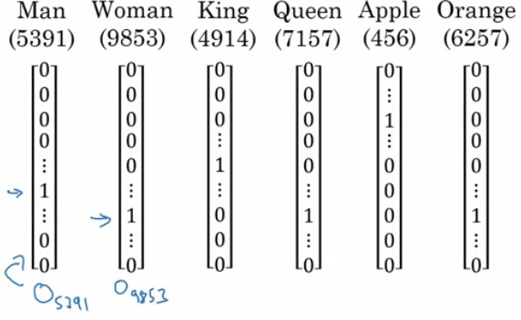
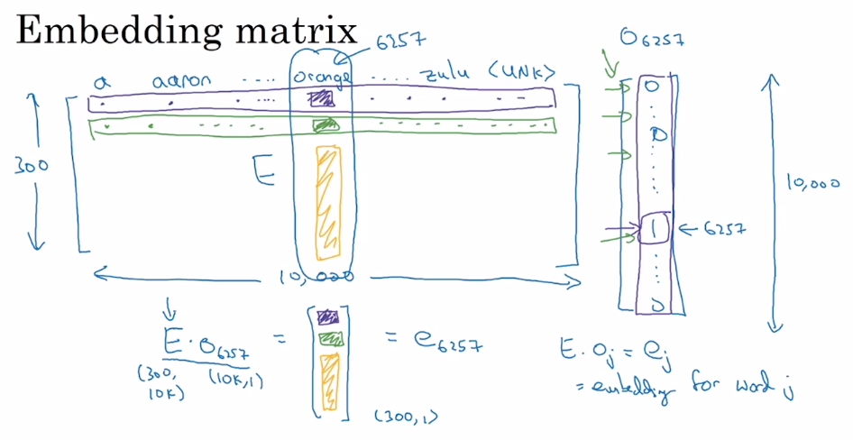
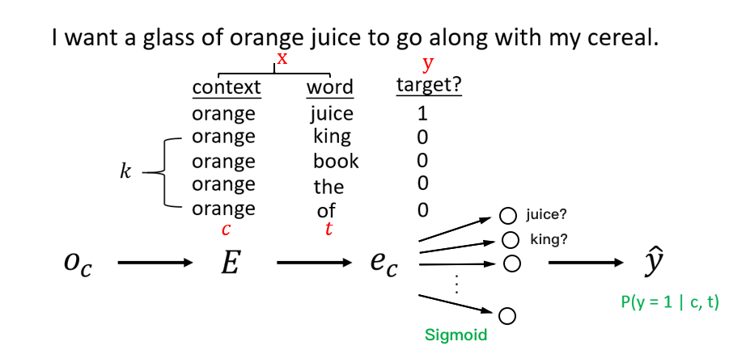
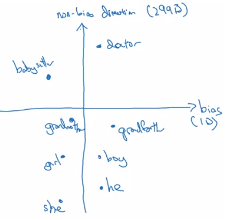

# Word Representation

* 還記得我們用 one-hot vector 來表示一個單字
  * 假設字典共有 10000 個單字，我們想表達第 i 個單字
  * 方法是將 10000 dimensional vector 的第 i 個 entry 設置為 1，其餘為 0

* 假設 Man 在 vector 的第 5391 個 index，我們可以表示成 $$O_{5391}$$ (O 代表 one-hot)
* 但這方法有一個缺點，就是他無法表達單字之間的關聯性
  * 每個字之間的 inner product 都是 0

$$
\begin{aligned}
\text{I want a glass of orange ＿＿ (juice)} \\
\text{I want a glass of apple ＿＿ (???)}
\end{aligned}
$$

* 今天我們讓 model 學會預測 orange 後面要接 juice
  * 那他能夠預測 apple 後面也應該要接 juice 嗎 ?
  * 用 one-hot 肯定是不太行的

## Word Embedding (Featurized Representation)

* 我們用各式各樣的特徵來表達一個字
  * 跟這個特徵越接近的就設定一個值表示

|        | Man  | Woman | King  | Queen | Apple | Orange |
| ------ | ---- | ----- | ----- | ----- | ----- | ------ |
| Gender | -1   | 1     | -0.95 | 0.97  | 0.00  | 0.01   |
| Royal  | 0.01 | 0.02  | 0.93  | 0.95  | -0.01 | 0.00   |
| Age    | 0.03 | 0.02  | 0.7   | 0.69  | 0.03  | -0.02  |
| Food   | 0.04 | 0.01  | 0.02  | 0.01  | 0.98  | 0.97   |
| Color  | ...  |
| Cost   | ...  |
| Verb   | ...  |
| ...    |

* 假設 Gender, Royal ... 特徵共有 300 個
* 那麼每一個單字，都會是一個 300 dimensional 的 vector
* 用 e 跟 index 組合來表達 $$\text{Man} = e_{5391} = \begin{bmatrix}-1\\0.01\\0.03\\0.04\\\vdots\end{bmatrix}$$
* 如此一來，Apple 和 Orange 的 vector 就會非常相似，變得能夠預測 apple juice 了
  * 雖然在 color 或一些地方會差異非常多，但無傷大雅

## Visualizing Word Embedding

* 有一些算法可以將 word embedding 視覺化，例如 t-SNE algorithm
* 將所有 300 dimensional vector 投影到二維平面

* 可以看到 man 跟 woman 類似所以鄰近
* man, woman, king, queen 為人類所以鄰近
* dog, cat, fish 為生物所以鄰近
* 以上都為生物所以鄰近
* 數字、生物、水果各在一個群體裡面

> 相關論文 : [van der Maaten and Hinton., 2008. Visualizing Data using t-SNE](https://www.seas.harvard.edu/courses/cs281/papers/tsne.pdf)

## Why call it Embedding

* 所以到底為什麼把這樣 feature representation 的方式稱作 embedding 呢
* 原因是因為我們把每一個單字 (orange, apple) 各別**嵌入 (embed)** 到一個**非常高維度 (如 300)** 的空間中的不同點

# Using Word Embeddings

* Word Embeddings 適合應用於 named entity recognition

$$
\text{Sally Johnson is an orange farmer}
$$

* 原本要學習上面這個句子時
  * Sally 會是一個 **one-hot vector** $$x^{<1>}$$
  * 並且 output 的 $$y^{<1>}$$ 應該會等於 1
* 現在改成用訓練後的 **word embeddings** 作為 input 來預測下一個句子

$$
\text{Robert Lin is an apple farmer}
$$

* 這時候看到 apple farmer，應該會將 Robert Lin 也預測為人名
* 但若不是 apple farmer 而是 **durian cultivator** 呢 ?
* 我們可以用 transfer learning 來擴大 word embeddings 的能力

## Transfer Learning and Word Embeddings

1. 首先要從網路上找出非常大的 text corpus 來訓練 word embedding
   * large text corpus = 1 to 100 Billion words
   * 或者可以直接下載 pre-trained 的 embeddings
2. 接著直接將這個 embeddings 轉移運用到目前 samll training set 的 task 上
   * small training set = 100k words
   * 這就是 transfer learning
3. 若是步驟 2 的 training set 蠻大的話，那可以試著用這些 data 來繼續 fine tune 這個 embeddings
   * 所以這步驟是 optional

# Properties of Word Embeddings

* Word Embeddings 能夠很有效的執行 analogy reasoning
* 例如 `man` to `woman` as `king` to ? (`queen`)

* 假設 embeddings 只有四個特徵
* 用 man 減去 woman 其實就是 gender 的差異

$$
e_{man} - e_{woman} = 
\begin{bmatrix}-1\\0.01\\0.03\\0.09\end{bmatrix} -
\begin{bmatrix}1\\0.02\\0.02\\0.01\end{bmatrix} \approx
\begin{bmatrix}-2\\0\\0\\0\end{bmatrix}
$$

* 而用 king 減去 queen 也會得到差不多的結果

$$
e_{king} - e_{queen} = 
\begin{bmatrix}-0.95\\0.93\\0.70\\0.02\end{bmatrix} -
\begin{bmatrix}0.97\\0.95\\0.69\\0.01\end{bmatrix} \approx
\begin{bmatrix}-2\\0\\0\\0\end{bmatrix}
$$

* Analogy reasoning 就是要找到這個 queen 符合
  * $$e_{man} - e_{woman} \approx e_{king} - e_{?}$$
* 所以公式是 : 找到一個 word $$(w)$$ 滿足下列條件式
  * $$w : \text{argmax}_w \,\,\text{sim}(e_w, e_{king} - e_{man} + e_{queen})$$
    * 通常能有 30% - 75% 機率找到最佳解
* 裡面所用到的 similarity function 通常會使用 cosine similarity
  * $$\text{sim}(u, v) = \frac{u^Tv}{\lVert u\rVert_2\cdot\lVert v\rVert_2}$$
* 常見的 analogy reasoning 幫我們找到了以下例子
  * `Man:Woman` as `Boy:Girl`
  * `Ottawa:Canada` as `Nairobi:Kenya`
  * `Big:Bigger` as `Tall:Taller`
  * `Yen:Japan` as `Ruble:Russia`

> 相關論文 : [Mikolov et. al., 2013, Linguistic regularities in continuous space word representations](https://www.microsoft.com/en-us/research/wp-content/uploads/2016/02/rvecs.pdf)

# Embedding Matrix

* 最終目標我們要在一個 embedding matrix 上學習 embeddings
* 假設 vocabulary 有 10000 個單字，Embedding 有 300 個特徵
* 那麼就定義一個 $$300\times10000$$ 的 **embedding matrix $$E$$**
* 之後將會隨機初始化 $$E$$ 來進行 embedding 的訓練

* 我們可以將某一個單字的 embedding 用矩陣相乘方式表達
  * 假設要找 orange 的 embedding
  * orange 在 vocabulary 中的第 6257 個
  * 他的 one hot vector 為 $$o_{6257}$$
  * 所以他的 embedding $$e_{6257}$$ 等於
    $$E \cdot o_{6257} = e_{6257}$$
* 一般化的表示如圖中右下角所示
  $$E\cdot o_j = e_j = \text{embedding for word j}$$
* 這只是一個 intuition
  * 正常並不會使用矩陣乘法來取得某個 embedding，因為 cost 太高了
  * 在實作上，會用一些方式直接取得該單字在 $$E$$ 的 column

# Learning word embeddings

* 在利用 deep learning 訓練 word embeddings 的歷史上
* 是由複雜的方式慢慢演變為簡單的方式
* 這裡將從複雜但卻直覺的方式開始講起

## Neural Language Model

$$
\text{I want a glass of orange ＿＿ .}
$$

* 在建立預測未知詞的神經網路，就順便可以訓練 embedding matrix $$E$$
  * 首先將每個詞的 one-hot vector 和 embedding matrix 相乘得到 embedding vector
    * e.g. $$o_{4343} \cdot E = e_{4343}$$
  * 接著將這些 embedding vector 丟到 neural network 訓練
  * 假設一層 fully-connect 一層 softmax
  * 所以共要訓練 $$E, W^{[1]}, b^{[1]}, W^{[2]}, b^{[2]}$$ 這幾個參數
  * 假設 embedding 特徵有 300 個，那麼 6 個詞就可以產生 1800 個 inputs

* 在實際應用上，會添加 fixed historical window
  * 只抓出預測詞的前 n (e.g. 4) 個字來進行訓練

### Other context/target pairs

* 在應用上還有許多 window 大小產生的 context/target pairs

$$\text{I want a glass of orange ＿＿ to go along with my cereal.}$$
  * **Last 4 words**
    * context = a glass of orange
  * **4 words on left & right**
    * context = a glass of orange, to go along with
  * **Last 1 word**
    * context = orange
  * **Nearby 1 word** (隨機取周邊的一個單字)
    * context = glass
    * 這個做法的效果意外的很好
    * 是之後的一個方法 **Skip-Gram** 的 idea

## Word2Vec

* Word2Vec 是一種比 neural language model 還要更有效率計算 word embedding 的 algorithm
  * Word2Vec algorithm 包含兩種算法
    * **Skip-gram** 從周邊的隨機單字來預測單字
    * **Continuous Bag of Words** 則從上下文來預測單字
  * 訓練方法又可分成
    * **Hierarchical softmax**
    * **Negative sampling**

### Skip-Gram

$$\text{I want a glass of orange juice to go along with my cereal.}$$

* 首先要先找出 **context** word 再來找他對應的 **target** word
  * target 可以選擇是前後五個字、前後十個字的範圍

| context | target |
| ------- | ------ |
| orange  | juice  |
| orange  | my     |
| orange  | glass  |

* 看起來是一個很難的 supervised problem
* 但目標不是為了要解 supervised problem 而是要升級我們的 embeddings

#### Skip-Gram Model

* 假設 Vocab size = 10000, orange = 6257, juice = 4834
* context "orange" $$c = o_{6257}$$, target "juice" $$t = o_{4834}$$ 
  * context, target 皆是 one-hot 型式
* 算出每個 embedding vector 並經由 softmax 來預測 $$\hat{y}$$
  * $$o_c \rightarrow E \rightarrow e_c \rightarrow \text{softmax} \rightarrow \hat{y}$$
  * 前三步驟又可表示為 $$e_c = E\cdot o_c$$
* 更仔細看 softmax model 他想計算的是 $$P(t \mid c)$$
  * 在知道 context 情況下 target 的機率
  * $$\text{softmax} = p(t\mid c) = \frac{e^{\theta_t^Te_c}}{\sum_{j=1}^{10000}e_j^Te_c}$$
    * 其中的 $$e_t$$ 代表跟 output t 有關的 parameter
    * 而 $$e_j$$ 表示 vocab 中全部單字的 embedding 
* 接著定義一下 softmax 的 cost function
  * 是一個 negative log likelihood 的算法
  * $$\mathcal{L}(\hat{{y}, y}) = - \sum_{i=1}^{10000}y_i\log\hat{y}_i$$
* 於是我們可以訓練 $$E$$ 的許多參數 $$e_c$$，以及 softmax 的參數如 $$\theta_t$$

##### Problem with Skip-Gram

* 要計算 softmax 時，需要計算對所有單字求和 (分母部分)，計算量非常大
  * 有一個解決方法是使用 Hierarchical Softmax Classifier
    * 利用樹的方式降低計算時間為 log 時間
    * 通常會再使用 Huffman tree 將常用單字編碼在接近 root 的地方
* 另外要怎麼樣選出 context ?
  * 完全隨機 ?
    * 那會讓一些單字非常常出現 (e.g. the, and, or, of, a, to, ...)
  * 所以一般在實作上，會有一些作法將 apple, orange, durian 這些不常見字和 and, or, are 這些常見字，平均的選取出來，而非完全公平隨機。

> 相關論文 : [Mikolov et. al., 2013. Efficient estimation of word representations in vector space.](https://arxiv.org/pdf/1301.3781.pdf)

### Negative Sampling

* 為了解決 softmax 運算較慢的問題，作者提出了另一種 negative sampling 的方法
* 我們將原本的 context/target 改變成 context/word/target
  * 原本的 context/target 變成 context/word/1 代表 positive example
  * 從字典抓出隨機的 word 產生 context/word/0 代表 negative example
  * negative example 的筆數為 k 筆
    * 作者認為 k 在 large dataset 時以 2-5 筆較佳
    * k 在 small dataset 時以 5-20 筆較佳

| context | word  | target |
| ------- | ----- | ------ |
| orange  | juice | 1      |
| orange  | king  | 0      |
| orange  | book  | 0      |
| orange  | the   | 0      |
| orange  | of    | 0      |
 
* 上面是一個 k = 4 的範例
* 這讓我們用另一種方式定義問題，變成解 logistic regression

#### Negative Sampling Model

* 現在變成要預測 $$P(y=1\mid c, t)$$
  * 代表給定 context 和 word，是否是正確的關係 (是=1 / 不是=0)
* 計算方法就可以使用簡單的 sigmoid function 來判斷
  * $$P(y=1\mid c, t) = \sigma(\theta_t^Te_c)$$
    * 其中的 $$\theta_t$$ 表示 word 參數，$$e_c$$ 表示 context 參數
* 畫成 neural networks 的方式來看
  * 我們把 orange 作為 one hot vector $$o_{6257}$$ 計算出 embedding vector $$e_{6257}$$
  * 然後透過 logistic regression 的方式來訓練每一個結果
  * 結果會得到像是訓練出 10000 個 binary logistic regression classifier
    * 給定 orange 是 juice 的機率 ?
    * 給定 orange 是 king 的機率 ?
    * ... (10000 個)
  * 但在每個 iteration 的訓練裡，只需要用到 k + 1 筆的 data 來訓練
    * 不必像 softmax 每回合的訓練都要重新計算 10000 筆 data
* 關於如何選擇字典的字作為 negative example 的方法
  * 作者建議用以下公式作為每個詞被挑選的機率
  * $$P(w_i) = \frac{f(w_i)^{3/4}}{\sum_{j=0}^m f(w_j)^{3/4}}$$
  * 這個公式能增加一些不常見的單字被選中的機率

> 相關論文 : [Mikolov et. al., 2013. Distributed representation of words and phrases and their compositionality](https://arxiv.org/pdf/1310.4546.pdf)

## GloVe Word Vector

* GloVe (Global Vectors for word representation)
* 在 GloVe 中一樣有 context/target pairs
* 但改用 $$i$$ 表示 **context**，而 $$j$$ 表示 **target**
* 並且定義 $$X_{ij}$$ 表示 $$j$$ 隨著 $$i$$ 一起出現的**次數 (count)**
  * 若 "一起出現" 定義為 "出現在前後 10 個單字"，那麼有可能 $$X_{ij} = X_{ji}$$
  * 若定義為 "出現在下一個字"，那麼可能就無法像上面一樣能夠對稱
* 我們將用 $$X_{ij}$$ 來訓練 GloVe Model

### GloVe Model

* 定義 Cost function $$J$$ 表示單字間的差異性
  * $$J = \sum_{i=1}^N\sum_{j=1}^Nf(X_{ij})(\theta_i^Te_j+b_i+b_j-\log(X_{ij}))^2$$
* 接著就可以用 Gradient Descent 來最小化 $$J$$
  * 其中的 $$\theta_i, e_j$$ 所扮演的角色就像 skip-gram 的 $$\theta_t, e_c$$ 一樣
  * 而 $$f(X_{ij})$$ 則是用來平衡 weights
    * 當 $$X_{ij}$$ 為零，log 無法計算時，$$f(X_{ij})$$ 就返回 0
    * 並且平衡常用字和不常用字出現的權重
* 在 GloVe 算式中的 $$\theta_i, e_j$$ 因為是代表同時出現，所以是對稱的
  * 因此訓練後可以取兩個值相加取平均作為共同的值
  * $$e_w^{(find)} = \frac{\theta_w + e_w}{2}$$

> * 補充 : 在實際訓練 Word Embedding 時，算出來的特徵其實超過了人類可以思考的範圍，
> 也就是不能將 vector 解釋成第一個為 gender, 第二個為 royal ...
> * 但在 analogy reasoning 的部分還是可以很好的呈現

# Sentiment Classification

$$\text{The dessert is excellent.} \rightarrow \star\star\star\star$$

* 在實際的情感分類應用上，因為 label data 不足，導致訓練成效不佳
* 將我們學到的 word embedding 引用至情感分類中可以得到很好的結果
  * 儘管 training data 很小，但 word embedding 已從數億個文字的 text corpus 學習

## Sentiment classification model

* 簡單的 Sentiment classification model 就這麼產生
  * 將文字透過 one-hot vector 與 embedding matrix 結合
  * 得到的 embedding vector 就是要 feed 進網路的 inputs
  * 將所有的 vector elements 取平均
  * 最後透過 softmax classifier 來取得 1-5 的分數，也就是預測的 $$\hat{y}$$
* 這個簡單的 model 效果不錯，但有一個缺點
  * 他沒有辦法分辨文字的前後順序
  * $$\text{Completely lacking in good taste, good service, and good ambience.}$$
  * 以這個句子來說，他看到太多 good，可能就把評分預測的很高
  * 但實際上是非常低分的評價

## RNN for Sentiment Classification

* 處理方式很簡單，將 embeddings 放入 RNN 訓練就好
  * 一樣將 one-hot 轉成 embedding vectors
  * 然後使用 one-to-many 的 RNN model
  * 就可以得到有前後文意的 sentiment classification

# Debiasing word embeddings

* 隨著越來越多地方使用 AI 當作決策依據
* AI 在訓練時更應該要避免掉種族、性別等歧視的 bias
* 很不幸的是，在進行 analogy reasoning 時就已經可以看到類似的情況產生
  * 當 `Man` to `Computer Programmer` as `Woman` to "what"
  * 可以得到 HouseMaker 的答案，這很明顯是帶有性別歧視的答案
* 我們必須要消除這一類的偏見問題

1. 首先要找出 bias direction
   * 當 plot 出一些性別單字，如 girl, boy, she, he, mother, father ...
   * 可以發現 babysitter 和 doctor 等單字也有相同的趨勢
   * 我們先用一些方式 (e.g. SVD 分解) 來計算出該趨勢

2. Neuturalize bias
   * 中和一些本身 (intrinsic) 不包含性別、種族的單字
   * 例如 boy, girl 本身就代表了性別，所以不需中和
   * 但 doctor, babysitter 這些詞需要中和其中的偏見
   * 例如將他們拉至 non-bias direction 的線上

3. Equalize pairs
   * 此時 babysitter 看起來還是偏向女性一點
   * 我們想確保 babysitter 和 grandmother, grandfather 的距離一致
   * 於是我們用一些線性代數方式將 grandmother 或 grandfather 移動
   * 最終使三者距離相等

> 相關論文 : [Bolukbasi et. al., 2016. Man is to computer programmer as woman is to homemaker? Debiasing word embeddings](https://arxiv.org/pdf/1607.06520.pdf)