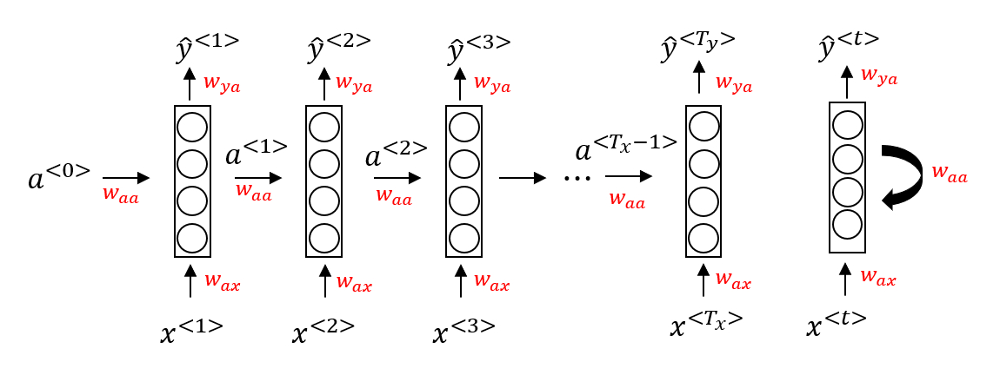

# Sequence Models

* Sequence data 指的是一連串的 data
  * 例如訓練 input 一連串聲音 output 成文字 (speech recognition)
* 我們要利用例如 Recurrent Neural Network (RNN) 來建立出 sequence model
  * model 將幫助我們把 non-sequence/sequence data 轉換成 non-sequence/sequence data

# Notation

* 假設有一個 name entity recognition 案例
  * 要標示出所有的人名

$$
\begin{aligned}
x =  \text{Harry Potter and Hermione Granger invented a new spell.}\\
y =  \text{{\color{red}Harry Potter} and {\color{red}Hermione Granger} invented a new spell.}
\end{aligned}
$$

* 句子中每個字依照順序會標註成

$$
\begin{aligned}
\text{Harry} &: x^{<1>} \\
\text{Potter} &: x^{<2>} \\&...
\end{aligned}
$$

* 因為 y 跟 x 的字一模一樣，所以用 1 標示是要找的人名

$$
\begin{aligned}
\text{Harry}: y^{<1>} &= 1\\
\text{Potter}: y^{<2>} &= 1\\
\text{and}: y^{<3>} &= 0\\&...
\end{aligned}
$$

* 另外 $$T_x = 9$$ 表示句子的字數，同樣方式表達 y 的字數 $$T_y = 9$$

* 因為可能有多筆 training set，若要表示第 i 筆 data 的第 t 個 word

$$
X^{(i)<t>}, y^{(i)<t>}
$$

* 表達字數的方式也差不多

$$
T_x^{(i)} = 9, T_y^{(i)} = 9
$$

## Vocabulary (Dictionary)

* 通常會用一整個列表記錄所有單字，一個列表可能會有 30 ~ 100000 個單字

$$
\begin{bmatrix}
\text{a} \\ \text{aaron} \\\vdots \\\text{and}\\\vdots\\\text{Harry}\\\vdots\\\text{Potter}\\\vdots\\\text{zoo}
\end{bmatrix}
$$

* 上面的案例是一個 10000 個單字的 dictionary
  * `and` 的 index 在 367
  * `Harry` 在 4075
  * `Potter` 在 6830
* 接著用 one-hot 方式來呈現單字
  * 例如 Harry 就會是一個全為 0 但 index=4075 為 1 的 10000 長度向量

$$
x^{<1>} = \begin{bmatrix}
0\\0\\\vdots\\1 (4075^{th})\\\vdots\\0\\\vdots\\0
\end{bmatrix}
$$

* 該 model 的目標就是給定一堆 $$x^{<t>}$$ 找出各別對應的 $$y^{<t>}$$

# Recurrent Neural Network Model

## Why not standard network ?

* 以 Harry 例子來說，Input 9 個單字要產生 9 個 output，每個 input/output 又都是 10000 長的 one-hot vector
* 第一個問題
  * 每個 training set 的 input 跟 output 會不斷改變
* 第二個問題
  * Input features 之間並沒有 share 的關係
    * 在 $$x^{<1>}$$ 發現 Harry 是人名，$$x^{<87>}$$ 又是 Harry，那 1 能告訴 87 嗎?
* 第三個問題
  * 參數太多，計算量太大
* Recurrent Neural Network 沒有這些問題

## RNNs

* 我們會先讀第一個單字 $$x^{<1>}$$
  * 將他丟入 neural network 產生 $$\hat{y}^{<1>}$$
  * 同時會產生 $$a^{<1>}$$ 給下一個單字 $$x^{<2>}$$ 使用
    * 通常 $$a^{<0>}$$ 是一個 0 vector
* 所以 $$x^{<1>}$$ 可以共享資訊給 $$x^{<3>}$$ 來產生 $$\hat{y}_^{<3>}$$ 
  * 這個模型無法由 3 供應資訊給 1
  * 之後會談到雙向的 RNNs (Bidirectional RNNs)
* 所有的 neural networks 會共享三大參數
  * $$W_{ax}, W_{aa}, W_{ya}$$
  * 命名的規則 (已 ax 為例) : 跟 x 作用並產生 a
* 以一般化 $$x^{t}$$ 來解釋每個單字在網路中的 forward propogation

$$
\begin{aligned}
a^{<0>} &= 0 \\
a^{<t>} &= \text{tanh}(W_{aa} a^{<t-1>} + W_{ax}x^{<t>} + b_a) \\
\hat{y}^{<t>} &= \text{softmax}(W_{ya}a^{<t>} + b_y)
\end{aligned}
$$

* 第一個 activation function 可選擇 tanh 或 ReLU
* 第二個 activation function 可選擇 sigmoid 或 softmax

## Simplify Forward Propogation

* 為了講解之後較複雜的 RNNs，我們可以將 forward propogation 進一步簡化
* 將 Waa 和 Wax 合併為 Wa
  * 若 Waa 是一個 100*100 矩陣
  * 且 Wax 是一個 100*10000 矩陣
  * 那麼 Wa 就是 100*10100 的寬矩陣

$$
W_a = \begin{bmatrix}
W_{aa} \mid W_{ax}
\end{bmatrix}
$$

* 將 $$a^{<t-1>}$$ 和 $$x^{<t>}$$ 也合併起來
  * 若 a 是一個 100*1 向量
  * 且 x 是一個 10000*1 向量
  * 那麼合併後就是一個長為 10100*1 的向量

$$
\begin{bmatrix}
a^{<t-1>}\\ x^{<t>}
\end{bmatrix}
$$

* 新的 forward propogation 公式

$$
\begin{aligned}
a^{<t>} &= \text{tanh}(W_a [a^{<t-1>};x^{<t>}] + b_a) \\
\hat{y}^{<t>} &= \text{softmax}(W_{y}a^{<t>}+ b_y)
\end{aligned}
$$

## Backpropogation through time

* RNNs 的 backpropogation 又稱作 backpropogation through time
  * 因為由右至左推回來，像是時間逆流的感覺
* 要計算 backpropogation 之前，要先知道每個單字的 loss function
* 這邊使用 Cross-entropy loss 作為每個單字 (或說時間點) 的 loss function
* 也就是在 $$x^{<t>}$$ 時的 loss 表示為

$$
\mathcal{L}^{<t>}(\hat{y}^{<t>}, y^{<t>}) = -y^{<t>}\log\hat{y}^{<t>} - (1-y^{<t>})\log(1-\hat{y}^{<t>})
$$

* 而整體的 loss function 可以定義為

$$
\mathcal{L}(\hat{y}, y) = \sum_{t=1}^{T_x}\mathcal{L}^{<t>}(\hat{y}^{<t>}, y^{<t>})
$$

* 如此一來，就可以回推並更新 $$W_y, b_y, W_a, b_a$$

# Different types of RNNs

* 剛剛的網路建立在 $$T_x = T_y$$ 的狀況下
* 如果要達成各式不同的 input/output 勢必需要不同的網路形式

* One-to-One
  * 很無聊，就是個普通的神經網路
* One-to-Many
  * 用於 sequence generation 
  * e.g. music generation
    * 給定音樂種類，生產出一系列的音符
  * 要注意的是該種類會把 $$\hat{y}$$ 當作下一層的 input
* Many-to-One
  * 用於 sentiment classification
  * e.g. 電影評價打分數
    * 讀入一連串的評價，產出 1~5 的分數
* Many-to-many with same length
  * e.g. name entity recognition
    * 給定一串文字，標示出文字為名稱的部分
* Many-to-many with different length
  * e.g. machine translation
    * 給定一串英文，翻譯成長度不同的中文
  * 首先先讀取 x 的部分，最後再處理 y 的部分

# Language model and sequence generation

## Language Modelling

