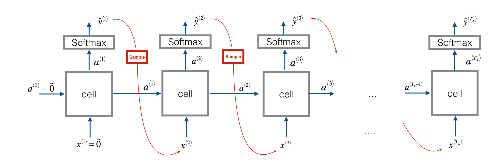
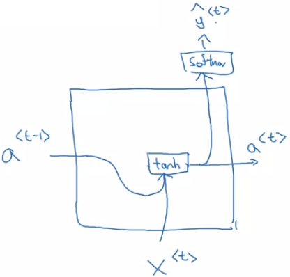
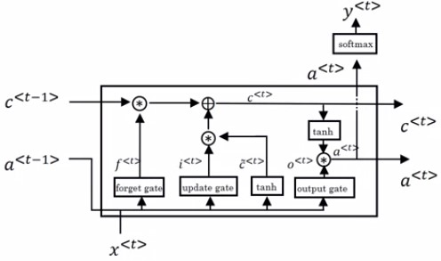
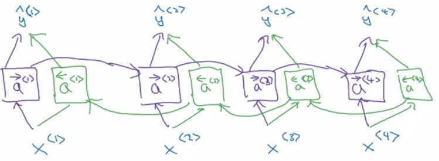

# Sequence Models

* Sequence data 指的是一連串的 data
  * 例如訓練 input 一連串聲音 output 成文字 (speech recognition)
* 我們要利用例如 Recurrent Neural Network (RNN) 來建立出 sequence model
  * model 將幫助我們把 non-sequence/sequence data 轉換成 non-sequence/sequence data

# Notation

* 假設有一個 name entity recognition 案例
  * 要標示出所有的人名

$$
\begin{aligned}
x =  \text{Harry Potter and Hermione Granger invented a new spell.}\\
y =  \text{{\color{red}Harry Potter} and {\color{red}Hermione Granger} invented a new spell.}
\end{aligned}
$$

* 句子中每個字依照順序會標註成

$$
\begin{aligned}
\text{Harry} &: x^{<1>} \\
\text{Potter} &: x^{<2>} \\&...
\end{aligned}
$$

* 因為 y 跟 x 的字一模一樣，所以用 1 標示是要找的人名

$$
\begin{aligned}
\text{Harry}: y^{<1>} &= 1\\
\text{Potter}: y^{<2>} &= 1\\
\text{and}: y^{<3>} &= 0\\&...
\end{aligned}
$$

* 另外 $$T_x = 9$$ 表示句子的字數，同樣方式表達 y 的字數 $$T_y = 9$$

* 因為可能有多筆 training set，若要表示第 i 筆 data 的第 t 個 word

$$
X^{(i)<t>}, y^{(i)<t>}
$$

* 表達字數的方式也差不多

$$
T_x^{(i)} = 9, T_y^{(i)} = 9
$$

## Vocabulary (Dictionary)

* 通常會用一整個列表記錄所有單字，一個列表可能會有 30 ~ 100000 個單字

$$
\begin{bmatrix}
\text{a} \\ \text{aaron} \\\vdots \\\text{and}\\\vdots\\\text{Harry}\\\vdots\\\text{Potter}\\\vdots\\\text{zoo}
\end{bmatrix}
$$

* 上面的案例是一個 10000 個單字的 dictionary
  * `and` 的 index 在 367
  * `Harry` 在 4075
  * `Potter` 在 6830
* 接著用 one-hot 方式來呈現單字
  * 例如 Harry 就會是一個全為 0 但 index=4075 為 1 的 10000 長度向量

$$
x^{<1>} = \begin{bmatrix}
0\\0\\\vdots\\1 (4075^{th})\\\vdots\\0\\\vdots\\0
\end{bmatrix}
$$

* 該 model 的目標就是給定一堆 $$x^{<t>}$$ 找出各別對應的 $$y^{<t>}$$

# Recurrent Neural Network Model

## Why not standard network ?

* 以 Harry 例子來說，Input 9 個單字要產生 9 個 output，每個 input/output 又都是 10000 長的 one-hot vector
* 第一個問題
  * 每個 training set 的 input 跟 output 會不斷改變
* 第二個問題
  * Input features 之間並沒有 share 的關係
    * 在 $$x^{<1>}$$ 發現 Harry 是人名，$$x^{<87>}$$ 又是 Harry，那 1 能告訴 87 嗎?
* 第三個問題
  * 參數太多，計算量太大
* Recurrent Neural Network 沒有這些問題

## RNNs

* 我們會先讀第一個單字 $$x^{<1>}$$
  * 將他丟入 neural network 產生 $$\hat{y}^{<1>}$$
  * 同時會產生 $$a^{<1>}$$ 給下一個單字 $$x^{<2>}$$ 使用
    * 通常 $$a^{<0>}$$ 是一個 0 vector
* 所以 $$x^{<1>}$$ 可以共享資訊給 $$x^{<3>}$$ 來產生 $$\hat{y}_^{<3>}$$ 
  * 這個模型無法由 3 供應資訊給 1
  * 之後會談到雙向的 RNNs (Bidirectional RNNs)
* 所有的 neural networks 會共享三大參數
  * $$W_{ax}, W_{aa}, W_{ya}$$
  * 命名的規則 (已 ax 為例) : 跟 x 作用並產生 a
* 以一般化 $$x^{t}$$ 來解釋每個單字在網路中的 forward propogation

$$
\begin{aligned}
a^{<0>} &= 0 \\
a^{<t>} &= \text{tanh}(W_{aa} a^{<t-1>} + W_{ax}x^{<t>} + b_a) \\
\hat{y}^{<t>} &= \text{softmax}(W_{ya}a^{<t>} + b_y)
\end{aligned}
$$

* 第一個 activation function 可選擇 tanh 或 ReLU
* 第二個 activation function 可選擇 sigmoid 或 softmax

## Simplify Forward Propogation

* 為了講解之後較複雜的 RNNs，我們可以將 forward propogation 進一步簡化
* 將 Waa 和 Wax 合併為 Wa
  * 若 Waa 是一個 100*100 矩陣
  * 且 Wax 是一個 100*10000 矩陣
  * 那麼 Wa 就是 100*10100 的寬矩陣

$$
W_a = \begin{bmatrix}
W_{aa} \mid W_{ax}
\end{bmatrix}
$$

* 將 $$a^{<t-1>}$$ 和 $$x^{<t>}$$ 也合併起來
  * 若 a 是一個 100*1 向量
  * 且 x 是一個 10000*1 向量
  * 那麼合併後就是一個長為 10100*1 的向量

$$
\begin{bmatrix}
a^{<t-1>}\\ x^{<t>}
\end{bmatrix}
$$

* 新的 forward propogation 公式

$$
\begin{aligned}
a^{<t>} &= \text{tanh}(W_a [a^{<t-1>};x^{<t>}] + b_a) \\
\hat{y}^{<t>} &= \text{softmax}(W_{y}a^{<t>}+ b_y)
\end{aligned}
$$

## Backpropogation through time

* RNNs 的 backpropogation 又稱作 backpropogation through time
  * 因為由右至左推回來，像是時間逆流的感覺
* 要計算 backpropogation 之前，要先知道每個單字的 loss function
* 這邊使用 Cross-entropy loss 作為每個單字 (或說時間點) 的 loss function
* 也就是在 $$x^{<t>}$$ 時的 loss 表示為

$$
\mathcal{L}^{<t>}(\hat{y}^{<t>}, y^{<t>}) = -y^{<t>}\log\hat{y}^{<t>} - (1-y^{<t>})\log(1-\hat{y}^{<t>})
$$

* 而整體的 loss function 可以定義為

$$
\mathcal{L}(\hat{y}, y) = \sum_{t=1}^{T_x}\mathcal{L}^{<t>}(\hat{y}^{<t>}, y^{<t>})
$$

* 如此一來，就可以回推並更新 $$W_y, b_y, W_a, b_a$$

# Different types of RNNs

* 剛剛的網路建立在 $$T_x = T_y$$ 的狀況下
* 如果要達成各式不同的 input/output 勢必需要不同的網路形式

* One-to-One
  * 很無聊，就是個普通的神經網路
* One-to-Many
  * 用於 sequence generation 
  * e.g. music generation
    * 給定音樂種類，生產出一系列的音符
  * 要注意的是該種類會把 $$\hat{y}$$ 當作下一層的 input
* Many-to-One
  * 用於 sentiment classification
  * e.g. 電影評價打分數
    * 讀入一連串的評價，產出 1~5 的分數
* Many-to-many with same length
  * e.g. name entity recognition
    * 給定一串文字，標示出文字為名稱的部分
* Many-to-many with different length
  * e.g. machine translation
    * 給定一串英文，翻譯成長度不同的中文
  * 首先先讀取 x 的部分，最後再處理 y 的部分

# Language model and sequence generation

## Language Modelling

* 假設 speech recognition 時聽到了一句話
  * “The apple and pear salad.”
* 那到底是聽到上面的句子還是 “The apple and pair salad.” ?
* 為了判斷是哪一句話，所以給兩句話機率的方法就是 **language modelling**

$$
P(\text{The apple and pear salad.}) = 5.7\times 10^{-10}\\
P(\text{The apple and pair salad.}) = 3.2\times 10^{-13}
$$

* 可以看到在這個 language model 中
  * The apple and pear salad 的機率比較高

## Build Language model with RNNs

* training set 會是 large **corpus** of english text
  * corpus 是一個 NLP 名詞，代表大量句子所組成的文本
* 首先要 tokenize corpus 中的所有單字，也就是建立字典
  * 標點符號可以 tokenize 可以不要

$$
\begin{aligned}
&\text{The } &\text{ Egyptian } &\text{ Mau } &\text{ is } &\text{ a } &\text{ bread } &\text{ of } &\text{ cat }. &\text{ <EOS> }\\
&y^{<1>}&y^{<2>}&y^{<3>}&y^{<4>}&y^{<5>}&y^{<6>}&y^{<7>}&y^{<8>}&y^{<9>}
\end{aligned}
$$

* tokenize 前有時會增加一個 `<EOS>` 代表句子結束
* tokenize 會將每一個單字轉換為 one hot vector 
  * 假設有一個 10000 單字的字典，那就會在該單字的 index 設 1 其他設 0
  * 今天遇到一個不在字典的單字，例如 `Mau`
    * 那就會將他設定在 `<UNK>` 的位置，表示 unknown

* Tokenize 後就可以將他們 input 到 RNN 訓練

* 首先 $$x^{<1>}$$ 和 $$a^{<0>}$$ 都設為 0
* 第一個 timestep 算出的 $$\hat{y}^{<1>}$$ 代表字典中所有單字是句子中第一個字的機率
  * 有 10002 個字，包括 `EOS` 和 `UNK`
    $$P(\text{a})P(\text{aaron})\cdots P(\text{cat})\cdots P(\text{UNK})P(\text{EOS})$$
* 第二個 timestep 的 $$x^{<2>}$$ 就是原本句子得到的 $$y^{<1>}$$
  * 加上上一個 timestep 算出的 $$a^{<1>}$$
  * 所以算出來的 $$\hat{y}^{<2>}$$ 代表出現 cats 後字典裡每一個單字是下一個字的機率
  * 所以 average 應該要是最高才對
    $$
    P(\text{average}\mid \text{cats}) \text{ should be the highest}
    $$
* 以此類推，$$\hat{y}^{<3>}$$ 表示 cats average 出現後，字典中每個單字的出現機率
  $$
  P(\text{15} \mid \text{cats average})\text{ should be the highest}
  $$

* 為了要訓練這個 RNN 我們定義 cost function
  * 在 predict 第 t 個單字時的 softmax loss function 為
    $$
    \mathcal{L}(\hat{y}^{<t>}, y^{<t>})=-\sum_i y_i^{<t>}\log\hat{y}_i^{<t>}
    $$
  * Overall 的 Cost function 為
    $$
    \mathcal{L} = \sum_t \mathcal{L}^{<t>}(\hat{y}^{<t>}, y^{<t>})
    $$

* 總結一下，要預測一個句子 $$P(y^{<1>},y^{<2>},y^{<3>})$$的機率
  * 等於要計算 $$P(y^{<1>})$$
  * 以及知道 $$P(y^{<1>})$$ 下的 $$P(y^{<2>})$$ 為何
  * 再來是 $$P(y^{<1>}, y^{<2>})$$ 下 $$P(y^{<3>})$$ 為何

$$
P(y^{<1>},y^{<2>},y^{<3>}) = P(y^{<1>})P(y^{<2>}\mid y^{<1>})P(y^{<3>}\mid y^{<1>},y^{<2>})
$$

## Sampling novel sequences

* 訓練好的 language model 可以用 sampling 方式來呈現他所學的結果
* Sampling 方式就像 one-to-many model
  * 給定 $$a^{<0>} = x^{<1>} = \vec{0}$$
  * 算出 $$\hat{y}^{<1>}$$ 之後，用 `np.random.choice` 方式從中選取任意一個 sample
  * 這個 sample 作為 $$x^{<2>}$$ 繼續算出 $$\hat{y}^{<2>}$$ 再選一個 sample
  * 以此類推直到 sampling 到 EOS 或是自訂回合數就停止

* 以上的方法每個 $$x^{<t>}$$ 都是一個單字，稱作 word level model
  * $$\text{Vocabulary} = [\text{a}, \text{aaron},\cdots, \text{zoo}, \text{<UNK>}]$$
* 我們可以使用 character 作為每個 inputs
  * 可以有大小寫字母、數字、符號
  * $$\text{Vocabulary} = [\text{a, b, c, ..., z, ., ;, 0, ..., 9, A, ...,Z}]$$
  * 優點是不會有 `<UNK>`
  * 缺點是資料量變大，計算變大、訓練成本過高
    * 不過隨著硬體發展，有一些專案使用 character level model
* Sampling example
  * 下圖左是一個從 news 訓練出的 model 所產生的 sampling novel sequences
  * 下圖右則是讀完沙士比亞文章所產生的 sequences

# Vanishing gradients with RNNs

* 觀察以下兩句句子

$$
\text{The cat},\text{ which already ate } \cdots, \text{ was full.} \\
\text{The cats},\text{ which already ate } \cdots, \text{ were full.} \\
$$

* 人類可以記住非常前面的詞 (cat/cats) 來去判斷很後面的詞 (was/were)
* 但目前的 basic RNN models 很難去找出這種 **Long-term Dependencies**
* 原因跟 deep neural networks 已提過的 **vanishing gradients** 有著很大關係
  * 回憶一下 vanishing gradients 是因為 backprop 的導數小於 1
  * 造成越往回走梯度越小，最終使得梯度消失

## Vanishing gradients in RNNs

* RNN 中也有類似 vanishing gradient 的情況，在 RNN 中會出現 local influences
* 舉例來說 $$\hat{y}^{<3>}$$ 只會跟 $$x^{<1>}, x^{<2>}, x^{<3>}$$ 有較大關係
* 假設 was 在 $$\hat{y}^{<100>}$$ 那他就無法跟最前面的 cat/cats 互相影響了
* 這造成 basic RNN model 有著無法處理 long-term dependencies 的弱點

> 補充 : RNN 也有可能出現 Exploding gradient 但情況較少
> 
> 而且梯度爆炸比較好偵錯，只要參數有問題或是出現 numerial overflow (出現 NaN) 就會知道
> 
> 並且可以用 **gradient clipping** 方法解決 (設定 threshold 避免梯度繼續增高)

* 為了處理 RNN 中的 vanishing gradient，要使用 GRU 及 LSTM 的技術

# Gated Recurrent Unit (GRU)

* 先回顧 basic RNN 的架構，在計算 $$a^{<t>}$$ 時是這樣計算
  $$a^{<t>} = g(W_a[a^{<t-1>}, x^{<t>}]+b_a)$$
  * 可以將 basic RNN 畫成下圖表示

* GRU 在 basic RNN 中加入一個 **memory cell** $$(c)$$ 的概念
* 回到原本的句子，目標是讓網路可以記憶 `cat` 並在之後知道要使用 `was`
  * $$\text{The cat, which already ate ... was full.}$$
* 定義每一個 $$c^{<t>}$$ 會和 $$a^{<t>}$$ 相等 $$c^{<t>} = a^{<t>}$$
* 然後定義 $$\tilde{c}^{<t>}$$ 是可能取代掉 $$c^{<t>}$$ 的候補
  * $$\tilde{c}^{<t>} = \text{tanh}(W_c[c^{<t-1>}, x^{<t>}]+b_c)$$
* 接著定義一個 **Update Gate** $$(\Gamma_u)$$ 用來決定是否要用 $$\tilde{c}^{<t>}$$ 取代掉 $$c^{<t>}$$
  * Update Gate 最好要能 output 0/1 值，1 決定取代、0 放棄取代，所以使用 sigmoid function
  * $$\Gamma_u = \sigma(W_u [c^{<t-1>},x^{<t>}]+b_u)$$
* 最後用以下公式決定每個 time step 要不要更新 $$c^{<t>}$$
  * $$c^{<t>} = \Gamma_u \times \tilde{c}^{<t>} + (1-\Gamma_u) \times c^{<t-1>}$$
    * 當 $$\Gamma_u = 1$$ 時，後面被消掉，所以 $$c^{<t>} = \tilde{c}^{<t>}$$
    * 當 $$\Gamma_u = 0$$ 時，前面被消掉，所以 $$c^{<t>} = c^{<t-1>}$$
 
 ## Example

* 回到 cat 的句子問題
  * 在 cat 時把 $$\tilde{c}^{<t>} = 1, \Gamma_u = 1$$
    * 此時的 $$c^{<t>}$$ 就會被設定為 1 (假設 1 代表單數、0 代表多數)
  * 接著句子持續下去，每一個的 $$\Gamma_u$$ 都設定為 0，避免 cat 的資訊被刷掉
  * 直到 was 的 time step 出現，我們就可以用 $$c^{<t>}$$ 告訴他是 cat 要用 was
  * 等到 was 結束，不會再用到這個資訊，在之後的某個地方就會設定 $$\Gamma_u = 1$$ 更新
* 因為使用 sigmoid 作為 $$\Gamma_u$$ 的計算方式
  * 使得 $$\Gamma_u$$ 長期都會非常接近 0 或是 1
  * 當 $$\Gamma_u = 1$$ 時，$$c^{<t>}$$ 就會被更新
  * 當 $$\Gamma_u = 0$$ 時，$$c^{<t>}$$ 就會保持 $$c^{<t-1>}$$
  * 由於 c 經過很長時間依然不變，且 c 就是 a，所以也解決了 vanishing gradients

## Simplified GRU

* 在 GRU 的 network 中
  * 先用 $$c^{<t-1>}$$ 和 $$x^{<t>}$$ 進行 `tanh` 得到 $$\tilde{c}^{<t>}$$ 
  * 再用 $$c^{<t-1>}$$ 和 $$x^{<t>}$$ 進行 `sigmoid` 得到 $$\Gamma_u$$
  * 然後透過紫色區塊 (就是決定是否更新) 來更新新的 $$c^{<t>} = a^{<t>}$$
  * 最後跟一般一樣，產出 $$\hat{y}^{<t>}$$
* 要注意的是，$$c^{<t>}$$ 可以是一個 vector
  * 若是 $$c^{<t>}$$ 是一個 100 dimensional 的向量
  * 那麼 $$\tilde{c}^{<t>}, \Gamma_u$$ 也會是 100 dimensional
  * 而更新 $$c^{<t>}$$ 的乘法就會是 element-wise 的乘法
    $$c^{<t>} = \Gamma_u \ast \tilde{c}^{<t>} + (1-\Gamma_u) \ast c^{<t-1>}$$

## Full GRU

* 以上的 GRU 是簡化過的 GRU
* 在完整的 GRU 中，會再添加一個 **Relevance Gate** $$\Gamma_r$$
* Relevance gate 用來表示 $$c^{<t>}$$ 和 $$\tilde{c}^{<t>}$$ 的關聯性
* 我們在原本的 $$\tilde{c}^{<t>}$$
  * $$\tilde{c}^{<t>} = \text{tanh}(W_c[c^{<t-1>}, x^{<t>}]+b_c)$$
* 加入 Relevance gate
  * $$\tilde{c}^{<t>} = \text{tanh}(W_c[\Gamma_r \times c^{<t-1>}, x^{<t>}]+b_c)$$
* 而 Relevance gate 的算法也很簡單
  * $$\Gamma_r = \sigma(W_r[c^{<t-1>}, x^{<t>}] + b_r)$$

* Full GRU 的算式如下

$$
\begin{aligned}
\tilde{c}^{<t>} &= \text{tanh}(W_c[\Gamma_r \times c^{<t-1>}, x^{<t>}]+b_c)\\
\Gamma_u &= \sigma(W_u [c^{<t-1>},x^{<t>}]+b_u)\\
\Gamma_r &= \sigma(W_r[c^{<t-1>}, x^{<t>}] + b_r)\\
c^{<t>} &= \Gamma_u \times \tilde{c}^{<t>} + (1-\Gamma_u) \times c^{<t-1>}
\end{aligned}
$$

> 補充 : GRU 最重要的兩篇論文 :
> * [Cho et al., 2014. On the properties of neural machine translation: Encoder-decoder approaches](https://arxiv.org/pdf/1409.1259.pdf)
> * [Chung et al., 2014. Empirical Evaluation of Gated Recurrent Neural Networks on Sequence Modeling](https://arxiv.org/pdf/1412.3555.pdf)

# Long Short Term Memory (LSTM)

* LSTM 跟 GRU 長的很像，但其實 LSTM 是較早出現的架構
* LSTM 捨棄了 **relevance gate**，保留 **update gate**，並新增了 **forget gate** 和 **output gate**
  * 所以 LSTM 共有三個 gates
* LSTM 不再讓 $$c^{<t>} = a^{<t>}$$，並將兩者分開來計算

$$
\begin{aligned}
\tilde{c}^{<t>} &= \text{tanh}(W_c[a^{<t-1>}, x^{<t>}]+b_c)\\
\Gamma_u &= \sigma(W_u [a^{<t-1>},x^{<t>}] + b_u)\\
\Gamma_f &= \sigma(W_f[a^{<t-1>}, x^{<t>}] + b_f)\\
\Gamma_o &= \sigma(W_o[a^{<t-1>}, x^{<t>}] + b_o)\\
c^{<t>} &= \Gamma_u \ast \tilde{c}^{<t>} + \Gamma_f \ast c^{<t-1>} \\
a^{<t>} &= \Gamma_o \ast \text{tanh}(c^{<t>}) 
\end{aligned}
$$

* 首先 $$\tilde{t}^{<t>}$$ 不再使用 $$c^{<t-1>}$$ 而是使用 $$a^{<t-1>}$$ 來跟著 $$x^{<t>}$$ 一起計算
* 然後依次算出 $$\Gamma_u, \Gamma_f, \Gamma_o$$
* 更新 $$c^{<t>}$$ 時，不再是兩者取一，而是將 $$c^{<t-1>}$$ 乘上 forget gate 後，**加進** update 的 $$\tilde{t}^{<t>}$$
* 最終用 output gate 乘上 $$\text{tanh}(c^{<t>})$$ 來更新 $$a^{<t>}$$

## LSTM nets

* 單個 LSTM 模型可以表示如下

* 接收上一層的 $$c^{<t-1>}, a^{<t-1>}$$
* 結合 $$x^{<t>}$$ 算出三個 gate 和 $$\tilde{c}^{<t>}$$
* 計算出這一層的 $$c^{<t>}, a^{<t>}$$ 給下一層使用
* 算出預測值 $$\hat{y}^{<t>}$$
* 將多個 LSTM 相連在一起就是 LSTM network

## Peephole Connection

* 上面的 LSTM 的三個 gate 值只有使用 $$x^{<t>}, a^{<t-1>}$$ 計算出來
* 但在實作上有一種方法將 $$c^{<t-1>}$$ 也帶入計算 gate 值
* 這種方法稱為 **Peephole connection**
* 注意點是，若 gate 是個 100 dimensional 的 vector
  * 那麼 c 的第 i 個值，只會影響到 gate vector 中的第 i 個值
  * 也就是 c 和 gate 的關係是 1 對 1 的
  * 跟 GRU 在更新 gate 是不一樣的

$$
\begin{aligned}
\Gamma_u &= \sigma(W_u[a^{<t-1>}, x^{<t>}, c^{<t-1>}] + b_u)\\
\Gamma_f &= \sigma(W_f[a^{<t-1>}, x^{<t>}, c^{<t-1>}] + b_f)\\
\Gamma_o &= \sigma(W_o[a^{<t-1>}, x^{<t>}, c^{<t-1>}] + b_o)
\end{aligned}
$$

# Bidirectional RNN (BRNN)

* 前面也說過，單方向的 RNN 會無法處理一些問題
* 例如單字必須透過後方單字才能辨別是否是人名

$$
\begin{aligned}
&\text{He said, "Teddy bears are on sales!"}\\
&\text{He said, "Teddy Roosevelt was a great President!"}
\end{aligned}
$$

* 上面兩個句子，只讀前三個字，可能會判斷兩個 Teddy 都是人名
* 但事實上只有第二句的 Teddy 指的是人名
* 為了解決此問題，出現了能夠雙向處理的 RNN － **Bidirectional RNN (BRNN)**

* 為了簡化問題，假設現在只讀了前四個字 `He said Teddy Roosevelt`
* 首先一如往常將句子由左至右產出 $$a^{<1>}, a^{<2>}, a^{<3>}, a^{<4>}$$ (以 $$\rightarrow$$ 表示)
* 接著再將句子由右至左產出 $$a^{<4>}, a^{<3>}, a^{<2>}, a^{<1>}$$ (以 $$\leftarrow$$ 表示)
  * 要注意的是，兩個都是 forward propogation，並非 backpropogation !
* 所以現在要計算句子中任意一個 $$\hat{y}^{<t>}$$ 都可以配合左右兩邊的資訊來計算
  * $$\hat{y}^{<t>} = g(W_y\begin{bmatrix}\overrightarrow{a}^{<t>}, \overleftarrow{a}^{<t>}\end{bmatrix}+b_y)$$
* 例如要計算 $$\hat{y}^{<3>}$$ 的 Teddy 為人名的機率
  * $$\hat{y}^{<3>} = g(W_y\begin{bmatrix}\overrightarrow{a}^{<3>}, \overleftarrow{a}^{<3>}\end{bmatrix}+b_y)$$
  * 他考慮的 $$\overrightarrow{a}^{<3>}$$ 考慮了 a1, a2 的 `He said`
  * 他考慮的 $$\overleftarrow{a}^{<3>}$$ 考慮了 a4 的 `Roosevelt`
* BRNN 的缺點是需要完整的句子序列，才可以訓練並預測句子中的任意單字
* 若用在 speech recognition，不可能等所有話講完，再慢慢處理所有文字
* 所以在 speech recognition 的實際應用上，不會使用 standard BRNN
* 但是在能夠一次取得完整句子的 NLP 應用中， standard BRNN 是很有效率的

# Deep RNNs (DRNN)

* 到目前為止見到的只是 one hidden layer 的 RNN model
* 事實上 RNN 也可以有多個 hidden layer，只是不會像 CNN 那麼多
* 上圖有幾個 notation 需要解釋
  * $$[l]$$ 用來代表第 l 層
  * $$<t>$$ 用來代表第 t 個 time step
  * 所以 $$a^{[2]<3>}$$ 代表是第 2 個 hidden layer 在第 3 個 timestep 的狀況
* 另外在 parameters 也有不同
  * $$W_a^{[l]}$$ 代表在第 l 層的 $$W_a$$
  * $$b_a^{[l]}$$ 代表在第 l 層的 $$b_a$$
  * 所以 $$a^{[2]<3>}$$ 的算法為
    $$a^{[2]<3>} = W_a^{[2]}\begin{bmatrix}a^{[2]<2>}, a^{[1]<3>}\end{bmatrix} + b_a^{[2]}$$
* DRNN 中的每一個 blocks 可以是一般的、GRU、LSTM blocks
* DRNN 在計算 $$\hat{y}^{<t>}$$ 前，也可以先接上一連串的 fully-connected networks
* 因為 RNN 的計算量已經相當龐大，所以 DRNN 的 hidden layers 數目並不會太多

