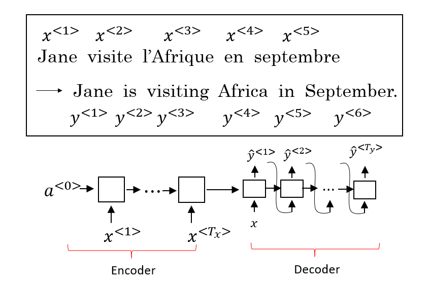
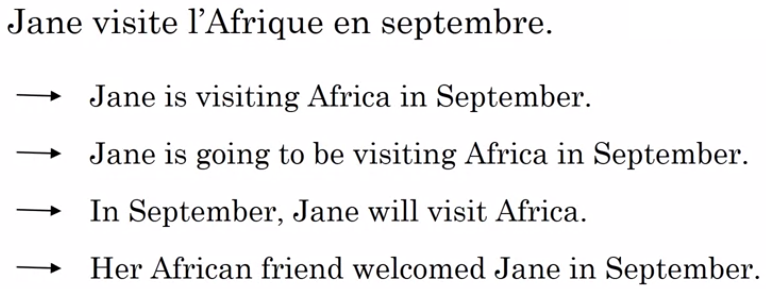
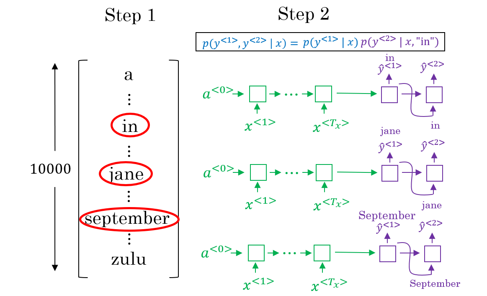
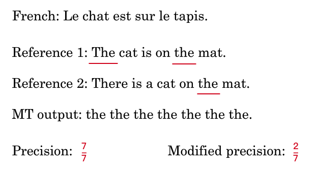
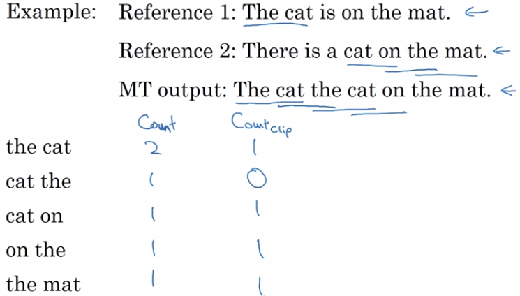
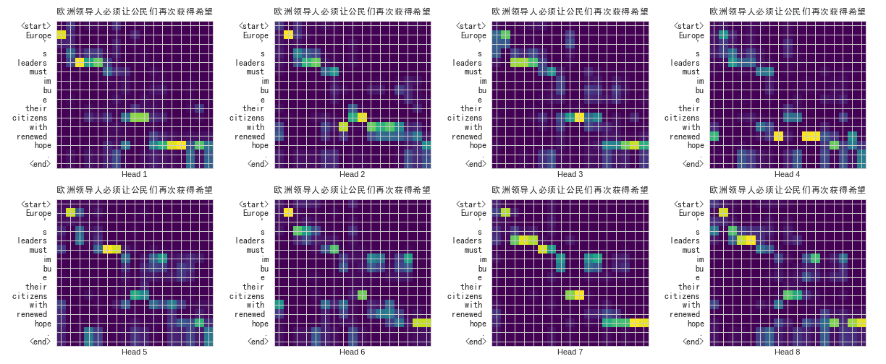

# Basic Models

* Seq2Seq (Sequence-to-Sequence) 是一種用於序列到序列轉換的模型
  * e.g. Machine translation, Speech recognition
* Seq2Seq 模型包含 **Encoder** 和 **Decoder**
  * 可以想像人類要翻譯一段英翻中，通常需要將英文編碼成自己的想法，再將想法解碼成中文

* Seq2Seq 也用在 Image Captioning
* 例如下圖將 AlexNet 的最後一層 softmax 改為 RNN 作為 **Decoder**

> * Seq2Seq 相關論文
>   * [Sutskever et al., 2014. Sequence to sequence learning with neural networks](https://arxiv.org/pdf/1409.3215.pdf)
>   * [Cho et al., 2014. Learning phrase representaions using RNN encoder-decoder for statistical machine translation](https://arxiv.org/abs/1406.1078)
> * Image Caption 相關論文
>   * [Mao et. al., 2014. Deep captioning with multimodal recurrent neural networks](https://arxiv.org/pdf/1412.6632.pdf)
>   * [Vinyals et. al., 2014. Show and tell: Neural image caption generator](https://arxiv.org/pdf/1411.4555.pdf)
>   * [Karpathy and Fei Fei, 2015. Deep visual-semantic alignments for generating image descriptions](https://arxiv.org/pdf/1412.2306.pdf)

# Picking the most likely sentence

* 我們之前學過用 language model 進行 sampling 時
  * Decoder 的 input a 和 x 都是 0 向量
* 在 machine translation 的 Decoder 的 input 則不同
  * Decoder 的 input 是 encoder 最後的輸出
  * 所以機器翻譯像是建立一個 **Conditional Language Model**
  * $$P(\hat{y}^{<1>}, \cdots, \hat{y}^{<T_y>} \mid x^{<1>}, \cdots, x^{<Tx>})$$
  * 我們可以簡化成 $$P(\hat{y}\mid x)$$
    * 其中 $$\hat{y}$$ 是要翻譯出的句子
    * 而 $$x$$ 是原本語言的句子
* 一個句子的翻譯可以產出多種不一樣的句子 (以下是法翻英的結果)

* 我們的目標就是從所有的翻譯中，找到最棒的那一個句子
  * $$\text{arg max}_{\hat{y}} P(\hat{y}\mid x)$$

## Why not greedy search ?

* 那麼為什麼不乾脆在抓每一個 $$\hat{y}$$ 時，都挑機率最大的就好 ?
  * 原因有兩個
    1. 今天 Jane is 是前兩個字，那麼第三個字在 going 的機率可能比 visiting 還要高
        * 因為 embedding 學到的 going 出現機率較多
    2. 若字典有 10000 個單字，那麼 10 個字就有 10 的 10000 次方選擇
        * 顯然 greedy 沒有那麼神可以一次找到最佳解

# Beam Search

* 通常我們使用 beam search 來應用於 machine translation
* Beam search 一次考慮多種可能性
* 我們會設定一個 **beam width** 表示考慮幾種可能性

* 假設我們設定 width = 3 在 $$\hat{y}^{<1>}$$ 找到了 in, jane, september 可能性最高
* 於是就針對這三個 RNNs 找下一個 $$\hat{y}^{<2>}$$
  * 也就是找 $$P(\hat{y}^{<2>} \mid x, \text{ in}), P(\hat{y}^{<2>} \mid x, \text{ jane}), P(\hat{y}^{<2>} \mid x, \text{ september})$$
* 接著我們找到 "in september", "jane is", "jane visits" 這三個
  * 代表 "september" 為第一個字的句子已經被剔除掉了
  * 我們就以這三個句子往下建立句子
  * 每次在建立時，會把所有字典的字都抓出來比對，找出最高機率的
    * "jane is -> [a, aaron, ..., september, ..., visit, ..., zoo, \<EOS>]"
* 用機率模型表示，我們在決定前兩個單字時
  * $$P(\hat{y}^{<1>}, \hat{y}^{<2>}\mid x) = P(\hat{y}^{<1>}\mid x)P(\hat{y}^{<2>}\mid x, \hat{y}^{<1>})$$
    * 我們就是在取這個機率最大的前三個句子
* 以此類推，最後一個單字的挑選就是
  * $$\text{arg max} \prod_{t=1}^{T_y} P(\hat{y}^{<t>}\mid x, \hat{y}^{<1>}, \cdots, \hat{y^{<t-1>}})$$
* 若是 beam width 設定為 1 時，就是 greedy search

## Refine Beam Search

$$
\text{arg max} \prod_{t=1}^{T_y} P(\hat{y}^{<t>}\mid x, \hat{y}^{<1>}, \cdots, \hat{y^{<t-1>}})
$$

* 回顧剛剛的公式會發現，多個小於 1 的機率相乘後，會造成 **Numerical Underflow**
  * 變成極小的 floating number，導致電腦無法存取
* 所以要透過 **Length Normalization** 來優化 beam search
  * 簡單來說，就是對所有機率取 log 並做平均
  * 因為取 log 後的最大值，依然等於原來的最大值

$$
\text{arg max}\frac{1}{T_y^{\alpha}} \sum_{t=1}^{T_y}\log P(\hat{y}^{<t>}\mid x, \hat{y}^{<1>}, \cdots, \hat{y^{<t-1>}})
$$

* 在最前面多了對整個公式除以句子長度的標準化
  * 標準化的原因是為了減少對輸出長句子的懲罰
  * 因為機率的原因，有可能會以為輸出短句子就是好句子
* 而 $$\alpha$$ 是一個用來調節標準化的 hyperparameter
  * 當 $$\alpha = 1$$ 時表示除以整個句子長度來標準化，通常取 0.7
* 最後關於 beam width 的選擇
  * 如果太大，可以得到很好的結果，但 cost 非常高
  * 如果太小，會得到較差結果，但 cost cheaper
  * 在實際 production 時，通常使用 10 - 100
  * 而在發表 paper 時，通常使用 1000 - 3000 使 paper 得到最高成效

## Error Analysis in Beam Search

* 由於 beam search 不見得能每次都 output 最好的句子
* 所以開發者可能會不斷嘗試修改 beam search 而忽略了有可能根本是 RNN 出錯
* 這裡提供一個 **error analysis** 的方法來偵錯
* 首先我們使用人類翻譯的句子當作最完美的 output $$y^\ast$$

$$
\begin{aligned}
&\text{Jane visite I'Afrique en septembre} \\\\
\text{Human :} &\text{Jane visits Africa in September.} &&(y^\ast)\\
\text{Algorithm :}&\text{Jane visits Africa last September.} &&(\hat{y})
\end{aligned}
$$

* 我們將句子重新丟入 RNN + beam search 訓練找出 $$y^\ast, \hat{y}$$ 的機率
* 就能來分析一下 $$P(y^\ast\mid x)$$ 和 $$P(\hat{y}\mid x)$$ 的關係
* 如果 $$P(y^\ast\mid x) > P(\hat{y}\mid x)$$
  * 表示是 beam search 出現錯誤，沒有選到最佳的單字
* 如我 $$P(y^\ast\mid x) < P(\hat{y}\mid x)$$
  * 表示 RNN 出現錯誤，預測出來的詞不是最佳的詞
* 最終我們對所有有人類翻譯的句子進行對比
  * 即可找出 Beam 跟 RNN 出現錯誤的比重，以此為根據來 debug

# Bleu Score

* Bleu (Bilingual Evaluation Understudy) Score 用於評分機器翻譯的品質
  * understudy 表示隨時可替代正規的後補
* 他的想法是機器翻譯的越接近人類翻譯，其分數就越高

* 最原始的 Bleu 錯誤的算法
  * 將機器翻譯的每個單字出現於人類翻譯的次數累加作為分子
  * 將機器翻譯出現該單字的次數作為分母
  * 結果全部都是同個字的錯誤翻譯得到了滿分
* 改進的 Bleu 算法
  * 只將該單字出現在該句子的最高出現次數作為分子
  * 分母和原本一樣
  * 於是準確度很合理的降低

## N-gram

* 以上抓取每個單字統計評分方法稱為 **unigram**
* 如果要抓取兩個單字來評分稱為 **bigram**
* 首先統計單字在機器翻譯結果中的 $$\text{count}$$
* 接著統計單字在人類翻譯結果中的 $$\text{count}_\text{clip}$$
  * 注意 $$\text{count}_\text{clip}$$ 不會超過 $$\text{count}$$

* 接著我們就會對 unigram, bigram, trigram, ... n-gram 做加總
  * $$p_n = \frac{\sum_{\text{n-gram}\in\hat{y}}\text{count}_\text{clip}(\text{n-gram})}{\sum_{\text{n-gram}\in\hat{y}}\text{count}(\text{n-gram})}$$
* 再來對 N 個 $$p_n$$ 加權平均得到
  * $$p_{ave} = exp(\frac{1}{N}\sum_{i=1}^N\log(p_n))$$

### Problems

* 當機器翻譯較短時，其單字出現於人類翻譯的次數可能增加，導致分數較高
* 改善方法是新增 **Brevity Penalty (BP)**，處罰那些短於人類翻譯的句子

$$
BP = 
\left\{\begin{matrix}
1,  &&\text{if MT-output-length} > \text{reference-output-length} \\ 
exp(\frac{1-\text{MT-output-length}}{\text{reference-output-length}}) && \text{otherwise}
\end{matrix}\right.
$$

* 最終得到的 Bleu 分數

$$
Bleu = BP \times exp(\frac{1}{N}\sum_{i=1}^N\log(p_n))
$$

* Bleu score 的提出成為很棒的評估指標貢獻
* 加速所有 machine translation, text generation 等領域的進步

> 相關論文： [Papineni et. al., 2002. A method for automatic evaluation of machine translation](http://www.aclweb.org/anthology/P02-1040.pdf)

# Attention Model

* 原本的 Seq2Seq 模型在處理長度較大的句子時，記憶力較差
  * 對於 Seq2Seq 長度大的句子，其 Bleu score 會隨著長度增加而遞減
* 人類在翻譯時也是如此，不太可能將整段句子讀完，再一口氣翻譯所有句子
* 於是 **Attention Model** 被提出，讓網路像人類一樣去處理句子，是目前最有影響力的想法之一

* 簡單來說，我們平行出另一個 RNN 網路，他的 activation 稱作 $$s$$ 跟原本 $$a$$ 作用相同
* 我們計算平行網路當下對所有 a 的注意力，並加權計算成 context $$c$$
* 平行網路即可透過 $$s, c$$ 來產出 $$\hat{y}$$

## Detail

* 下層是一個 BRNN，每個 time step 都可根據前後網路產生

$$a^{<t'>} = (\overrightarrow{a}^{<t'>}, \overleftarrow{a}^{<t'>})$$

* 上層是一個新的 many-to-many RNN model
* 透過前一個 timestep 產出的 $$s^{<t-1>}, \hat{y}^{<t>}$$ 
* 和下層提供的 $$c$$ 來輸出 $$\hat{y^{<t>}}$$

$$c^{<t>} = \sum_{t'} \alpha^{<t, t'>}a^{<t'>}$$

* **(注意上面一個是 alpha 一個是 activation a)**
* 其中的 $$\alpha^{<t, t'>}$$ 代表 $$\hat{y}^{<t>}$$ 對於 $$a^{<t'>}$$ 的注意力
* 而每個 timestep t 所擁有的所有 $$\alpha$$ 加總為 1

$$\sum_{t'}\alpha^{<t, t'>} = 1$$

* 為確保加總為 1 ，將使用 softmax 來計算 alpha

$$\alpha^{<t, t'>} = \frac{exp(e^{t, t'})}{\sum_{t'=1}^{T_x}exp(e^{t, t'})}$$

* 其中的 $$e^{<t, t'>}$$ 將透過 input $$s^{<t-1>}, a^{<t'>}$$ 至神經網路學習

* 注意力模型有一個缺點是 Time Complexity = $$O(n^3)$$

* 從機器翻譯來看，Attention 機制很好的運用在其中
* 在翻譯每一個單字時，都會注意到正確的原單字

> 相關論文 : [Bahdanau et. al., 2014. Neural machine translation by jointly learning to align and translate](https://arxiv.org/pdf/1409.0473.pdf)

<!-- # Speech Recognition -->
<!-- # Trigger Word Detection -->

