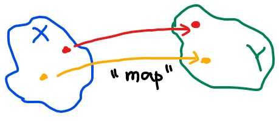
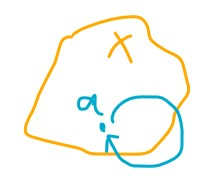
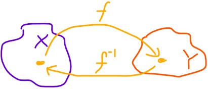
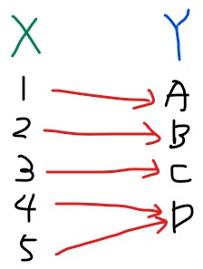
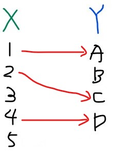
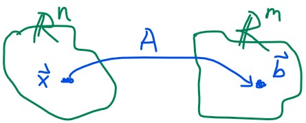
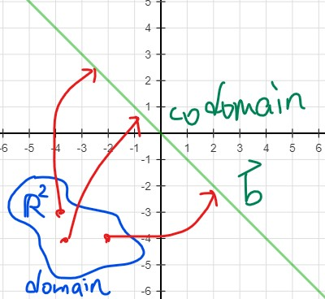
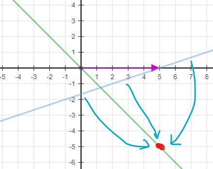

# Inverse functions and transformations

### Inverse of a function

* https://youtu.be/-eAzhBZgq28

我們先複習一下 function

$$
\begin{align}
&f: X \to Y \\
&f(a) = b
\end{align}
$$
還有 Identity function

$$
\mathbf{I_x}: X \to X \\
\mathbf{I_x}(a) = a \mid a\in X
$$
任何值經過 identity function 運算後，還是自己

看起來很無用，但他可以幫助我們很多，例如在底下的 inverse function 的證明中就可以用到他

#### Invertible

這邊講的是可逆函數 (invertible function)，

指的是 function 能透過對應的 inverse function 將值運算回自己

$$
\begin{align}
f&:X\to Y\\
f^{-1}&:Y\to X
\end{align}
$$
所以一個 function 可逆我們定義為
$$
\begin{align}
f:X\to Y \text{ invertible } \iff &\text{there exists } f^{-1}:Y\to X\\
&\text{s.t. }f^{-1} \circ f =  \mathbf{I_x} \\
&\text{and } f\circ f^{-1} = \mathbf{I_y}
\end{align}
$$
為什麼 function 和 inverse function 的組合會變成 Identity function

因為 f 先做，會從 X 變成 Y，這時 f-1 從 Y 再變回 X，就像在 X 執行 Identity function 一樣
$$
f^{-1}\circ f: (X\to Y) \to X
$$
另外一邊也是，換用函數方法表示
$$
f\circ f^{-1}: f(f^{-1}(b)) = b \mid b \in Y
$$

那任何 function 只要為 invertible ，他對應的 inverse function 是唯一的嗎？
$$
\text{ Is } f^{-1} \text{ unique ?}
$$
我們假設 f 有兩個 inverse function g 和 h
$$
f: X \to Y\\
g: Y \to X\\
h: Y \to X
$$
也就是說
$$
\begin{align}
g\circ f = \mathbf{I_x}\\
f\circ g = \mathbf{I_y}\\\\

h\circ f = \mathbf{I_x}\\
f\circ h = \mathbf{I_y}\\

\end{align}
$$
現在我們將 g 表示為跟 identity function 的 composition

沒有什麼問題，等於 g 讓 Y 變到 X 再變到 X 一樣
$$
\begin{align}
g &= \mathbf{I_x}\circ g\\
&=  (h\circ f)\circ g \\
&= h \circ (f \circ g) \\
&= h\circ \mathbf{I_y} \\
&= h
\end{align}
$$
第二和三行：Ix 等於 h 和 f 的 composition ，而我們學過 transformation 是有 associative 的

第四行：f 和 g 等於 Iy，表示先從 Y 轉到 Y，再從 Y 轉到 X，跟直接 h 是一樣的

第五行：所以 g = h 表示 inverse function 是 unique 的

### Invertibility implies a unique solution to f(x)=y

- https://youtu.be/7GEUgRcnfVE

上面證明只要 function 是 invertible ，其對應的 inverse function 就是 unique

現在我們想知道，若 function 是 invertible 那麼 x 是唯一從 f 變成 y 的值嗎？

我們先假設任何 y ，都有一個唯一的 x 經過 f(x) = y ，然後稱這個假設為函數 S
$$
S: Y\to X \\
S(y): \text{ The unique solution in } x \text{ to } f(x) = y
$$

現在有任意一個變數 b 在 Y subset 裡面， S(b) 代表的就是 X 中那一個會變成 b 的唯一 x
$$
S(b) = \text{the unique solution to }f(x) =b\\
\Rightarrow f(S(b)) = b
$$

我們將這個式子展開，發現 f 和 S 可以表示為 Iy ，因為先從 Y 到 X 再回 Y
$$
\begin{align}f(S(b)) &= (f \circ S)(b)\\
&= \mathbf{I_y} b\\
&= b
\end{align}
$$
先把這個記起來，我們反過來看另外一邊

若有 a 透過 f(a) 從 X 變到 Y，那麼對 f(a) 做 S transformation 能變回 a 嗎？

因為我們早已定義 S 會幫我們找到唯一的 x 值，所以很明顯要找的 x 就是 a
$$
S(f(a)) = \text{ the unique solution to } f(x) = f(a) \Rightarrow x = a
$$
我們也將這個式子展開
$$
\begin{align}
S(f(a)) &= (S \circ f)(a)\\
&= \mathbf{I_x}a\\
&= a
\end{align}
$$
我們發現 f 和 S 正是 invertible 的結果
$$
(f\circ S) = \mathbf{I_y}\\
(S\circ f) = \mathbf{I_x}\\
$$
所以結論：若 f 為 invertible ，任何 y 都是由唯一的 x 經過 f 而取得
$$
f:X\to Y \text{ invertible} \iff \forall y\in Y:\exist \text{ unique solution } x \text{ to } f(x) =y
$$

### Surjective (onto) and injective (one-to-one) functions

* https://youtu.be/xKNX8BUWR0g

#### Surjective (onto)

所有的 y 至少都會有一個 x map 到他，符合 f(x) = y
$$
\text{Every } y \in Y \,\exist \text{ at LEAST one }x\in \text{ such that } f(x) = y
$$

我們知道 Image 不一定要 map 到所有的 Y，但 onto 將會 map 到整個 Y
$$
Im(f) = Y = \text{range}(f)
$$

> 之前學過：Range 代表的是 x map 到 y 的 subset 範圍

舉個例子，所有的 Y 都至少有一人 map 到他

#### Injective (one-to-one)

所有的 y 只要有人 map 到他，都會是唯一，而上面例子中， 4 和 5 就不符合 one-to-one
$$
\text{For any }y \in Y \text{ at MOST one }x\in X \text{ such that } f(x) = y
$$
注意的是，可以有 y 不被任何人 map 到，但不可以一次有兩個以上的人 map 到 y

### Relating invertibility to being onto and one-to-one

* https://youtu.be/QIU1daMN8fw

現在我們可以重新定義 invertible，我們知道 invertible 原本的定義如下
$$
f:X\to Y \text{ invertible} \iff \forall y\in Y:\exist \text{ unique solution } x \text{ to } f(x) =y
$$
首先 **所有的 y** 都有一個 unique solution x 來對應他，這正好就是 **surjective (onto)** 的定義

再來 所有的 y 都有一個 **unique solution x** 來對應他，這正好也是 **injective (one-to-one)** 的定義

所以為了滿足 f is invertible， f 必須要滿足 surjective 以及 injective 兩者
$$
\begin{align}
f:X\to Y \text{ invertible} \iff
&f \text{ is surjective & injective} \\
&f \text{ is onto & one-to-one}
\end{align}
$$

### Determining whether a transformation is onto

* https://youtu.be/eR8vEdJTvd0

前面都是直接用定義和圖案來觀察 transformation 是否符合 onto，

我們知道 transformation 還可以轉為 matrix vector product

$$
\begin{align}
&\vec{x} \in \mathbb{R}^n \\
&T(\vec{x}) = \mathbf{A}\vec{x}  = \vec{b} \in \mathbb{R}^m
\end{align}
$$

用 matrix 來表示 transformation 時的 onto 定義為
$$
\begin{align}
&\text{for every }\vec{b} \in \mathbb{R}^m \\
&\exist \text{ at least one solution } \vec{x} \text{ to } \mathbf{A}\vec{x} = \vec{b}\\
&\text{where } \vec{x} \in \mathbb{R}^n
\end{align}
$$
我們知道 Ax 相乘其實就是 A 的 linear combination

而這個 combination 將會生成任意的 b in Rm
$$
\begin{align}
&\mathbf{A} = \begin{bmatrix} \vec{a_1}&\vec{a_2}&\cdots&\vec{a_n} \end{bmatrix},
\vec{x} = \begin{bmatrix}x_1\\x_2\\\vdots\\x_n\end{bmatrix} \\
&\mathbf{A}\vec{x} = x_1\vec{a_1} + x_2\vec{a_2} + \cdots + x_n\vec{a_n}
\end{align}
$$
所以要能夠滿足 onto Rm ，代表 A 的 column space 必須要能夠 span Rm
$$
\begin{align}
span(\vec{a_1},\vec{a_2}, \cdots, \vec{a_n} ) &= \mathbb{R}^m \\
C(\mathbf{A}) &= \mathbb{R}^m
\end{align}
$$
若 Ax 沒有 span 整個 Rm，代表沒有 onto

要出現這種情形，在代表 Ax = b 的 [A | b] 化簡為 [R (rref) | c] 時

會有一行全為 0 但結果不為 0 (no solution)
$$
\begin{bmatrix}\begin{array}{c|c}  &b_1 \\\mathbf{A}&\vdots\\&b_n\end{array}\end{bmatrix}
= 
\begin{bmatrix}\begin{array}{cccc|c}  
1&0&\cdots&0& \\
0&1&\cdots&0&\\
0&0&\cdots&0&2b_1+3b_2+\cdots\end{array}\end{bmatrix} = \text{Can't span } \mathbb{R}^m
$$

若 Ax 可以 span 整個 Rm，代表 onto

要出現這種情形，代表 rref(A) 必須在每一個 row 都出現 pivot entry，也就是每一行都是 pivot column
$$
\begin{align}
T \text{ is Onto} &\iff C(\mathbf{A}) = \mathbb{R}^m\\
&\iff m \text{ pivot entries} \\
&\iff m \text{ pivot columns} \\
&\iff \text{Rank}(\mathbf{A}) = \text{dim}(C(\mathbf{A})) = m
\end{align}
$$

在矩陣上就是 A 變到 rref(A) 之後，每一個 row 都有一個 leading one
$$
\begin{align}
&\mathbf{A} = &&\begin{bmatrix} \vec{a_1}&\vec{a_2}&\cdots&\vec{a_m}\end{bmatrix}\\\\
&\downarrow \text{rref}(\mathbf{A}) &&\downarrow\\\\
&\mathbf{R} = &&\begin{bmatrix} 
1_1&0&\cdots&0\\
0&1_2&\cdots&0\\
0&0&\cdots&1_m\\
\end{bmatrix} \Rightarrow \text{span}(\mathbb{R}^m) \Rightarrow \text{Onto}
\end{align}
$$

舉個例子，來確認 S 這個 transformation 是否符合 onto
$$
S = \mathbb{R}^2 \to \mathbb{R}^3, S(\vec{x}) = 
\begin{bmatrix} 1&2\\3&4\\5&6\end{bmatrix}
\vec{x}
$$
我們將 S matrix 化簡為 rref，發現只有 2 pivot entries
$$
\begin{bmatrix} 1&2\\3&4\\5&6\end{bmatrix} \to
\begin{bmatrix} 1&2\\0&2\\0&4\end{bmatrix} \to
\begin{bmatrix} 1&2\\0&1\\0&4\end{bmatrix} \to
\begin{bmatrix} 1&0\\0&1\\0&0\end{bmatrix} \Rightarrow
\text{rank}\left(\begin{bmatrix} 1&2\\3&4\\5&6\end{bmatrix} \right) = 2
$$
所以 S rank 為 2，S 不是 onto，也代表 S 不可能是 invertible

### Exploring the solution set of Ax = b

* https://youtu.be/1PsNIzUJPkc

我們來看一個 linear transformation
$$
\begin{align}
&T: \mathbb{R}^2 \to \mathbb{R}^2 \\
&T(\vec{x}) = \begin{bmatrix} 1&-3\\-1&3 \end{bmatrix}
\begin{bmatrix} x_1\\x_2 \end{bmatrix} =
\begin{bmatrix} b_1\\b_2 \end{bmatrix} \\
\Rightarrow 
&\begin{bmatrix} \begin{array}{cc|c} 1 & -3 &b_1 \\-1&3&b_2 \end{array} \end{bmatrix} =
\begin{bmatrix} \begin{array}{cc|c} 1 & -3 &b_1 \\0&0&b_1+b_2 \end{array} \end{bmatrix}
\end{align}
$$
我們發現這個 transformation 已經不可能是 onto

但我們可以知道，要讓 b 有結果， b1 + b2 必須等於 0
$$
b_1 + b_2 = 0 \rightarrow b_1 = -b_2
$$

也就是說任何 x 經過 T 一定要在 b1 = -b2 直線上的任何一點，才是有 solution

因為只有變成這條直線，沒有 span 整個 R2 ，所以 T 當然是沒有 onto 的

但我們可以找找看到底 domain 在哪裡

首先必須先遵守 b1 + b2 = 0 的原則，並且從第一列我們得到解
$$
x_1-3x_2 = b_1 \\
x_1 = b_1 + 3x_2
$$
也就是說只有 x vector (domain) 等於以下時，才會轉換到 b1 + b2 = 0 的直線上
$$
\vec{x} = \begin{bmatrix} x_1\\x_2 \end{bmatrix} =
 \begin{bmatrix} b_1\\0 \end{bmatrix}+
 x_2 \begin{bmatrix} 3\\1 \end{bmatrix}
$$
例如當 b 為 [5, -5] 時，domain 為
$$
\vec{x} = 
\begin{bmatrix} 5\\0 \end{bmatrix}+
 x_2 \begin{bmatrix} 3\\1 \end{bmatrix}
$$

淺藍色的直線就是我們的 x vector (domain)，上面的任何一點經過 T 都會 map 到 [5, -5]

當 b = [4, -4] 時， domain 就是 [4, 0] + x2 * [3, 1]

我們很好的 visualize 這個 transformation

那若我們要 map 到 b = [0, 0] 會發生什麼事

這時候 x 代表的就是 null space of A 了 ! 在這個例子就是 [3, 1] 乘以任何 scalar
$$
\begin{align}
&\mathbf{A}\vec{x} = \vec{0} \\

&\vec{x} = 
\begin{bmatrix} 0\\0 \end{bmatrix}+
 x_2 \begin{bmatrix} 3\\1 \end{bmatrix} \in N(\mathbf{A})
\end{align}
$$
所以我們可以把 solution set 統整為某個 particular vector 和 null space 的組合
$$
\begin{align}
&\text{Assuming } \mathbf{A}\vec{x} = \vec{b} \text{ has a solution} \\
&\text{The solution set = }
\begin{Bmatrix} \vec{x_p} \end{Bmatrix}\cup N(\mathbf{A})
\end{align}
$$

> 會在之後證明

而我們想要讓一個 transformation 能夠 one-to-one => 最多一個解

那這個 solution set 裡面的 null space 是必要是 empty 、空向量、zero vector

### Matrix condition for one-to-one transformation

我們知道要求 null space of A 的方法
$$
N(\mathbf{A}) = \mathbf{A}\vec{x} = \vec{0} \\
\begin{bmatrix} \mathbf{A} \mid \vec{0} \end{bmatrix} \Rightarrow
\begin{bmatrix} \text{rref}(\mathbf{A}) \mid \vec{0} \end{bmatrix}
$$
我們會得到類似這樣的 homogeneous solution
$$
\vec{x} = a\vec{n_1} + b\vec{n_2} + \cdots + c\vec{n_n} \\
N(\mathbf{A}) = \text{span}(\vec{n_1}, \vec{n_2}, \cdots, \vec{n_n})
$$

而要求得 b 有解，也就是要取得 inhomogeneous solution 的方法
$$
\mathbf{A}\vec{x} = \vec{b} \\
\begin{bmatrix} \mathbf{A} \mid \vec{b} \end{bmatrix} \Rightarrow
\begin{bmatrix} \text{rref}(\mathbf{A}) \mid \vec{b}' \end{bmatrix}
$$
我們會得到 particular solution + homogeneous solution
$$
\begin{align}
\vec{x} &= \vec{b}' + a\vec{n_1} + b\vec{n_2} + \cdots + c\vec{n} \\
&= \vec{x_p} + \vec{x_h}
\end{align}
$$

現在我們來證明這個 claim
$$
\text{Any solution to the inhomogeneous system } \mathbf{A}\vec{x} = \vec{b} \\
\text{ will take the form } \vec{x_p} + \vec{x_h}
$$

1. 將 xp + xh 帶入 A transformation，果然為 x 的解

$$
\begin{align}
&\text{Is }\vec{x_p} + \vec{x_h} \text{ a solution to }\mathbf{A}\vec{x} = \vec{b} \text{ ?} \\\\
&\mathbf{A}(\vec{x_p} + \vec{x_h}) =
\mathbf{A}\vec{x_p} + \mathbf{A}\vec{x_h} = \vec{b}+\vec{0} = \vec{b}
\end{align}
$$

> 因為 A*xp 為 Ax = b 的特定解，所以為 b 向量
>
> 因為 A*xh 為 Ax = 0 的解，所以為 0 向量

2. 利用所有 x 來減掉 xp ，最後也可以導出 xp + xh 為 x 的解

$$
\begin{align}
&\text{Is any solution }\vec{x} \text{ to }\mathbf{A}\vec{x}=\vec{b} 
\text{ takes the form } \vec{x} = \vec{x_p} + \vec{x_h} \text{ ?} \\\\

&\text{Assume }\vec{x} \text{ is any solution to }\mathbf{A}\vec{x} = \vec{b}\\
&\mathbf{A}(\vec{x} - \vec{x_p}) = \mathbf{A}\vec{x} - \mathbf{A}\vec{x_p} = \vec{b} - \vec{b} = \vec{0}
\end{align}
$$

也就是說
$$
(\vec{x}-\vec{x_p}) \text{ is a solution to }\mathbf{A}\vec{x} = \vec{0} \\
(\vec{x}-\vec{x_p}) \text{ is a member of }N(\mathbf{A})\\
(\vec{x}-\vec{x_p}) = \vec{x_h} \\
\vec{x} = \vec{x_p} + \vec{x_h}
$$

證明完所有 x 皆可以化為 particular solution + homogeneous solution 後，我們來看 one-to-one
$$
\begin{align}
\text{Under one-to-one condition:}\\
\text{Any solution} &= 
\begin{Bmatrix}\vec{x_p} + \vec{x_h}\mid \vec{x_h} \in N(\mathbf{A}) \end{Bmatrix} \text{ can only be 1 solution}\\
&\Rightarrow N(\mathbf{A}) = \begin{Bmatrix} \vec{0} \end{Bmatrix}
\end{align}
$$
也就是說
$$
\begin{bmatrix}\vec{a_1}&\vec{a_2}&\cdots&\vec{a_n}\end{bmatrix}
\begin{bmatrix}x_1\\x_2\\\vdots\\x_n\end{bmatrix} =
\begin{bmatrix}0\\0\\\vdots\\0\end{bmatrix} =
x_1\vec{a_1} + x_2\vec{a_2} + \cdots+ x_n\vec{a_n} = \vec{0}
$$
因為只能有 0 向量，所以
$$
x_1, x_2, \cdots, x_n = 0
$$
好像似曾相識，代表在 one-to-one 時：
$$
\begin{align}
C(\mathbf{A}) &= \text{span}(\vec{a_1}, \vec{a_2}, \cdots, \vec{a_n})\\
&\Rightarrow \vec{a_1}, \vec{a_2}, \cdots, \vec{a_n} \text{ are linear independence}\\
&\Rightarrow \vec{a_1}, \vec{a_2}, \cdots, \vec{a_n} \text{ are a basis for } C(\mathbf{A}) \\
&\Rightarrow \text{dim}(C(\mathbf{A})) = n \\
&\Rightarrow \text{Rank}(\mathbf{A}) = n
\end{align}
$$

xh 也會變成空的，而 any solution 只對應到 particular solution，所以為 one-to-one
$$
\text{Any solution} = \begin{Bmatrix}\vec{x_p}\end{Bmatrix} 
\Rightarrow
\text{one-to-one}
$$

