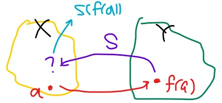

# Inverse functions and transformations

### Inverse of a function

* https://youtu.be/-eAzhBZgq28

我們先複習一下 function

$$
\begin{align}
&f: X \to Y \\
&f(a) = b
\end{align}
$$
還有 Identity function

$$
\mathbf{I_x}: X \to X \\
\mathbf{I_x}(a) = a \mid a\in X
$$
任何值經過 identity function 運算後，還是自己

看起來很無用，但他可以幫助我們很多，例如在底下的 inverse function 的證明中就可以用到他

#### Invertible

這邊講的是可逆函數 (invertible function)，

指的是 function 能透過對應的 inverse function 將值運算回自己

$$
\begin{align}
f&:X\to Y\\
f^{-1}&:Y\to X
\end{align}
$$
所以一個 function 可逆我們定義為
$$
\begin{align}
f:X\to Y \text{ invertible } \iff &\text{there exists } f^{-1}:Y\to X\\
&\text{s.t. }f^{-1} \circ f =  \mathbf{I_x} \\
&\text{and } f\circ f^{-1} = \mathbf{I_y}
\end{align}
$$
為什麼 function 和 inverse function 的組合會變成 Identity function

因為 f 先做，會從 X 變成 Y，這時 f-1 從 Y 再變回 X，就像在 X 執行 Identity function 一樣
$$
f^{-1}\circ f: (X\to Y) \to X
$$
另外一邊也是，換用函數方法表示
$$
f\circ f^{-1}: f(f^{-1}(b)) = b \mid b \in Y
$$

那任何 function 只要為 invertible ，他對應的 inverse function 是唯一的嗎？
$$
\text{ Is } f^{-1} \text{ unique ?}
$$
我們假設 f 有兩個 inverse function g 和 h
$$
f: X \to Y\\
g: Y \to X\\
h: Y \to X
$$
也就是說
$$
\begin{align}
g\circ f = \mathbf{I_x}\\
f\circ g = \mathbf{I_y}\\\\

h\circ f = \mathbf{I_x}\\
f\circ h = \mathbf{I_y}\\

\end{align}
$$
現在我們將 g 表示為跟 identity function 的 composition

沒有什麼問題，等於 g 讓 Y 變到 X 再變到 X 一樣
$$
\begin{align}
g &= \mathbf{I_x}\circ g\\
&=  (h\circ f)\circ g \\
&= h \circ (f \circ g) \\
&= h\circ \mathbf{I_y} \\
&= h
\end{align}
$$
第二和三行：Ix 等於 h 和 f 的 composition ，而我們學過 transformation 是有 associative 的

第四行：f 和 g 等於 Iy，表示先從 Y 轉到 Y，再從 Y 轉到 X，跟直接 h 是一樣的

第五行：所以 g = h 表示 inverse function 是 unique 的

### Invertibility implies a unique solution to f(x)=y

- https://youtu.be/7GEUgRcnfVE

上面證明只要 function 是 invertible ，其對應的 inverse function 就是 unique

現在我們想知道，若 function 是 invertible 那麼 x 是唯一從 f 變成 y 的值嗎？

我們先假設任何 y ，都有一個唯一的 x 經過 f(x) = y ，然後稱這個假設為函數 S
$$
S: Y\to X \\
S(y): \text{ The unique solution in } x \text{ to } f(x) = y
$$

現在有任意一個變數 b 在 Y subset 裡面， S(b) 代表的就是 X 中那一個會變成 b 的唯一 x
$$
S(b) = \text{the unique solution to }f(x) =b\\
\Rightarrow f(S(b)) = b
$$

我們將這個式子展開，發現 f 和 S 可以表示為 Iy ，因為先從 Y 到 X 再回 Y
$$
\begin{align}f(S(b)) &= (f \circ S)(b)\\
&= \mathbf{I_y} b\\
&= b
\end{align}
$$
先把這個記起來，我們反過來看另外一邊

若有 a 透過 f(a) 從 X 變到 Y，那麼對 f(a) 做 S transformation 能變回 a 嗎？

因為我們早已定義 S 會幫我們找到唯一的 x 值，所以很明顯要找的 x 就是 a
$$
S(f(a)) = \text{ the unique solution to } f(x) = f(a) \Rightarrow x = a
$$
我們也將這個式子展開
$$
\begin{align}
S(f(a)) &= (S \circ f)(a)\\
&= \mathbf{I_x}a\\
&= a
\end{align}
$$
我們發現 f 和 S 正是 invertible 的結果
$$
(f\circ S) = \mathbf{I_y}\\
(S\circ f) = \mathbf{I_x}\\
$$
所以結論：若 f 為 invertible ，任何 y 都是由唯一的 x 經過 f 而取得
$$
f:X\to Y \text{ invertible} \iff \forall y\in Y:\exist \text{ unique solution } x \text{ to } f(x) =y
$$

### Surjective (onto) and injective (one-to-one) functions

* https://youtu.be/xKNX8BUWR0g

#### Surjective (onto)

所有的 y 至少都會有一個 x map 到他，符合 f(x) = y
$$
\text{Every } y \in Y \,\exist \text{ at LEAST one }x\in \text{ such that } f(x) = y
$$

我們知道 Image 不一定要 map 到所有的 Y，但 onto 將會 map 到整個 Y
$$
Im(f) = Y = \text{range}(f)
$$

> 之前學過：Range 代表的是 x map 到 y 的 subset 範圍

舉個例子，所有的 Y 都至少有一人 map 到他

#### Injective (one-to-one)

所有的 y 只要有人 map 到他，都會是唯一，而上面例子中， 4 和 5 就不符合 one-to-one
$$
\text{For any }y \in Y \text{ at MOST one }x\in X \text{ such that } f(x) = y
$$
注意的是，可以有 y 不被任何人 map 到，但不可以一次有兩個以上的人 map 到 y

### Relating invertibility to being onto and one-to-one

* https://youtu.be/QIU1daMN8fw

現在我們可以重新定義 invertible，我們知道 invertible 原本的定義如下
$$
f:X\to Y \text{ invertible} \iff \forall y\in Y:\exist \text{ unique solution } x \text{ to } f(x) =y
$$
首先 **所有的 y** 都有一個 unique solution x 來對應他，這正好就是 **surjective (onto)** 的定義

再來 所有的 y 都有一個 **unique solution x** 來對應他，這正好也是 **injective (one-to-one)** 的定義

所以為了滿足 f is invertible， f 必須要滿足 surjective 以及 injective 兩者
$$
\begin{align}
f:X\to Y \text{ invertible} \iff
&f \text{ is surjective & injective} \\
&f \text{ is onto & one-to-one}
\end{align}
$$

