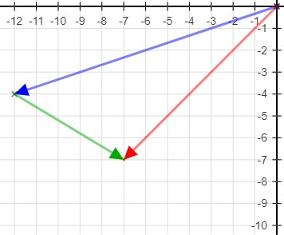
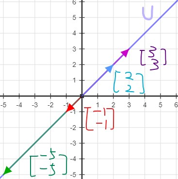

# Vectors and spaces

## Vectors

賦予任意坐標方向性，並且可以從任意起點開始

* Scalar multiplication
  * 視覺上就像一個向量，被直直的拉長 10 倍

$$
\vec{v} = (2,3) 
\\10\vec{v} = (20, 30)
$$

* Unit vector
  * A unit vector has a magnitude \(or length\) of 1.

$$
\begin{align}
&\vec{v} = \left(2,3\right)
\\ &\text{unit vector of } \vec{v} = \left(\frac{2}{\sqrt{13}},\:\frac{3}{\sqrt{13}}\right)\\
\\ &\text{check: }\sqrt{\left(\frac{2}{\sqrt{13}}\right)^2+\left(\frac{3}{\sqrt{13}}\right)^2} = 1
\end{align}
$$

* Add & subtract vectors
  * 視覺上就像先往第一個向量前進後，再往第二個向量的 \(正或反\) 向前進

$$
\begin{align}
\vec{u} &= (-5, 3)\\
\vec{w} &= (-12, -4)\\
\vec{w} - \vec{u} &= (-7, -7)
\end{align}
$$

## Linear Combination and Span

* [https://youtu.be/Qm\_OS-8COwU](https://youtu.be/Qm_OS-8COwU)

向量加上任意 **實數 scalar** 後，並且透過加法組合在一起時，產生一個 **線性** 的組合即為 _**Linear combination**_

$$
a_1\vec{v_1} + a_2\vec{v_2}+ \cdots + a_n\vec{v_n}. | a_n \in \mathbb{R}
$$

舉個例子，以下兩個向量經過與 scalar 相乘後，可以組合並且表示一個新的向量

$$
3 \begin{bmatrix} 1\\ 2\end{bmatrix}
+2 \begin{bmatrix} 0\\ 3\end{bmatrix}=
\begin{bmatrix} 3\\ 12\end{bmatrix}
$$

因為 Vectors 可以與**任意**實數相乘，產生的 linear combination 就可以任意表示其他向量，這個現象叫作 _**Span**_

例如以下兩個向量不管 a1 和 a2 為何，在 combine 之後只能 span 這兩條向量原本的那條線

$$
\begin{align}
a_1 \begin{bmatrix} 1\\ 2\end{bmatrix}+
a_2\begin{bmatrix} 2\\ 4\end{bmatrix}&=\\
a_1 \begin{bmatrix} 1\\ 2\end{bmatrix}+
2a_2\begin{bmatrix} 1\\2\end{bmatrix}&=\\
a_1 +2a_2 \begin{bmatrix} 1\\ 2\end{bmatrix}&=
a\begin{bmatrix} 1\\ 2\end{bmatrix}
\end{align}
$$

而底下兩個向量卻可以 **span** 整個二維平面的任意兩點，我們可以這樣表示

$$
\begin{align}
&\vec{v_1} = (1,0), \vec{v_2} = (0,1)\\
&a_1\vec{v_1} + a_2\vec{v_2} = \mathbb{R}^2
\end{align}
$$

## Linear Dependence & Linear Independence

* [https://youtu.be/CrV1xCWdY-g](https://youtu.be/CrV1xCWdY-g)

有了 linear combination 和 span 的知識後，很簡單就可以了解 Linear dependence / independence 的意義，

當你想要 span 某個東西時，使用不多不少剛剛好的向量來表示即為 _**Linear Independence**_

> 例如使用 \(1, 0\) 和 \(0, 1\) 來 span 整個 R2 平面時，這兩個向量即為線性獨立

而在 span 時，使用了 **多餘** 的向量，這個向量和本來就足夠的向量，形成了 _**Linear Dependence**_

> 例如本來只用 \(1, 0\) 和 \(0, 1\) 已經可以 span R2 ，
>
> 但我又加了向量 \(1, 3\) 來形成 R2 平面， \(1, 3\) 和另外兩個向量即為線性依賴

---

* [https://youtu.be/Alhcv5d\_XOs](https://youtu.be/Alhcv5d_XOs)
* 正式一點的定義為
  * 當 linear combination 中有任意一個向量可以被表示為其他向量的加總時
  * 或是某個向量的 scalar 不為 0 卻可以讓整個 linear combination 變為 0 時
  * 即為 **Linear dependence**

$$
\begin{align}
\text{Linear dependent} &\iff a_1\vec{v_1} + a_2\vec{v_2}+\cdots+a_n\vec{v_n} = 0 = \begin{bmatrix} 0\\\vdots\\0 \end{bmatrix}\\
&\iff \text{for some }a_i \text{ , not all are zero, at least one non-zero}\\
v_1 = a_2v_2 + a_3v_3+\cdots+a_nv_n&\iff 
\end{align}
$$

上面的定義可以很好的用來檢驗向量間為 linear dependence or linear independence

例如要檢測下面兩個向量是否有 linear dependence

$$
\begin{align}
\vec{v_1} &= (2,1)\\ \vec{v_2} &= (3,2) \\
a_1\vec{v_1}+a_2\vec{v_2} &= 0 = \begin{bmatrix} 0\\0 \end{bmatrix}\\
a_1 \begin{bmatrix}2\\1\end{bmatrix} + a_2 \begin{bmatrix}3\\2\end{bmatrix}&=\begin{bmatrix}0\\0\end{bmatrix}
\end{align}
$$

再將其拆開驗證即可

$$
\left\{\begin{matrix}
2a_1 + 3a_2 &= 0\\
a_1 + 2a_2 &= 0\\
\end{matrix}\right.\\
a_1 = 0
\\a_2 =0
$$

可以得到結果， v1 和 v2 為 linear independence !

> 3 demension example: [https://youtu.be/9kW6zFK5E5c](https://youtu.be/9kW6zFK5E5c)

## Subspaces and basis for a subspace

* https://youtu.be/pMFv6liWK4M

若一個 V 空間為 R^n 空間的 subspace，那這個 V 空間必須滿足三個條件
$$
\begin{align}
&1. \mathbf{V} \text{ contains } \mathbf{0} = \begin{bmatrix} 0\\\vdots \\0 \end{bmatrix}\\\\
&2. \vec{x} \text{ in } \mathbf{V}, c\vec{x} \text{ in } \mathbf{V} \mid c \in \mathbb{R} \text{  (closure under scalar multiplication)}\\\\

&3. \vec{a} \text{ in } \mathbf{V}, \vec{b} \text{ in} \mathbf{V}, \vec{a} + \vec{b} \text{ in } \mathbf{V}\text{  (closure under addition)}
\end{align}
$$

舉個滿足 **subspace** 的例子  (***The span of any set of vectors is a valid subspace***)
$$
\mathbf{U} = span\left( \begin{bmatrix} 1\\1\end{bmatrix} \right)
$$

* U 包含 0 向量
* 滿足 closure under scalar multiplication
  * [-1, -1] * -5 = [-5, -5]
* 滿足 closure under addition
  * [-1, -1] + [3, 3] = [2, 2]

---

舉個不滿足 **subspace** 的例子
$$
\mathbf{S} = \begin{Bmatrix} \begin{bmatrix} x_1 \\ x_2 \end{bmatrix} \in \mathbb{R}^2 \mid x_1 \ge 0 \end{Bmatrix}
$$

* S 滿足了**第一**和**第三項**條件
  * 包含 0 向量
  * 任意兩個 S 底下的向量相加還是維持在 S 空間裡面

* 但 S 沒辦法滿足**第二項**條件
  * 若將任意一個 S 底下的任一個 x1 不為零的向量乘以 **negative scalar** ，則 x1 就不在滿足條件

---

### Basis

$$
\begin{align}
\text{Subspace }\mathbf{V} = span&\left(\vec{v_1}, \vec{v_2}, \cdots \vec{v_n} \right)\\
&\begin{Bmatrix} \vec{v_1}, \vec{v_2}, \cdots \vec{v_n} \end{Bmatrix} \text{ is linear independence} \\\\

\text{then}\\\\

\mathbf{S} &= \begin{Bmatrix} \vec{v_1}, \vec{v_2}, \cdots \vec{v_n} \end{Bmatrix} \\
\mathbf{S} &\text{ is a } \bold{Basis}  \text{ for }\mathbf{V}
\end{align}
$$

* 若利用 **Minimum set of vectors** 來 span 該 subspace V
* 也就是 span subspace V 的向量都是 linear independence 時
* 這些向量的集合稱為該 Subspace 的 **Basis**

---

我們舉個例子 T
$$
\mathbf{T} = \begin{Bmatrix} \begin{bmatrix}1\\0\end{bmatrix}, \begin{bmatrix}0\\1\end{bmatrix} \end{Bmatrix}
$$
首先他可以 span R^2 子空間
$$
\begin{align}
c_1\begin{bmatrix} 1\\0\end{bmatrix} + c_2\begin{bmatrix} 0\\1\end{bmatrix} &= \begin{bmatrix} x_1\\x_2\end{bmatrix} \\

c_1 + 0 = x_1, c_1 &= x_1\\
0 + c_2 = x_2, c_2 &= x_2\\
\end{align}
$$
並且他為 linear independence
$$
\begin{align}
c_1\begin{bmatrix} 1\\0\end{bmatrix} + c_2\begin{bmatrix} 0\\1\end{bmatrix} &= \begin{bmatrix} 0\\0\end{bmatrix} \\

c_1 + 0 = 0, c_1 &= 0\\
0 + c_2 = 0, c_2 &= 0\\
\end{align}
$$
所以 T 為 R^2 的 basis (而且是 ***standard basis***)

---

而這些 vectors 所生成的任一個向量在 Subspace 中都是獨一無二的 :
$$
\begin{align}
\vec{a} &\in \mathbf{V}, \\
\vec{a} &= c_1\vec{v_1} + c_2\vec{v_2} + \cdots + c_n\vec{v_n} \\
\vec{a} &= d_1\vec{v_1} + d_2\vec{v_2} + \cdots + d_n\vec{v_n} \text{ (subtract)} \\

\vec{0} &= (c_1-d_1)\vec{v_1}  + (c_2-d_2)\vec{v_1}  + \cdots + (c_n-d_n)\vec{v_n} 
\end{align}
$$

因為相減還是在 subspace 裡面，並且滿足 basis (linear independent)，所以 :
$$
\begin{align}
c_1 - d_1 &= 0 \\
c_2 - d_2 &= 0 \\
c_n - d_n &= 0 \\
c_n &= d_n
\end{align}
$$
證明了生成的向量為唯一

## Vector dot and cross products

**Dot product** 有別於 addition 和 scalar multiplication，他將 output 出一個 scalar value
$$
\vec{a} \cdot \vec{b} = \begin{bmatrix} a_1\\a_2\\\vdots\\a_n \end{bmatrix} \cdot 
\begin{bmatrix} b_1\\b_2\\\vdots\\b_n \end{bmatrix} = a_1b_1 + a_2b_2 + \cdots + a_nb_n \text{ (A scalar value)}
$$

例如
$$
\begin{bmatrix} 2\\5\end{bmatrix} \cdot \begin{bmatrix} 2\\5\end{bmatrix} = 
\begin{bmatrix} 4\\25\end{bmatrix}
$$

而向量的 **Length** 可以計算為
$$
\lVert \vec{a} \rVert = \sqrt{\vec{a_1}^2 + \vec{a_2}^2 + \cdots + \vec{a_n}^2}
$$

在二維向量的情況下，計算其 Length 就像 ***Pythagorean Theorem*** 一樣
$$
\vec{a} = \begin{bmatrix} 2\\5\end{bmatrix},
\lVert \vec{a} \rVert = \sqrt{2^2 + 5^2} = \sqrt{29}
$$

但這個方法卻可以很有效的計算超過二、三維以上的長度，並且我們可以定義為
$$
\begin{align}
\lVert \vec{a} \rVert &= \sqrt{\begin{bmatrix} a_1\\a_2\\\vdots\\a_n\end{bmatrix} \cdot \begin{bmatrix} a_1\\a_2\\\vdots\\a_n\end{bmatrix}} = \sqrt{\vec{a} \cdot \vec{a}}\\\\

\lVert \vec{a} \rVert^2 &= \vec{a} \cdot \vec{a}
\end{align}
$$

> Dot Product Properties: https://youtu.be/rVQ3G9epCjw
>
> * Commutative, Distributive, Associative

$$
\begin{align}
&\text{1. } \vec{v} \cdot \vec{w} = \vec{w} \cdot \vec{v} \\

&\text{2. } \left( \vec{v} + \vec{w} \right) \cdot \vec{x} = \left( \vec{v} \cdot \vec{x}+ \vec{w}\cdot \vec{x} \right) \\

&\text{3. } (c \cdot\vec{v} )\cdot \vec{w} = c \cdot (\vec{v} \cdot \vec{w})
\end{align}
$$

> Cauchy-Schwarz inequality: https://youtu.be/r2PogGDl8_U

$$
\lvert \vec{x}\cdot\vec{y}\rvert \le \lVert x\rVert \cdot\lVert y\rVert\\\\
\lvert \vec{x}\cdot\vec{y}\rvert = \lVert x\rVert \cdot\lVert y\rVert \iff \vec{x} = c\vec{y} \text{ (co-linear)}
$$

> Triangle inequality: https://youtu.be/PsNidCBr5II

$$
\lVert \vec{x} + \vec{y} \rVert \le \lVert \vec{x} \rVert + \lVert \vec{y}  \rVert\\
\lVert \vec{x} + \vec{y} \rVert = \lVert \vec{x} \rVert + \lVert \vec{y}  \rVert \iff \vec{x} = c\vec{y} \mid c>0
$$

我們可以用二維空間來展示，而且好處是可以套用至更高維的空間

