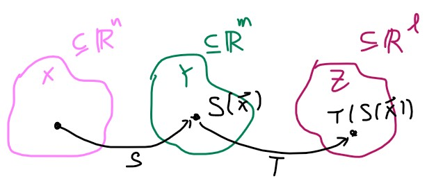

# Transformations and matrix multiplication

## Compositions of linear transformations 1

* [https://youtu.be/f\_DTiXZpb8M](https://youtu.be/f_DTiXZpb8M)

現在要來討論的是， linear transformation 的組合要怎麼表示？他還算是 linear transformation 嗎？

我們現在有 Rn, Rm, Rl 空間，以及 S 和 T 兩個 linear transformation function

$$
\begin{aligned}
&S: X \to Y \mid X \subseteq \mathbb{R}^n, Y \subseteq \mathbb{R}^m \\
&S(\vec{x}) = \mathbf{A}\vec{x} \mid \mathbf{A} \text{ is } m \times n \\\\

&T: Y \to Z \mid Y \subseteq \mathbb{R}^m, Z \subseteq \mathbb{R}^l \\
&T(\vec{x}) = \mathbf{B}\vec{x} \mid \mathbf{B} \text{ is } l \times m
\end{aligned}
$$

那我們要怎麼一次定義 x 到 z ，也就是先對 vector 做 S 再做 T 的 transformation 這段變化呢

$$
T \circ S: X \to Z \text{ ( The composition of T with S )} \\
T \circ S = T(S(\vec{x}))
$$

那這樣子定義還是不是 linear transformation 呢

* 條件一 OK

$$
\begin{aligned}
T \circ S(\vec{x} + \vec{y}) &= T(S(\vec{x}+\vec{y}))\\
&= T(S(\vec{x})+S(\vec{y}))\\
&= T(S(\vec{x})) + T(S(\vec{y}))\\
&= T \circ S(\vec{x}) + T \circ S(\vec{y})
\end{aligned}
$$

* 條件二 OK

$$
\begin{aligned}
T \circ S(c\vec{x} ) &= T(S(c\vec{x})) \\
&= T(cS(\vec{x})) \\
&= cT(S(\vec{x})) \\
&= c T \circ S(\vec{x})
\end{aligned}
$$

所以我們的確可以把 S 和 T 兩個 transformation 合併，用一個 matrix 來表達

$$
T \circ S (\vec{x}) = \mathbf{C}\vec{x} \mid C \text{ is } l \times n
$$

## Compositions of linear transformations 2

* [https://youtu.be/BuqcKpe5ZQs](https://youtu.be/BuqcKpe5ZQs)

現在將更進一步探討 S 和 T 兩個 transformation 如何轉為 matrix 表示

$$
T(\vec{x})= \mathbf{B}\vec{x} \mid \mathbf{B} \text{ is } l \times m\\
S(\vec{x})= \mathbf{A}\vec{x} \mid \mathbf{A} \text{ is } m \times n\\
T \circ S = \mathbf{B}(\mathbf{A}(\vec{x})) = \mathbf{C}\vec{x}
$$

我們要如何找到這個 C ，首先這個 C 將會是多大 size

因為 vector 從 Rn 開始被轉換，所以先定義 identity matrix 為 In

$$
\mathbf{I_n} = \begin{bmatrix} 1&0&\cdots& 0\\ 0&1&\cdots&0 \\0&0&\ddots&\vdots\\0&0&\cdots&1\end{bmatrix}
$$

而我們的 C 就會等於

$$
\mathbf{C} = \begin{bmatrix} 
\mathbf{B}(\mathbf{A}\left(\begin{bmatrix} 1\\0\\\vdots\\0\end{bmatrix}\right))&
\mathbf{B}(\mathbf{A}\left(\begin{bmatrix} 0\\1\\\vdots\\0\end{bmatrix}\right))&
\cdots&
\mathbf{B}(\mathbf{A}\left(\begin{bmatrix} 0\\0\\\vdots\\1\end{bmatrix}\right))
\end{bmatrix}
$$

雖然看起來很複雜，但我們將 A 拆開來看，A 的運算應該如下

$$
\mathbf{A} = \begin{bmatrix} \vec{a_1} &\vec{a_2}&\cdots &\vec{a_n}\end{bmatrix}
\begin{bmatrix} x_1\\x_2\\\vdots\\x_n\end{bmatrix} =
x_1\vec{a_1}+x_2\vec{a_2}+\cdots+x_n\vec{a_n}
$$

所以 C 的 A 只有乘到每一項對應的 vector 而已，而這個 matrix 也就是 BA 相乘 !

$$
\mathbf{C} = \begin{bmatrix} 
\mathbf{B}(\vec{a_1})&
\mathbf{B}(\vec{a_2})&
\cdots&
\mathbf{B}(\vec{a_n})
\end{bmatrix} = \mathbf{BA}
$$

## Matrix product examples

* [https://youtu.be/x1z0hOyjapU](https://youtu.be/x1z0hOyjapU)

我們現在知道 B 和 A 相乘的意義其實就是 S 和 T 這兩個 transformation 的 composition

我們實際舉個例子來運算看看

$$
\underset{2\times3}{\mathbf{B}} = \begin{bmatrix}1&-1&2\\0&-2&1\end{bmatrix},\,\,
\underset{3\times4}{\mathbf{A}} = \begin{bmatrix}1&0&1&1\\2&0&1&-1\\3&1&0&2\end{bmatrix}
$$

所以 BA 會等於

$$
\begin{aligned}
\mathbf{BA} &= \begin{bmatrix} 
\mathbf{B}(\vec{a_1})&
\mathbf{B}(\vec{a_2})&
\cdots&
\mathbf{B}(\vec{a_n})
\end{bmatrix}
\\
&= 
\begin{bmatrix} 
\mathbf{B}\begin{bmatrix}1\\2\\3\end{bmatrix} &
\mathbf{B}\begin{bmatrix}0\\0\\1\end{bmatrix} &
\mathbf{B}\begin{bmatrix}1\\1\\0\end{bmatrix} &
\mathbf{B}\begin{bmatrix}1\\-1\\2\end{bmatrix}
\end{bmatrix}\\
&= 
\begin{bmatrix} 
5&2&0&6\\-1&1&-2&4
\end{bmatrix} 
\end{aligned}
$$

> 更詳細的運算過程可以去看影片

我們可以發現，能夠運算如此順利，是因為 B 和 A 已經 well defined

因為 2 x 3 和 3 x 4 的矩陣相乘，我們可以得到一個 2 x 4 的矩陣

今天若是 B 和 A 交換，要求 AB 是求不出來的

所以這邊又點出一個觀念，就是 **矩陣相乘是沒有交換律的 \(NO commutative\)** 

$$
\mathbf{AB \neq BA}
$$

## Matrix product associativity

* [https://youtu.be/Hhc96U\_HvQE](https://youtu.be/Hhc96U_HvQE)

那們矩陣相乘有沒有結合律呢？我們從更多的 transformation 來看

$$
H(\vec{x}) = \mathbf{A}\vec{x}\\
G(\vec{x}) = \mathbf{B}\vec{x}\\
F(\vec{x}) = \mathbf{C}\vec{x}\\
$$

我們將轉移到 F 後，再轉移到 G ，最終轉移到 H，可以這樣寫

$$
\begin{aligned}
((H\circ G) \circ F)(\vec{x}) &=
(H\circ G)(F(\vec{x})) \\&=
H(G(F(\vec{x})))\\&=
H(G\circ F(\vec{x})) \\&=
(H\circ (G \circ F))(\vec{x}) 
\end{aligned}
$$

結果我們發現

$$
((H\circ G) \circ F)(\vec{x}) = 
(H\circ (G \circ F))(\vec{x}) = 
(H\circ G \circ F)(\vec{x})
$$

也就是說 **矩陣相乘是有結合律的 \(HAS Associative\)**

$$
(\mathbf{AB})\mathbf{C} = \mathbf{A}(\mathbf{BC}) = \mathbf{ABC}
$$

> 簡單來說就是可以忽略掉括號啦

## Distributive property of matrix products

* [https://youtu.be/oMWTMj78cwc](https://youtu.be/oMWTMj78cwc)

最後我們來看矩陣相乘有沒有分配律 !

$$
\mathbf{A} = k \times m\\
\mathbf{B} = m \times n\\
\mathbf{C} = m \times n\\
$$

試著乘乘看

$$
\begin{aligned}
\mathbf{A}(\mathbf{B+C}) &= \mathbf{A}
\begin{bmatrix}\vec{b_1}+\vec{c_1}& \vec{b_2}+\vec{c_2} & \cdots & \vec{b_n}+\vec{c_n}\end{bmatrix}\\
&=
\begin{bmatrix}\mathbf{A}(\vec{b_1}+\vec{c_1})& \mathbf{A}(\vec{b_2}+\vec{c_2}) & \cdots & \mathbf{A}(\vec{b_n}+\vec{c_n})\end{bmatrix} \\
&=
\begin{bmatrix}\mathbf{A}\vec{b_1}+\mathbf{A}\vec{c_1}& \mathbf{A}\vec{b_2}+\mathbf{A}\vec{c_2} & \cdots & \mathbf{A}\vec{b_n}+\mathbf{A}\vec{c_n}\end{bmatrix} \\
&=
\begin{bmatrix}\mathbf{A}\vec{b_1}& \mathbf{A}\vec{b_2} & \cdots & \mathbf{A}\vec{b_n}\end{bmatrix} +
\begin{bmatrix}\mathbf{A}\vec{c_1}& \mathbf{A}\vec{c_2} & \cdots & \mathbf{A}\vec{c_n}\end{bmatrix} \\
&=
\mathbf{AB} + \mathbf{AC}
\end{aligned}
$$

所以**矩陣相乘是有分配律的 \(HAS Distributive\)**

統整一下：

* matrix multiplication has no commutative

  $$
  \mathbf{AB} \neq \mathbf{BA}
  $$

* matrix multiplication has associative

$$
\mathbf{A}(\mathbf{BC}) = (\mathbf{AB})\mathbf{C} = \mathbf{ABC}
$$

* matrix multiplication has distributive

$$
\mathbf{A}(\mathbf{B+C}) = \mathbf{AB}+\mathbf{AC}
$$

