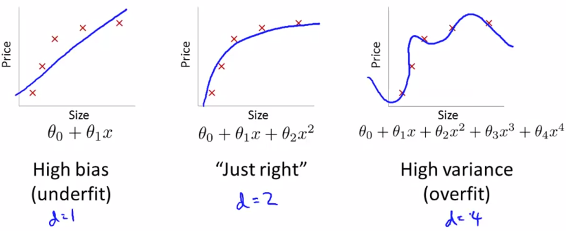
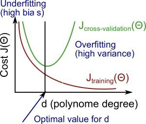
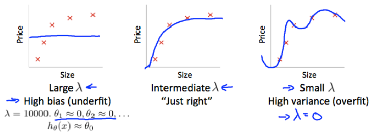

# Evaluating a Learning Algorithm

## Debuging learning algorithm

當你的 Cost function 怎麼算都不對時，下一步該怎麼做 ?

* 找更多 training examples
* 減少 features
* 增加 features
* 試著加入 polynomial features
* Increasing $$\lambda$$
* Decreasing $$\lambda$$

如果只是隨便從中任選一個當解方，那可能會花上數個月解決

所以我們必須要採取 **Machine Learning Diagnostic**

Diagnostic 可能會發非常多時間 implement

但他可以給我們 guidance 以及 insight of learning algorithm

## Evaluating a Hypothesis

為了避免 hypothesis **overfitting**

我們也將 trainging examples 拆成兩組，其中

70% 作為 **training set**，而 30% 作為 **test set** (拆分時最好是隨機的狀態)

所以現在 learning 的順序變成 :

1. 找出能夠 minimize $$J_\text{train}(\Theta)$$ 的 $$\Theta$$ 得到 **hypothesis**
2. 計算對應的 test set error $$J_\text{test}(\Theta)$$

在 Linear regression 中，我們表示 test set error 為 :

$$
J_\text{test}(\Theta) = \frac{1}{2m_\text{test}}\sum_{i=1}^{m_\text{test}}(h_\Theta(x_\text{test}^{(i)}) - y_\text{test}^{(i)})
$$

在 Logistic regression 中，我們重新定義了 **Misclassification error (0/1 misclassification error)**

$$
err(h_\Theta(x), y) = 
\left\{\begin{matrix}
\begin{aligned}
&1  && \text{if }h_\Theta(x) \ge 0.5 \text{ and } y = 0 \text{ || } h_\Theta(x) < 0.5 \text{ and } y = 1 \\
&0  &&\text{otherwise}
\end{aligned}
\end{matrix}\right.
$$

而 Average test error 即告訴我們有多少的 test set 被 misclassified :

$$
\text{Test Error } = \frac{1}{m_\text{test}}\sum_{i=1}^{m_\text{test}} err(h_\Theta(x_\text{test}^{(i)}), y_\text{test}^{(i)}) 
$$

## Model Selection

為了進一步解決 Overfitting 的問題，我們能夠採用 model selection 的辦法

一次列出不同 degree 的多種 model 來測試

首先對各個 model 計算出 $$\theta$$

然後把每個 $$\theta$$ 都丟進 $$J_\text{test}(\theta)$$ 測試，找出最小的 model

$$
\begin{aligned}
&d=1, &&h_\theta(x) = \theta_0 + \theta_1x&&\rightarrow \theta^{(1)}\rightarrow J_\text{test}(\theta^{(1)})\\
&d=2, &&h_\theta(x) = \theta_0 + \theta_1x + \theta_2x^2&&\rightarrow \theta^{(2)}\rightarrow J_\text{test}(\theta^{(2)})\\
&&\vdots\\
&d=10, &&h_\theta(x) = \theta_0 + \theta_1x + \cdots + \theta_{10}x^{10}&&\rightarrow \theta^{(10)}\rightarrow J_\text{test}(\theta^{(10)})
\end{aligned}
$$

但我們提早用了 test set 當作測試 model 的 data

難道我們又要再用 test set 進行最終測試嗎 ?

### Cross Validation (CV) Set

為此我們將資料拆成三等分

多了一種 validation set 用來當作 model selection 的 data

* Training set : 60% 
* Validation set : 20%
* Test set : 20%

現在我們將進行三個步驟，各別算出 train, cv, test 的 error values :

1. 利用 **training set** 找出每個 degree model 的最佳 $$\theta$$
2. 利用 **validation set** 找出最小 error 的 degree model
3. 將找到的 model 與 **test set** 作 $$J_\text{test}(\theta^{(d)})$$ 的最終測試
   * d = theta from polynomial with lower error

這麼一來，就不會再發生 test set 偷看的問題了 !

# Bias vs. Variance

為了認清每一個 degree 是 underfit 或是 overfit

我們需要先知道 bias 和 variance 是什麼

其實 **high bias** 就是指 underfit，而 **high variance** 就是 overfit

我們知道不管 overfitting，training error 會隨著 degree 增加而**減少**

而因為 overfitting 的關係，沒有了 training set 的 

**validation 及 test 的 error** 則都會隨著 degree 增加而**增加**

* d increase
  * training error decrease
  * validation error increase
  * test error increase

因此我們可以從這個特徵找出 cost function 是 high bias 或是 high variance

* **High bias (underfit)** : $$J_\text{train}(\theta)$$ 和 $$J_\text{CV}(\theta)$$ 的 error 都很高，並且 $$J_\text{train}(\theta) \approx J_\text{CV}(\theta)$$
* **High variance (overfit)** : $$J_\text{train}(\theta)$$ error 很低，但 $$J_\text{CV}(\theta)$$ 的 error 很高

## Regularization with bias/variance

我們知道解決 regularization 可以解決 overfitting 的問題

但要怎麼設定 $$\lambda$$ ? 可不可以自動找出一個最好的 $$\lambda$$ ?

我們觀察，當 $$\lambda$$ 在不同程度時的變化

* $$\lambda = 10000$$，所有的 $$\theta \approx 0$$，所以變成 **High bias (underfit)**
* $$\lambda = 0$$，等於沒有 regularization，所以變成 **High variance (overfit)**

也就是 $$\lambda$$ 越小時，train cost 很低 (overfit)，但也因此 CV cost 很高

而 $$\lambda$$ 越大時，train cost 變高了 (underfit)，所以 CV cost 依然很高

我們可以用類似 model selection 的方式來尋找 best $$\lambda$$

1. 首先定義一個的 $$\lambda$$ list (可以以 *2 列出)
2. 用每一個 $$\lambda$$ 去學習每一個 $$\min_\theta J(\theta)$$ 得到不同的 $$\theta$$
3. 將學到的 $$\theta$$ 丟到**不含 regularization 的 CV cost function** $$J_{CV}(\theta)$$ 計算
4. 找出在 CV 測試中最小 error 的 model
5. 將最好的 $$\lambda \text{ and } \theta$$ 丟到 $$J_\Text{test}(\theta)$$ 測試結果

## Learning Curves

現在我們可以利用一種工具來檢查 bias 或是 variance 稱作 learning curves

假設我們有一個做好的 quadratic curve 的 hypothesis

從 m = 1, 2, 3, ... 個 training sets 開始測試

一開始的 error 會非常的小，但隨著 size m 越大 error 就會變得很大

因為只有 quadratic 的 curve 很難 fit 越來越多的 data

### High bias experience

High bias 代表 underfitting

* **Training sets 小的時候**
  * $$J_\text{train}(\theta)$$ 會非常小 (因為訓練過)
  * $$J_\text{CV}(\theta)$$ 會非常大 (因為不是訓練的 data，且只有一點點 data)

* **Training sets 大的時候**
  * $$J_\text{train}(\theta)$$ 會越來越大 (underfit 的關係)
  * $$J_\text{CV}(\theta)$$ 會降低，但還是會很大 (一樣是因為 underfit)

所以若 hypothesis 有 high bias problem

Learning curves 的測試結果會跟下圖差不多

* $$J_\text{train}(\theta)$$ 跟 $$J_\text{CV}(\theta)$$ 會 converge
* 但兩者都會比 desired performance 還要差

### High variance experience

High variance 代表 overfitting

* **Training sets 小的時候**
  * 跟 high bias 狀況一樣
  * $$J_\text{train}(\theta)$$ 會非常小 (因為訓練過)
  * $$J_\text{CV}(\theta)$$ 會非常大 (因為不是訓練的 data，且只有一點點 data)

* **Training sets 大的時候**
  * $$J_\text{train}(\theta)$$ 會越來越大，但是好現象的越來越大
    * training size 越來越滿足 overfitting
  * $$J_\text{CV}(\theta)$$ 會越來越低，並且越來越接近 desired performance

High variance problem 在隨著 training sets 增加後

learning curves 會跟下圖差不多

* $$J_\text{train}(\theta)$$ 跟 $$J_\text{CV}(\theta)$$ 一樣會 converge
* 但兩者是朝著 desired performance 交會

所以 High variance 問題發生時，**增加 training sets size** 應該是個不錯的方法

## Summary

所以當你 diagnose 並發現問題點後，可以分別做正確的修正了 !

* When you get **high bias problem**
  * add features
  * add polynomial features $$(x_1x_2, x_1^2, x_2^2, \cdots)$$
  * decrease $$\lambda$$
* When you get **high variance problem**
  * add more training examples
  * try smaller sets of features
  * increase $$\lambda$$

### Diagnose Neural Networks

* 小的 neural networks 趨向於 **underfitting**
  * 但他 **computationally cheaper**
* 大的 neural networks 趨向於 **overfitting**
  * 但他 **computationally expensive**
  * 而 overfitting 也可以透過 regularization 來修正 (increase $$\lambda$$)

Neural networks 預設是使用 1 hidden layer

但你也可以使用多個 hidden layer 並且搭配 cross validation sets 來訓練

### Model Complexity Effects

* 當 hypothesis 的 degree 很低時
  * 會 high bias 及 low variance
  * train set 和 test set 都會 fit poorly
* 當 hypothesis 的 degree 很高時
  * 會在 train set 有 low bias 但 high variance
  * 在 train set fit perfectly
  * 但在 test set fit poorly

我們希望的 model 會介於兩者之間，fit all sets reasonably !
