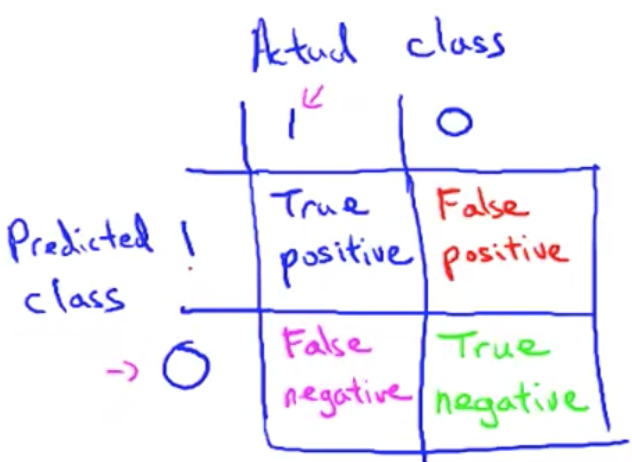
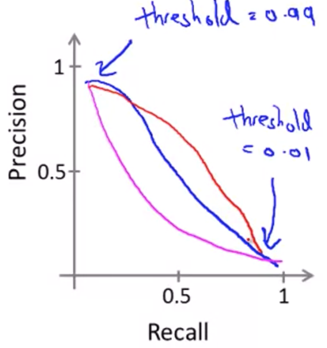

# Building a Spam Classifier

我們將用一個 Email Spam Classifier 來當作 system design example

## Prioritizing What to Work On

在訓練一個 spam classifier 時

通常會建立一個 10000 ~ 50000 entries 的 vector

裡面存放一些常見詞 for spam/not spam

每一個 entries words 出現在信中就標上 1，沒有出現就標上 0


所以在實作中，要怎麼樣增加 classifier 的 accuracy 呢 ?

* 收集大量資料 (例如 honeypot)
* 找出一些 sophisticated features (例如 email header 的 data 作為 features)
* 升級我們的 algorithm (例如辨識 misspelling in spam)

在實作中，很難決定哪一個才是最好的方法 ...

## Error Analysis

所以在實作一個 machine learning project 時，推薦可以這樣做 :

1. 快速製作一個簡單的 learning algorithm 然後早一點利用 cross validation set 測試
2. Plot learning curves 到自己的 algorithm 來判斷下一步
3. 手動測試 cross validation 的結果，來查看哪裡才是 algorithm 的弱點

舉個例子 :

* 500 個 emails 中我們誤判了 100 個
* 我們可以手動檢查這 100 個錯在哪裡
* 我們在針對錯的地方，加入新的 features
* 例如其中有 50 封都是釣魚信，代表我們要再增強辨識釣魚信的演算法

另外在實作時，也要習慣把實際數字記錄下來

例如我們是否要把 discount / discounts / discounted / discounting 視為一樣的意思

* 當沒有利用 steming 時 error 為 5%
* 利用 steming 時 error 為 3%
* steming + case detection 時 error 為 3.3%

所以就可以看出怎麼做才是最好的方法

# Handling Skewed Data

假設我們有一個 logistic regression model

用來 predict y = 1 時為 cancer，y = 0 時沒有 cancer

這個 model 在 test set 預測了 99% 正確，只有 1% error

但結果後來發現，根本只有 0.5% 的病人有 cancer

代表我用一個演算法，全部都猜 0 還有更高的 0.5% 的正確率 !

``` matlab
function y = predictCancer(x)
    y = 0;  % ignore x, always equals to zero
return
```

這個 test set 就是一個 `skewed classes`

## Error Matrices (Precision and Recall)

所以我們用一個 precision/recall 的 table 來檢驗一下正確率

這個方法可以避免 skewed classes

我們設定**左邊**為你的 predict class，而**右邊**為 actual class



所以分別會有以下幾種結果

* **True Positive** : 猜 1 然後猜對
* **False Positive** : 猜 1 結果猜錯
* **False Negative** : 猜 0 結果猜錯
* **True Negative** : 猜 0 然後猜對

接下來我們就可以來計算 Precision 和 Recall

### Precision

在 model 預測的猜測的 y = 1 中，有多少的 fraction 是真正為 1

簡單來說就是我猜 1 然後中獎的機率有多少啦

$$
\frac{\text{True positives}}{\text{Predicted positives}} = 
\frac{\text{True positives}}{\text{True positives + False positives}}
$$

### Recall

在真實情況下 y = 1 中，有多少是我猜對的

簡單來說就是 actual = 1 時，我剛好猜對 y = 1 的機率有多少

$$
\frac{\text{True positives}}{\text{Actual positives}} = 
\frac{\text{True positives}}{\text{True positives + False negatives}}
$$

如此一來，就算你在 skewed classes 猜中 99%

但因為你的 **Actual positives** 很小很小

所以你的 recall 不是很小就是等於 0

就可以避免這種像 **cheating** 的結果出現


## Trade Off Precision and Recall

其實我們是很難滿足 high precision 又 high recall 的

今天假設我們想要提高預測的準確度

我們將 logistic regression 改為 $$h_\theta(x) \ge 0.9$$ 時 y = 1

所以$$h_\theta(x) < 0.9$$ 時 y = 0

這麼一來就可以非常有信心的預測成功

但也因為 threshold 設的太高，所以漏看了一些可能的 data

我們得到 **higher precision, lower recall**

那這時候我們改成 $$h_\theta(x) \ge 0.3$$ 時 y = 1

而 $$h_\theta(x) < 0.3$$ 時 y = 0

此時將不會漏看可能的 data

但精準度也變得很低

我們得到 **lower precision, higher recall**

畫成圖表，可能會出現這樣的結果



### F score

現在假設我們設計出三個 algorithm (可能是一個 algorithm 用三種 threshold)

|             | Precision (P) | Recall (R) | Average | F-score |
| ----------- | ------------- | ---------- | ------- | ------- |
| Algorithm 1 | 0.5           | 0.4        | 0.45    | 0.444   |
| Algorithm 2 | 0.7           | 0.1        | 0.4     | 0.175   |
| Algorithm 3 | 0.02          | 1.0        | 0.51    | 0.0392  |

我們要怎麼判斷並取捨 precision 和 recall 的搭配呢

**Average** $$\frac{P+R}{2}$$ 顯然是不行的

因為使用 average 下，選擇的 Algorithm 3 雖然 recall 很高但 precision 極低

這邊可以使用一個算法叫做 **F-score**

$$
2 \times \frac{PR}{P+R}
$$

他可以比 average 更有效的找出適當的 precision/recall 組合

# Using Large Data Sets

“不是比較誰的 algorithm 比較好，而是比較誰有最多 data”

* Useful test
  * 當你把 input x 告訴一個那個領域的專家時，他能不能很好的預測出 y
  * 如果可以，代表你的 input x 就是充足的

* 通常我們需要結合兩項重點
  * 你的 learning algorithm 的 parameters 要充足
    * 讓你的 $$J_{\text{train}}(\theta)$$ 很小
  * 要使用大量的 training set
    * 就不會 overfitting
    * 所以 $$J_{\text{train}}(\theta) \approx J_{\text{test}}(\theta)$$
* 兩項結合在一起，代表 $$J_\text{test}(\theta)$$ 就可以很小