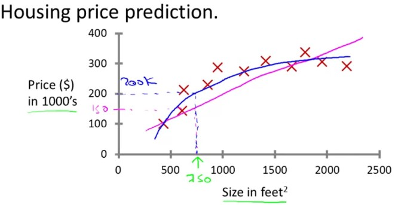
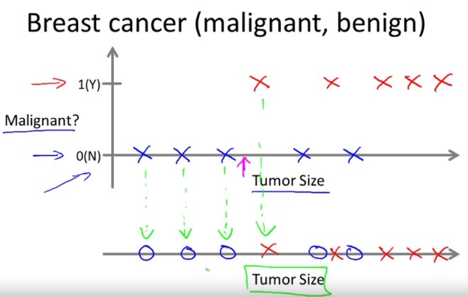
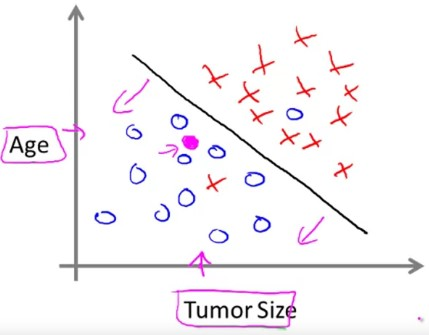

# What is machine learning
Arthur Samuel (1959) : Machine learning gives computers the ability to learn without being explicitly programmed.

Tom Mitchell (1998) : A computer program is said to learn from experience E with respect to some task T and some performance measure P, if its performance on T, as measured by P, improves with experience E.

> **Example**: 你想讓 program 學習 email spam filter.
>
> **E**: Program 觀察你 label email 為 spam or not spam
>
> **T**: Program 獨自區分 mail 為 spam or not spam 
> 
> **P**: filter spam mail 的成功率
>
> 所以 **T** 的 **P** 應該在 **E** 的訓練下而有所提升 !

# Supervised Learning
在 Supervised Learning 中會把**問題跟解答 (right answer)** 一起給 Program 學習，從中去找出**兩者之間的關係**。

Supervised Learning 可以簡單分類為 **Regression Problem** 以及 **Classification Problem** :

## Regression Problem
在 Regression Problem，我們希望利用 **Features** 來預測 **Continuous Results**，
也就是 map input variables to some continuous function。

### Example
例如我們想從現有的房地產狀況，來判斷手中的房產應該用多少的價格賣出，才會符合市場需求。


此時 **feature** 為 Size in feet square，而 **result** 為 Price 是一個 continuous output

我們可以設定 learning algorithm 要讓 data 符合 straight line 或是 quadratic function


## Classification Problem
在 Classification Problem，我們希望利用 **Features** 來預測 **Discrete Results**，
也就是 map input variables into discrete categories。

### Example
例如我們想從病人的腫瘤大小，來訓練機器判斷腫瘤是良性或是惡性時，此時結果可以用 0 或 1 表示，所以是 Classification 問題。


在 Classification Problem 中，**Features** 和 **Results** 都可以有多個出現 !

例如我們可以用 tumor size, age, 甚至是**無限多**的 features 來一起學習預測腫瘤好壞。

而 results 也可以有多種出現，例如預測的腫瘤還有分多種型態，就可以用 0, 1, 2, 3, ... 分別代表不同種類。



# Unsupervised Learning
Unsupervised Learning 不需要知道資料中每個問題對應的解答為何，而是由 program 從資料中找出 pattern & structure，方法通常為利用 data 中的變數關係進行 **clustering algorithm**。

## Clustering
* Google News 會每天自動分類並匯集相關新聞於不同新聞網站的 URL。
* 從上百萬的 gene data 中，透過 lifespan, location, roles, 等不同變數進行自動分組。
* Oraganize computing clusters
* Social Network analysis
* Market segmentation
* Astronomical data analysis

## Non-clustering
Non-clustering algorithm 則是另一種 unsupervised learning 的學科，又稱為 Cocktail Party Algorithm。

想像我們要從派對中非常多人的聲音裡面，去截取出特定一個人的聲音。

聽起來要在 C++, Java 平台上實作出來非常的困難，但其實只要在 Octave 環境下用一行程式碼即可達成。 (得利於前人的智慧)

```
[W,s,v] = svd((repmat(sum(x.*x,1),size(x,1),1).*x)*x');
```

上面的程式碼中，其實 svd 就是 linear algebra 的奇異值分解，這在 java 中是需要非常多行程式碼來完成的，

但我們可以在 matlab, octave 這類 ide 中快速實作。

所以我們應該保有一個觀念，在將 learning algorithm implement 於專案時，
永遠先在 octave 上實作 learning algorithm。

等到運行一切順利時，再回到 C++, Java, Python 來實作同一個 learning algorithm，
這會使得開發更加的快速與順利。

> [Cocktail party effect](https://en.wikipedia.org/wiki/Cocktail_party_effect)

> [Slide](https://d3c33hcgiwev3.cloudfront.net/_974fa7509d583eabb592839f9716fe25_Lecture1.pdf?Expires=1568073600&Signature=OEtmMhR4BOgX3iJBHI-ruZDXW61hNm20fk5F0IeSWGHI5lI4NlA5rpc4mzNq8NFu0U5LtOA5QTSWk3jiH6mpAMxz-q4J2jK7xkSFTZZAb6TBpQJx4M8JWdJrb05DAnEWyeg3Kx0QIHQswz~Lzpy91V~dd5XjyAvaIo0c1TDTkHk_&Key-Pair-Id=APKAJLTNE6QMUY6HBC5A)