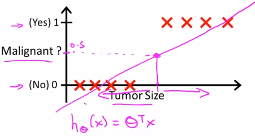
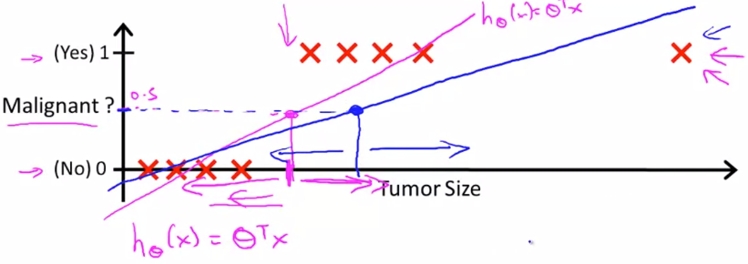
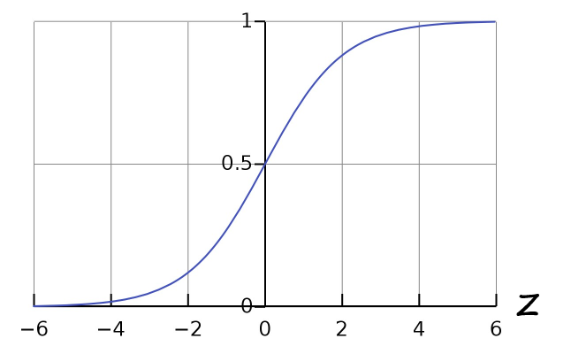
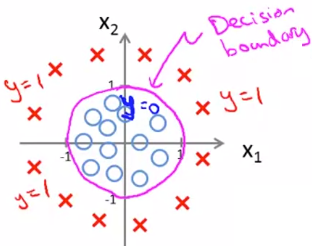

# Classification and Representation

## Classification

* 舉幾個簡單的例子
  * Email : Spam / Not spam
  * Transaction : Fraud / No fraud
  * Tumor : Malignant / Benign
* 我們會用 0/1 來代表結果
  * 0 = Negative class
  * 1 = Positive class \(通常為計算中比較想知道的結果\)
* 例如 :

  $$
  y \in \left\{0, 1\right\} \mid \text{ 0 = benign tumor, 1 = malignant tumor}
  $$

* 當然 classification 可以有多種結果
* 但現在只專注在 **binary classification problem**
* 我們可以利用 linear regression 來找到 Hypothesis
  * 只要簡單的設置一個 threshold \(例如 0.5\)
    * **`y < 0.5`** 的是 0 而 **`y > 0.5`** 的是 1

* 但這方法不好，假設今天有一個 outlier 出現在 plot 的最右方
  * 這下子有一些原本是 1 的就會被誤認為是 0 了

另外，若使用 linear regression 來預測 hypothesis 時

$$
h_\theta(x) \text{ can be } > 1 \text{ or } < 0
$$

所以我們在解決 classification problem 時

會使用 **Logistic Regression**，他會使得 h 的區間在合理範圍

$$
0 \le h_\theta(x) \le 1
$$

## Hypothesis Representation

所以在解決 classification problem 時

我們的 hypothesis 將套用 **Logistic Function g** \(又稱作 **Sigmoid Function**\)

$$
g(z) = \frac{1}{1+e^{-z}}
$$

Logistic function 的長相像這樣

不超過 0 和 1 的 boundary，而且看起來很適合處理 classification

所以我們將他套入原本的 hypothesis :

$$
h_\theta(x) = g(\theta^Tx) = \frac{1}{1+e^{-\theta^Tx}}
$$

現在 hypothesis 有了全新的意義

hypothesis 現在代表 1 出現的 **Probability**

也就是 **positive class** 的出現機率

用機率的方法表示如下 :

$$
h_\theta(x) = P(y=1\mid x;\theta) = 1 - P(y=0\mid x;\theta) \\
\text{ or }\\
P(y=0\mid x;\theta) + P(y=1\mid x;\theta) = 1
$$

用 tumor 的例子來說 :

$$
\begin{aligned}
&\text{if } h_\theta(x) = 0.7\\
&\text{then the tumor have 70\% to be 1 (malignant).}\\
&\text{and the tumor have 30\% to be 0 (benign).}
\end{aligned}
$$

## Decision Boundary

為了更好的辨識 0/1

我們以 0.5 作為間隔值

也就是說大於等於 0.5 的都是 1，而小於 0.5 的是 0

$$
h_\theta(x) \ge 0.5 \rightarrow y = 1 \\
h_\theta(x) < 0.5 \rightarrow y = 0
$$

另外我們觀察到 sigmoid function

只要 y &gt; 0.5 那 z 就一定大於 0

若 y &lt; 0.5 那 z 就一定小於 0

$$
\begin{aligned}
&z = 0, g(z) = \frac{1}{1+e^{-0}} = \frac{1}{2}\\
&z \rightarrow \infty, g(z) = \frac{1}{1+e^{-\infty}} = 1\\
&z \rightarrow -\infty, g(z) = \frac{1}{1+e^{\infty}} = 0
\end{aligned}
$$

因此我們可以推測出 :

$$
\begin{aligned}
&g(z) \ge 0.5 \\
&\text{when }z \ge 0 \\\\
&h_\theta(x) = g(\theta^Tx) \ge 0.5 \\
&\text{when }\theta^Tx \ge 0
\end{aligned}
$$

現在我們只要看 $$\theta^Tx$$ 就可以判斷 :

$$
\theta^Tx \ge 0 \Rightarrow y = 1\\
\theta^Tx < 0 \Rightarrow y = 0\\
$$

而介於兩者中間的那一條線，就是 **Decision Boundary**

### Linear Decision Boundary

假設我們已經知道下方 training sets 的 hypothesis 了

\(會在之後的篇幅講到如何找到 hypothesis\)

$$
h_\theta(x) = g(\theta_0 + \theta_1x_1 + \theta_2x_2),
\theta = \begin{bmatrix}-3 \\ 1 \\ 1\end{bmatrix}
$$

將 $$\theta$$ 代回 hypothesis 可以得到

$$
\begin{aligned}
-3 + x_1 + x_2 \ge 0 \Rightarrow y = 1 \\
x_1 + x_2 \ge 3 \Rightarrow y = 1\\\\

x_1 + x_2 < 3 \Rightarrow y = 0
\end{aligned}
$$

而$$x_1 + x_2 = 3$$

就是分割兩群 data set 的 decision boundary

### Non-linear Decision Boundary

在 classification problem 中我們也可以沿用 linear regression 的技巧

使用 quadratic, cubic 等不同 function 來表示 hypothesis

例如上面這種類型的 training sets

Hypothesis 為

$$
\begin{aligned}
h_\theta(x) &= g(\theta_0 + \theta_1x_1 + \theta_2x_2 + \theta_3x_1^2 + \theta_4x_2^2)\\
\theta &= \begin{bmatrix}-1\\0\\0\\1\\1\end{bmatrix}
\end{aligned}
$$

所以

$$
\begin{aligned}
-1 + x_1^2+x_2^2 \ge &0 \\
x_1^2 + x_2^2 \ge &1 \Rightarrow y = 1
\end{aligned}
$$

我們就可以知道 decision boundary 為 :

$$
x_1^2 + x_2^2 = 1
$$

也就是圈起來的那條線

