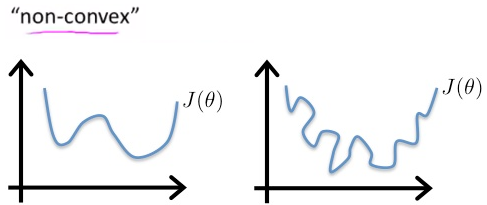
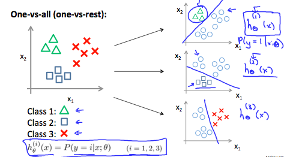

# Logistic Regression Model

## Cost Function

在處理 Classification 的 logistic regression 時

我們的 cost function 不能和 linear regression 一樣使用 :

$$
J(\theta) = \frac{1}{m}\sum_{i=1}^m \color{red}{\frac{1}{2} (h_\theta(x^{(i)})- y^{(i)})^2}
$$

原因如下，我們把 sum 後面那一段簡寫成 :

$$
\text{Cost}(h_\theta(x), y) = \frac{1}{2}(h_\theta(x)-y)^2
$$

而其中的 h\(x\) 在 logistic regression 時需要帶入 :

$$
\text{Cost}(h_\theta(x), y) = \frac{1}{2}(\frac{1}{1+e^{-\theta^Tx}}-y)^2
$$

這個 complicated nonlinear function 會使得 cost function 變為 **non-convex**

也就是有多個 local optima 難以 converge



所以針對 logistic regression 有另一套 cost function :

$$
\begin{aligned}
&J(\theta) = \frac{1}{m}\sum_{i=1}^m \text{Cost}(h_\theta(x^{(i)}),y^{(i)})\\
&\text{Cost}(h_\theta(x),y) = -\log(h_\theta(x))&& \text{ if } y = 1\\
&\text{Cost}(h_\theta(x),y) = -\log(1 - h_\theta(x))&& \text{ if } y = 0
\end{aligned}
$$

跟使用 logistic function 用來表達 classification 的 hypothesis 一樣

我們用 **log function** 的特徵加上負號來代表 cost function


所以當 y = 1 且我的 h\(x\) 也為 1 時

代表我準確命中，所以 cost function 應該為 0

而我 h\(x\) 為 0 時，代表我錯的離譜，所以 cost function 會 → ∞


而當 y = 0 且我 h\(x\) 也為 0 時

一樣表示我準確命中，所以 cost function 為 0

而 h\(x\) 為 1 時，錯的離譜，所以 cost function 一樣 → ∞


現在我們得到一個 cost function J 他是一定能夠 converge 的 **convex** function

$$
\begin{aligned}
&\text{Cost}(h_\theta(x), y) = 0 \text{ if } h_\theta(x) = y\\
&\text{Cost}(h_\theta(x), y) \rightarrow \infty \text{ if } y = 0 \text{ and } h_\theta(x) \rightarrow 1\\
&\text{Cost}(h_\theta(x), y) \rightarrow \infty \text{ if } y = 1 \text{ and } h_\theta(x) \rightarrow 0
\end{aligned}
$$

## Simplified Cost Function and Gradient Descent

我們可以將兩行的 cost function 濃縮成一行 :

$$
\text{Cost}(h_\theta(x), y) = -y \log(h_\theta(x)) - (1 - y) \log (1-h_\theta(x))
$$

* 假設 y = 1 那麼後面項將會被消掉

  $$
  \text{Cost}(h_\theta(x), y) = -\log(h_\theta(x))
  $$

* y = 0 則是前面項會被消掉

  $$
  \text{Cost}(h_\theta(x), y) = -\log(1-h_\theta(x))
  $$

所以完整的 cost function J 為

$$
J(\theta) = - \frac{1}{m}\sum_{i=1}^m 
[y^{(i)}\log(h_\theta(x^{(i)})) + (1 - y^{(i)})\log(1-h_\theta(x^{(i)}))]
$$


可以再進化成 vectorized function

$$
h = g(X\theta)\\
J(\theta) = \frac{1}{m} \cdot (-y^T\log(h)-(1-y)^T\log(1-h))
$$


我們一樣可以使用 **Gradient Descent** 來找出 cost function 的最小 $$\theta$$

原本的 gradient descent 長這樣 :

$$
\begin{aligned}
&\text{Repeat \{} \\
&\theta_j := \theta_j - \alpha \frac{d}{d\theta_j}J(\theta)\\
&\text{\}}
\end{aligned}
$$

現在我們可以將新的 cost function J 插入得到 :

$$
\begin{aligned}
&\text{Repeat \{} \\
&\theta_j := \theta_j - \alpha \frac{1}{m} \sum_{i=1}^{m}(h_\theta(x^{(i)}) - y^{(i)})x^{(i)}_j\\
&\text{\}}
\end{aligned}
$$

這個新的 Gradient descent 看起來跟 linear regression 的**一模一樣**

但實際上裡面的 h\(x\) 是不同的東西 :

$$
\begin{aligned}
\text{Old : } h(x) &= \theta^Tx \\
\text{New : } h(x) &= \frac{1}{1+e^{-\theta^Tx}}
\end{aligned}
$$


每個 loop 裡面的 theta 一樣要同時更新，而他的 vectorized implementation 為

$$
\theta := \theta - \alpha \frac{1}{m} X^T (g(X\theta) - \vec{y})
$$


## Advanced Optimization

有一些進階的方法可以求 optimize theta

例如 :

* Conjugate gradient
* BFGS
* L-BFGS

這些方法比起自己寫的 gradient descent 還要更快更有效率

也不需手動決定 learning rate

但十分複雜，不過我們可以透過一些 library 來直接執行

在 Octave 中我們呼叫 `fminunc()` 來實作

我們需要提供以下兩個東西的數值，分別為

$$
J(\theta) \text{  and  } \frac{d}{d\theta_j}J(\theta)
$$

這邊我們建立一個 **`costFunction`** 可以一次算出兩者

```text
function [jVal, gradient] = costFunction(theta)
    jVal = [...code to compute J(theta)...];
    gradient = [...code to compute derivative of J(theta)...];
end
```

接著要提供 `optimset` \(function 的 options\)

以及最初的 $$\theta$$ 值

Octave 程式碼如下 :

```text
options = optimset('GradObj', 'on', 'MaxIter', 100);
initialTheta = zeros(2,1);

[optTheta, functionVal, exitFlag] = fminunc(@costFunction, initialTheta, options);
```

### Example

舉個簡單的例子 :

要找到該 Cost function 最小的 theta \(一看就知道兩個都是 5\)

$$
\begin{aligned}
\theta &= \begin{bmatrix}\theta_1\\\theta_2\end{bmatrix}\\
J(\theta) &= (\theta_1 - 5)^2 + (\theta_2 - 5)^2\\
\frac{d}{d\theta_1}J(\theta) &= 2(\theta_1 - 5)\\
\frac{d}{d\theta_2}J(\theta) &= 2(\theta_2 - 5)
\end{aligned}
$$

實作 :

* Cost function

```text
function [jVal, gradient] = costFunction(theta)
    jVal = (theta(1)-5)^2 + (theta(2)-5)^2;
    gradient = zeros(2, 1);
    gradient(1) = 2*(theta(1)-5);
    gradient(2) = 2*(theta(2)-5);
end
```

* Calling fminunc

```text
options = optimset('GradObj', 'on', 'MaxIter', 100);
initialTheta = zeros(2, 1);

[optTheta, functionVal, exitFlag] = fminunc(@costFunction, initialTheta, options);
```

* prints

```text
optTheta =
    5.0000
    5.0000

functionVal = 1.5777e-030  // 就是 cost 0
exitFlag = 1  // 代表 Converge
```

## Multiclass Classification: One-vs-all

當 classification 的種類超過兩種以上

也就是 y = {0, 1} 擴充至 y = {0, 1, ... n} 時

要使用 **one-vs-all \(one-vs-rest\)** 的方法來解決

做法就是將 n 個種類的 data 執行 n 次的分類

每一次專注在一種種類，並把其他種類當成一類

$$
\begin{aligned}
&y \in \begin{Bmatrix}0,1,\cdots,n\end{Bmatrix}\\
&h_\theta^{(0)} (x) = P(y = 0 \mid x;\theta)\\
&h_\theta^{(1)} (x) = P(y = 1 \mid x;\theta)\\
&h_\theta^{(2)} (x) = P(y = 2 \mid x;\theta)\\
\vdots\\
&h_\theta^{(n)} (x) = P(y = n \mid x;\theta)\\\\

&\text{prediction } = \max_{i}(h_\theta^{(i)}(x)) 
\end{aligned}
$$

然後分析每一個 data 在所有 n 個 h\(x\) 裡誰的機率最高，他就是哪一類



例如新的 data 要進到裡面來，看他是 class 1, 2, 3 哪一種

就會把三種 h\(x\) 各跑一次

最後哪一種機率最高，他就是那一個 class

