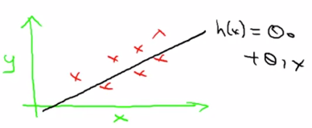
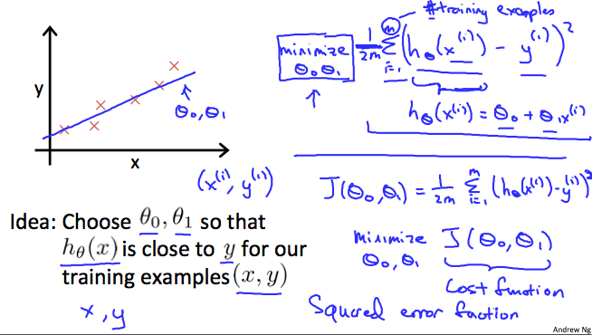

# Model Representation
在 Supervised learning 中我們會有一些 training sets (用來學習預測)

用房屋大小預測價格 :

| Size in feet | Price in 1000 |
|--------------|---------------|
| 2104         | 460           |
| 1416         | 232           |
| 1534         | 315           |
| ...          | ...           |

有一些常用的 notation 先記一下 :

* **m** = Number of training examples (有幾筆資料)
* **x's** = Input variables / features (輸入的變數 / 房子 Size)
* **y's** = Output variables / features (輸出的變數 / 對應的 Price)

要表達每一筆 data 則是這樣 :
* **(x, y)** = One training example
* 而要表達特定某一行 training example 時 :
$$
(x^{(i)}, y^{(i)}) = \text{i}^{th} \text{ training example.}
\\
\text{For example : }
x^{(1)} = 2104, y^{(1)} = 460
$$

---

所以一個 Supervised learning 的工作流程如下 :

我們會將 training sets 餵進一個 learning algorithm 等他產生 output **Hypothesis (h)**

這個 **hypothesis** 是一個將 x 映射至 y 的函數

也就是我們在未來只要給定 **x**， **hypothesis** 就要能夠幫我們精準預測 **y**

所以接下來的重點就是如何去取得這個 **hypothesis** !

---

我們首先先用簡單的線性公式來表達 **hypothesis** :

$$
h_\theta(x) = \theta_0 + \theta_1x
$$

我們可以簡寫為
$$
h(x)
$$

這個公式可以透過簡單的線性方程與我們 x 預測 y 的圖表結合 :

而這個簡單的模型我們稱為 **Univariate linear regression** (means **Linear regression with one variable**)

# Cost Function
我們知道 **Hypothesis** 的公式為
$$
h_\theta(x) = \theta_0 + \theta_1x
$$
那我們要帶入什麼值給 (How to choose)
$$
\theta_0 \text{ and } \theta_1 \text{ (parameters)}
$$
來讓這個線性方程能夠 best fit 我們的 training sets

---

$$
\text{Idea : Choose } \theta_0, \theta_1 \text{ so that } h_\theta(x) \text{ is close to } y \text{ for our training examples } (x, y) 
$$

所以我們得到一個公式 (**Cost function**)，用於最小化 theta 0 和 theta 1 :
$$
J(\theta_0, \theta_1) = \frac{1}{2m} \sum_{i=1}^{m}(h_\theta(x^i)-y^i)^2
$$

**Cost function** 所算出來的值越接近 0 ，代表越精確

深入觀察，其實就是在算

每一個「**預測的 y**」 和「**真實的 y**」 的差異，平方過後並求平均值

又稱為 **"Squared error function", or "Mean squared error"**

> 這個 1/2 是為了方便 gradient descent 計算，因為在微分後可以消掉這個 1/2

用圖總結一下 cost function :

# Intuition I

假設我們有一個非常完美的 **Hypothesis (h)** 被 Output 出來

這個 function 剛好是 linear equation 直線完全 fit 到所有的 training examples

所以他對應的 **Cost function (J)** 會是 0 才對

> 我們假設 theta 0 是 0，只要看 theta 1 就好，所以 J 會呈現一個 x, y plane
>
> 其中 x 軸代表 theta 1 的值，而 y 軸代表 Cost function 的結果

在上圖， theta 1 等於 1 的時候，hypothesis 完全 fit 所有的 training sets

所以他在 cost function 中得到 0 的結果

接著若 theta 1 = 0.5 的話，Hypothesis 和每個 training sets 都有一些差距

此時他的 cost function 就等於 0.58 了 !

我們可以依此類推得出所有的 theta 1 得出整個 cost function 圖表

因為 theta 1 = 1 時，cost function 最接近 (等於) 0，代表誤差最小

所以我們應該要 output 一個 hypothesis 他的 theta 1 = 1, theta 0 = 0 為最佳解

$$
\begin{aligned}
H_\theta(x) &= \theta_0 + \theta_1 \times x \\
&= 0 + 1 \times x
\end{aligned}
$$

# Intuition 2
上面我們在案例中把 theta 0 拿掉，所以 cost function 會顯示為二維圖表

若 theta 0 不等於 0 時， cost function 將要使用一個 3D 模型才可以視覺化 (也可以用 contour plot 表示)

> 可以看到右下為 theta 0，左下為 theta 1，而模型最凹之處就是最小誤差的地方

在上圖中
$$
\theta_0 = 800 \text{ and } \theta_1 = -0.15
$$
不用看 cost function 就知道跟真實的 training sets 有誤差

而 cost function 的值的確也與中心點有段距離

而當
$$
\theta_0 = 250 \text{ and } \theta_1 = 0.12
$$
時，我們可以算出他的 cost function 非常接近中心點了

也就是一個非常好的 hypothesis 了

---
我們複習一下重點

也就是說

我們應該要創建一個 learning algorithm

讓這個 algorithm **自動** 去找出 cost function 的最低點

並且 output 出一個理想的 **Hypothesis** !