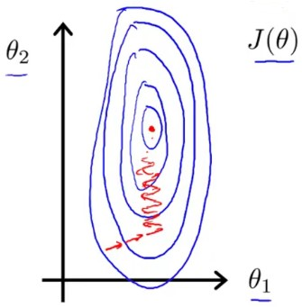
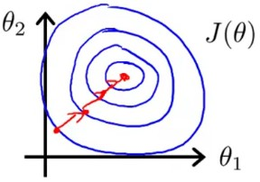
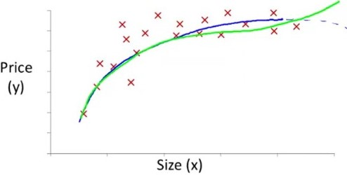
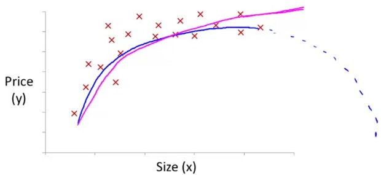

# Multiple Features
當 linear progression 可以有多個 features (variables) 時

稱作 **Multivariate linear regression**

例如一次用 size, ages, number of bedrooms, floors 來判斷 house price

| size | bedrooms | floors | age | price |
|------|----------|--------|-----|-------|
| 2104 | 5        | 1      | 45  | 460   |
| 1416 | 3        | 2      | 40  | 232   |
| 1534 | 3        | 2      | 30  | 315   |

此時我們多了一些名詞 :

$$
\begin{aligned}
n &= \text{number of features}\\

x^{(i)} &= \text{the features (input) of the } i^{th} \text{ training example}\\

x^{(i)}_j &= \text{value of feature j in the } i^{th} \text{ training example}
\end{aligned}
$$

用表格來舉例 :

$$
\begin{aligned}
m &= 3 \\
n &= 4 \\
x^{(2)} &= \begin{bmatrix}
    1416 \\ 3 \\ 2 \\ 40
\end{bmatrix} \\

x^{(3)}_3 &= 2
\end{aligned}
$$

---

我們的 Hypothesis 也不再是單純的
$$
h_\theta(x) = \theta_0 + \theta_1x
$$

而可以是 :
$$
h_\theta(x) = \theta_0 + \theta_1x_1 + \theta_2x_2 + \theta_3x_3 + \cdots + \theta_nx_n   
$$

我們可以用房子當作例子來想像這個公式 :
$$
h_\theta(x) = 80 + 0.1x_1 + 0.01x_2 + 3x_3 - 2x_4
$$
* 代表 80 為房價的基底
* 0.1 為 size 的權重
* 0.01 為 bedroom 數量的權重
* 以此類推，最終將會得出一個 solid value for pricing

---

我們可以使用矩陣和向量來簡化 Hypothesis

首先我們先假設 x0 來補齊每一個 training set 對應的 base value (80 的部分)
$$
x^{(i)}_0 = 1
$$

所以 features 可以建成一個 n + 1 size 的 vector
$$
x = \begin{bmatrix}
    x_0 \\ x_1 \\x_2 \\\vdots\\x_n
\end{bmatrix} \in \mathbb{R}^{n+1}
$$

而 parameters 也一樣可以建成一個 n + 1 size 的 vector
$$
\theta = \begin{bmatrix}
    \theta_0 \\ \theta_1 \\\theta_2 \\\vdots\\\theta_n
\end{bmatrix} \in \mathbb{R}^{n+1}
$$

如此一來， Hypothesis 可以寫成
$$
\begin{aligned}
x_0 &= 1,\\
h_\theta(x) &= \theta_0x_0 + \theta_1x_1 + \theta_2x_2 + \theta_3x_3 + \cdots + \theta_nx_n\\
&= \begin{bmatrix} \theta_0 & \theta_1 & \cdots & \theta_n \end{bmatrix}
\begin{bmatrix} x_0 \\ x_1 \\ \vdots \\ x_n \end{bmatrix} \\
&= \theta^Tx
\end{aligned}
$$

# Gradient Descent for Multiple Variables
Multivariate 不只會讓 Hypothesis 改變，也會讓 Cost function 改變 :
$$
J(\theta) = \frac{1}{2m}\sum_{i=1}^{m}(h_\theta(x^{(i)}) - y^{(i)})^2
$$

甚至可以寫成 :
$$
J(\theta) = \frac{1}{2m}\sum_{i=1}^{m}((\sum_{j=0}^n\theta_jx^{(i)}_j) - y^{(i)})^2
$$

或是寫成 :
$$
J(\theta) = \frac{1}{2m}\sum_{i=1}^{m}(\theta^Tx^{(i)} - y^{(i)})^2
$$

---
在看新的 Gradient descent algorithm 前，先複習原本只有一個 feature 的算法 :
$$
\begin{aligned}
\text{Repeat} &\text{ until convergence: }\\
&\theta_0 := \theta_0 - \alpha \frac{1}{m}\sum_{i=1}^m(h_\theta(x^{(i)}) - y^{(i)})\\
&\theta_1 := \theta_1 - \alpha \frac{1}{m}\sum_{i=1}^m(h_\theta(x^{(i)}) - y^{(i)})x^{(i)}\\

&(\text{simultaneously update }\theta_0, \theta1)
\end{aligned}
$$

而新的 Gradient descent algorithm 其實非常簡單 :
$$
\begin{aligned}
\text{Repeat} &\text{ until convergence: }\\
&\theta_0 := \theta_0 - \alpha \frac{1}{m}\sum_{i=1}^m(h_\theta(x^{(i)}) - y^{(i)}) \cdot x_0^{(i)}\\
&\theta_1 := \theta_1 - \alpha \frac{1}{m}\sum_{i=1}^m(h_\theta(x^{(i)}) - y^{(i)}) \cdot x_1^{(i)}\\
&\theta_2 := \theta_2 - \alpha \frac{1}{m}\sum_{i=1}^m(h_\theta(x^{(i)}) - y^{(i)}) \cdot x_2^{(i)}\\
&\cdots\\
&(\text{simultaneously update }\theta_0, \theta1, \cdots \theta_n)
\end{aligned}
$$

因為我們已經定義過， x0 = 1，所以才可以這樣寫

代表每一個微分項裡面都會有乘上對應的 feature

我們可以將算法再簡化一些 :
$$
\begin{aligned}\text{Repeat} &\text{ until convergence: }\\
&\theta_j := \theta_j - \alpha \frac{1}{m}\sum_{i=1}^m(h_\theta(x^{(i)}) - y^{(i)}) \cdot x_j^{(i)}\\
& \text{for j = } 0 \cdots n \text{ (and update simultaneously)}
\end{aligned}
$$

這就是解決 Multivariate linear regression 的 cost function 的 Gradient descent algorithm

# Gradient Descent in Practice I - Feature Scaling
現在來學習幾個方法來改善 gradient descent 的一些小缺點

我們發現若 feature 的數值範圍若過大，會造成 cost function 所形成的 contour plot 變成類似橢圓形

而 gradient descent 將會以較慢速度，來回擺動直到找到最佳收斂點

所以 feature 值盡量介於以下區間 (當然不是必須，但不要差太多就行) :
$$
-1 \le x_i \le 1 \\
\text{or}\\
-0.5 \le x_i \le 0.5
$$

有兩個方法可以解決問題，分別是 **feature scaling** 和 **mean normalization**

讓 gradient descent 可以良好的運作在類圓形的 cost function，減少 iteration 的次數

## Feature scaling
Feature scaling 將 input feature 除以 range (例如 features 的 maximum - minimum 或是 standard deviation)

來讓新的 input value 變成接近在 1 範圍的新數值

例如 :
$$
\begin{aligned}
x_1 &= \frac{\text{size} (\text{feet}^2)}{2000} \\
x_2 &= \frac{\text{number of bedrooms}}{5}
\end{aligned}
$$

## Mean normalization
Mean normalization 則是將 input 減去 features average 

來讓新的 input value 接近 zero mean (x0 = 1 不會變)

我們會將兩個方法合而為一個公式 :

$$
x_i := \frac{x_i - \mu_i}{S_i} 
$$

* 其中 mu 代表是所有 features 的平均值
* S 表示 Range 值 (or standard deviation)

例如 :

Housing prices 在 range 2000 ~ 5000 然後 mean value 為 1000

所以每個新的 features 會計算為 :
$$
x_i := \frac{x_i - 1000}{3000}
$$

# Gradient Descent in Practice II - Learning Rate
要確保 gradient descent 正常運作

我們可以使用以下的 plot 進行 **debugging gradient descent** :

* x 軸為 gradient descent 已經 iterate 的次數
* y 軸為 cost function 的表現

如果 J function 是往上增加
* 可能是 gradient descent algorithm 寫錯了
* 或需要把 alpha 值減少再重做一遍

---
不同問題的 gradient descent 所需要的 iteration 數也不同

可能從幾百到幾百萬次迴圈數都有可能

所以這張圖可以很清楚的看到 gradient descent 的狀態

另外也可以使用 **Automatic convergence test** 

透過設置一個小於 10^-3 的值，並觀察下一次的 iteration 是否變動小於該數

來自動告訴我們已經收斂

> 但要設置這個數是較困難的，所以比較少使用

---
至少已經證明

當 **learning rate alpha** 夠小

cost function J 是會不斷 decrease 的

所以當 debug plot 發生這幾種現象時

應考慮減少 alpha 值

# Features and Polynomial Regression
我們可以改變 features 以及 Hypothesis 的形式及組成

來優化 Hypothesis 讓他適應更多不同的 training sets

像是我們可以組合兩個 features 為一個，透過簡單的相乘即可 :
$$
x = x_1 \cdot x_2
$$

例如使用房子的 width 和 height 作為 features 時
$$
h_\theta(x) = \theta_0 + \theta_1 \cdot \text{frontage} + \theta_2 \cdot \text{depth}
$$
我們可以將兩者相乘得到 area 作為新的 feature :
$$
\begin{aligned}
x \text{ (area)} &= \text{frontage } \cdot \text{ depth} \\
h_\theta(x) &= \theta_0 + \theta_1 \cdot x
\end{aligned}
$$
---

Hypothesis 也不一定只能使用 linear function 來 fit training sets

我們可以將 hypothesis function 轉為 quadratic, cubic 或 square root function 甚至是更多不同的 functions

例如上面這一個 training sets 若使用一般的 linear function 一定不好

我們可以使用藍線的 quadratic function

只要將同一個 feature 拿來平方即可
$$
h_\theta(x) = \theta_0 + \theta_1x_1 + \theta_2x_1^2
$$

但 quadratic 會在 size 越大時得到更少 price

所以我們可以使用綠線的 cubic function
$$
h_\theta(x) = \theta_0 + \theta_1x_1 + \theta_2x_1^2 + \theta_3x_1^3
$$

這時候有兩個新的 feature 就是由 x1 的平方和立方求得

---

要十分注意的是 !

這類 Polynomial regression 在搭配 **feature scaling** 時

數值的範圍改變非常重要 !

例如 :
$$
\text{Range of }x_1 = 1 - 1000
$$

那麼在 quadratic 及 cubic 的部分就會變成 :
$$
\begin{aligned}
\text{Range of }x_1^2 &= 1 - 1,000,000 \\
\text{Range of }x_1^3 &= 1 - 1,000,000,000
\end{aligned}
$$

---

其實上面用 quadratic 跟 cubic function 都沒有非常 fit

最後，我們用一個 square root 的例子來練習

也就是上圖紫線的部分
$$
h_\theta(x) = \theta_0 + \theta_1x_1 + \theta_2\sqrt{x_1}
$$

而他在 feature scaling 後的 features 就是 (不考慮 mean normalization) :
$$
x_1 = \frac{\text{size}}{1000},
x_2 = \frac{\sqrt{\text{size}}}{\sqrt{1000}}
$$

> [Slide](https://d3c33hcgiwev3.cloudfront.net/_7532aa933df0e5055d163b77102ff2fb_Lecture4.pdf?Expires=1569110400&Signature=D3p36Xxg5kY-RmkDekhyQDn3ru8QNE8RgDx4qQBpR2PgiZhBuS4tJh5b5oIcZ0sjzrk0Eos0hTLml7vXO0A2OjsDiCfevUWnVFf16-j9WWyEFnPiHMbrfRgm96Aiozqb6XCkpjHSsATJbwvx~7wtiaM4L1jpOCfNCyDLC92KLOc_&Key-Pair-Id=APKAJLTNE6QMUY6HBC5A)