# Motivations

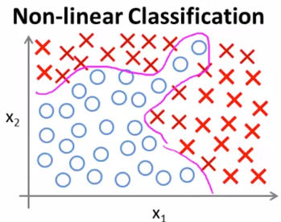

想像我們為了解決上面這個 Non-linear classification

必須使用 sigmoid function 搭配很多的 parameters 和新 features

$$
g(\theta_0 + \theta_1x_1 + \theta_2x_2 + \theta_3x_1x_2 + \theta_4x_1^2x_2 + \theta_5x_1^3x_2 + \theta_6x_1x_2^2 + \cdots)
$$

像上面用了兩個 features 就產生了可能 "Overfitting" 的 hypothesis

當我們有更多的 features 時，新 features 的數量將以指數成長

## Example - Computer Vision

當我們要用機器學習來辨識圖片時 (舉例: 車子)

我們將整張圖片的每一個 pixel 截取出來，並給予 intensity (0-255 灰階)

我們將不同圖片的 pixel 資訊 plot 在一個二維空間中，用以分辨該 pixel 為多少時是否為車子

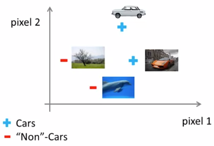

這種時候就可以用到 non-linear hypothesis

假設我們只要辨識 50 * 50 pixel 的小圖片

那我們將會用到 2500 的 features (7500 if RGB)

而產生的新 features 將會達到約 3 billion features

## Neural Networks

一開始 neural networks 是為了試圖模擬人的大腦運作

大腦可以讓我們做幾乎任何事情，聽、說、讀、寫、看、觸 ...

而其實大腦只花了一種 learning algorithm 就做到這些事情

科學家用一種 Neural Rewiring 的實驗發現了這件事情

他們將動物接收聽覺的 Auditory Cortex **REWIRE** 接收視覺

他們發現 Auditory Cortex 變得能夠接收到視覺

### Sensor Representation in the brain

還有許多將 Sensor 與大腦結合的發明

* 用舌頭看東西
* 人體聲納
* Haptic belt

這些東西告訴我們

其實大腦只用了一種 algorithm 來教導身體做事

而我們的最終目標就是找到這個 learning algorithm 的 hypothesis

並且把他運用在電腦上

# Model Representation

## Neuron

Neuron 作為 neural networks 的最小單位，模擬人類的神經元

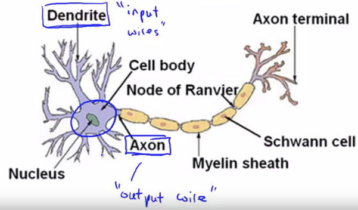

* 透過 input wires (**dendrites**) 接收多個 input
* 並從 output wires (**axons**) 將處理過的訊息傳送出去

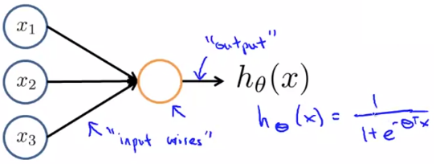

其中 input 的是 features $$x_1, x_2, \cdots x_n$$ 

而 output 就是 hypothesis function $$h_\theta(x)$$

我們會在 input 再加上一個 $$x_0$$ 作為 **bias unit** 永遠為 1

而處理這些 input 的為 sigmoid (logistic) **activation** function $$\frac{1}{1+e^{-\theta^Tx}}$$

而在 neural networks 中 $$\theta$$ 這個 parameters 又稱作 "**weight**"

當有多層 layer 時，我們稱第一層為 input layer 最後一層為 output layer

而中間所有的層統稱為 **hidden layers**

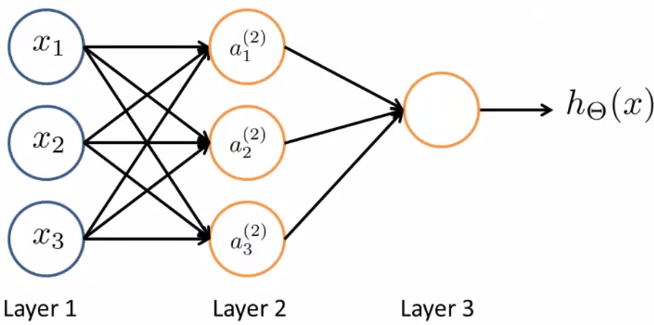

## Notations

我們給予上圖 hidden layer 的 nodes 一個名字: **Activation units**

而這些 activation units 是經由 input 和 **Matrix of Weights** 作用 output 過來的

$$
\begin{aligned}
a_i^{(j)} &= \text{activation of unit } i \text{ in layer }j\\
\Theta^{(j)} &= \text{matrix of weights controlling function mapping from layer } j \text{ to layer } j + 1
\end{aligned}
$$

舉個例子來說 $$a_1^{(2)}, a_2^{(2)}, a_3^{(2)}$$

就是由 3x4 的 $$\Theta^{(1)}$$ 乘上 4x1 的 input $$\vec{x}$$ 向量而來

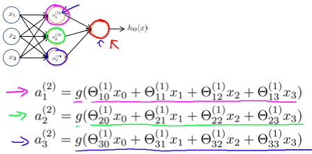

而 hypothesis $$h_\Theta(x)$$ 就是

$$
h_\Theta(x) = a_1^{(3)} = g(\Theta^{(2)}\vec{a}^{(2)}) = g(\Theta^{(2)}_{10}a_0^{(2)}+
\Theta^{(2)}_{11}a_1^{(2)} + \Theta^{(2)}_{12}a_2^{(2)} + \Theta^{(2)}_{13}a_3^{(2)})
$$

我們可以推出 matrix of weight 的 dimension :

* 若 layer $$j$$ 共有 $$s_j$$ 個 units
* 且 layer $$j+1$$ 共有 $$s_{j+1}$$ 個 units
* 那麼 $$\Theta^{(j)}$$ 的 dimension 為 $$s_{j+1} \times (s_j + 1)$$

例如 layer 1 有 2 個 nodes 而 layer 2 有 4 個 nodes

那麼 $$\Theta^{(1)}$$ 的 dimension 為 4 x 3

## Vectorized implementation

現在我們將每個 g function 內的 $$\Theta$$ 和 $$x$$ 改為矩陣運算產生的 $$z$$

$$
\begin{aligned}
a_1^{(2)} = g(\Theta_{10}^{(1)}x_0 + \Theta_{11}^{(1)}x_1 + \Theta_{12}^{(1)}x_2 + \Theta_{13}^{(1)}x_3) = g(z_1^{(2)})\\
a_2^{(2)} = g(\Theta_{20}^{(1)}x_0 + \Theta_{21}^{(1)}x_1 + \Theta_{22}^{(1)}x_2 + \Theta_{23}^{(1)}x_3) = g(z_2^{(2)})\\
a_3^{(2)} = g(\Theta_{30}^{(1)}x_0 + \Theta_{31}^{(1)}x_1 + \Theta_{32}^{(1)}x_2 + \Theta_{33}^{(1)}x_3) = g(z_3^{(2)})
\end{aligned}
$$

也就是說在第 j 個 layer 的第 k 個 node，他的 z 就會是

$$
z_k^{(j)} = \Theta_{k,0}^{(j-1)}x_0 + \Theta_{k,1}^{(j-1)}x_1 + \cdots + \Theta_{k,n}^{(j-1)}x_n
$$

現在我們進一步將 input $$x$$ 向量作為 $$a^{(1)}$$，所以

$$
\begin{aligned}
z^{(2)} &= \Theta^{(1)}a^{(1)} \\
a^{(2)} &= g(z^{(2)})
\end{aligned}
$$

然後 $$a^{(2)}$$ 必須要補個 $$a_0^{(2)} = 1$$ 才能繼續

$$
\begin{aligned}
z^{(3)} &= \Theta^{(2)}a^{(2)} \\
a^{(3)} &= g(z^{(3)}) = h_\Theta(x)
\end{aligned}
$$

總結來說，z 和 a 的公式如下

其中的 n + 1 為 $$a_0^{(1)} = x_0, a_0^{(2)}, a_0^{(3)}, \cdots$$

$$
\begin{aligned}
z^{(j)} &= \Theta^{(j-1)}a^{(j-1)} \text{ where } \dim({\Theta^{(j-1)}}) = s_j \times (n + 1)\\
a^{(j)} &= g(z^{(j)})
\end{aligned}
$$

我們可以看到其實將最後一個 hidden layer 計算出 output layer 的過程

**等同**於將最後一個 hidden layer 的每個 activation units 作為 features 執行 **logistic regression**

而這些 activation units 其實又都是上一層的 nodes 執行 logistic regression 而來

所以這個方法稱作 **Forward Propogation**

意思是每一層都將計算出更有深度意義 (complex) 的 Hypothesis 至下一層

產出最好的 Hypothesis function

# Applications and Intuitions

我們將使用 XNOR (NOT XOR) 的例子來解釋為何 neural networks 為何可以成功

| x1  | x2  | XNOR |
| --- | --- | ---- |
| 0   | 0   | 1    |
| 0   | 1   | 0    |
| 1   | 0   | 0    |
| 1   | 1   | 1    |

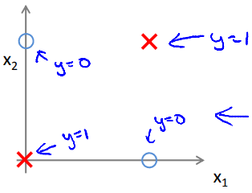

首先我們先來看 AND, OR 和 NOR 在 neural networks 的實作 :

## AND

我們將 activation function 設成以下狀態

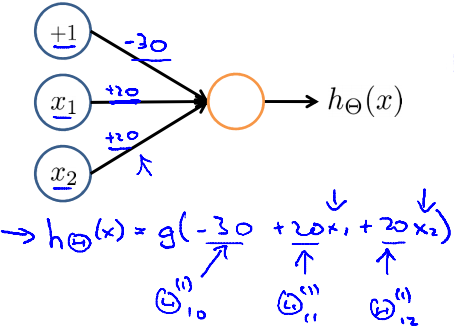

我們知道 sigmoid function 在大於 4.6 時差不多為 1

在小於 4.6 時差不多為 0

所以我們帶進去得到

| x1  | x2  | $$h_\Theta(x)$$      |
| --- | --- | -------------------- |
| 0   | 0   | $$g(-30) \approx 0$$ |
| 0   | 1   | $$g(-10) \approx 0$$ |
| 1   | 0   | $$g(-10) \approx 0$$ |
| 1   | 1   | $$g(10) \approx 1$$  |

所以這個 $$h_\Theta(x)$$ 可以說是 AND 的 best hypothesis

## OR

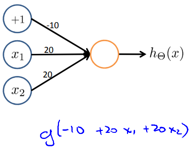

| x1  | x2  | $$h_\Theta(x)$$      |
| --- | --- | -------------------- |
| 0   | 0   | $$g(-10) \approx 0$$ |
| 0   | 1   | $$g(10) \approx 1$$  |
| 1   | 0   | $$g(10) \approx 1$$  |
| 1   | 1   | $$g(30) \approx 1$$  |

這個 Neural network 產生的 $$h_\Theta(x)$$ 也可以說是 OR 的 best hypothesis

## NOR

首先 Negation 的 hypothesis 產生如下

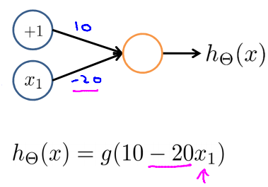

| x1  | $$h_\Theta(x)$$      |
| --- | -------------------- |
| 0   | $$g(10) \approx 1$$  |
| 1   | $$g(-10) \approx 0$$ |

而 NOR 其實就是 (NOT x1) AND (NOT x2)

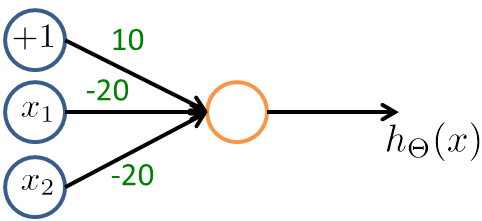

| x1  | x2  | $$h_\Theta(x)$$      |
| --- | --- | -------------------- |
| 0   | 0   | $$g(10) \approx 1$$  |
| 0   | 1   | $$g(-10) \approx 0$$ |
| 1   | 0   | $$g(-10) \approx 0$$ |
| 1   | 1   | $$g(-30) \approx 0$$ |

## XNOR

現在我們有了三種 $$\Theta$$ for AND, OR, NOR

$$
\begin{aligned}
\text{AND } \Theta^{(1)} &= \begin{bmatrix} -30 & 20 & 20\end{bmatrix}  \\
\text{NOR } \Theta^{(1)} &= \begin{bmatrix} 10 & -20 & -20\end{bmatrix}  \\
\text{OR } \Theta^{(1)} &= \begin{bmatrix} -10 & 20 & 20\end{bmatrix}  \\
\end{aligned}
$$

我們將 AND 和 NOR 的 $$\Theta$$ 分別擺到第一層運算

而 OR 則是在最後運算

$$
\begin{aligned}
\Theta^{(1)} &= \begin{bmatrix}
-30 & 20 & 20 \\ 10 & -20 & -20
\end{bmatrix} \\
\Theta^{(2)} &= \begin{bmatrix}
-10 & 20 & 20
\end{bmatrix}\\\\
a^{(2)} &= g(\Theta^{(1)} \cdot x) \\
a^{(3)} &= g(\Theta^{(2)} \cdot a^{(2)}) = h_\Theta(x)
\end{aligned}
$$

# Multiclass Classification

現在若 Neural networks 要一次處理多種問題

例如圖片辨識需要一次辨識出 Pedestrian, Car, Motorcycle, Truck

當 training sets 為 $$(x^{(1)}, y^{(1)}), (x^{(2)}, y^{(2)}), \cdots, (x^{(m)}, y^{(m)})$$ 時

我們會將 y 和 hypothesis 以 vector 方式輸出

$$
y^{(i)} = 
\begin{bmatrix}1\\0\\0\\0\end{bmatrix},
\begin{bmatrix}0\\1\\0\\0\end{bmatrix},
\begin{bmatrix}0\\0\\1\\0\end{bmatrix},
\begin{bmatrix}0\\0\\0\\1\end{bmatrix}
$$

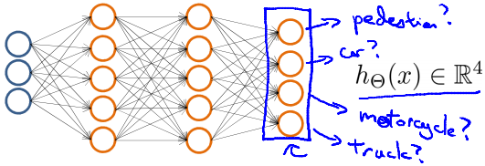

若是路人，則 $$h_\Theta(x) \approx \begin{bmatrix} 1\\0\\0\\0\end{bmatrix}$$

若是車子，則 $$h_\Theta(x) \approx \begin{bmatrix} 0\\1\\0\\0\end{bmatrix}$$

以此類推 ... 試圖讓 $$h_\Theta(x^{(i)}) \approx y^{(i)} \mid \text{Both are } \mathbb{R}^4$$