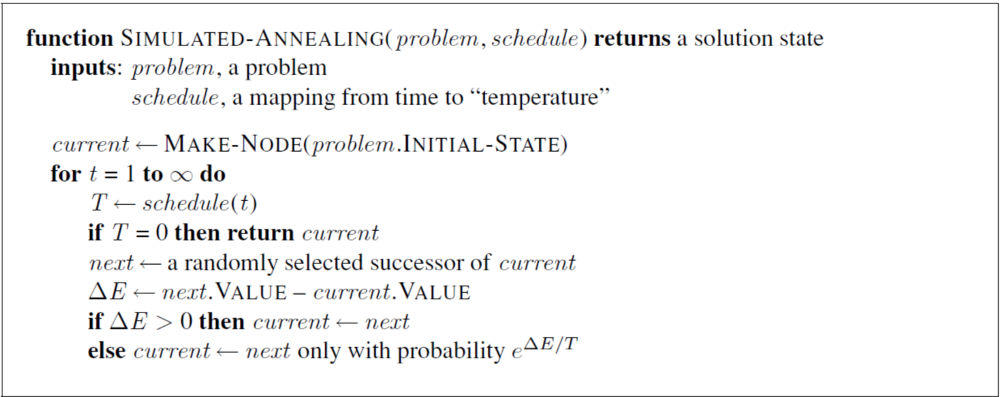
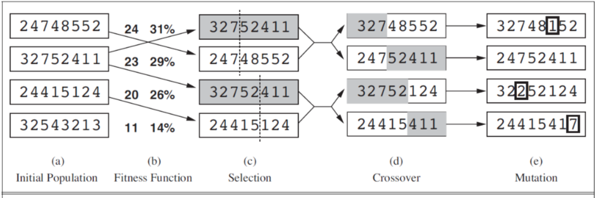
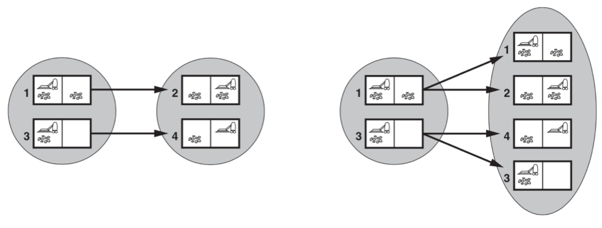
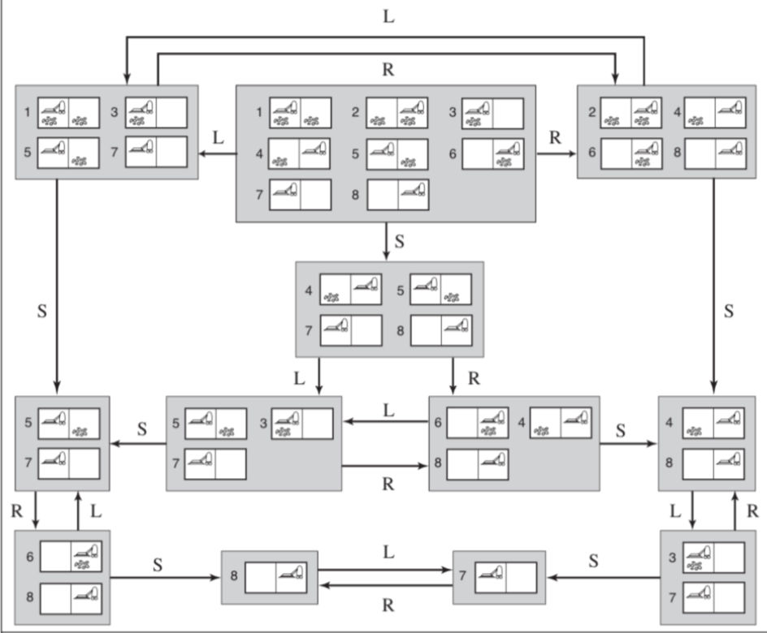
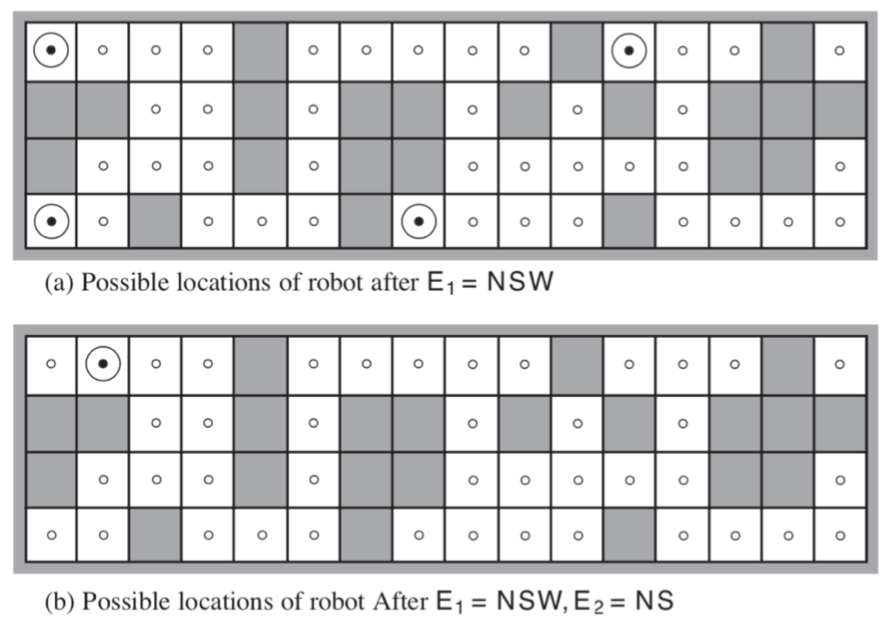

# Local Search Algorithms and Optimization Algorithms
前幾章的 Search algorithm 在找解答時

順便把經過也找了出來 (e.g., path to goal)

但其實很多問題只要求解答而已 (e.g., 8-queens problem)

---
* 這種直接求解的算法稱作 **Local Search** Algorithm
  * 每個 operation 只將 single current node 移動到鄰居
  * low memory
  * 可以在 infinite state spaces 找到 reasonable solutions
  * 他適合利用 **objective function** 來解決 **optimization problems**


* Local Search 的目標是找到 Global maximum (也就是 best solution)
* 下面介紹第一個 local search algorithm : hill climbing 

## Hill Climbing Search
* 會在 loop 中不斷找尋可以往上走的方向
  * 直到找到 **peak (no neighbor has a higher value)** 才停止
* 因為只觀察 current state 的鄰居，不會觀察全局
  * 所以只需保存 current node 的 objective function value
    * 不需要用到 search tree structure
* 又稱作 **Greedy local search** (效能還不錯)
* 但演算法會因為一些原因而卡住 :
  * Local maxima
  * Ridges
  * Plateaux or shoulder


### Example : 8-queens problem
* Successors of a state : 放下 queen 之後的所有的可能性
* Heuristic cost function (h) : 有幾對 queens 會互相攻擊
* 當 best h 有數個時，會隨機選取


* 8-queens 共有 8^8 states (17 millions)
* 若很 greedy 每次皆選最陡的路往上走
  * 有 86% 會卡住
    * 但只需花 3 步就會卡住
  * 只有 14% 會找到解
    * 但只需花 4 步找到解

* 若是繼續走，希望走到的只是一個 plateau
  * 有 94% 可以找到解
    * 但要花 21 步
  * 而失誤的話要等到 64 步才會知道

### Mutation
* **Stocastic hill climbing**
  * 在選擇 uphill move 時，會 random select 一個做為下一個 move
* **First-choice hill climbing**
  * 從 random 裡面開始找，找到第一個比 current state 好的 move 就移動
* **Random-restart hill climbing**
  * 失敗了就自動重來，直到到達 goal state 為止


## Simulated Annealing
* Annealing (冶金退火)
  * 是把金屬加熱至最高點後，慢慢降溫的手法
* Simulated Annealing
  * 一樣 random 選擇
    * 只要比 current state 好就永遠 accept
    * 就算比 current state 差也會有**一定機率** accept
      * 但是**機率**會隨著步數的增加而 decrease (就像退火)
      * With teperature T goes down
        * It becomes unlikely to accept badness




## Local Beam Search
* 會一次 track **k** 個 states (別的算法只有一個)
* initialize : k ramdom states
* Every step : all k states generate k^2 states
* 如果某一個 state 為 goal state 就中止算法

---

* Local beam search 看起來就只是 k 個 states 被平行操作
* 但其實這 k 個 states 是會互相影響, 互相傳送資料的
* 變形為 **Stochastic beam search**
  * 是 random 產生 k successors


## Genetic Algorithm
* 是 Stochastic beam search 的變形
* 會找到兩個 parent states 來產生新的 state



* Population : k ramdomly begin states
* Individual : each state
  * 用 strings 或是 0/1 來表達

* 產生 successor 方法 :
   1. 會對每個 states 打分數 (**fitness** score)
   2. 從分數給定每一個 states 被挑選的機率
   3. 從機率選擇兩個 states 作為 parent pair
   4. 每個 pair 進行 **crossover** 融合
   5. 最後再將組合好的 state 進行 **mutation**

* 下面是 crossover in 8-queens problem


# Local Search in Continuous Spaces
* 問題例子
  * 定義三個機場的 coordinates (x, y)
  * 每個城市到其中三個機場的距離都要最近
  * 有 $$(x_1, y_1), (x_2, y_2), (x_3, y_3)$$ 六個變數 (6-dimensional space)
  * 可以 **discretize** problem，利用 $$\delta$$ limitation 讓問題每次只產生 12 successors
  * 令 $$C_i$$ 為跟 airport $$i$$ 最近的 cities，而 objective function 為
    $$
    f(x_1, y_1, x_2, y_2, x_3, y_3) = \sum_{i=1}^3\sum_{c\in C_i}(x_i-x_c)^2+(y_i-y_c)^2
    $$
  * 通常會使用 gradient 方式找最佳解
  * 一個 objective function 的 gradient 會用 $$\nabla f$$ 表示
    $$
    \nabla f = \left(\frac{\partial f}{\partial x_1}, \frac{\partial f}{\partial y_1}, \frac{\partial f}{\partial x_2}, \frac{\partial f}{\partial y_2}, \frac{\partial f}{\partial x_3}, \frac{\partial f}{\partial y_3}\right)
    $$
  * 例如 $$\frac{\partial f}{\partial x_1} = 2 \sum_{c\in C_1} (x_i - x_c)$$
  * 目標就是要找到 $$\nabla f = 0$$ (斜度歸零代表找到最佳解)
  * 更 formal 的 gradient algorithm 可以寫為 $$x \leftarrow x + \alpha \nabla f(x)$$
    * $$\alpha$$ 為 step size (learning rate)

---

* $$\alpha$$ 的挑選太小跟太大都不好
  * 可以利用 line search algorithms 來挑選適合的 $$\alpha$$ 值
  * 最有名的算法是 **Newton-Raphson** method
* Local search 在 continuous space 一樣會有 local maxima 等問題
  * 可以使用 restarts, annealing 來幫助
* 這類 **constraint optimization** 最有名的是 **linear programming** (convex problem)
 
 
# Searching with Nondeterministic Actions
* 之前的問題都是 deterministic problem (actions 會產生新的固定 states)
* Nondeterministic problem 則是 actions 不一定產生常理的新 states
* 用掃地機器人的問題舉例
  * Deterministic => state 1 吸完一定跑到 state 5
  * Nondeterministic => state 1 吸完可能跑到 state 1, 5, 7 (吸力異常)


---

* 因為 nondeterministic 不一定會有固定的 actions 來解決問題
* result 變為 results
* single state 變為 set of possible states
* 所以必須把 contingency plan 考慮進去 (如果 suck 後成功變為 5 再繼續行動)
* 世界上的日常問題通常都是這種 contingency problems
* 通常解決的 solution 會包含 nested **if-then-else**
  ```
  [Suck, if State = 5 then [Right, Suck] else []]
  ```

* 我們會用 AND-OR search trees 來表達 nondeterministic actions
  * OR nodes 用來連接到既定狀況 (sequential states)
  * AND nodes 用來連接到不確定狀況 (non-deterministic)
  * 每個 leaf 都是一個 goal


---

* Nondeterministic 還可以有 cyclic solution
  * 不再是 tree 的架構
  * 例如掃地機器人的移動功能壞掉
  * 可能往右移不斷失敗，然後不斷重複右移
  * 我們可以加入 label 來表示一個 plan 方便在重複時呼叫
    ```
    [Suck, L1 : Right, if state = 5 then L1 else Suck]
    ```


# Searching with Partial Observations

## Searching with no observation (sensorless problem)
* agent 無法感知環境，但 agent 知道該做哪些事情
* agent 會把所有該做的事情做好，用 **coerce** 方式達成 goal state
* **Belief states** : 包含所有可能的 physical states
  * 若有 N 個 states，那 sensorless problem 可以提高到 $$2^N$$ states
* **Initial states** : all possible states in the problem
* **Actions** : 如果 actions 都不會發生什麼嚴重後果，那麼會將 actions union 組合
  * 如果某個 action 會造成嚴重後果，那麼 actions 最好使用 intersect 組合
* **Transition model** : 生成新的 belief states 的程序我們稱為 **prediction step**
  $$
  b' = \text{PREDICT}_p(b,a)
  $$



* **Goal test** : Agent 可能會不小心就觸發 goal 的條件，但自己卻不知道
* **Path cost** : 相同的 action 在不同的 states 進行時可能會不同

* 現在我們可以 formulate automatic construction
* 再應用之前的 search algorithms




## Solving partially observable problems
* 一個 partially observable agent 與一般的 agent 有兩點不同
* solution 將不再是 sequential 而是 conditional
* 需要維護每個 action 過後的 belief states


* 上圖又是一個幼稚園版的掃地機器人
* 每次掃地完可能會有小朋友又亂丟垃圾



* 上圖是另外一種 robot position 問題
* 我們要從給定的 robot 目前障礙物，來一步步判斷 robot 的位置


# Online Searching Agents with Unknown Environments
* 以上我們講的都是 **Offline search**
  * 在還沒解決問題就已經知道所有真實世界會發生的事情
* **Online search** 則是會在接收 action 後的狀況來決定下一個 action
  * 最著名的例子就是以走路機器人來建立一個平面的 3D 地圖

* Online search 一樣需考慮 :
  * **Actions** : 在 state s 可以使用的 actions
  * **Step cost** : 只有在完整做完 action 後才會知道
  * **Goal test** : Cannot determine RESULT(s,a) except by actually being in s and doing a.
  * **Competitive ratio** : 類似於 actual shortest path，越小越好

* DFS 和 hill-climbing 算法較適合用於 online search

