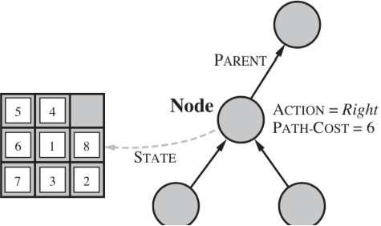

# Solving Problems by Searching

## Introduction

* 皆下來將談論 Goal-based agent 的一種型態 : **Problem-solving agent**
* 而環境也會設定在一般的 **PEAS**
  * 也就是 actions 永遠為 fixed sequence

## Problem-Solving Agents

* Problem-Solving agent 被設計為 **"Formulate, search, execute"**
* Search : 找出一系列 actions 來完成 goal
  * Search algorithm 會把 problem 當成 input，然後 output 出 solution
* Execution : 執行由這些 solution 產生的 actions

## Formulation

Formulate 也是一大關鍵，要能夠把問題很好的呈現出來

一個問題可以用五大元件表達 :

* Initial state
  * State 的最初狀態
* Actions
  * 可以實現的所有動作
* Transition model
  * 每個動作的描述與結果 \(做了某 action 會發生什麼\)
* Goal test
  * 查看 State 是否為 Goal state
* Path cost
  * 計算每個動作的成本

> * **Solution = 一系列的 actions 讓我們從 init state 走到 goal state**
> * **Solution quality = 由 past cost function 來計算**

### Example

#### Find path to a destination

* **init**: 起始位子
* **action**: 可以往哪幾個節點走
* **transition model**: 往 X 走之後會發生什麼 ?
* **goal test**: 是否到了終點
* **path cost**: 每個節點的距離

#### 8-puzzle problem

* 要讓左邊的棋盤變成右邊的棋盤
  * state: 每個回合棋盤的樣子
  * **init**: 棋盤的起始樣子
  * **action**: 空格往哪個方向移動
  * **transition model**: 移動完後新的棋盤長什麼樣子
  * **goal test**: 棋盤是否已經變成終點的樣子了
  * **path cost**: 每次移動 cost 1

#### 8-queens problem

* 要讓棋盤上的八個 queen 不會互相攻擊 \(同一列、行、斜線都會攻擊\)
  * state: 任何 8 個 queen 在棋盤的樣子
  * **init**: 每有任何 queen 在棋盤
  * **action**: 加入 queen 到棋盤
  * **transition model**: 加入後新的棋盤的樣子
  * **goal test**: 測試 8 個 queen 沒有互相攻擊

#### Real world problem

* Touring problem
* TSP
* VLSI layout
* Robot navigation

## Infrastructure for Searching Algorithms

* 我們用樹的運作來定義一個 search algorithm
  * 其中 branches 是 actions
  * 而 nodes 是 states

* 而每個 node \(n\) 有幾個屬性 :
  * n.state
  * n.parent
  * n.action
  * n.path-cost
* 我們也可以透過幾個尺度來測量 searching algorithm 的好壞 :
  * **Completeness** : 一定能找到一個解嗎
  * **Optimality** : 是否找到最佳解
  * **Time complexity** : 多久找到解
  * **Space complexity** : 花多少 memory 才找到解

而 Searching algorithm 可以分為 **uninformed** 以及 **informed**

## Uninformed Search Strategies

* 又稱 **blind search**
* 每個 state 之後生成新的 states
* 並且利用 goal test 來驗證新的 state 是否為 goal state
* 他不會知道 non-goal state 彼此間到底誰好
* 如果知道的話就是 **informed search \(heuristic search\)**

### Breadth-first search \(BFS\)

1. expand root node
2. expand all its successors
3. then their successors

* 考慮每個節點都有 b 個 successors
* 受到深度 \(depth\) 影響非常大
* 第一層要跑 b 個 nodes, 下一層要跑 b^2 個 nodes, 再下一層 b^3 ...
* 他的複雜度為

  $$
  b+b^2+b^3+\cdots+b^d = \mathcal{O}(b^d)
  $$

### Uniform-cost search

1. expand 會優先選擇 **lowest path cost** 的 node
   * 由 priority queue 來實作
2. 接著會對該 node 進行 goal test
   * test 是為了避免有更好的 path 可以走
3. 通常可以得到 optimal solution
4. 因為不受 depth 影響而是考慮 path cost
5. 複雜度為

   $$
   \mathcal{O}(b^{1+\left \lfloor C*/\epsilon \right \rfloor})
   $$

6. 若所有的 path cost 都一樣，那就會像 BFS

舉個例子 :

* [Tutorial video from youtube](https://www.youtube.com/watch?v=dRMvK76xQJI)
* queue 為 \[explored\] = 記錄不會再去的點 :

1. 走到 S
   * 此時 queue = \[S\], 並且找到 RV\[80\], E\[99\]
2. 我們選擇 RV
   * 此時 queue = \[S, RV\], 並且找到 E\[99\], P\[80+97\]
3. 我們選擇 E
   * 此時 queue = \[S, RV, E\], 並且找到 P\[80+97\], B\[99+211\]
4. 我們選擇 P
   * 此時 queue = \[S, RV, E, P\], 並且更新 B，因為 B\[80+97+101\] 小於 B\[99+211\] 
5. 我們選擇 B
   * 此時找到終點 B 為 S -&gt; RV -&gt; P -&gt; B \[80+97+101\]

### Depth-first search \(DFS\)

* expand 同一條路徑 \(frontier\) 上直到找到最深 \(deepest\) 的 node
* 時間複雜度為 \(m 有可能遠大於 d\)

  $$
  \mathcal{O}(b^m) \mid m = \text{maximum depth of any node}
  $$

* DFS 一次只需儲存同一條路上的點，空間複雜度為

  $$
  \mathcal{O}(bm)
  $$

### Depth-limited search

* 在 DFS 基礎上加入 limit \(ℓ\)
* Incompleteness
* Nonoptimal
* 這個 limit 可以由有 domain-knowledge 的人來設計

### Iterative deepening DFS

* 逐步增加 limit 直到找到 goal 為止
* 有 DFS 省空間的好處、也有 BFS completeness 的好處
* 通常用於 search space 很大時，或是 solution 是 unknown 的
* 看起來很浪費 Time complexity ，但其實 bound 在 最後一層

### Bidirectional search

* 同時從終點及起點開始演算法
* 若在中間點交集，代表找到最佳解
* Motivation 是

  $$
  b^{d/2}+b^{d/2} < b^d
  $$

* 但如何從背後 search 回來是一大難題
* path-finding & 8-puzzle 還可以實作
* 但 8-queen 這類題目是無法實作的

## Informed \(Heuristic\) Search Strategies

* Infromed search 會加入一些 domain-knowledge 進來
  * 可以幫助 algorithm 更快解出 solution
* 代表的算法為 **best-first search**
  * 藉由 evaluation function f\(n\) 來算出下一個 node
    * f\(n\) 會透過 search strategy 來挑選
  * 大部分的 search algorithm 會有 heuristic function h\(n\)
    * h\(n\) 通常評估從 node n 到 goal state 的 cheapest path cost 為何
  * 有可能 f &gt; h , 也有可能 f = h

### Greedy best-first search

* 以 path-finding 為例，直線最接近終點的 node 應該可以更快找到 solution
* 所以 h\(n\) = **n 到終點的直線距離** \(domain knowledge\)
* 而 path-finding 的 **h\(n\) = f\(n\)**
* 因為會直接使用 h\(n\) 尋找下一個最接近終點的 node
  * 所以 search cost is **minimal**
  * 但不見得是 **optimal**
  * 也像 DFS 一樣是 incomplete
* 更好的 heuristic 可以讓算法效率更高

### A\* Search

* 最有名的 best-first search
* 他會把 **path cost g\(n\)** 和 **heuristic h\(n\)** 結合在一起

  $$
  f(n) = g(n) + h(n)
  $$

* 要求 h\(n\) 能夠符合 **admissibility**
  * admissibility 代表永遠不會 overestimate cost to goal
    * Straight line distance 就有符合 admissibility
* 要求 **consistency**
  * n 的 goal cost 永遠不會大於他的 successor n'

    $$
    h(n) \le c(n,a,n') + h(n')
    $$
* 用 path-finding 舉例 :
  * heuristic = straight line distance
  * path cost = to next city distance

