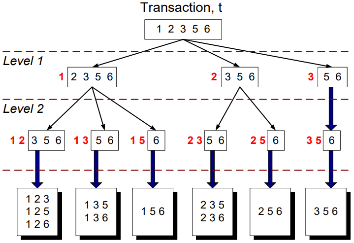
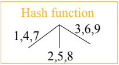
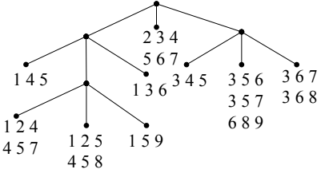
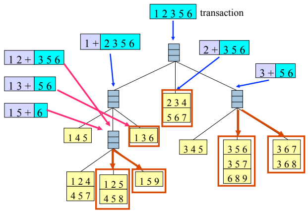
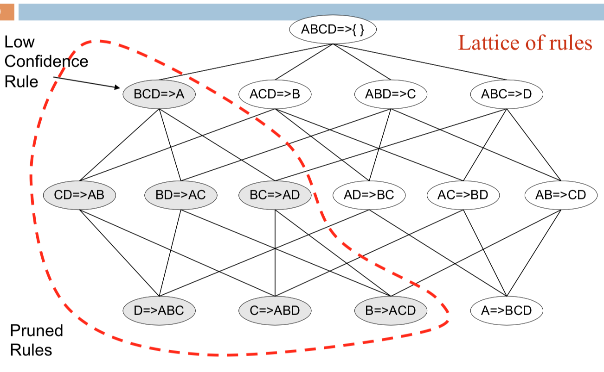
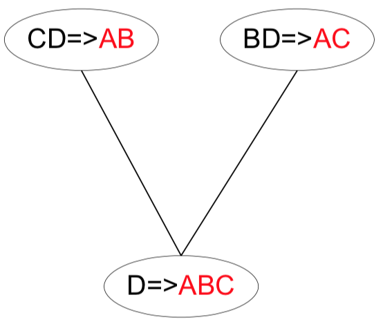
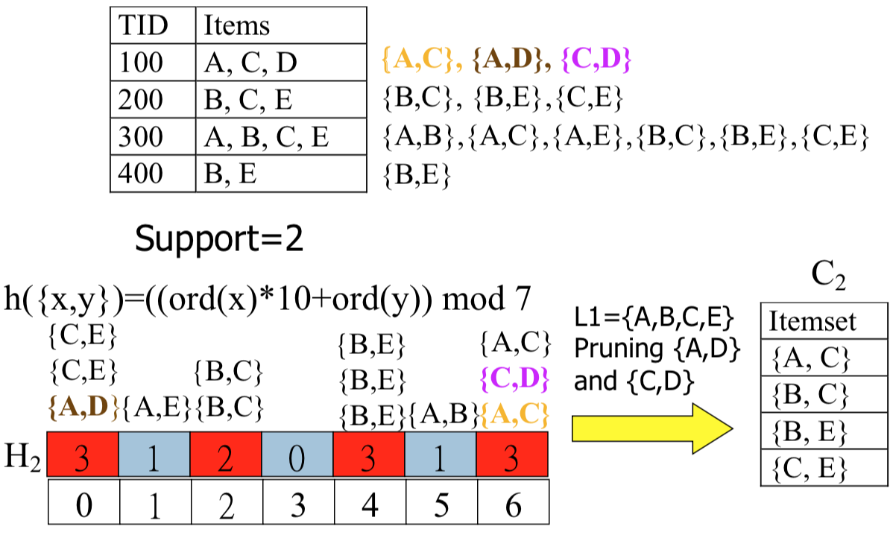

# Association Analysis

關聯法則雖然在 2019 已經不是最熱門的技術

但其實他是開啟整個 Data mining 的第一把火

## Association Rule Mining

Association Rule 就是在一堆 transaction 中

利用其他 items **occurrence** 的頻率

來預測我們想知道的 item 的 **occurrence** 機率


例如買尿布就會買啤酒, 買牛奶就會買雞蛋 ...

每次預測可以包含多個 items 合在一起

```text
{Diaper} -> {Beer}
{Milk, Bread} -> {Eggs, Coke}
{Beer, Bread} -> {Milk}
```

Association Rule 重視的是 **co-occurence**，而非 **causality** !

### Definition

接下來講解一些 association rule 實作中會遇到的專有名詞 :

* Itemset
  * 一或多個 item 的組合
  * k-Itemset 表示一個組合有 k 個 items
* Support count $$(\sigma)$$
  * 這一個 Itemset 在整個 transaction 中出現幾次
  * e.g., $$\sigma(\begin{Bmatrix} \text{Milk, Bread, Diaper} \end{Bmatrix}) = 2$$
* Support $$(s)$$
  * 該 Support count 在 transaction 的比例是多少 \(ratio from 0 - 1\)
  * e.g., $$s(\begin{Bmatrix} \text{Milk, Bread, Diaper} \end{Bmatrix}) = 2/5$$
* Frequent Itemset
  * 我們會定義一個 **minsup** \(minimum-support\)
  * 只要某個 Itemset 的 support 超過 minsup 他就是 **Frequent Itemset**
* Association Rule
  * 就是一個關聯的表達格式
  * $$X \rightarrow Y \mid X, Y \text{ are itemsets}$$
  * e.g., $$\begin{Bmatrix} \text{Milk, Diaper} \end{Bmatrix} \rightarrow \begin{Bmatrix} \text{Beer} \end{Bmatrix}$$
* Rule Evaluation Metrics
  * 要探討該 Itemset 的關聯法則準確度，我們使用 s 和 c 來表達
  * Support \(s\)
    * 跟上面一樣，就是 itemset 在 transaction 出現的百分比
    * $$s = \frac{\sigma(X, Y)}{\lvert T \rvert}$$
  * Confidence \(c\)
    * 信心度，指的是 $$Y$$ 有多常跟著 $$X$$ 一起出現
    * $$c = \frac{\sigma(X, Y)}{X}$$
  * 舉個例子，一樣是用上面出現過的 transaction

    

    我們想要探討 $$\begin{Bmatrix} \text{Milk, Diaper} \end{Bmatrix} \rightarrow \begin{Bmatrix} \text{Beer} \end{Bmatrix}$$ 的關聯度如何

    $$
    \begin{aligned}
    s = \frac{\sigma(\text{Milk, Diaper, Beer})}{\lvert T \rvert} = \frac{2}{5} = 0.4\\
    c = \frac{\sigma(\text{Milk, Diaper, Beer})}{\sigma(\text{Milk, Diaper})} = \frac{2}{3} = 0.6
    \end{aligned}
    $$

### Full Example

| TID | Items |
| :--- | :--- |
| 100 | A, C, D |
| 200 | B, C, E |
| 300 | A, B, C, E |
| 400 | B, E |

* Minimum support = 2
* Minimum confidence = 2/3

Frequent Itemset 有 \(他們都是 support 大於等於 2 的 Itemset\)

```text
{A}, {B}, {C}, {E}, {A, C}, {B, C}, {B, E}, {C, E}, {B, C, E}
```

而 Strong rule 為 \(他們都是 confidence 大於等於 2/3 的 Itemset\)

```text
{B, E} -> {C}  (2/3)
{C} -> {A}  (2/3)
{A} -> {C}  (2/2)
```

## Association Rule Mining Task

接著要想出一個方法在 transaction $$T$$, **minsup**, **minconf** 的情況下

試著找到 association rule 並滿足以下兩個條件

* $$\text{support} \ge \text{minsup}$$
* $$\text{confidence} \ge \text{minconf}$$

### Brute Force approach

1. 先列出所有的 Association rules
2. 把所有 rules 的 s 和 c 都算出來
3. 再刪除所有不滿足兩條件的 rules
4. 不可能 \(**Computationally prohibitive**\)


上面只考慮三個物件的 rules 就可以產生好幾種 \(考慮賣場有上萬種商品，有幾種 Rules ?\)

他們會有**一樣的 support**，但會有**不一樣的 confidence**

### Find other approach

1. 先找出所有 Frequent itemsets
2. 從這些 Frequent itemsets 再產生 strong association rules
3. 但光是找出 Frequent itemsets 又是 **Computationally prohibitive**

> 通常演算法找出的 frequent itemsets 不會超過五組


想像有 d 個 items，要將他們組成所有可能的 itemset 再從中去刪除不為 frequent 的 itemset

d 個 items 就會產生 $$2^d$$ 個 itemsets

* 我們將 Brute force 套回來看看
  * 所以共要先產生 $$M = 2^d$$ 個 **Candidate rules**
  * 在 database 掃描並更新每個 candidate rules 的 **support**
  * 再將所有 transactions 比對所有 candidate rules
  * 複雜度將會是 $$O(NMw) \mid N = \text{transactions}, w = \text{itemset length}$$

### Strategies

* 想辦法減少 candidate $$M = 2^d$$ ?
  * pruning techniques
* 想辦法減少 transactions $$N$$ ?
  * DHP, vertical-based mining algorithms
* 想辦法減少 comparisons $$NM$$ ?
  * efficient data strucutres

## Apriori Algorithm

### Principle

若 itemset 本身為 frequent itemset

那他的 subset 一定也可以是 frequent subset

$$
\forall X, Y : (X \subseteq Y) \Rightarrow s(X) \ge s(Y)
$$

意思就是任意 itemset 的 support 一定不會超過他的 subset 的 support

這個方法可以反推回我們在產生所有 itemset 的圖表中


因為 itemset 的 support 一定不會超過 subset

所以若是 subset 已經確定不為 frequent itemset 的話

那底下所有包含該 subset 的 itemset 都一定不會是 frequent itemset

$$
\begin{aligned}
&\begin{Bmatrix}A, B\end{Bmatrix} \neq \text{Frequent itemset} \\
\Rightarrow
&\text{Any itemset contains } \begin{Bmatrix}A, B\end{Bmatrix} \neq \text{Frequent itemset}
\end{aligned}
$$

這個原則我們稱為 **Anti-monotone** !

### Notation and Algorithm

* $$C_k$$ : candidate k-itemsets : 代表所有可能為 frequent 的 itemsets
* $$L_k$$ : frequent k-itemsets : 所有已滿足 minsup 的 frequent itemsets
* Algorithm

  ```text
  k = 1, C_1 = all items

  While C_k not empty :
      從 C_k 找出所有符合 minsup 的放入 L_k

      從 L_k 產生出下一階段的 C_k+1

      k = k + 1
  ```

### Example


* 先從 $$C_1$$ 刪除不合 minsup 的 itemsets 產生 $$L_1$$
* $$L_1$$ 生成下一階段的 $$C_2$$
* $$C_2$$ 刪除不合 minsup 產生 $$L_2$$
* $$L_2$$ 生成下一階段的 $$C_3$$
* $$C_3$$ 刪除不合 minsup 的 itemsets 產生 $$L_3$$
* $$L_3$$ 無法再產生 $$C_4$$

注意在 $$L_2$$ 生成 $$C_3$$ 的時候

{Milk, Beer} 已經不是 frequent itemset

所以包含他的 {Milk, Beer, Diaper} 也不會出現在 $$C_3$$

如果用暴力破解，總共要產生 $$\binom{6}{1} + \binom{6}{2} + \binom{6}{3} = 41$$ 種 itemset

而在這個方法中，我們只產生了 $$6 + 6 + 1 = 13$$ 種 itemset

### Generate Candidates

在產生新的 candidate itemset 時

我們將會使用 **lexicographic order** 套入 SQL 中

假設現在有 $$L_k$$ 的 itemset

**那麼新的** $$C_{k+1}$$ **= 原本兩個 k-itemsets 他們共享了其中的 k-1 個 items**


我們可以寫成 self-joining 的 SQL 語法


只要前 k - 1 個 item 都一樣

而最後的第 k 個 item 不同，就可以產生新的 candidate

### Prune

從現在所有的 \(k+1\)-itemsets candidates 中

去翻出每一個裡面的 subset k-itemsets 是否有 not frequent 的 itemset

如果有就要刪除該 candidate

### Challenges

看起來問題都解決了，但事實上還有一些問題 :

* 要如何做到在 transaction database 進行 **multiple scans**
* 在由 $$L_1$$ 產出 $$C_2$$ 的第二層，在真實問題中會產生非常大量的 itemsets \(bottleneck\)
* 計算每一個 candidate 的 support \(s\) 非常吃力
  * 可以利用 hash tree 加強

### Subset Operation

假設我們已經有一群 candidates 的名單

我們要更新他們的 support counts

我們先思考若給定 transaction 那要如何產生所有 3-subset



答案是使用 recursion !

我們將會以此精神結合 hash tree 來加快計算 support count

### Hash tree

Hash Tree 的建法很簡單，把現有的 itemset 按照 hash function 的規則建立

其中 **leaf node** 用來存 itemsets & counts 的列表

而 **interior node** 則是存放 hash table



先從 item 1 開始按照 hash function 分類

當超過 max leaf size 時，就會以下一個 item 的規則分裂



最後我們將 subset operation 套用到 hash tree 中

找到 transaction 對應的 candidates 就可以 increment 該 candidate 的 count




[Other Slide](http://www.cs.uoi.gr/~tsap/teaching/2012f-cs059/material/datamining-lect3.pdf)


### Rule Generation

我們從 frequent itemset 可以產生各式各樣的 association rules

目前為止，只要是符合 **minconf** 和 **minsup** 的 association rules

我們就會將他解釋為 good association rule

但可能有些 rules 是無用或是 duplicated 的

#### Anti-monotone

在一般情形下，不同的 confidence 間是沒有 anti-monotone 的關係

$$
c(ABC \rightarrow D) \;\not\!\!\!\implies c(AB \rightarrow D)
$$

但是相同 itemset 所產出的 confidence 可以有 anti-monotone 的關係

$$
c(ABC \rightarrow D) \ge c(AB \rightarrow CD)  \ge c(A \rightarrow BCD)
$$


你可以想像成已知三個條件猜一個

一定比已知兩個條件猜兩個還要簡單很多


所以當我們知道上層的 rule 是不符合 confidence 的

那相同 itemset 所產生的下層 rules 就可以被刪掉



#### Generate Candidate rules

我們也可以用兩個 rules 來產生新的 rule

透過 shared prefix 來組成新的 rule

但若是新 rule 的 subset 含有 low confidnece rule 那就必須刪除



$$
\begin{aligned}
&\text{join}(CD\rightarrow AB, BD\rightarrow AC) = 
D\rightarrow ABC \\
&\text{Prune }(D \rightarrow ABC) \text{ if } (AD \rightarrow BC) \text{ is low confidence.}
\end{aligned}
$$

### Improvement of Apriori Algorithm

* Ideas
  * 減少對 database 的 scan 次數
  * 減少 candidates 數量
  * Facilitate support counting of candidates

#### DHP \(Direct Hashing & Pruning\)

DHP 的目的是要改善

* frequent itemsets generation
* transaction database size reduction
* reducing of database scans

DHP 將會運用 hashing 的技巧

​將一開始的 itemsets 轉移到 hash table 上

再從 hash table 篩選出 hash 出現次數多的格子

DHP 在 hash 時可能會有誤差，但因為會不斷的往下篩選所以不要緊



在篩選的過程中，也可以慢慢剔除掉不必要的 transactions \(如 100, 400\)

達到 **Reduction on Transaction Database size**

#### Partitioning

因為 potential frequent itemset 常出現在至少一個 partition 中

所以我們將 transaction database 拆分成不重複的 partitions 放入 main memory 中

```text
Divide D into partitions D1, D2, ..., Dp
For i = 1 to p:
    Li = Apriori(Di)
C = L1 + L2 + ... + Lp
Count C on D to generate L
```

第一次 scan 時，每個 partitions 會分別產生 local frequent itemset

第二次 scan 時，collection of local frequent itemset 就能找出 global candidate itemset

每一個 partitions 能夠平行化運算增加效率

但還是會在第二次 scan 時產生過多的 candidates

#### Beyond Apriori Algorithm

所以 Apriori 始終沒辦法解決 candidates 過多的問題

我們有辦法避免 candidate generation 嗎？

