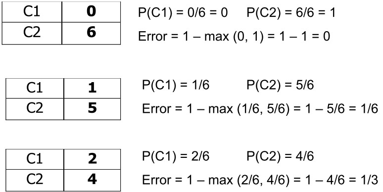
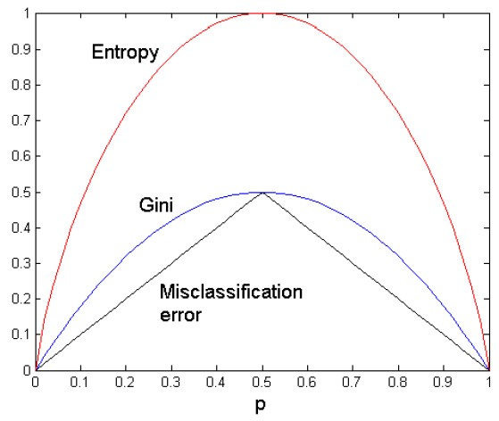
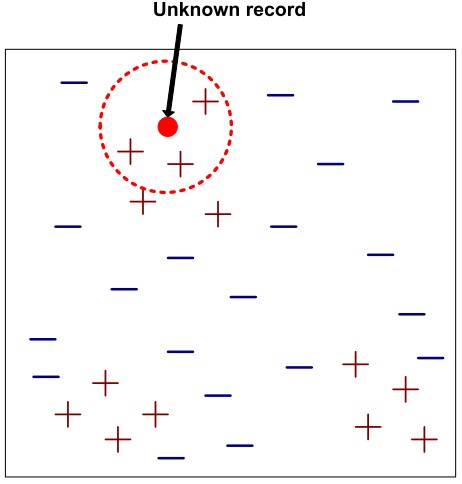
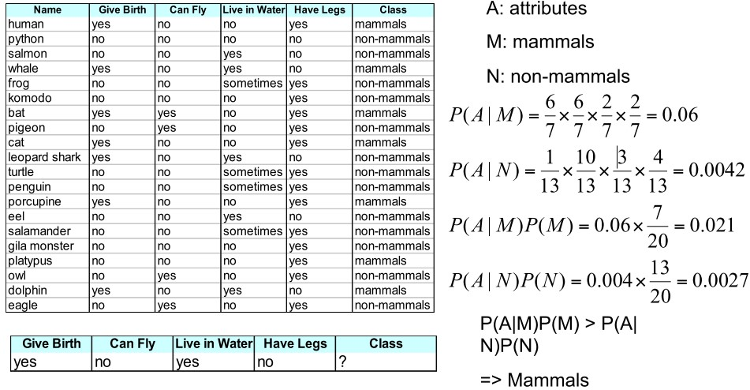
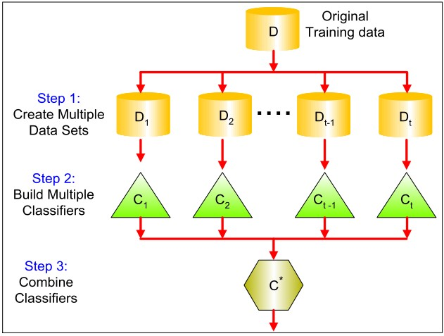
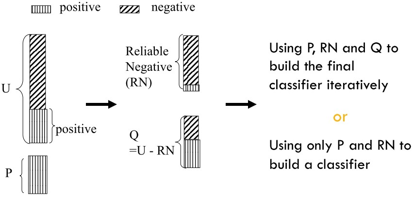

# Classification

* Given a collection of training sets **`[attributes : class]`**
* Find a **model** for class attribute as a function of the values of other attributes. 
* Goal: **previously unseen** records should be assigned a class as accurately as possible. 

## Data Preparation

* Data cleaning
* Relevance analysis
* Data transformation

## Classification Evaluation

* accuracy
* speed & scalability
* robustness
  * handling noise and missing values
* interpretability
* goodness of rules
  * decision tree size 
  * compactness of classification rules 

## Techniques for classification

* Decision Tree
* Memory based reasoning (K-NN)
* Regression
* Neural Networks
* Naïve Bayes
* Support Vector Machines
* Random Forest

## Issues of Classification

* Missing Values
* Costs of Classification
* Underfitting and Overfitting
  * Address Overfitting
    * Pre-Pruning (Early Stopping Rule)
      * Stop the algorithm before it becomes a fully-grown tree
    * Post-pruning
      * Grow decision tree to its entirety
      * Trim the nodes of the decision tree in a bottom-up fashion
      * If generalization error improves after trimming, replace sub-tree by a leaf node
      * Class label of leaf node is determined from majority class of instances in the sub-tree

# Decision tree

* Algorithms
  * Hunt's Algorithm
  * CART
  * ID3, C4.5, C5.0, See5
  * SLIQ,SPRINT
* Tree Induction
  * Greedy strategy
    * Split the records based on an attribute test that 
optimizes certain criterion
  * Issues
    * How to split the records
    * When to stop splitting
* Test Condition
  * Depend on attribute types
    * Nominal: `{hot, cool, cold}`
    * Ordinal: `{A, B, C}, {small, medium, large}`
    * Continuous: `{1.25, 2, -3}`
      * Binary split
        * `x > 80 -> Yes, No`
      * Multi-way split
        * `[10, 25], [25, 50], [50, 80]`
  * Depends on number of ways to split
    * binary split
      * Divides values into two subsets.
      * Need to find optimal partitioning.
        * `CarType -> {Sports, Luxury}, {Family}`
    * Multi-way split
      * Use as many partitions as distinct values.
        * `CarType -> Family, Sports, Luxury`
* How to Determine the Best Split
  * Need a measure of node impurity
  * Non-homogeneous, High degree of impurity 
    * `a:5, b:5`
  * Homogeneous, Low degree of impurity 
    * `a:9, b:1`
* Measures of Node Impurity
  * Gini Index
  * Entropy
  * Misclassification error
* Advantages
  * Inexpensive to construct
  * Extremely fast at classifying unknown records
  * Easy to interpret for small-sized trees
  * Accuracy is comparable to other classification techniques for many simple data sets
  * Good at dealing with symbolic feature
  * Easy to comprehend

## GINI

$$
GINI(t) = 1 - \sum_j [p(j\mid t)]^2
$$

* Maximum : when records are equally distributed among all classes, implying least interesting information
* Minimum : when all records belong to one class, implying most interesting information
* GINI 越小代表分的越好
  * 最差 0.5，最好 0

### GINI with Multiple Attributes

* 以左邊為例

$$
\begin{aligned}
1-(\frac{3}{5})^2 - (\frac{2}{5})^2 &= 0.48\\
1-(\frac{1}{5})^2 - (\frac{4}{5})^2 &= 0.32\\
0.48 \times \frac{5}{10} + 0.32 \times \frac{5}{10} &= 0.4
\end{aligned}
$$

### GINI with Continuous Attributes

* Need to Computing Gini Index 
  * Several Choices for the splitting value
* For efficient computation:
  * Sort the attribute on values
  * Linearly scan these values
    * Updating the count matrix and computing gini index
  * Choose the split position that has the least gini index

## Entropy

$$
Entropy(t) = -\sum_j p(j\mid t)\log_2p(j\mid t)
$$

* NOTE: $$p(j\mid t)$$ is relative frequency of class j at node t
* Maximum : when records are equally distributed among all classes implying least information
* Minimum :  when all records belong to one class, implying most information 
* Entropy 越小代表分的越好
  * Entropy based computations are similar to the GINI index computations
  * 最差 1，最好 0
* log_2 代表有 2 類別，若有 10 類別可以用 log_10

### Information Gain

$$
GAIN_{\text{split}} = Entropy(p) - (\sum_{i=1}^k \frac{n_i}{n}Entropy(i))
$$

* Measures Reduction in Entropy achieved because of the split. 
* Choose the split that achieves most reduction (maximizes GAIN) 
* Used in ID3 and C4.5
* Disadvantage
  * Tends to prefer splits that result in large number of partitions, each being small but pure.

### Gain Ratio

$$
GainRATIO_\text{split} = \frac{GAIN_\text{split}}{SplitINFO}
$$

$$
SplitINFO = -\sum_{i=1}^k \frac{n_i}{n}\log\frac{n_i}{n}
$$

* Adjusts Information Gain by the entropy of the partitioning (SplitINFO).
* Higher entropy partitioning (large number of small partitions) is penalized!
* Used in C4.5
* Designed to overcome the disadvantage of Information Gain

## Classification error

$$
Error(t) = 1 - \max_i P(i\mid t)
$$

* Maximum : when records are equally distributed among all classes, implying least interesting information
* Minimum : when all records belong to one class, implying most interesting information
* Error 越小越好
* 最差 1，最好 0

## Splitting Criteria Comparison

# Nearest Neighbor Classifiers

* Requires three things
  * The set of stored records
  * **Distance Metric** to compute distance between records
  * **The value of k**, the number of nearest neighbors to retrieve
* To classify an unknown record
  * Compute distance to other training records
  * Identify k nearest neighbors
  * Use class labels of nearest neighbors to determine the class label of unknown record

* k-NN classifiers are lazy learners
* Compute distance between two points
  $$
  d(p, q) = \sqrt{\sum_i (p_i - q_i)^2}
  $$
* Determine the class from nearest neighbor list
* Choosing the value of k
  * k is too small, sensitive to noise points
  * k is too large, neighborhood may include points from other classes
* Scaling issues
  * Attributes may have to be scaled to prevent distance measures error
    * height, weight, income with different unit
* distance measure issues
  * High dimensional data may cause **curse of dimensionality**
  * Can produce counter-intuitive results
  * Solution
    * Normalize the vectors to unit length

# Bayesian Classifiers

* A probabilistic framework for solving classification problems
* Bayes theorem
  $$
  P(C\mid A) = \frac{P(A\mid C)P(C)}{P(A)}
  $$
* Consider each attribute and class label as random variables 
  * Given a record with attributes $$(A_1, A_2, \cdots, A_n)$$
  * Goal is to predict class $$C$$
* Estimate $$P(C\mid A_1 , A_2 ,\cdots,A_n)$$ directly from data
  * compute the posterior probability for all values of C

$$
P(C\mid A_1A_2\cdots A_n) = \frac{P(A_1A_2\cdots A_n\mid C)P(C)}{P(A_1A_2\cdots A_n)}
$$

# Naïve Bayes Classifier

* Assume independence among attributes
  $$
  P(A_1 , A_2 ,\cdots,A_n\mid C) = P(A_1\mid C) P(A_2\mid C)\cdots P(A_n\mid C)
  $$
* Estimate all $$P(A_i \mid C_j)$$
* Maximize $$P(C_j) \prod P(A_i\mid C_j)$$

## Example

* Summary
  * Robust to **isolated noise points**
  * Handle missing values by ignoring the instance during probability estimate calculations
  * Robust to irrelevant attributes
  * **Independence** assumption may not hold for some attributes

# Support Vector Machines

* Find a linear hyperplane (decision boundary) that will separate the data
* Find hyperplane maximizes the margin

$$
\text{Margin} = \frac{2}{\lVert \vec{w}\rVert^2}
$$

* This is a constrained optimization problem
  * Numerical approaches to solve it

# Ensemble Methods

* Construct a set of classifiers from the training data
* Predict class label of previously unseen records by aggregating predictions made by multiple classifiers

* Why it works?
  * Suppose there are 25 base classifiers
    * Each classifier has error rate $$\epsilon = 0.3$$
    * Assume classifiers are independent
    * Probability that the ensemble classifier makes a wrong prediction
      $$
      \sum_{i=13}^{25}\binom{25}{i}\epsilon^i(1-\epsilon)^{25-i}=0.06
      $$

* Methods
  * Bagging
  * Boosting

## Boosting

* Training
  * Produce a sequence of classifiers
  * Each classifier is dependent on the previous one
    * and focuses on the previous one’s errors
  * Examples that are **incorrectly** predicted in previous classifiers are given **higher weights**
* Testing
  * the results of the series of classifiers are combined to determine the final class of the test case
* Records that are wrongly classified will have their weights increased 
* Records that are classified correctly will have their weights decreased

### AdaBoost

* The actual performance of boosting depends on the data and the base learner. 
* Boosting seems to be **susceptible to noise**.
  * When the number of outliners is very large, the emphasis placed on the hard examples can hurt the performance. 

# Semi-supervised learning

* Assigning labels to training set
  * expensive, time consuming
* Abundance of unlabeled data
  * LU learning
    * Learning with a small set of labeled examples and a large set of unlabeled examples
  * PU learning
    * Learning with positive and unlabeled examples

| Usage          | Supervised | Semi-Supervised | Unsupervised |
| -------------- | ---------- | --------------- | ------------ |
| labeled data   | yes        | yes             | no           |
| unlabeled data | no         | yes             | yes          |

* Label propagation
  * Each node in the graph is an example
    * Two examples are labeled 
    * Most examples are unlabeled
  * Compute the similarity between examples
  * Connect examples to their most similar examples

* Application of PU Learning
  * given a ICML proceedings, find all machine learning papers from AAAI, IJCAI, KDD
  * given one's bookmarks (positive documents), identify those documents that are of interest to him/her from Web sources.
  * Company has database with details of its customer – positive examples, but no information on those who are not their customers
    * No labeling of negative examples from each of these collections. 

## PU Learning 2-step strategy

1. Identifying a set of **reliable negative** documents from the unlabeled set. 
   * Reliable Negative : Human labeling 100% Negative data
2. Building a sequence of classifiers by iteratively applying a classification algorithm and then selecting a good classifier. 

# Co-training Algorithm

* Given
  * labeled data L
  * unlabeled data U
* Compute
  * Train **h1** using L
  * Train **h2** using L
  * Allow h1 to label p positive, n negative examples from U
  * Allow h2 to label p positive, n negative examples from U
  * Add these most confident self-labeled examples to L
  * Loop

## Example

Consider the task of classifying web pages into two categories: category for students and category for professors

Two aspects of web pages should be considered

* Content of web pages
  * "I am currently the second year Ph.D. student …"
* Hyperlinks
  * "My advisor is …"

### Scheme

1. Train a content-based classifier using labeled web pages
2. Apply the content-based classifier to classify unlabeled web pages
3. Label the web pages that have been confidently classified
4. Train a hyperlink based classifier using the web pages that **are initially labeled and labeled by the classifier**
5. Apply the hyperlink-based classifier to classify the unlabeled web pages
6. Label the web pages that have been confidently classified