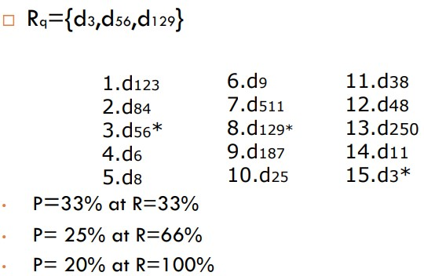
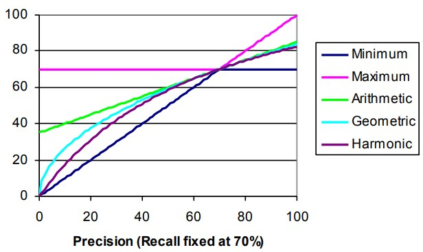
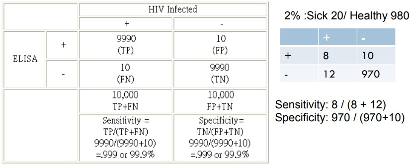
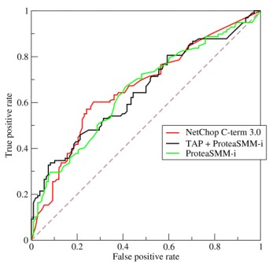
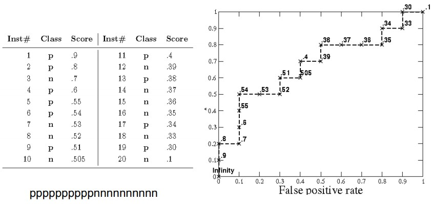
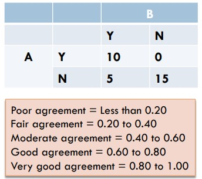
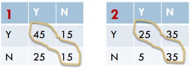

# Recall and Precision

* Recall
  * The fraction of the relevant documents (R) which has been retrieved
* Precision
  * The fraction of the retrieved documents (A) which is relevants

$$
\begin{aligned}
\text{Recall} = \frac{R_a}{R} \\
\text{Precision} = \frac{R_a}{A} \\
\end{aligned}
$$

* Precision versus recall curve
  * 通常 Recall 越高，會使 Precision 越低 (tradeoff)
    * P = 100% at R = 10%
    * P = 66% at R = 20%
    * P = 50% at R = 30%

# Top-k Precision (Precision at k, P@k)

* Precision evaluation in a **ranking list**
* The precision value of the top-k results
* `Top-1 = P@1`, `Top-3 = P@3`
* 前 5 筆有 2 筆中，P@5 = 2/5 = 40%

# Average Over Multiple Queries

$$
\bar{P}(r) = \frac{1}{N_q}\sum_{i=1}^{N_q}P_i(r)
$$

* Average precision at the recall level r
* $$N_q = \text{Number of queries used}$$
* $$P_i(r) = \text{Precision at recall level r for the i-th query}$$

## Interpolated precision

* What is interpolation mean ?
  * https://www.youtube.com/watch?v=c4_MJg_c49k

* 下方的 (P, R) 分別為讀到第三個、第八個、第十五個時候

$$
P(r_i) = \max{r_i \le r \le r_{i+1}P(r)}
$$

# Single Value Summaries

* Average precision 可能會隱藏演算法中不正常的部分
* 需要知道對某特定 query 的 performance
* The single value should be interpreted as a **summary** of the corresponding precision versus recall curve

## Average Precision

* Seen Relevant Documents
* obtained after each new relevant document is observed
* e.g. $$(1+0.66+0.5+0.4+0.3)/5=0.57$$
* 此方法對於很快找到相關文件的系統是相當有利的
  * 相關文件被排在越前面, precision值越高

## Mean Average Precision (MAP)

* Average of the precision value obtained for the **top k documents**
  * each time a relevant doc is retrieved
* Avoids interpolation, use of fixed recall levels

$$
MAP(Q) = \frac{1}{\lvert Q \rvert} \sum_{j=1}^{\lvert Q \rvert}
\frac{1}{m_j}\sum_{k=1}^{m_j}P(R_{jk})
$$

## R-Precision

* **break-even point**: recall = precision
* The precision at **the R-th position** in the ranking
* **R** : the total number of relevant documents of the current query 

### Comparison

* **R**N**R**NN NNN**RR**
  * MAP = (1 + 2/3 + 3/9 + 4/10) / 4 = 0.6
  * RP(4) = 2/4 = 0.5 
    * (只看前四個)

* N**R**NN**R** **RR**NNN
  * MAP = (1/2 + 2/5 + 3/6 + 4/7) / 4 = 0.49
  * RP(4) = 1/4 = 0.25

# MRR: Mean Reciprocal Rank

* Rank of the first correct answer

$$
MRR = \frac{1}{\lvert Q \rvert} \sum_{i=1}^{\lvert Q\rvert} \frac{1}{\text{rank}_i}
$$

# Precision-Recall

| Class  | Predicted | Correct? |
| ------ | --------- | -------- |
| orange | lemon     | 0        |
| orange | lemon     | 0        |
| orange | apple     | 0        |
| orange | orange    | 1        |
| orange | apple     | 0        |
| lemon  | lemon     | 1        |
| lemon  | apple     | 0        |
| apple  | apple     | 1        |
| apple  | apple     | 1        |

## Microaveraging

* 重視數量的差距
* Each **Instance** has equal weight
* Largest classes have most influence

$$
\text{Micro-average precision : } 4/9 =0.44
$$

## Macroaveraging
 
* 每個 rank 都一樣重要
* Each **Class** has equal weight

$$
\begin{aligned}
\text{Orange} &= 1/5 = 0.20 \\
\text{Lemon} &= 1/2 = 0.50 \\
\text{Apple} &= 2/2 = 1.00 \\\\
\text{Macro-average precision} &: (0.20+0.50+1.00) / 3 = 0.57 
\end{aligned}
$$

## P/R 適用性

* Maximum recall 需要知道所有文件相關的背景知識
  * 平時不太可能得到標準答案，因為實際案例的 Recall 不好算
* Recall and precision 是相對的測量方式，兩者要合併使用比較適合
  * Application dependent

# F-score

## The Harmonic Mean, F-measure

$$
F(j) = \frac{2}{\frac{1}{r(j)}+\frac{1}{P(j)}}, F \in [0, 1]
$$

## Example

$$
\begin{aligned}
\frac{2}{\frac{1}{0.7}+\frac{1}{0.4}} &= 0.509 \\
\frac{2}{\frac{1}{0.7}+\frac{1}{0.5}} &= 0.583 \,... 
\end{aligned}
$$

## Harmonic

# User-Oriented Measure

* 在不同領域上可以修改 recall / precision 來進行不同評分
* e.g. coverage / novelty
  * Coverage 越高，找到越多 user 期望文件
  * Novelty 越高，找到越多使用者原本不知道的文件
* 這些評分都需要先經過繁雜的 labeling

# Alternative Measures (confusion matrix)

* 將預測與結果分為 True/False 的 Positive/Negative 四類
* 可以改寫原本的 Recall / Precision
  * $$\text{Recall} = \frac{\lvert R_a \rvert}{\lvert R\vert} = \frac{TP}{TP+FN}$$
    * Recall 又可稱為 Sensitivity
  * $$\text{Precision} = \frac{\lvert R_a \rvert}{\lvert A\vert} = \frac{TP}{TP+FP}$$
* 新增兩種測量方法
  * $$\text{Accuracy} = \frac{TP+TN}{N}$$
    * Accuracy 就是所有猜對的機率
  * $$\text{Specificity} = \frac{TN}{TN+FP}$$
    * Specificity 可以看作 Negative Recall
    * Not useful, TN is always too large

## Example

* 100% sensitivity 代表完全猜對所有生病的人
* 100% specificity 代表完全猜對所有健康的人

# Limitation of Accuracy

* 想像 class 0 的 examples 有 9990 個
* 然後 class 1 的 examples 只有 10 個
* 我的模型全猜 class 0
  * Accuracy = 9990/10000 = 99.9%
  * 這個 acc 誤導我們，讓我們以為模型超強

## Cost Matrix

* Cost matrix 和 confusion matrix 幾乎一樣
* 給 false negative 的 weight 加大

### Example

* 我們設置上面 matrix 為計算的標準
  * False Negative (猜沒生病，但其實有生病) 的權重 Cost 為 100
* 左邊的預測可以得到
  * acc = $$(150+250) / (150+250+60+40) = 80\%$$
  * cost = $$150\times(-1) + 40\times100 + 60\times1 + 250\times0 = 3910$$
* 右邊的預測可以得到
  * acc = $$(250+200) / (250+200+5+45) = 90\%$$
  * cost = $$250\times(-1) + 45\times100 + 5\times1 + 200\times0 = 4255$$
* 可以發現雖然右邊 acc 較高，但 cost 也較高
* 很多情況，例如醫學上可能就不能容許 cost 較高情況出現

# ROC

* ROC : Receiver Operating Characteristic
* ROC is a plot of **sensitivity** vs. **1-specificity** for a binary classifier

## ROC curve

* ROC 的結果可以等同於 plot TP fraction vs. FP fraction
  * the area under the ROC curve, or "AUC"
* AUC 越大，代表分類器正確率越高

## Example

* 利用預先算好的結果 plot 到圖上
  * True Positive 就往上走
  * False Positive 就往右走
* 若是 ppppppppppnnnnnnnnnn 就會是一個 $$\Gamma$$ 的形狀

## Issues

* ROC curves are **insensitive** to changes in class distribution
  * TPR and FPR are all strict columnar ratio
  * 對於不 balance 的 data，產生的結果差不多，因為是參考 ratio
* ROC measures the ability of a classifier to produce good relative scores. 
  * need only produce relative accurate scores that serve to discriminate positive and negative instances

# Questions

Q : What is the relationship between the value of F1 and the break-even point?

A : at break-even point F1 = P = R.

Q : Prove that the F1 is equal to the Dice coefficient of the retrieved and relevant document sets. 

$$
Dice(X, Y) = 2\lvert X\cap Y\rvert / \lvert X \rvert + \lvert Y \rvert
$$

A : 

$$
\begin{aligned}
P &= \frac{TP}{TP+FP} \\
R &= \frac{TP}{TP+FN} \\ 
F1 &= \frac{2PR}{P+R} = \frac{2TP}{2TP+FP+FN}\\\\
X &= TP+FP \\
Y &= TP+FN \\
Dice(X,Y) &= TP/2TP+FP+FN 
\end{aligned}
$$

# Estimation Methods

* Holdout
  * 2/3 train, 1/3 test
* Random subsampling
  * Repeated holdout
* **Cross validation**
  * Partition data into k disjoint subsets
  * **k-fold**: train on k-1 partitions, test on the remaining one
  * **LOOCV**: k=n (train on all data except 1 for test)
* Stratified sampling
  * oversampling vs undersampling
* Bootstrap
  * Sampling with replacement

# Evaluate Ranked list

* The ground truth is ranked / partially preferred
  * DCG
  * Correlation coefficient measurement

## Discounted Cumulative Gain (DCG)

* measures the usefulness, or gain, of a document based on its position in the result list
* The gain is accumulated cumulatively
* CG is **independent** with the result order
* DCG is **dependent** with the result order
  * DCG at position p
    $$
    DCG_p = rel_1 + \sum_{i=2}^{p}\frac{rel_i}{\log_2(i)}
    $$
    * The $$rel_i$$ is the graded relevance of the result at position i

### Example

| Data  | D1  | D2  | D3  | D4  | D5  |
| ----- | --- | --- | --- | --- | --- |
| Score | 2   | 1   | 0   | 2   | 0   |

* Higher is more relevant
* The score of order above is
  $$
  \begin{aligned}
  DCG_5 &= 2 + \frac{1}{\log_2(2)} + \frac{0}{\log_2(3)} + \frac{2}{\log_2(4)}
  + \frac{0}{\log_2(5)}
  \\ &= 2 + 1 + 0 + 1 + 0
  \\ &= 4
  \end{aligned}
  $$
* The ideal order is 2, 2, 1, 0, 0
  $$
  \begin{aligned}
  IDCG_5 &= 2 + \frac{2}{\log_2(2)} + \frac{1}{\log_2(3)} + \frac{0}{\log_2(4)}
  + \frac{0}{\log_2(5)}
  \\ &= 2 + 2 + 0.63 + 0 + 0
  \\ &= 4.63
  \end{aligned}
  $$
* NDCG 將 DCG 正規化
  $$
  NDCG_5 = \frac{DCG_5}{IDCG_5} = \frac{4}{4.63} = 0.86
  $$

## Correlation coefficient measurement

### Kendall-tau

* measure the association between two measured quantities
  $$\frac{\text{concordant - discordant}}{\frac{n(n+1)}{2}}$$
  * where $$\frac{n(n+1)}{2} = \binom{n}{2}$$
  * 找出所有任選兩個數字的前後關係
* e.g. Ground Truth = 12345, Result = 21534
  $$
  \begin{aligned}
  \text{Concordant} &= 7 \\
  &\{1, 3\}, \{1, 4\}, \{1, 5\}, \{2, 3\}, \{2, 4\}, \{2, 5\}, \{3, 4\}\\
  \text{Discordant} &= 3 \\
  &\{1, 2\}, \{3, 5\}, \{4, 5\}\\
  \text{Kendall-tau} &= (7-3)/10 = 0.4 
  \end{aligned}
  $$
  * 前後關係維持一致的是 concordant
  * 前後關係變不同的是 discordant

### Cohen's Kappa

* 度量兩個評分者 (rater) 的 agreement
  $$
  \mathcal{K} = \frac{\text{Pr}(a)-\text{Pr}(e)}{1-\text{Pr}(e)}
  $$

#### Example 1

* 例如有 rater A 和 rater B
  * 在 30 個投票中，共有 25 個 agreement
    $$\text{Agreement Pr}(a) = (10+15)/30 = 0.83$$
  * 看起來很高，但有時候是因為很多 noise 導致 (例如選擇太 trivial)
  * 解決方法就是減去 $$\text{Pr}(e)$$ 這個 random agreement
    * 這個 $$\text{Pr}(e)$$ 代表的是兩人隨便亂猜就可以一致的機率
    $$
    \begin{aligned}
    P(A=Y)&=10/30 = 0.33 \\
    P(B=Y)&=15/30 = 0.5 \\
    P(A=Y, B=Y)&= 0.33\times0.5 = 0.17 \\
    P(A=N, B=N)&= 0.66\times0.5 = 0.33 \\
    \Rightarrow \text{Pr}(e)&= 0.17+0.33 = 0.5
    \end{aligned}
    $$
  * 得到 a 和 e 的機率就可以算出上面的 kappa 值
    $$
    \mathcal{K} = \frac{0.83-0.5}{1-0.5} = 0.66
    $$
  * 所以 agreement 就從 0.83 下降至 0.66

#### Example 2

$$
\begin{aligned}
\text{Both Pr}(a) &= \frac{60}{100} = 0.6 \\
\text{Pr}_1(e) &= \frac{60}{100}\times\frac{70}{100} + \frac{40}{100}\times\frac{30}{100} = 0.54 \\
\text{Pr}_2(e) &= \frac{60}{100}\times\frac{30}{100} + \frac{40}{100}\times\frac{70}{100} = 0.46 \\
\mathcal{K}_1 &= \frac{0.6-0.54}{1-0.54} = 0.13 \\
\mathcal{K}_2 &= \frac{0.6-0.46}{1-0.46} = 0.26
\end{aligned}
$$

* 雖然兩題在未計算 kappa 之前的 agreement 都是 0.6
* 但計算完 kappa 後，可以發現右邊的 2 raters agreement 較好

# Applicability

* each system need to use diff evaluation
  * NDCG : sort data, ranking
  * Recall : use with ground truth
  * Top-1 precision : recommandation
  * F1 : find the best in precision + recall tradeoff 
  * Novelty