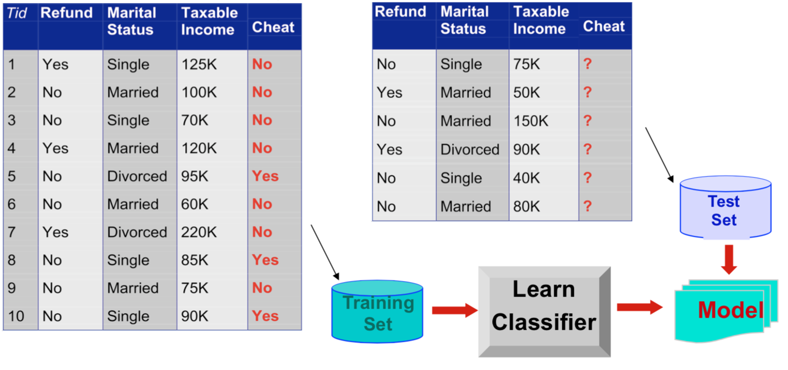
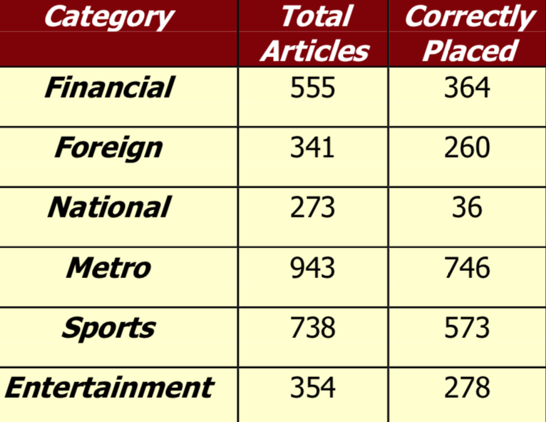

# Introduction

## Introduction

### Examples

1. Data-Result : Titanic@Kaggle \(預測船員存活率\)
2. Data-only : Google maps \(預測路徑, 塞車警告, 結合各種應用\)
3. IoT makes data increasing \(Surveillance, healthcare, ...\)

### Definition of data mining

* 跨學科的 computer science
* 從 **AI, ML, statistics, DB** 結合出的 large data sets 找出 unknown patterns
* 如何有效的從資料之間找出關聯
* Auto/Semi-automatic
* **Knowledge discovery in databases \(KDD\)**
  * Data record =&gt; Cluster analysis
  * Unusual record =&gt; Anomaly detection
  * Dependencies =&gt; Association rule mining
* 不只是 retrive 而是 detect/find association

### Applications

* **Market** analysis and management
  * 透過客戶行為找到與公司的關係, 銀行判斷信用
* **Risk** analysis and management
* **Fraud** detection and detection of **unusual** patterns \(**outliers**\)
  * Whoscall

## Knowledge Discovery from Databases \(KDD\)

* Nontrivial process of extraction
  * valid \(可以用\)
  * novel \(別人有興趣, 沒有人知道\)
  * potential useful
  * understandable \(講得出原因\)
    * linear regression hypothesis 難以解釋
  * patterns from big data \(助於未來分析\)
* Pattern
  * expression in languages
  * model applicable
* Example : Uber control drivers

### KDD process

#### Databases to work on

* Relational
* Transactional \(交易\)
* Spatial \(空間\)
* Time series data \(Sensor 等 sequential data\)
* Multimedia \(照片, 影片\)
* Unstructured data \(語音\)
* Graph \(點跟邊資料 =&gt; 方便 implement algorithms\)

#### Knowledge to be mined

* Association rules \(買什麼就會順便買什麼\)
* Classification
* Clustering
* Time series data analysis
* Semantics

## Data mining tasks

* Predict methods : 用已有變數來 predict 未知變數
  * Classification
  * Regression
  * Deviation detection
* Description methods : 把資料 label 起來, 解釋 data
  * Clustering
  * Association rule discovery
  * Sequential pattern discovery

## Classification

用已經**分類**過的 data 來學習分類，再丟進從未看過的 data 來**測試**是哪一種分類

* Training sets \(each class has features/attributes\)
* Find a model for class attribute
* test previously unseen records \(test set\)

$$
\text{Training set} \rightarrow \text{learn classifier} \rightarrow \text{model} \leftarrow \text{test set}
$$

* Supervised classification
* 建立符合邏輯的模型 \(例如樹\) 來解釋 data
* Relate to machine learning

### Application

1. Direct marketing \(廣告投放\)
   * Buy / Don't Buy
2. Fraud detection \(避免詐騙\)
   * Fair / Fraud
3. Customer Attrition/Churn \(使用者忠誠度預測\)
   * Loyal / Disloyal
   * feature engineering
4. Sky suvery cataloging \(預測銀河狀態\)

## Clustering

有點像 unsupervised classification， 把相似度高的 data points \(has some attributes\) 分類在一起

* 目標是 data 在同一群都很像，跟別群都不像 \(maybe tradeoffs\)
* 並且該怎麼表示及定義每一群的名字
* Clutering 不像 Classification 能夠最佳化 \(主觀\)

### Application

1. Market Segmentation \(客戶分群\)
   * 高, 中, 低消費群
2. Document Clustering \(新聞分類\)
   * 蔡英文, 柯文哲, 韓國瑜
   * [記者快抄](http://news.ptt.cc/)
3. Stock Clustering
   * 與熱門公司的關聯度, 蘋果關聯股等等

> Classification 跟 Clustering 是可以合作使用的

## Association Rule Discovery

* 從其他 item 的 **occurrence** 來預測該 item 的 **dependency rules**

### Application

* Marketing and Sales Promotion
* Supermarket shelf management
  * 有關聯的兩件物品，一件庫存較少就可以先進貨
* Inventory management
  * 找出零件關係，是否某件壞了就會有另一件跟著壞掉

## Sequential Pattern Discovery

* 在 data 中加上時序，再從中找出他們的 **sequential dependencies**
  * 可以比 association rule 還要更有因果關係

### Application

* In telecommunications alarm logs
* In point-of-sale transaction sequences
  * Computer Bookstore
  * Athletic Apparel Store

## Regression

* 利用多個 features 來找出最佳的解 y
* 可能利用 linear 或是 non-linear 的 dependency model 來解 

### Application

* 利用 temperature, humidity, pressure 等來預測風速
* 利用過去銷售經驗，來預測新產品的銷量

## Deviation / Anomaly Detection

* 從 Normal behavior 中找出 significant deviations

### Application

* 信用卡詐騙
* 網路入侵

## Graph mining

* 從複雜的圖表中找出關鍵點或關鍵的 subgraph
  * Degree
  * Power
  * Closeness
  * Betweeness

## Summary

* Performance Measurement
  * Efficiency \(Time, Accuracy\)
  * Effectiveness \(Interestingness\)
* Interestingness
  * understandable
  * valid on new one
  * potentially useful
* Challenge of data mining
  * Scalability
  * Dimensionality
  * 不同領域資料結合
  * Data quality
  * Privacy \(只遮住 id 一樣能被暴力破解\)
  * Streaming data \(Sensor input 持續性不足\)
* Feature & Challenge of KDD
  * Big data, Feature engineering, deep learning
  * more data from human behavior and knowledge
  * Utimate goal : build brain for robots

