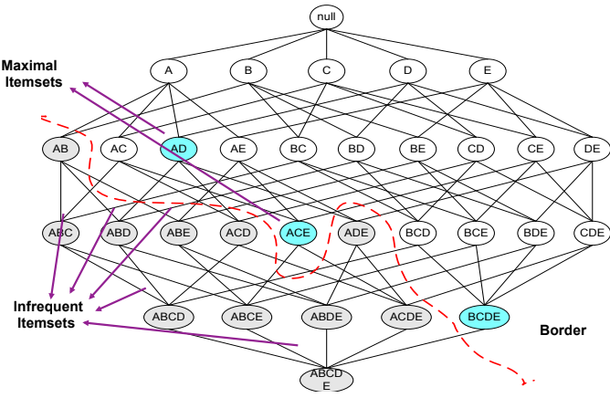
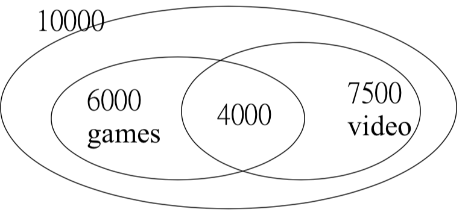
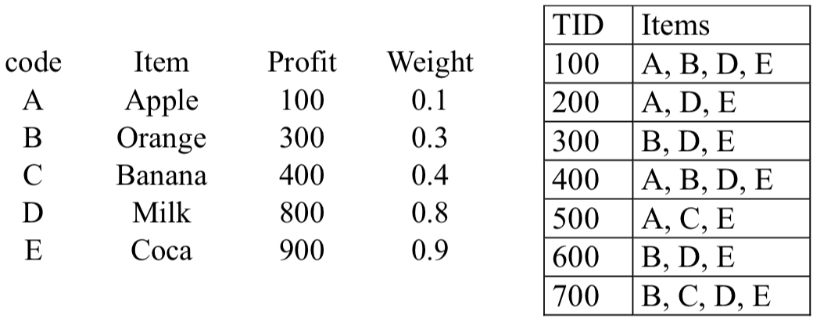

# Other Association Rules

## Multilevel Association Rules

* Items 之間有 hierarchy
* lower level = lower support
* transaction 可以經由 level 來 encoded


### Uniform Support
* The same minimum support for all levels
* 不會因為 ancestor 沒通過 minsup 就不檢查他的子樹
* 如果 uniform support 設定太高
  * miss low level association
* 如果 uniform support 設定太低
  * generate too many high level association

### Reduced Support
* 動態決定 low level 的 minimum support
  * 4 strategies
    * Level-by-level independent
    * Level-cross filtering by single item
    * Level-cross filtering by k-itemset
    * Controlled level-cross filtering by single item
* 跟現實生活較接近 (商品單價改變可能影響 support)

## Closed Association Rules

* max pattern : 一個 frequent itemset 沒有比他更大的 frequent itemset
* **Closed Frequent itemset** : itemset X 要符合兩件事才是 closed itemset 
  * 找不到任何 proper superset Y
  * 找不到任何 superset Y 出現在所有 X 也出現的 transaction


* 例如 {e} 找不到其他的 item 在每個 transaction 都有一起出現
  * a 在 100 跟 200 都有，但 300 就沒有一起出現
  * 所以 {e} 就可以獨立是一個 closed frequent itemset

### Maximal Frequent Itemset
* 一個 itemset 沒有任何的 superset 是 frequent
* 這個 itemset 就是 maximal frequent itemset




### Maximal vs. Closed Itemsets

我們可以用 lattice 綜觀所有的 itemset 然後發現

* 當 superset 的 item 都沒有重複跟自己一起出現的，那就是 closed itemset
* 當 superset 的 support 皆小於自己，那就是 maximal itemset


* 我們可以用 maximal & closed 來過濾當 minsup 設定太低時
* 所出現的一些雖然通過 minsup 但沒用處的 itemset

總結一下 :

$$
\text{Maximal Frequent Itemsets} \subset \text{Closed Frequent Itemsets} \subset \text{Frequent Itemsets}
$$


## Quantitative Association Rules

這邊探討的是，當 attributes 從 boolean 變為 continuous space 時

應該如何使用 Association rules 

### Multidimensional Association Rules

* 例如 attributes 變為 **categorical** 或 **numerical**
  * categorical : finite number 的選項 (good, medium, bad ...)
  * numerical : 不斷變化的數值 (ages, prices)
* $$
  \text{age}(30-35) \wedge \text{income}(30K-50K) \rightarrow \text{buys}(HDTV)
  $$

#### Example

| Record Id | Age | Married | # cars |
| --------- | --- | ------- | ------ |
| 100       | 23  | No      | 1      |
| 200       | 25  | Yes     | 1      |
| 300       | 29  | No      | 0      |
| 400       | 34  | Yes     | 2      |
| 500       | 38  | Yes     | 2      |

我們可以將 age 進行離散化可以得到


然後整理成為一般的 transactions

| TID | Items |
| --- | ----- |
| 100 | A,D,F |
| 200 | A,C,F |
| 300 | A,D,E |
| 400 | B,C,G |
| 500 | B,C,G |

但離散化的 minsup 和 minconf 可能較難設定

### One Hot Encoding

另外在處理此類 Quantitative association 時

編碼的方式也非常重要

例如要處理此類 attributes :

```
{male, female}
{europe, us, asia}
{firefox, chrome, safari, ie}
```

假設我們要取得 `{male, us, safari}`

* 傳統編碼把每個 itemset 都從 0 編碼，可以得到 `{0, 1, 2}`
  * 這種編碼方法可能造成 distance 之類的錯誤
* 而 one hot encoding 會將每個 itemset 只取一個作為 true 值
  * 得到 `{10, 010, 0010}`

### Mining methods

以下有幾種方法適合用來對 quantitative data 進行 mining

* Static discretization of quantitative attributes
  * Discretized prior to mining using concept hierarchy.
  * Numeric values are replaced by ranges.
  * Data cube (n demensional cuboid 對應 n predicate sets)

* Quantitative association rule
  * Discretized based on distribution of data
  * Numeric attributes are dynamically discretized
  * 2D grid to predict


* Distance-based association rule
  * Discretized based on semantic meaning of interval
  * Different binning methods
  * Consider density/number and closeness in an interval

## From Association Mining to Correlation Analysis



考慮上圖的關聯 $$\text{Games} \implies \text{Videos}$$

雖然 confidence 很高

$$
\text{support } = 4000/10000 = 0.4\\
\text{confidence } = 4000/6000 = 0.66
$$

但其實 videos 本身的出現率就已經有 0.75 之高

所以用購買 Games 來推測出還會購買 Videos 的方法

反而還降低機率，所以只是 negatively associated

### Correlation Analysis

我們可以使用 Correlation 的方式來推測 rules 是不是夠 strong

$$
\text{Corr}(A, B) = P(A \cup B) / (P(A) \times P(B))
$$

* 若 Corr(A, B) = 1 代表兩者完全無關 (independent)
* 若 Corr(A, B) > 1 代表 A 對 B 有 positive 的 correlation
* 若 Corr(A, B) < 1 代表 A 對 B 只有 negative 的 correlation

用 Games, Videos 來算算看可以得到 :

$$
\text{Corr(Games, Videos)} = 0.4 / 0.6 * 0.75 = 0.89
$$

### Weighted item

另外我們還可以對 item 添加 weight 比重

讓比重較高的 item 需要多一點重視，所以會較容易出現在 rules 中

例如我有五種 itemsets 以及七筆 transactions



那麼 {B, E} 的新 support 可以這樣算 : $$(0.3+0.9)*5/7 = 0.86$$

### Inter-transaction association rules

* Intra-transaction association rules
  * 當某些 item 出現變化時
  * 特定的 item 也會 **同時** 出現變化
  * IBM 跟 SUN 漲價，此時 Microsoft 就會一起漲價

* Inter-transaction association rules
  * 當某些 item 出現變化時
  * 特定的 item 就是**下一個**出現變化的 item
  * IBM 跟 SUN 漲價，而 Microsoft 隔天就會漲價


## Association Rules with Constraints

* 一般的 association rules 可能缺乏 user exploration 跟 focus
* 或是一遇到海量資料就會失效
* 這時候就要依靠定義 **constraints**，例如 :
  * Data constraints: SQL-like queries
  * Dimension/level constraints
  * Rule constraints
  * Interestingness constraints
* 有兩種 rule constraints
  * rule from constraints
    * $$P(x, y) \wedge Q(x, w) \implies \text{Buy}(x, \text{"Education software"})$$
  * rule (content) constraints
    * $$\text{Sum}(S.\text{price} < 5)$$
