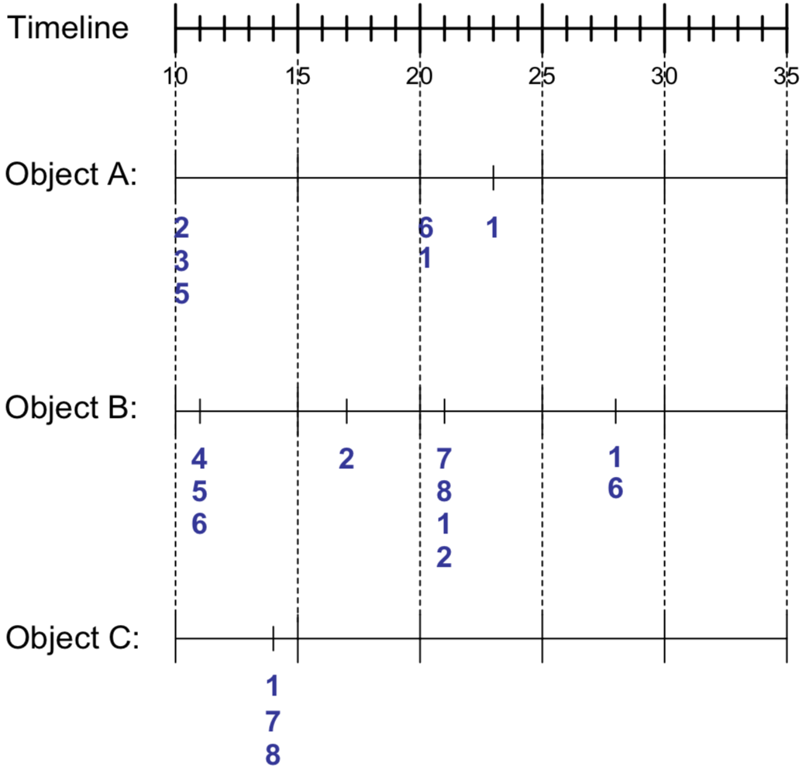
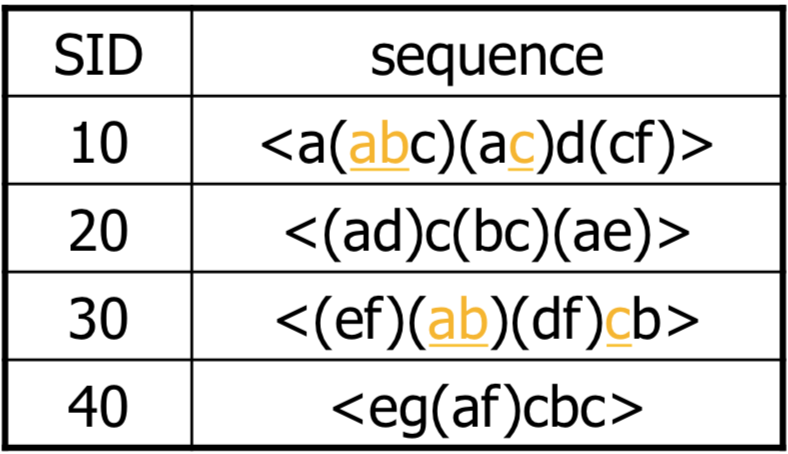
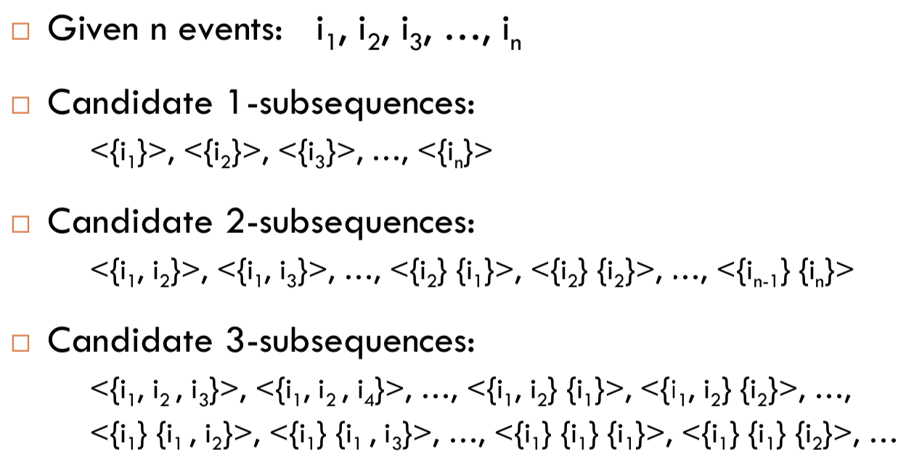
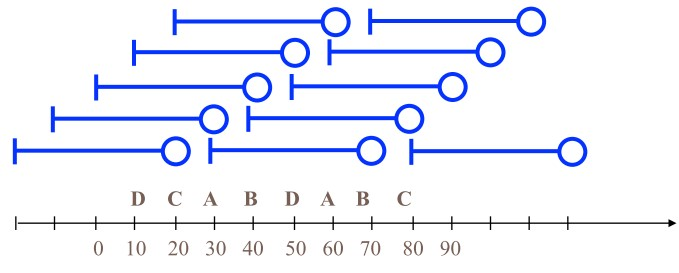
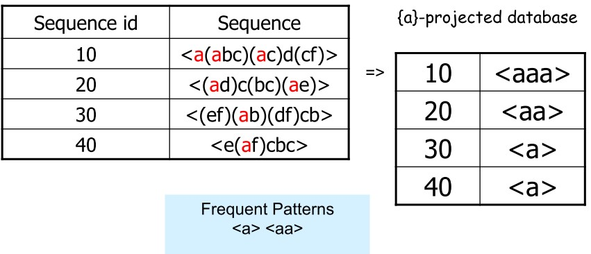
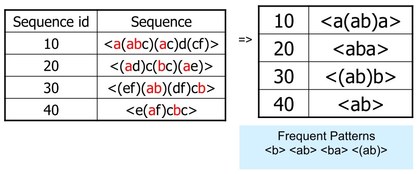
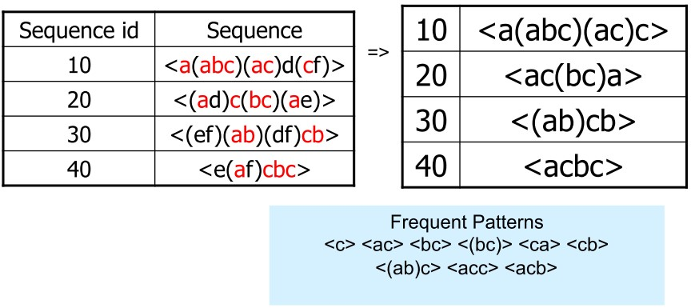
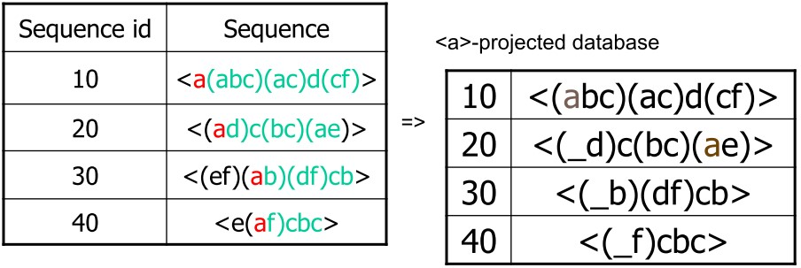

# Sequence Pattern

在前一章節的 Association Analysis 中， itemset 都是固定一筆一筆所出現

若我們想要更了解 Item 之間的 association rule

勢必要加上時間軸，得到順序與因果關係

## Sequence Data

我們將一般 Dataset 加上 Timeline 取得 sequence data table



| Object | Timestamp | Events  |
| ------ | --------- | ------- |
| A      | 10        | 2,3,5   |
| A      | 20        | 6,1     |
| A      | 23        | 1       |
| B      | 11        | 4,5,6   |
| B      | 17        | 2       |
| B      | 21        | 7,8,1,2 |
| B      | 28        | 1,6     |
| C      | 14        | 1,8,7   |

## Definition

* **Sequence** : 我們的時間軸，時間軸上有許多 elements
* **Element** : 即 transaction，一個 transaction 有許多 events
* **Event** : 每個 events 代表一個 item
* **Length of sequence** : 用 $$\lvert s\rvert$$ 表達 sequence 上的 elements 有幾個
  * k-sequence 代表該 sequence 上共有 k 個 events
* 例如下圖是一個 **8-sequence with length 5** 的 sequence data


* 還有許多的例子
  * web sequence `<{Homepage} {Electronics} {Cameras} {Shopping Cart} ... >`
  * library checkout books `<{Fellowship of the Ring} {The Two Towers} {Return of the King}>`

## Subsequence

若 sequence A 的每個 elements 的 events 

都是另一個 sequence B 對應的 elements 的 subset 

那 sequence A 就是 B 的 subsequence


* 一個 subsequence 的 support = data sequences 包含該 subsequence 的 fraction
* **Sequential pattern** : Frequent subsequence
  * 該 subsequence 的 support $$\ge$$ minsup

## Sequential Pattern Mining

從一群 sequences 中找出所有的 frequent subsequences

我們這邊使用 `<a(bc)dc>` 來表示有四個 elements 分別為 a, bc, d, c

而他是 `<a(abc)(ac)d(cf)>` 的 subsequence，原因如下

```
<a( bc)    d c>
<a(abc)(ac)d(cf)>
```

現在我們要從這個 sequence database 找出 sequential pattern



假設 minsup = 2，那我們可以找到 `<(ab)c>` 是一個 sequential pattern

因為 (ab) 跟 c 都有出現過兩次

### Definition of Sequential Pattern Mining

正式的來定義一下 **Sequential Pattern Mining**

```
Given :
    1. a database of sequences
    2. a minsup

Task :
    1. find all subsequences with support >= minsup
```

#### Extracting sequential patterns method

我們首先可以想到用 candidates + apriori 的方法來找出 subsequences



* 這類的算法有
  * Apriori* (Apriori All, Apriori Some)
  * Apriori-based SP algorithm (GSP)

* 但想也知道有非常多的問題
  * 會產生過多的 candidate sequences
  * database scans 次數過多
  * 要找的 sequential patterns 長度越大越困難


## Sequential Pattern Mining Algorithm

1. 首先將 data 進行 sorting
2. 計算 large itemset 也就是 support 值
3. 進行 transformation (Replacement)
4. sequence phase
5. maximal phase

### Example

* 進行 sorting 後的資料


* 找出滿足 support 的 large itemset
  * 並給他們定義一個新 id


* Transformation Phase
  * 刪除原本資料不滿足 support 的 item
  * 將滿足的資料能攤開的攤開
  * 然後設定新 id


* Sequence Phase
  * 將 after mapping 的 items 攤開成 Maximal Large Sequence
  * Apriori-like

```
<1 2 3> : support = 2
<1 2 4> : support = 2

Generate <1 2 3 4>
```

* Maximal Sequence
  * 一個 sequence 沒有包含在其他 sequence 即為 maximal sequence

```
e.g.

<(3) (4 5) (8)> is contained by <(7) (3 8) (9) (4 5 6) (8)>

<(3) (5)> is not contained by <(3 5)>
```


## Episode Mining

* Episode : A partially ordered collection of events occurring 
together
* 以 sliding window 方式來抓出 sequence
*  discover all frequent episodes from a given class(ex. all parallel or all serial) of episodes 




## FreeSpan

* Frequent pattern-projected Sequential pattern mining
  * 將 sequence database 投影成**較小**的 projected database
  * grow subsequence fragments in each projected database
  * **Divide-and-conquer**

### Example


* a 皆出現在這四筆所以 a : 4
* 以此類推求出所有 support > 2 的 item 並排序

``` python
f_list = a:4, b:4, c:4, d:3, e:3, f:3
```



* 先對 a 投影
  * aaa 只出現 1 次所以不拿
  * aa 出現 2 次
  * a 出現 4 次



* 以 a 為底，接著對 b 投影
  * 可以抓出 b 出現 4 次
  * ab 出現 4 次
  * (ab) 出現 2 次
  * 要注意 ab 和 (ab) 是不同的



* 以 a, b 為底，接著對 c 投影


## PrefixSpan

* Prefix-projected Sequential pattern mining
  * 一樣是 Projection-based
  * less projections and quickly shrinking sequences 
* PrefixSpan 有三個核心，分別是 **prefix, postfix, projection**
  * 假設有一 sequence 為 `<a(abc)(ac)d(cf)>`
  * Prefix
    * `<a>, <aa>, <a(ab)>, <a(abc)> ...`
    * 一定要從每一個 item 的頭開始
    * 所以 `<ab>, <a(bc)>` 這些都不算在 prefix
  * Postfix
    * 對於 `<aa>` 來說他的 postfix 為
      * `<(_bc)(ac)d(cf)>`
    * 對於 `<bd>` 來說他的 postfix 為
      * `<(cf)>`
  * Projection
    * projection 讓我們可以 groupby
    * `<bd>` 的 projection 是 `<bd(cf)>`

### Example



* 先對 a 投影，就可以找出所有有 prefix a 的 length 2 sequence
  * `<aa>:2  <ab>:4  <(ab)>:2  <ac>:4  <ad>:2  <af>:2`
  * 接著就可以對這 6 個 subsets 遞迴投影


* 例如對 `<aa>` 投影，有兩筆可以繼續遞迴
* 對 `<ab>` 投影，有三筆可以繼續遞迴
* 同時也可以刪去不滿足 support 的 item


* 將 a 及其 subsets 進行一輪後
* 接著就可以對 b 及他的 subsets 投影