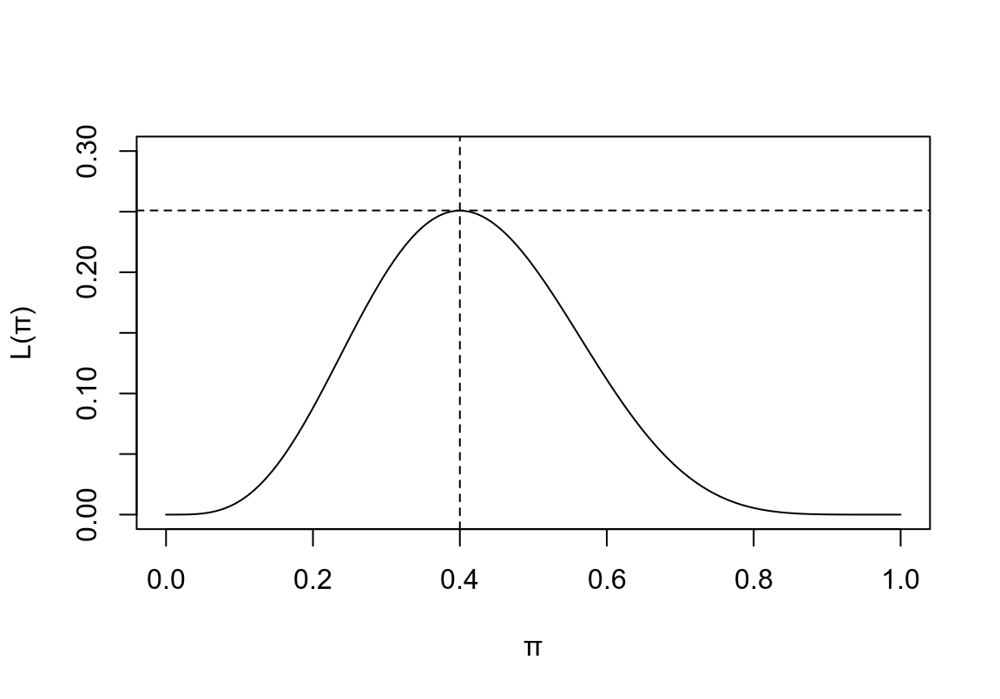

# Inference Concept

1. Population and sample
   * 一個是所有數據，一個是抽樣數據
   * 而討論抽樣術據 (樣本) 時
     * Sample 有無代表性
     * Population 有無準確定義
     * Population 可否無限大
     * 從所有可能的 Population 中抽樣嗎
2. Sample and statistic
   * 一般實驗通常只會拿到 sample 數據
   * 並想要從 sample 數據推出 population 的**統計量 (statistics)**
     * 這個推導的動作稱為 **inference**
     * 用已知 sample 推測未知 population 的過程為 **estimate**
   * 想推導的 population 稱為**參數 (parameter)**
     * 從樣本預測出來的 statistics 則叫作**估計量 (estimator)**
   * 所有數據都會有 **sampling distribution**
     * **無限次取樣後的無限次統計量分布**
        1. 先從 population 取 n 的樣本
        2. 計算該樣本的合適統計量，用於估計 population
        3. 計算該統計量的 sampling distribution (會假設抽樣無數次)
        4. 可以精準預測 sampling distribution，就可以預估 population 準確度
3. Estimation
   * 從 sample mean 來推測 population mean 是一種 estimation
   * 這個估計值會有 bias 和 precision
   * Bias 代表樣本的估計量和 population 的差距
   * Precision 可以用樣本分布的 variance 來評估
     $$
     \frac{\text{True standard deviation}}{\sqrt{\text{sample size}}}
     $$
4. Confidence intervals
   * 每次從樣本計算的估計量稱為**點估計 (point estimate)**
   * 信賴區間代表這些點估計的精準度
     * 信賴區間越窄代表精準度越高
   * 信賴區間會有 lower & upper bound
   * 每次從樣本計算出來的信賴區間都不同
   * 這些不同信賴區間就會有信賴區間的 sampling distribution
   * [Khan 解釋](https://youtu.be/hlM7zdf7zwU)

# Likelihood

* 有時會假設硬幣 $$Prob(\text{head}) = 0.5$$
  * 再來算例如 10 次有 4 次 head 的機率是多少
    $$
    \binom{10}{4}\times0.5^4\times0.5^{10-4}=0.205
    $$
  * 但這 0.5 是不是真的，只有神知道 (如果有神)
  * 這個 0.5 就是一個 likelihood
    * 我們或許不知道真正的 likelihood
    * 但我們可以預測 likelihood
* 所以現在 likelihood 變為**未知數** 
  $$
  Prob(\text{head} = 4\mid P) = \binom{10}{4}\times P^4\times (1-P)^{10-4}
  $$
  * 然後變成求 $$P (0 \sim 1)$$ 為多少時，可以讓 $$Prob(X = 4\mid P)$$ 得到最高值
  * 下表可以看到 P = 0.4 時最有可能發生 4 次 head

| P   | head = 4 |
| --- | -------- |
| 0.0 | 0.000    |
| 0.2 | 0.088    |
| 0.4 | 0.251    |
| 0.5 | 0.205    |
| 0.6 | 0.111    |
| 1.0 | 0.000    |

* 圖表可表示為

* 求取 likelihood 的公式可以寫成
  $$
  L(P\mid \text{head} = 4) = \binom{10}{4}\times P^4\times (1-P)^{10-4}
  $$

## General Likelihood

* 對於 likelihood 的一般化，首先定義兩個變數
  * likelihood 參數為 $$\theta$$
  * 觀察的數據定義為 $$x$$
* 所以 likelihood function 為
  $$
  L(\theta\mid x) = P(x\mid \theta)
  $$
* 下圖是 $$x = 0\sim 4$$ 時，$$\theta = 1 \sim 3$$ 的機率
  * 目標是求出每一個 $$x$$ 的 $$\theta$$

| $$x$$ | $$f(x\mid 1)$$ | $$f(x\mid 2)$$ | $$f(x\mid 3)$$ | $$\theta$$ |
| ----- | -------------- | -------------- | -------------- | ---------- |
| 0     | 1/3            | 1/4            | 0              | **1**      |
| 1     | 1/3            | 1/4            | 0              | **1**      |
| 2     | 0              | 1/4            | 1/6            | **2**      |
| 3     | 1/6            | 1/4            | 1/2            | **3**      |
| 4     | 1/6            | 0              | 1/3            | **3**      |

## Log-likelihood

* 要求 likelihood 等於求 $$L(\theta\mid x)$$ 的 maximum
* 等於求 $$L$$ 微分等於 0，二次微分小於 0
* 有人發現將 likelihood 取 log 再求會更好算
  $$
  \begin{aligned}
  \frac{d\ell}{d\theta} = \ell'(\theta\mid x) = 0 \\
  \frac{d^2\ell}{d\theta^2} < 0
  \end{aligned}
  $$

## Maximum Likelihood Estimator, MLE

* 我們估計的最佳 likelihood 會給一頂帽子，寫作 $$\hat{\theta}$$
* Asymptotically unbiased
  * $$n\rightarrow\infty \Rightarrow E(\hat{\theta}) \rightarrow \theta$$
* Asymptotically efficient
  * $$n\rightarrow\infty \Rightarrow Var(\hat{\theta}) \text{ is min}.$$
* Asymptotically normal
  * $$n\rightarrow\infty \Rightarrow \hat{\theta} \sim N(\theta, Var(\hat{\theta}))$$
* Transformation invariant
  * $$\hat{\theta} \text{ is MLE of } \theta \Rightarrow g(\hat{\theta}) \text{ is MLE of } g(\theta)$$
* Sufficient Information
  * $$\hat{\theta} \text{ contains all info of data}$$
* Consistent
  * $$n\rightarrow\infty \Rightarrow \hat{\theta} \rightarrow \theta$$

